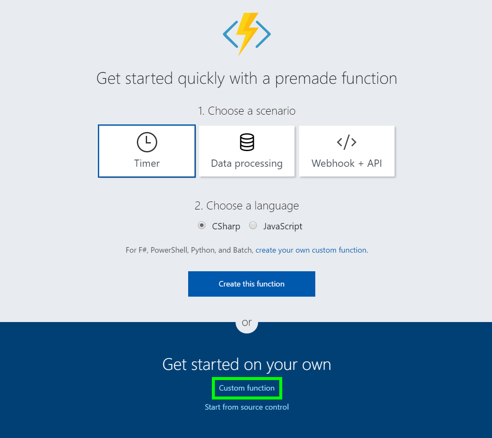
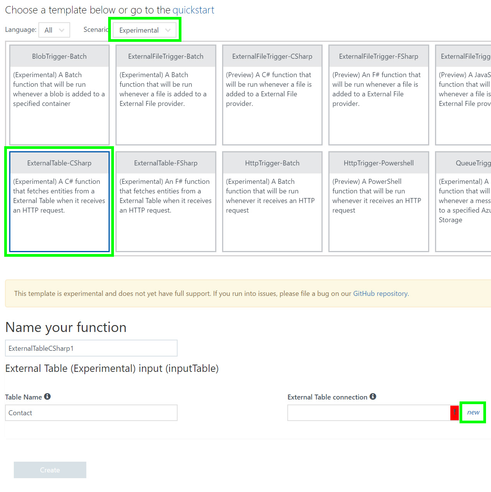
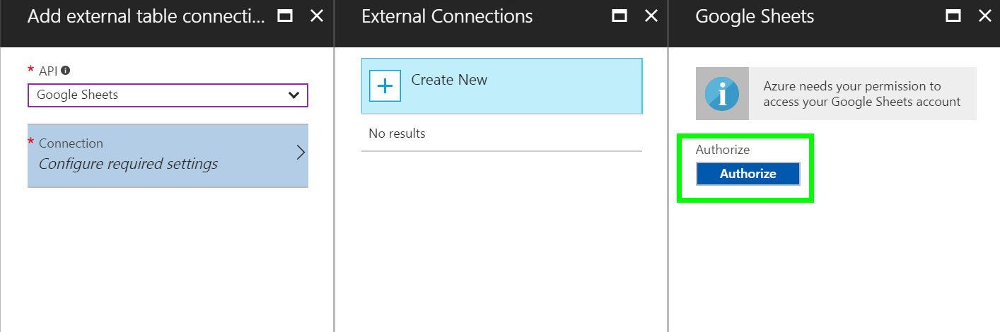
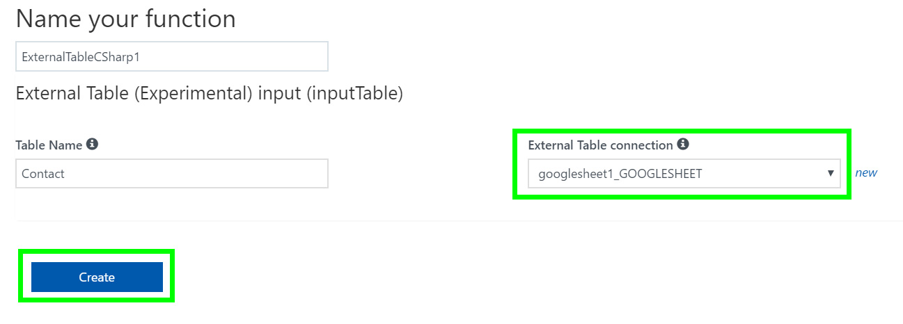
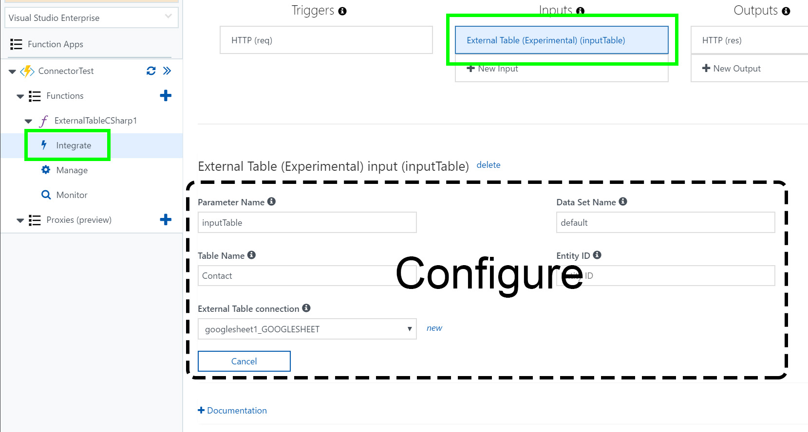

# Azure Functions External Table binding (Preview)
This article shows how to manipulate tabular data on SaaS providers (e.g. Sharepoint, Dynamics) within your function with built-in bindings. Azure Functions supports input, and output bindings for external tables.

[!INCLUDE [intro](../../includes/functions-bindings-intro.md)]

## API Connections

Table bindings leverage external API connections to authenticate with 3rd party SaaS providers. 

When assigning a binding you can either create a new API connection or use an existing API connection within the same resource group

### Supported API Connections (Table)s

|Connector|Trigger|Input|Output|
|:-----|:---:|:---:|:---:|
|[DB2](https://docs.microsoft.com/azure/connectors/connectors-create-api-db2)||x|x
|[Dynamics 365 for Operations](https://ax.help.dynamics.com/wiki/install-and-configure-dynamics-365-for-operations-warehousing/)||x|x
|[Dynamics 365](https://docs.microsoft.com/azure/connectors/connectors-create-api-crmonline)||x|x
|[Dynamics NAV](https://msdn.microsoft.com/library/gg481835.aspx)||x|x
|[Google Sheets](https://docs.microsoft.com/azure/connectors/connectors-create-api-googledrive)||x|x
|[Informix](https://docs.microsoft.com/azure/connectors/connectors-create-api-informix)||x|x
|[Dynamics 365 for Financials](https://docs.microsoft.com/azure/connectors/connectors-create-api-crmonline)||x|x
|[MySQL](https://docs.microsoft.com/azure/store-php-create-mysql-database)||x|x
|[Oracle Database](https://docs.microsoft.com/azure/connectors/connectors-create-api-oracledatabase)||x|x
|[Common Data Service](https://docs.microsoft.com/common-data-service/entity-reference/introduction)||x|x
|[Salesforce](https://docs.microsoft.com/azure/connectors/connectors-create-api-salesforce)||x|x
|[SharePoint](https://docs.microsoft.com/azure/connectors/connectors-create-api-sharepointonline)||x|x
|[SQL Server](https://docs.microsoft.com/azure/connectors/connectors-create-api-sqlazure)||x|x
|[Teradata](http://www.teradata.com/products-and-services/azure/products/)||x|x
|UserVoice||x|x
|Zendesk||x|x


> [!NOTE]
> External Table connections can also be used in [Azure Logic Apps](https://docs.microsoft.com/azure/connectors/apis-list)

### Creating an API connection: step by step

1. Create a function > custom function

1. Scenario `Experimental` > `ExternalTable-CSharp` template > Create a new `External Table connection`

1. Choose your SaaS provider > choose/create a connection

1. Select your API connection > create the function

1. Select `Integrate` > `External Table`
    1. Configure the connection to use your target table. These settings will very between SaaS providers. They are outline below in [data source settings](#datasourcesettings)


## Usage

This example connects to a table named "Contact" with Id, LastName, and FirstName columns. The code lists the Contact entities in the table and logs the first and last names.

### Bindings
```json
{
  "bindings": [
    {
      "type": "manualTrigger",
      "direction": "in",
      "name": "input"
    },
    {
      "type": "apiHubTable",
      "direction": "in",
      "name": "table",
      "connection": "ConnectionAppSettingsKey",
      "dataSetName": "default",
      "tableName": "Contact",
      "entityId": "",
    }
  ],
  "disabled": false
}
```
`entityId` must be empty for table bindings.

`ConnectionAppSettingsKey` identifies the app setting that stores the API connection string. The app setting is created automatically when you add an API connection in the integrate UI.

A tabular connector provides data sets, and each data set contains tables. The name of the default data set is “default.” The titles for a dataset and a table in various SaaS providers are listed below:

|Connector|Dataset|Table|
|:-----|:---|:---| 
|**SharePoint**|Site|SharePoint List
|**SQL**|Database|Table 
|**Google Sheet**|Spreadsheet|Worksheet 
|**Excel**|Excel file|Sheet 

<!--
See the language-specific sample that copies the input file to the output file.

* [C#](#incsharp)
* [Node.js](#innodejs)

-->
<a name="incsharp"></a>

### Usage in C# #

```cs
#r "Microsoft.Azure.ApiHub.Sdk"
#r "Newtonsoft.Json"

using System;
using Microsoft.Azure.ApiHub;

//Variable name must match column type
//Variable type is dynamically bound to the incoming data
public class Contact
{
    public string Id { get; set; }
    public string LastName { get; set; }
    public string FirstName { get; set; }
}

public static async Task Run(string input, ITable<Contact> table, TraceWriter log)
{
    //Iterate over every value in the source table
    ContinuationToken continuationToken = null;
    do
    {   
        //retreive table values
        var contactsSegment = await table.ListEntitiesAsync(
            continuationToken: continuationToken);

        foreach (var contact in contactsSegment.Items)
        {   
            log.Info(string.Format("{0} {1}", contact.FirstName, contact.LastName));
        }

        continuationToken = contactsSegment.ContinuationToken;
    }
    while (continuationToken != null);
}
```

<!--
<a name="innodejs"></a>

### Usage in Node.js

```javascript
module.exports = function(context) {
    context.log('Node.js Queue trigger function processed', context.bindings.myQueueItem);
    context.bindings.myOutputFile = context.bindings.myInputFile;
    context.done();
};
```
-->
<a name="datasourcesettings"></a>
## Data Source Settings

### SQL Server

The script to create and populate the Contact table is below. dataSetName is “default.”

```sql
CREATE TABLE Contact
(
	Id int NOT NULL,
	LastName varchar(20) NOT NULL,
	FirstName varchar(20) NOT NULL,
    CONSTRAINT PK_Contact_Id PRIMARY KEY (Id)
)
GO
INSERT INTO Contact(Id, LastName, FirstName)
     VALUES (1, 'Bitt', 'Prad') 
GO
INSERT INTO Contact(Id, LastName, FirstName)
     VALUES (2, 'Glooney', 'Ceorge') 
GO
```

### Google Sheets
In Google Docs, create a spreadsheet with a worksheet named `Contact`. The connector cannot use the spreadsheet display name. The internal name (in bold) needs to be used as dataSetName, for example: `docs.google.com/spreadsheets/d/`**`1UIz545JF_cx6Chm_5HpSPVOenU4DZh4bDxbFgJOSMz0`**
Add the column names `Id`, `LastName`, `FirstName` to the first row, then populate data on subsequent rows.

### Salesforce
dataSetName is “default.”

## Next steps
[!INCLUDE [next steps](../../includes/functions-bindings-next-steps.md)]
