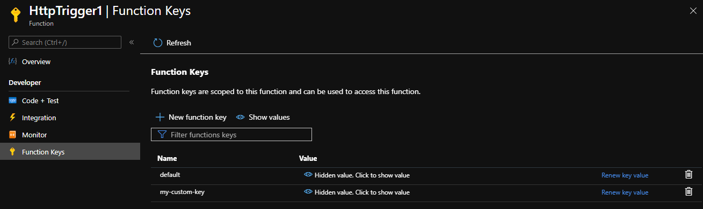

# Azure Functions HTTP triggers and bindings

This article explains how to work with HTTP triggers and output bindings in Azure Functions.

An HTTP trigger can be customized to respond to [webhooks](https://en.wikipedia.org/wiki/Webhook).

[!INCLUDE [intro](../../includes/functions-bindings-intro.md)]

[!INCLUDE [HTTP client best practices](../../includes/functions-http-client-best-practices.md)]

The code in this article defaults to the syntax which uses .NET Core, used in Functions version 2.x and higher. For information on the 1.x syntax, see the [1.x functions templates](https://github.com/Azure/azure-functions-templates/tree/v1.x/Functions.Templates/Templates).

## Packages - Functions 1.x

The HTTP bindings are provided in the [Microsoft.Azure.WebJobs.Extensions.Http](https://www.nuget.org/packages/Microsoft.Azure.WebJobs.Extensions.Http) NuGet package, version 1.x. Source code for the package is in the [azure-webjobs-sdk-extensions](https://github.com/Azure/azure-webjobs-sdk-extensions/tree/v2.x/src/WebJobs.Extensions.Http) GitHub repository.

[!INCLUDE [functions-package-auto](../../includes/functions-package-auto.md)]

## Packages - Functions 2.x and higher

The HTTP bindings are provided in the [Microsoft.Azure.WebJobs.Extensions.Http](https://www.nuget.org/packages/Microsoft.Azure.WebJobs.Extensions.Http) NuGet package, version 3.x. Source code for the package is in the [azure-webjobs-sdk-extensions](https://github.com/Azure/azure-webjobs-sdk-extensions/blob/master/src/WebJobs.Extensions.Http/) GitHub repository.

[!INCLUDE [functions-package](../../includes/functions-package-auto.md)]

## Trigger

The HTTP trigger lets you invoke a function with an HTTP request. You can use an HTTP trigger to build serverless APIs and respond to webhooks.

By default, an HTTP trigger returns HTTP 200 OK with an empty body in Functions 1.x, or HTTP 204 No Content with an empty body in Functions 2.x and higher. To modify the response, configure an [HTTP output binding](#output).

## Trigger - example

# [C#](#tab/csharp)

The following example shows a [C# function](functions-dotnet-class-library.md) that looks for a `name` parameter either in the query string or the body of the HTTP request. Notice that the return value is used for the output binding, but a return value attribute isn't required.

```cs
[FunctionName("HttpTriggerCSharp")]
public static async Task<IActionResult> Run(
    [HttpTrigger(AuthorizationLevel.Function, "get", "post", Route = null)] 
    HttpRequest req, ILogger log)
{
    log.LogInformation("C# HTTP trigger function processed a request.");

    string name = req.Query["name"];

    string requestBody = await new StreamReader(req.Body).ReadToEndAsync();
    dynamic data = JsonConvert.DeserializeObject(requestBody);
    name = name ?? data?.name;

    return name != null
        ? (ActionResult)new OkObjectResult($"Hello, {name}")
        : new BadRequestObjectResult("Please pass a name on the query string or in the request body");
}
```

# [C# Script](#tab/csharp-script)

The following example shows a trigger binding in a *function.json* file and a [C# script function](functions-reference-csharp.md) that uses the binding. The function looks for a `name` parameter either in the query string or the body of the HTTP request.

Here's the *function.json* file:

```json
{
    "disabled": false,
    "bindings": [
        {
            "authLevel": "function",
            "name": "req",
            "type": "httpTrigger",
            "direction": "in",
            "methods": [
                "get",
                "post"
            ]
        },
        {
            "name": "$return",
            "type": "http",
            "direction": "out"
        }
    ]
}
```

The [configuration](#trigger---configuration) section explains these properties.

Here's C# script code that binds to `HttpRequest`:

```cs
#r "Newtonsoft.Json"

using System.Net;
using Microsoft.AspNetCore.Mvc;
using Microsoft.Extensions.Primitives;
using Newtonsoft.Json;

public static async Task<IActionResult> Run(HttpRequest req, ILogger log)
{
    log.LogInformation("C# HTTP trigger function processed a request.");

    string name = req.Query["name"];

    string requestBody = await new StreamReader(req.Body).ReadToEndAsync();
    dynamic data = JsonConvert.DeserializeObject(requestBody);
    name = name ?? data?.name;

    return name != null
        ? (ActionResult)new OkObjectResult($"Hello, {name}")
        : new BadRequestObjectResult("Please pass a name on the query string or in the request body");
}
```

You can bind to a custom object instead of `HttpRequest`. This object is created from the body of the request and parsed as JSON. Similarly, a type can be passed to the HTTP response output binding and returned as the response body, along with a 200 status code.

```csharp
using System.Net;
using System.Threading.Tasks;
using Microsoft.Extensions.Logging;

public static string Run(Person person, ILogger log)
{   
    return person.Name != null
        ? (ActionResult)new OkObjectResult($"Hello, {person.Name}")
        : new BadRequestObjectResult("Please pass an instance of Person.");
}

public class Person {
     public string Name {get; set;}
}
```

# [JavaScript](#tab/javascript)

The following example shows a trigger binding in a *function.json* file and a [JavaScript function](functions-reference-node.md) that uses the binding. The function looks for a `name` parameter either in the query string or the body of the HTTP request.

Here's the *function.json* file:

```json
{
    "disabled": false,    
    "bindings": [
        {
            "authLevel": "function",
            "type": "httpTrigger",
            "direction": "in",
            "name": "req"
        },
        {
            "type": "http",
            "direction": "out",
            "name": "res"
        }
    ]
}
```

The [configuration](#trigger---configuration) section explains these properties.

Here's the JavaScript code:

```javascript
module.exports = function(context, req) {
    context.log('Node.js HTTP trigger function processed a request. RequestUri=%s', req.originalUrl);

    if (req.query.name || (req.body && req.body.name)) {
        context.res = {
            // status defaults to 200 */
            body: "Hello " + (req.query.name || req.body.name)
        };
    }
    else {
        context.res = {
            status: 400,
            body: "Please pass a name on the query string or in the request body"
        };
    }
    context.done();
};
```

# [Python](#tab/python)

The following example shows a trigger binding in a *function.json* file and a [Python function](functions-reference-python.md) that uses the binding. The function looks for a `name` parameter either in the query string or the body of the HTTP request.

Here's the *function.json* file:

```json
{
    "scriptFile": "__init__.py",
    "disabled": false,    
    "bindings": [
        {
            "authLevel": "function",
            "type": "httpTrigger",
            "direction": "in",
            "name": "req"
        },
        {
            "type": "http",
            "direction": "out",
            "name": "res"
        }
    ]
}
```

The [configuration](#trigger---configuration) section explains these properties.

Here's the Python code:

```python
import logging
import azure.functions as func


def main(req: func.HttpRequest) -> func.HttpResponse:
    logging.info('Python HTTP trigger function processed a request.')

    name = req.params.get('name')
    if not name:
        try:
            req_body = req.get_json()
        except ValueError:
            pass
        else:
            name = req_body.get('name')

    if name:
        return func.HttpResponse(f"Hello {name}!")
    else:
        return func.HttpResponse(
            "Please pass a name on the query string or in the request body",
            status_code=400
        )
```

# [Java](#tab/java)

* [Read parameter from the query string](#read-parameter-from-the-query-string)
* [Read body from a POST request](#read-body-from-a-post-request)
* [Read parameter from a route](#read-parameter-from-a-route)
* [Read POJO body from a POST request](#read-pojo-body-from-a-post-request)

The following examples show the HTTP trigger binding in a *function.json* file and the respective [Java functions](functions-reference-java.md) that use the binding. 

Here's the *function.json* file:

```json
{
    "disabled": false,    
    "bindings": [
        {
            "authLevel": "anonymous",
            "type": "httpTrigger",
            "direction": "in",
            "name": "req"
        },
        {
            "type": "http",
            "direction": "out",
            "name": "res"
        }
    ]
}
```

#### Read parameter from the query string

This example reads a parameter, named ```id```, from the query string, and uses it to build a JSON document returned to the client, with content type ```application/json```. 

```java
@FunctionName("TriggerStringGet")
public HttpResponseMessage run(
        @HttpTrigger(name = "req", 
            methods = {HttpMethod.GET}, 
            authLevel = AuthorizationLevel.ANONYMOUS)
        HttpRequestMessage<Optional<String>> request,
        final ExecutionContext context) {
    
    // Item list
    context.getLogger().info("GET parameters are: " + request.getQueryParameters());

    // Get named parameter
    String id = request.getQueryParameters().getOrDefault("id", "");

    // Convert and display
    if (id.isEmpty()) {
        return request.createResponseBuilder(HttpStatus.BAD_REQUEST)
                        .body("Document not found.")
                        .build();
    } 
    else {
        // return JSON from to the client
        // Generate document
        final String name = "fake_name";
        final String jsonDocument = "{\"id\":\"" + id + "\", " + 
                                        "\"description\": \"" + name + "\"}";
        return request.createResponseBuilder(HttpStatus.OK)
                        .header("Content-Type", "application/json")
                        .body(jsonDocument)
                        .build();
    }
}
```

#### Read body from a POST request

This example reads the body of a POST request, as a ```String```, and uses it to build a JSON document returned to the client, with content type ```application/json```.

```java
    @FunctionName("TriggerStringPost")
    public HttpResponseMessage run(
            @HttpTrigger(name = "req", 
              methods = {HttpMethod.POST}, 
              authLevel = AuthorizationLevel.ANONYMOUS)
            HttpRequestMessage<Optional<String>> request,
            final ExecutionContext context) {
        
        // Item list
        context.getLogger().info("Request body is: " + request.getBody().orElse(""));

        // Check request body
        if (!request.getBody().isPresent()) {
            return request.createResponseBuilder(HttpStatus.BAD_REQUEST)
                          .body("Document not found.")
                          .build();
        } 
        else {
            // return JSON from to the client
            // Generate document
            final String body = request.getBody().get();
            final String jsonDocument = "{\"id\":\"123456\", " + 
                                         "\"description\": \"" + body + "\"}";
            return request.createResponseBuilder(HttpStatus.OK)
                          .header("Content-Type", "application/json")
                          .body(jsonDocument)
                          .build();
        }
    }
```

#### Read parameter from a route

This example reads a mandatory parameter, named ```id```, and an optional parameter ```name``` from the route path, and uses them to build a JSON document returned to the client, with content type ```application/json```. T

```java
@FunctionName("TriggerStringRoute")
public HttpResponseMessage run(
        @HttpTrigger(name = "req", 
            methods = {HttpMethod.GET}, 
            authLevel = AuthorizationLevel.ANONYMOUS,
            route = "trigger/{id}/{name=EMPTY}") // name is optional and defaults to EMPTY
        HttpRequestMessage<Optional<String>> request,
        @BindingName("id") String id,
        @BindingName("name") String name,
        final ExecutionContext context) {
    
    // Item list
    context.getLogger().info("Route parameters are: " + id);

    // Convert and display
    if (id == null) {
        return request.createResponseBuilder(HttpStatus.BAD_REQUEST)
                        .body("Document not found.")
                        .build();
    } 
    else {
        // return JSON from to the client
        // Generate document
        final String jsonDocument = "{\"id\":\"" + id + "\", " + 
                                        "\"description\": \"" + name + "\"}";
        return request.createResponseBuilder(HttpStatus.OK)
                        .header("Content-Type", "application/json")
                        .body(jsonDocument)
                        .build();
    }
}
```

#### Read POJO body from a POST request

Here is the code for the ```ToDoItem``` class, referenced in this example:

```java

public class ToDoItem {

  private String id;
  private String description;  

  public ToDoItem(String id, String description) {
    this.id = id;
    this.description = description;
  }

  public String getId() {
    return id;
  }

  public String getDescription() {
    return description;
  }
  
  @Override
  public String toString() {
    return "ToDoItem={id=" + id + ",description=" + description + "}";
  }
}

```

This example reads the body of a POST request. The request body gets automatically de-serialized into a ```ToDoItem``` object, and is returned to the client, with content type ```application/json```. The ```ToDoItem``` parameter is serialized by the Functions runtime as it is assigned to the ```body``` property of the ```HttpMessageResponse.Builder``` class.

```java
@FunctionName("TriggerPojoPost")
public HttpResponseMessage run(
        @HttpTrigger(name = "req", 
            methods = {HttpMethod.POST}, 
            authLevel = AuthorizationLevel.ANONYMOUS)
        HttpRequestMessage<Optional<ToDoItem>> request,
        final ExecutionContext context) {
    
    // Item list
    context.getLogger().info("Request body is: " + request.getBody().orElse(null));

    // Check request body
    if (!request.getBody().isPresent()) {
        return request.createResponseBuilder(HttpStatus.BAD_REQUEST)
                        .body("Document not found.")
                        .build();
    } 
    else {
        // return JSON from to the client
        // Generate document
        final ToDoItem body = request.getBody().get();
        return request.createResponseBuilder(HttpStatus.OK)
                        .header("Content-Type", "application/json")
                        .body(body)
                        .build();
    }
}
```

---

## Trigger - attributes

In [C# class libraries](functions-dotnet-class-library.md) and Java, the `HttpTrigger` attribute is available to configure the function.

You can set the authorization level and allowable HTTP methods in attribute constructor parameters, webhook type, and a route template. For more information about these settings, see [Trigger - configuration](#trigger---configuration).

# [C#](#tab/csharp)

This example demonstrates how to use the [HttpTrigger](https://github.com/Azure/azure-webjobs-sdk-extensions/blob/dev/src/WebJobs.Extensions.Http/HttpTriggerAttribute.cs) attribute.

```csharp
[FunctionName("HttpTriggerCSharp")]
public static Task<IActionResult> Run(
    [HttpTrigger(AuthorizationLevel.Anonymous)] HttpRequest req)
{
    ...
}
```

For a complete example, see the [trigger example](#trigger---example).

# [C# Script](#tab/csharp-script)

Attributes are not supported by C# Script.

# [JavaScript](#tab/javascript)

Attributes are not supported by JavaScript.

# [Python](#tab/python)

Attributes are not supported by Python.

# [Java](#tab/java)

This example demonstrates how to use the [HttpTrigger](https://github.com/Azure/azure-functions-java-library/blob/dev/src/main/java/com/microsoft/azure/functions/annotation/HttpTrigger.java) attribute.

```java
@FunctionName("HttpTriggerJava")
public HttpResponseMessage<String> HttpTrigger(
        @HttpTrigger(name = "req",
                     methods = {"get"},
                     authLevel = AuthorizationLevel.ANONYMOUS) HttpRequestMessage<String> request,
        final ExecutionContext context) {

    ...
}
```

For a complete example, see the [trigger example](#trigger---example).

---

## Trigger - configuration

The following table explains the binding configuration properties that you set in the *function.json* file and the `HttpTrigger` attribute.

|function.json property | Attribute property |Description|
|---------|---------|----------------------|
| **type** | n/a| Required - must be set to `httpTrigger`. |
| **direction** | n/a| Required - must be set to `in`. |
| **name** | n/a| Required - the variable name used in function code for the request or request body. |
| <a name="http-auth"></a>**authLevel** |  **AuthLevel** |Determines what keys, if any, need to be present on the request in order to invoke the function. The authorization level can be one of the following values: <ul><li><code>anonymous</code>&mdash;No API key is required.</li><li><code>function</code>&mdash;A function-specific API key is required. This is the default value if none is provided.</li><li><code>admin</code>&mdash;The master key is required.</li></ul> For more information, see the section about [authorization keys](#authorization-keys). |
| **methods** |**Methods** | An array of the HTTP methods to which the function  responds. If not specified, the function responds to all HTTP methods. See [customize the HTTP endpoint](#customize-the-http-endpoint). |
| **route** | **Route** | Defines the route template, controlling to which request URLs your function responds. The default value if none is provided is `<functionname>`. For more information, see [customize the HTTP endpoint](#customize-the-http-endpoint). |
| **webHookType** | **WebHookType** | _Supported only for the version 1.x runtime._<br/><br/>Configures the HTTP trigger to act as a [webhook](https://en.wikipedia.org/wiki/Webhook) receiver for the specified provider. Don't set the `methods` property if you set this property. The webhook type can be one of the following values:<ul><li><code>genericJson</code>&mdash;A general-purpose webhook endpoint without logic for a specific provider. This setting restricts requests to only those using HTTP POST and with the `application/json` content type.</li><li><code>github</code>&mdash;The function responds to [GitHub webhooks](https://developer.github.com/webhooks/). Do not use the  _authLevel_ property with GitHub webhooks. For more information, see the GitHub webhooks section later in this article.</li><li><code>slack</code>&mdash;The function responds to [Slack webhooks](https://api.slack.com/outgoing-webhooks). Do not use the _authLevel_ property with Slack webhooks. For more information, see the Slack webhooks section later in this article.</li></ul>|

## Trigger - usage

The trigger input type is declared as either `HttpRequest` or a custom type. If you choose `HttpRequest`, you get full access to the request object. For a custom type, the runtime tries to parse the JSON request body to set the object properties.

### Customize the HTTP endpoint

By default when you create a function for an HTTP trigger, the function is addressable with a route of the form:

    http://<APP_NAME>.azurewebsites.net/api/<FUNCTION_NAME>

You can customize this route using the optional `route` property on the HTTP trigger's input binding. As an example, the following *function.json* file defines a `route` property for an HTTP trigger:

```json
{
    "bindings": [
    {
        "type": "httpTrigger",
        "name": "req",
        "direction": "in",
        "methods": [ "get" ],
        "route": "products/{category:alpha}/{id:int?}"
    },
    {
        "type": "http",
        "name": "res",
        "direction": "out"
    }
    ]
}
```

Using this configuration, the function is now addressable with the following route instead of the original route.

```
http://<APP_NAME>.azurewebsites.net/api/products/electronics/357
```

This allows the function code to support two parameters in the address, _category_ and _id_.

# [C#](#tab/csharp)

You can use any [Web API Route Constraint](https://www.asp.net/web-api/overview/web-api-routing-and-actions/attribute-routing-in-web-api-2#constraints) with your parameters. The following C# function code makes use of both parameters.

```csharp
using System.Net;
using Microsoft.AspNetCore.Mvc;
using Microsoft.Extensions.Primitives;

public static IActionResult Run(HttpRequest req, string category, int? id, ILogger log)
{
    var message = String.Format($"Category: {category}, ID: {id}");
    return (ActionResult)new OkObjectResult(message);
}
```

# [C# Script](#tab/csharp-script)

You can use any [Web API Route Constraint](https://www.asp.net/web-api/overview/web-api-routing-and-actions/attribute-routing-in-web-api-2#constraints) with your parameters. The following C# function code makes use of both parameters.

```csharp
#r "Newtonsoft.Json"

using System.Net;
using Microsoft.AspNetCore.Mvc;
using Microsoft.Extensions.Primitives;

public static IActionResult Run(HttpRequest req, string category, int? id, ILogger log)
{
    var message = String.Format($"Category: {category}, ID: {id}");
    return (ActionResult)new OkObjectResult(message);
}
```

# [JavaScript](#tab/javascript)

In Node, the Functions runtime provides the request body from the `context` object. For more information, see the [JavaScript trigger example](#trigger---example).

The following example shows how to read route parameters from `context.bindingData`.

```javascript
module.exports = function (context, req) {

    var category = context.bindingData.category;
    var id = context.bindingData.id;
    var message = `Category: ${category}, ID: ${id}`;

    context.res = {
        body: message;
    }

    context.done();
}
```

# [Python](#tab/python)

The function execution context is exposed via a parameter declared as `func.HttpRequest`. This instance allows a function to access data route parameters, query string values and methods that allow you to return HTTP responses.

Once defined, the route parameters are available to the function by calling the `route_params` method.

```python
import logging

import azure.functions as func

def main(req: func.HttpRequest) -> func.HttpResponse:

    category = req.route_params.get('category')
    id = req.route_params.get('id')
    message = f"Category: {category}, ID: {id}"

    return func.HttpResponse(message)
```

# [Java](#tab/java)

The function execution context is properties as declared in the `HttpTrigger` attribute. The attribute allows you to define route parameters, authorization levels, HTTP verbs and the incoming request instance.

Route parameters are defined via the `HttpTrigger` attribute.

```java
package com.function;

import java.util.*;
import com.microsoft.azure.functions.annotation.*;
import com.microsoft.azure.functions.*;

public class HttpTriggerJava {
    public HttpResponseMessage<String> HttpTrigger(
            @HttpTrigger(name = "req",
                         methods = {"get"},
                         authLevel = AuthorizationLevel.FUNCTION,
                         route = "products/{category:alpha}/{id:int}") HttpRequestMessage<String> request,
            @BindingName("category") String category,
            @BindingName("id") int id,
            final ExecutionContext context) {

        String message = String.format("Category  %s, ID: %d", category, id);
        return request.createResponseBuilder(HttpStatus.OK).body(message).build();
    }
}
```

---

By default, all function routes are prefixed with *api*. You can also customize or remove the prefix using the `http.routePrefix` property in your [host.json](functions-host-json.md) file. The following example removes the *api* route prefix by using an empty string for the prefix in the *host.json* file.

```json
{
    "http": {
    "routePrefix": ""
    }
}
```

### Using route parameters

Route parameters that defined a function's `route` pattern are available to each binding. For example, if you have a route defined as `"route": "products/{id}"` then a table storage binding can use the value of the `{id}` parameter in the binding configuration.

The following configuration shows how the `{id}` parameter is passed to the binding's `rowKey`.

```json
{
    "type": "table",
    "direction": "in",
    "name": "product",
    "partitionKey": "products",
    "tableName": "products",
    "rowKey": "{id}"
}
```


### Working with client identities

If your function app is using [App Service Authentication / Authorization](../app-service/overview-authentication-authorization.md), you can view information about authenticated clients from your code. This information is available as [request headers injected by the platform](../app-service/app-service-authentication-how-to.md#access-user-claims). 

You can also read this information from binding data. This capability is only available to the Functions runtime in 2.x and higher. It is also currently only available for .NET languages.

# [C#](#tab/csharp)

Information regarding authenticated clients is available as a [ClaimsPrincipal](https://docs.microsoft.com/dotnet/api/system.security.claims.claimsprincipal). The ClaimsPrincipal is available as part of the request context as shown in the following example:

```csharp
using System.Net;
using Microsoft.AspNetCore.Mvc;
using System.Security.Claims;

public static IActionResult Run(HttpRequest req, ILogger log)
{
    ClaimsPrincipal identities = req.HttpContext.User;
    // ...
    return new OkObjectResult();
}
```

Alternatively, the ClaimsPrincipal can simply be included as an additional parameter in the function signature:

```csharp
using System.Net;
using Microsoft.AspNetCore.Mvc;
using System.Security.Claims;
using Newtonsoft.Json.Linq;

public static void Run(JObject input, ClaimsPrincipal principal, ILogger log)
{
    // ...
    return;
}
```

# [C# Script](#tab/csharp-script)

Information regarding authenticated clients is available as a [ClaimsPrincipal](https://docs.microsoft.com/dotnet/api/system.security.claims.claimsprincipal). The ClaimsPrincipal is available as part of the request context as shown in the following example:

```csharp
using System.Net;
using Microsoft.AspNetCore.Mvc;
using System.Security.Claims;

public static IActionResult Run(HttpRequest req, ILogger log)
{
    ClaimsPrincipal identities = req.HttpContext.User;
    // ...
    return new OkObjectResult();
}
```

Alternatively, the ClaimsPrincipal can simply be included as an additional parameter in the function signature:

```csharp
#r "Newtonsoft.Json"

using System.Net;
using Microsoft.AspNetCore.Mvc;
using System.Security.Claims;
using Newtonsoft.Json.Linq;

public static void Run(JObject input, ClaimsPrincipal principal, ILogger log)
{
    // ...
    return;
}
```

# [JavaScript](#tab/javascript)

The authenticated user is available via [HTTP Headers](../app-service/app-service-authentication-how-to.md#access-user-claims).

# [Python](#tab/python)

The authenticated user is available via [HTTP Headers](../app-service/app-service-authentication-how-to.md#access-user-claims).

# [Java](#tab/java)

The authenticated user is available via [HTTP Headers](../app-service/app-service-authentication-how-to.md#access-user-claims).

---

### Authorization keys

Functions lets you use keys to make it harder to access your HTTP function endpoints during development.  A standard HTTP trigger may require such an API key be present in the request. 

> [!IMPORTANT]
> While keys may help obfuscate your HTTP endpoints during development, they are not intended as a way to secure an HTTP trigger in production. To learn more, see [Secure an HTTP endpoint in production](#secure-an-http-endpoint-in-production).

> [!NOTE]
> In the Functions 1.x runtime, webhook providers may use keys to authorize requests in a variety of ways, depending on what the provider supports. This is covered in [Webhooks and keys](#webhooks-and-keys). The Functions runtime in version 2.x and higher does not include built-in support for webhook providers.

There are two types of keys:

* **Host keys**: These keys are shared by all functions within the function app. When used as an API key, these allow access to any function within the function app.
* **Function keys**: These keys apply only to the specific functions under which they are defined. When used as an API key, these only allow access to that function.

Each key is named for reference, and there is a default key (named "default") at the function and host level. Function keys take precedence over host keys. When two keys are defined with the same name, the function key is always used.

Each function app also has a special **master key**. This key is a host key named `_master`, which provides administrative access to the runtime APIs. This key cannot be revoked. When you set an authorization level of `admin`, requests must use the master key; any other key results in authorization failure.

> [!CAUTION]  
> Due to the elevated permissions in your function app granted by the master key, you should not share this key with third parties or distribute it in native client applications. Use caution when choosing the admin authorization level.

### Obtaining keys

Keys are stored as part of your function app in Azure and are encrypted at rest. To view your keys, create new ones, or roll keys to new values, navigate to one of your HTTP-triggered functions in the [Azure portal](https://portal.azure.com) and select **Manage**.



You may obtain function keys programmatically by using [Key management APIs](https://github.com/Azure/azure-functions-host/wiki/Key-management-API).

### API key authorization

Most HTTP trigger templates require an API key in the request. So your HTTP request normally looks like the following URL:

    https://<APP_NAME>.azurewebsites.net/api/<FUNCTION_NAME>?code=<API_KEY>

The key can be included in a query string variable named `code`, as above. It can also be included in an `x-functions-key` HTTP header. The value of the key can be any function key defined for the function, or any host key.

You can allow anonymous requests, which do not require keys. You can also require that the master key be used. You change the default authorization level by using the `authLevel` property in the binding JSON. For more information, see [Trigger - configuration](#trigger---configuration).

> [!NOTE]
> When running functions locally, authorization is disabled regardless of the specified authorization level setting. After publishing to Azure, the `authLevel` setting in your trigger is enforced. Keys are still required when running [locally in a container](functions-create-function-linux-custom-image.md#run-the-image-locally).


### Secure an HTTP endpoint in production

To fully secure your function endpoints in production, you should consider implementing one of the following function app-level security options:

* Turn on App Service Authentication / Authorization for your function app. The App Service platform lets you use Azure Active Directory (AAD) and several third-party identity providers to authenticate clients. You can use this to implement custom authorization rules for your functions, and you can work with user information from your function code. To learn more, see [Authentication and authorization in Azure App Service](../app-service/overview-authentication-authorization.md) and [Working with client identities](#working-with-client-identities).

* Use Azure API Management (APIM) to authenticate requests. APIM provides a variety of API security options for incoming requests. To learn more, see [API Management authentication policies](../api-management/api-management-authentication-policies.md). With APIM in place, you can configure your function app to accept requests only from the IP address of your APIM instance. To learn more, see [IP address restrictions](ip-addresses.md#ip-address-restrictions).

* Deploy your function app to an Azure App Service Environment (ASE). ASE provides a dedicated hosting environment in which to run your functions. ASE lets you configure a single front-end gateway that you can use to authenticate all incoming requests. For more information, see [Configuring a Web Application Firewall (WAF) for App Service Environment](../app-service/environment/app-service-app-service-environment-web-application-firewall.md).

When using one of these function app-level security methods, you should set the HTTP-triggered function authorization level to `anonymous`.

### Webhooks

> [!NOTE]
> Webhook mode is only available for version 1.x of the Functions runtime. This change was made to improve the performance of HTTP triggers in version 2.x and higher.

In version 1.x, webhook templates provide additional validation for webhook payloads. In version 2.x and higher, the base HTTP trigger still works and is the recommended approach for webhooks. 

#### GitHub webhooks

To respond to GitHub webhooks, first create your function with an HTTP Trigger, and set the **webHookType** property to `github`. Then copy its URL and API key into the **Add webhook** page of your GitHub repository. 


#### Slack webhooks

The Slack webhook generates a token for you instead of letting you specify it, so you must configure a function-specific key with the token from Slack. See [Authorization keys](#authorization-keys).

### Webhooks and keys

Webhook authorization is handled by the webhook receiver component, part of the HTTP trigger, and the mechanism varies based on the webhook type. Each mechanism does rely on a key. By default, the function key named "default" is used. To use a different key, configure the webhook provider to send the key name with the request in one of the following ways:

* **Query string**: The provider passes the key name in the `clientid` query string parameter, such as `https://<APP_NAME>.azurewebsites.net/api/<FUNCTION_NAME>?clientid=<KEY_NAME>`.
* **Request header**: The provider passes the key name in the `x-functions-clientid` header.

## Trigger - limits

The HTTP request length is limited to 100 MB (104,857,600 bytes), and the URL length is limited to 4 KB (4,096 bytes). These limits are specified by the `httpRuntime` element of the runtime's [Web.config file](https://github.com/Azure/azure-webjobs-sdk-script/blob/v1.x/src/WebJobs.Script.WebHost/Web.config).

If a function that uses the HTTP trigger doesn't complete within 230 seconds, the [Azure Load Balancer](../app-service/faq-availability-performance-application-issues.md#why-does-my-request-time-out-after-230-seconds) will time out and return an HTTP 502 error. The function will continue running but will be unable to return an HTTP response. For long-running functions, we recommend that you follow async patterns and return a location where you can ping the status of the request. For information about how long a function can run, see [Scale and hosting - Consumption plan](functions-scale.md#timeout).

## Output

Use the HTTP output binding to respond to the HTTP request sender. This binding requires an HTTP trigger and allows you to customize the response associated with the trigger's request. If an HTTP output binding is not provided, an HTTP trigger returns HTTP 200 OK with an empty body in Functions 1.x, or HTTP 204 No Content with an empty body in Functions 2.x and higher.

## Output - configuration

The following table explains the binding configuration properties that you set in the *function.json* file. For C# class libraries, there are no attribute properties that correspond to these *function.json* properties.

|Property  |Description  |
|---------|---------|
| **type** |Must be set to `http`. |
| **direction** | Must be set to `out`. |
| **name** | The variable name used in function code for the response, or `$return` to use the return value. |

## Output - usage

To send an HTTP response, use the language-standard response patterns. In C# or C# script, make the function return type `IActionResult` or `Task<IActionResult>`. In C#, a return value attribute isn't required.

For example responses, see the [trigger example](#trigger---example).

## host.json settings

This section describes the global configuration settings available for this binding in versions 2.x and higher. The example host.json file below contains only the version 2.x+ settings for this binding. For more information about global configuration settings in versions 2.x and beyond, see [host.json reference for Azure Functions](functions-host-json.md).

> [!NOTE]
> For a reference of host.json in Functions 1.x, see [host.json reference for Azure Functions 1.x](functions-host-json-v1.md#http).

```json
{
    "extensions": {
        "http": {
            "routePrefix": "api",
            "maxOutstandingRequests": 200,
            "maxConcurrentRequests": 100,
            "dynamicThrottlesEnabled": true,
            "hsts": {
                "isEnabled": true,
                "maxAge": "10"
            },
            "customHeaders": {
                "X-Content-Type-Options": "nosniff"
            }
        }
    }
}
```

|Property  |Default | Description |
|---------|---------|---------| 
| customHeaders|none|Allows you to set custom headers in the HTTP response. The previous example adds the `X-Content-Type-Options` header to the response to avoid content type sniffing. |
|dynamicThrottlesEnabled|true<sup>\*</sup>|When enabled, this setting causes the request processing pipeline to periodically check system performance counters like connections/threads/processes/memory/cpu/etc. and if any of those counters are over a built-in high threshold (80%), requests will be rejected with a 429 "Too Busy" response until the counter(s) return to normal levels.<br/><sup>\*</sup>The default in a Consumption plan is `true`. The default in a Dedicated plan is `false`.|
|hsts|not enabled|When `isEnabled` is set to `true`, the [HTTP Strict Transport Security (HSTS) behavior of .NET Core](/aspnet/core/security/enforcing-ssl?view=aspnetcore-3.0&tabs=visual-studio#hsts) is enforced, as defined in the [`HstsOptions` class](/dotnet/api/microsoft.aspnetcore.httpspolicy.hstsoptions?view=aspnetcore-3.0). The above example also sets the [`maxAge`](/dotnet/api/microsoft.aspnetcore.httpspolicy.hstsoptions.maxage?view=aspnetcore-3.0#Microsoft_AspNetCore_HttpsPolicy_HstsOptions_MaxAge) property to 10 days. Supported properties of `hsts` are: <table><tr><th>Property</th><th>Description</th></tr><tr><td>excludedHosts</td><td>A string array of host names for which the HSTS header isn't added.</td></tr><tr><td>includeSubDomains</td><td>Boolean value that indicates whether the includeSubDomain parameter of the Strict-Transport-Security header is enabled.</td></tr><tr><td>maxAge</td><td>String that defines the max-age parameter of the Strict-Transport-Security header.</td></tr><tr><td>preload</td><td>Boolean that indicates whether the preload parameter of the Strict-Transport-Security header is enabled.</td></tr></table>|
|maxConcurrentRequests|100<sup>\*</sup>|The maximum number of HTTP functions that are executed in parallel. This allows you to control concurrency, which can help manage resource utilization. For example, you might have an HTTP function that uses a lot of system resources (memory/cpu/sockets) such that it causes issues when concurrency is too high. Or you might have a function that makes outbound requests to a third party service, and those calls need to be rate limited. In these cases, applying a throttle here can help. <br/><sup>*</sup>The default for a Consumption plan is 100. The default for a Dedicated plan is unbounded (`-1`).|
|maxOutstandingRequests|200<sup>\*</sup>|The maximum number of outstanding requests that are held at any given time. This limit includes requests that are queued but have not started executing, as well as any in progress executions. Any incoming requests over this limit are rejected with a 429 "Too Busy" response. That allows callers to employ time-based retry strategies, and also helps you to control maximum request latencies. This only controls queuing that occurs within the script host execution path. Other queues such as the ASP.NET request queue will still be in effect and unaffected by this setting. <br/><sup>\*</sup>The default for a Consumption plan is 200. The default for a Dedicated plan is unbounded (`-1`).|
|routePrefix|api|The route prefix that applies to all routes. Use an empty string to remove the default prefix. |


## Next steps

[Learn more about Azure functions triggers and bindings](functions-triggers-bindings.md)
