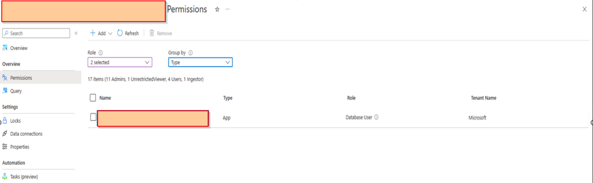
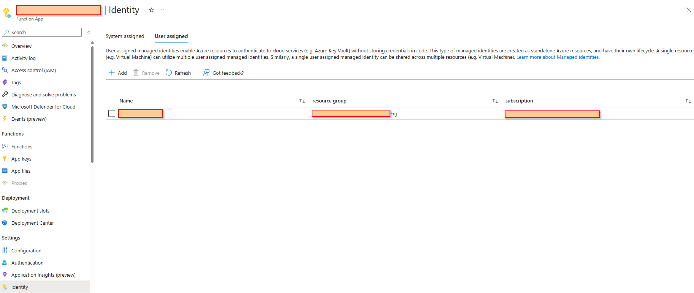
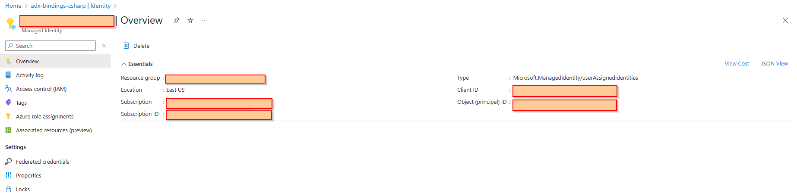

# Tutorial: Connect an Azure Functions app to Azure Data Explorer with managed identity (Preview)

Azure Functions provides a [managed identity](../active-directory/managed-identities-azure-resources/overview.md), that can be used to access Kusto or other Azure services. Managed identities make it easy to centrally manage authentication without having to worry about storing Keys/Secrets in the code.

This document provides an overview of how to connect with Kusto using a user managed identity. The following are the high level steps needed for setting up access and allowing bindings to ingest or query data from Kusto.

> [!div class="checklist"]
>
> * [Create a user managed identity](#create-a-user-managed-identity)
> * [Grant database access to the identity](#grant-database-access-to-the-identity)
> * [Enable user managed identity on Azure Function](#enable-user-managed-identity-on-azure-function)
> * [Using the ManagedIdentity attribute in the function](#using-the-managedidentity-attribute-in-the-function)

## Create a user managed identity

A user managed identity can be created on AZ-CLI as follows

```azurecli-interactive
az identity create -g <RESOURCE GROUP> -n <managed-user-identity>
```

## Grant database access to the identity

The permissions to the database can be granted as explained [here](https://learn.microsoft.com/azure/data-explorer/manage-database-permissions). From the portal, the created managed-user-identity (created in the above step)  can be assigned as a Database User or with Ingestor privileges depending on if we want to query (Input bindings) or ingest (Output bindings).



## Enable user managed identity on Azure Function

The created managed user identity can be attached as a user managed identity to the Azure function.



## Using the ManagedIdentity attribute in the function

The client id created on the first step can then be used in the bindings to pass the identity to use in the function



The client id can be passed into the ManagedServiceIdentity attribute.

```csharp
            [Kusto(Database:"database" ,
            KqlCommand = "declare query_parameters (name:string);GetProductsByName(name)" ,
            KqlParameters = "@name={name}",
            Connection = "KustoConnectionStringManagedIdentity", ManagedServiceIdentity ="abcdef5f-a46f-4ca0-9bc0-27a46c7799ff")]
            IEnumerable<Product> products)
```

> Note that in this case the connection string used can be updated to not have the Application credentials (Client Id, Secret , Tenant & Auth tokens passed into them). For example ```KustoConnectionStringManagedIdentity``` can be the value ```"Data Source=https://kustocluster.kusto.windows.net;Database=database;"```
