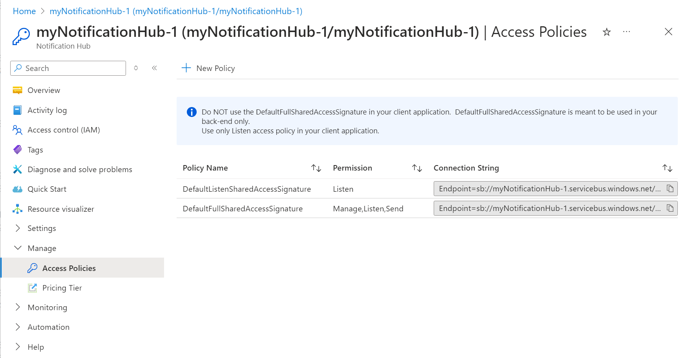

# Notification Hubs output binding for Azure Functions

This article explains how to send push notifications by using [Azure Notification Hubs](../notification-hubs/notification-hubs-push-notification-overview.md) bindings in Azure Functions. Azure Functions supports output bindings for Notification Hubs.

Azure Notification Hubs must be configured for the Platform Notifications Service (PNS) you want to use. To learn how to get push notifications in your client app from Notification Hubs, see [Getting started with Notification Hubs](../notification-hubs/notification-hubs-windows-store-dotnet-get-started-wns-push-notification.md) and select your target client platform from the drop-down list near the top of the page.

[!INCLUDE [intro](../../includes/functions-bindings-intro.md)]

> [!IMPORTANT]
> Google has [deprecated Google Cloud Messaging (GCM) in favor of Firebase Cloud Messaging (FCM)](https://developers.google.com/cloud-messaging/faq). This output binding doesn't support FCM. To send notifications using FCM, use the [Firebase API](https://firebase.google.com/docs/cloud-messaging/server#choosing-a-server-option) directly in your function or use [template notifications](../notification-hubs/notification-hubs-templates-cross-platform-push-messages.md).

## Packages - Functions 1.x

The Notification Hubs bindings are provided in the [Microsoft.Azure.WebJobs.Extensions.NotificationHubs](https://www.nuget.org/packages/Microsoft.Azure.WebJobs.Extensions.NotificationHubs) NuGet package, version 1.x. Source code for the package is in the [azure-webjobs-sdk-extensions](https://github.com/Azure/azure-webjobs-sdk-extensions/tree/v2.x/src/WebJobs.Extensions.NotificationHubs) GitHub repository.

[!INCLUDE [functions-package](../../includes/functions-package.md)]

## Packages - Functions 2.x and higher

This binding is not available in Functions 2.x and higher.

## Example - template

The notifications you send can be native notifications or [template notifications](../notification-hubs/notification-hubs-templates-cross-platform-push-messages.md). Native notifications target a specific client platform as configured in the `platform` property of the output binding. A template notification can be used to target multiple platforms.   

See the language-specific example:

* [C# script - out parameter](#c-script-template-example---out-parameter)
* [C# script - asynchronous](#c-script-template-example---asynchronous)
* [C# script - JSON](#c-script-template-example---json)
* [C# script - library types](#c-script-template-example---library-types)
* [F#](#f-template-example)
* [JavaScript](#javascript-template-example)

### C# script template example - out parameter

This example sends a notification for a [template registration](../notification-hubs/notification-hubs-templates-cross-platform-push-messages.md) that contains a `message` placeholder in the template.

```cs
using System;
using System.Threading.Tasks;
using System.Collections.Generic;

public static void Run(string myQueueItem,  out IDictionary<string, string> notification, TraceWriter log)
{
    log.Info($"C# Queue trigger function processed: {myQueueItem}");
    notification = GetTemplateProperties(myQueueItem);
}

private static IDictionary<string, string> GetTemplateProperties(string message)
{
    Dictionary<string, string> templateProperties = new Dictionary<string, string>();
    templateProperties["message"] = message;
    return templateProperties;
}
```

### C# script template example - asynchronous

If you are using asynchronous code, out parameters are not allowed. In this case use `IAsyncCollector` to return your template notification. The following code is an asynchronous example of the code above. 

```cs
using System;
using System.Threading.Tasks;
using System.Collections.Generic;

public static async Task Run(string myQueueItem, IAsyncCollector<IDictionary<string,string>> notification, TraceWriter log)
{
    log.Info($"C# Queue trigger function processed: {myQueueItem}");

    log.Info($"Sending Template Notification to Notification Hub");
    await notification.AddAsync(GetTemplateProperties(myQueueItem));    
}

private static IDictionary<string, string> GetTemplateProperties(string message)
{
    Dictionary<string, string> templateProperties = new Dictionary<string, string>();
    templateProperties["user"] = "A new user wants to be added : " + message;
    return templateProperties;
}
```

### C# script template example - JSON

This example sends a notification for a [template registration](../notification-hubs/notification-hubs-templates-cross-platform-push-messages.md) that contains a `message` placeholder in the template using a valid JSON string.

```cs
using System;

public static void Run(string myQueueItem,  out string notification, TraceWriter log)
{
    log.Info($"C# Queue trigger function processed: {myQueueItem}");
    notification = "{\"message\":\"Hello from C#. Processed a queue item!\"}";
}
```

### C# script template example - library types

This example shows how to use types defined in the [Microsoft Azure Notification Hubs Library](https://www.nuget.org/packages/Microsoft.Azure.NotificationHubs/). 

```cs
#r "Microsoft.Azure.NotificationHubs"

using System;
using System.Threading.Tasks;
using Microsoft.Azure.NotificationHubs;

public static void Run(string myQueueItem,  out Notification notification, TraceWriter log)
{
   log.Info($"C# Queue trigger function processed: {myQueueItem}");
   notification = GetTemplateNotification(myQueueItem);
}

private static TemplateNotification GetTemplateNotification(string message)
{
    Dictionary<string, string> templateProperties = new Dictionary<string, string>();
    templateProperties["message"] = message;
    return new TemplateNotification(templateProperties);
}
```

### F# template example

This example sends a notification for a [template registration](../notification-hubs/notification-hubs-templates-cross-platform-push-messages.md) that contains `location` and `message`.

```fsharp
let Run(myTimer: TimerInfo, notification: byref<IDictionary<string, string>>) =
    notification = dict [("location", "Redmond"); ("message", "Hello from F#!")]
```

### JavaScript template example

This example sends a notification for a [template registration](../notification-hubs/notification-hubs-templates-cross-platform-push-messages.md) that contains `location` and `message`.

```javascript
module.exports = function (context, myTimer) {
    var timeStamp = new Date().toISOString();

    if (myTimer.IsPastDue)
    {
        context.log('Node.js is running late!');
    }
    context.log('Node.js timer trigger function ran!', timeStamp);  
    context.bindings.notification = {
        location: "Redmond",
        message: "Hello from Node!"
    };
    context.done();
};
```

## Example - APNS native

This C# script example shows how to send a native APNS notification. 

```cs
#r "Microsoft.Azure.NotificationHubs"
#r "Newtonsoft.Json"

using System;
using Microsoft.Azure.NotificationHubs;
using Newtonsoft.Json;

public static async Task Run(string myQueueItem, IAsyncCollector<Notification> notification, TraceWriter log)
{
    log.Info($"C# Queue trigger function processed: {myQueueItem}");

    // In this example the queue item is a new user to be processed in the form of a JSON string with 
    // a "name" value.
    //
    // The JSON format for a native APNS notification is ...
    // { "aps": { "alert": "notification message" }}  

    log.LogInformation($"Sending APNS notification of a new user");    
    dynamic user = JsonConvert.DeserializeObject(myQueueItem);    
    string apnsNotificationPayload = "{\"aps\": {\"alert\": \"A new user wants to be added (" + 
                                        user.name + ")\" }}";
    log.LogInformation($"{apnsNotificationPayload}");
    await notification.AddAsync(new AppleNotification(apnsNotificationPayload));        
}
```

## Example - WNS native

This C# script example shows how to use types defined in the [Microsoft Azure Notification Hubs Library](https://www.nuget.org/packages/Microsoft.Azure.NotificationHubs/) to send a native WNS toast notification. 

```cs
#r "Microsoft.Azure.NotificationHubs"
#r "Newtonsoft.Json"

using System;
using Microsoft.Azure.NotificationHubs;
using Newtonsoft.Json;

public static async Task Run(string myQueueItem, IAsyncCollector<Notification> notification, TraceWriter log)
{
    log.Info($"C# Queue trigger function processed: {myQueueItem}");

    // In this example the queue item is a new user to be processed in the form of a JSON string with 
    // a "name" value.
    //
    // The XML format for a native WNS toast notification is ...
    // <?xml version="1.0" encoding="utf-8"?>
    // <toast>
    //      <visual>
    //     <binding template="ToastText01">
    //       <text id="1">notification message</text>
    //     </binding>
    //   </visual>
    // </toast>

    log.Info($"Sending WNS toast notification of a new user");    
    dynamic user = JsonConvert.DeserializeObject(myQueueItem);    
    string wnsNotificationPayload = "<?xml version=\"1.0\" encoding=\"utf-8\"?>" +
                                    "<toast><visual><binding template=\"ToastText01\">" +
                                        "<text id=\"1\">" + 
                                            "A new user wants to be added (" + user.name + ")" + 
                                        "</text>" +
                                    "</binding></visual></toast>";

    log.Info($"{wnsNotificationPayload}");
    await notification.AddAsync(new WindowsNotification(wnsNotificationPayload));        
}
```

## Attributes

In [C# class libraries](functions-dotnet-class-library.md), use the [NotificationHub](https://github.com/Azure/azure-webjobs-sdk-extensions/blob/v2.x/src/WebJobs.Extensions.NotificationHubs/NotificationHubAttribute.cs) attribute.

The attribute's constructor parameters and properties are described in the [configuration](#configuration) section.

## Configuration

The following table explains the binding configuration properties that you set in the *function.json* file and the `NotificationHub` attribute:

|function.json property | Attribute property |Description|
|---------|---------|----------------------|
|**type** |n/a| Must be set to `notificationHub`. |
|**direction** |n/a| Must be set to `out`. | 
|**name** |n/a| Variable name used in function code for the notification hub message. |
|**tagExpression** |**TagExpression** | Tag expressions allow you to specify that notifications be delivered to a set of devices that have registered to receive notifications that match the tag expression.  For more information, see [Routing and tag expressions](../notification-hubs/notification-hubs-tags-segment-push-message.md). |
|**hubName** | **HubName** | Name of the notification hub resource in the Azure portal. |
|**connection** | **ConnectionStringSetting** | The name of an app setting that contains a Notification Hubs connection string.  The connection string must be set to the *DefaultFullSharedAccessSignature* value for your notification hub. See [Connection string setup](#connection-string-setup) later in this article.|
|**platform** | **Platform** | The platform property indicates the client platform your notification targets. By default, if the platform property is omitted from the output binding, template notifications can be used to target any platform configured on the Azure Notification Hub. For more information on using templates in general to send cross platform notifications with an Azure Notification Hub, see [Templates](../notification-hubs/notification-hubs-templates-cross-platform-push-messages.md). When set, **platform** must be one of the following values: <ul><li><code>apns</code>&mdash;Apple Push Notification Service. For more information on configuring the notification hub for APNS and receiving the notification in a client app, see [Sending push notifications to iOS with Azure Notification Hubs](../notification-hubs/notification-hubs-ios-apple-push-notification-apns-get-started.md).</li><li><code>adm</code>&mdash;[Amazon Device Messaging](https://developer.amazon.com/device-messaging). For more information on configuring the notification hub for ADM and receiving the notification in a Kindle app, see [Getting Started with Notification Hubs for Kindle apps](../notification-hubs/notification-hubs-kindle-amazon-adm-push-notification.md).</li><li><code>wns</code>&mdash;[Windows Push Notification Services](/windows/uwp/design/shell/tiles-and-notifications/windows-push-notification-services--wns--overview) targeting Windows platforms. Windows Phone 8.1 and later is also supported by WNS. For more information, see [Getting started with Notification Hubs for Windows Universal Platform Apps](../notification-hubs/notification-hubs-windows-store-dotnet-get-started-wns-push-notification.md).</li><li><code>mpns</code>&mdash;[Microsoft Push Notification Service](/previous-versions/windows/apps/ff402558(v=vs.105)). This platform supports Windows Phone 8 and earlier Windows Phone platforms. For more information, see [Sending push notifications with Azure Notification Hubs on Windows Phone](../notification-hubs/notification-hubs-windows-mobile-push-notifications-mpns.md).</li></ul> |

[!INCLUDE [app settings to local.settings.json](../../includes/functions-app-settings-local.md)]

### function.json file example

Here's an example of a Notification Hubs binding in a *function.json* file.

```json
{
  "bindings": [
    {
      "type": "notificationHub",
      "direction": "out",
      "name": "notification",
      "tagExpression": "",
      "hubName": "my-notification-hub",
      "connection": "MyHubConnectionString",
      "platform": "apns"
    }
  ],
  "disabled": false
}
```

### Connection string setup

To use a notification hub output binding, you must configure the connection string for the hub. You can select an existing notification hub or create a new one right from the *Integrate* tab in the Azure portal. You can also configure the connection string manually. 

To configure the connection string to an existing notification hub:

1. Navigate to your notification hub in the [Azure portal](https://portal.azure.com), choose **Access policies**, and select the copy button next to the **DefaultFullSharedAccessSignature** policy. This copies the connection string for the *DefaultFullSharedAccessSignature* policy to your notification hub. This connection string lets your function send notification messages to the hub.
    
1. Navigate to your function app in the Azure portal, choose **Application settings**, add a key such as **MyHubConnectionString**, paste the copied *DefaultFullSharedAccessSignature*  for your notification hub as the value, and then click **Save**.

The name of this application setting is what goes in the output binding connection setting in *function.json* or the .NET attribute. See the [Configuration section](#configuration) earlier in this article.

[!INCLUDE [app settings to local.settings.json](../../includes/functions-app-settings-local.md)]

## Exceptions and return codes

| Binding | Reference |
|---|---|
| Notification Hub | [Operations Guide](https://docs.microsoft.com/rest/api/notificationhubs/) |

## Next steps

> [!div class="nextstepaction"]
> [Learn more about Azure functions triggers and bindings](functions-triggers-bindings.md)

