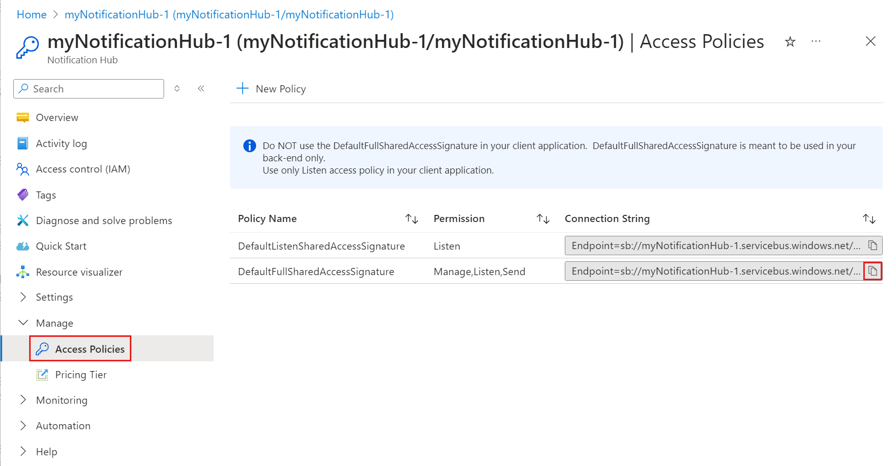

# Azure Functions Notification Hub output binding
[!INCLUDE [functions-selector-bindings](../../includes/functions-selector-bindings.md)]

This article explains how to configure and code Azure Notification Hub bindings in Azure Functions. 

[!INCLUDE [intro](../../includes/functions-bindings-intro.md)]

Your functions can send push notifications using a configured Azure Notification Hub with a few lines of code. However, the Azure Notification Hub must be configured for the Platform Notifications Services (PNS) you want to use. For more information on configuring an Azure Notification Hub and developing a client applications that register to receive notifications, see [Getting started with Notification Hubs](../notification-hubs/notification-hubs-windows-store-dotnet-get-started-wns-push-notification.md) and click your target client platform at the top.

The notifications you send can be native notifications or template notifications. Native notifications target a specific notification platform as configured in the `platform` property of the output binding. A template notification can be used to target multiple platforms.   

## Notification hub output binding properties
The function.json file provides the following properties:


|Property  |Description  |
|---------|---------|
|**name** | Variable name used in function code for the notification hub message. |
|**type** | Must be set to `notificationHub`. |
|**tagExpression** | Tag expressions allow you to specify that notifications be delivered to a set of devices who have registered to receive notifications that match the tag expression.  For more information, see [Routing and tag expressions](../notification-hubs/notification-hubs-tags-segment-push-message.md). |
|**hubName** | Name of the notification hub resource in the Azure portal. |
|**connection** | This connection string must be an **Application Setting** connection string set to the *DefaultFullSharedAccessSignature* value for your notification hub. |
|**direction** | Must be set to `out`. | 
|**platform** | The platform property indicates the notification platform your notification targets. By default, if the platform property is omitted from the output binding, template notifications can be used to target any platform configured on the Azure Notification Hub. For more information on using templates in general to send cross platform notifications with an Azure Notification Hub, see [Templates](../notification-hubs/notification-hubs-templates-cross-platform-push-messages.md). When set, _platform_ must be one of the following values: <ul><li><code>apns</code>&mdash;Apple Push Notification Service. For more information on configuring the notification hub for APNS and receiving the notification in a client app, see [Sending push notifications to iOS with Azure Notification Hubs](../notification-hubs/notification-hubs-ios-apple-push-notification-apns-get-started.md).</li><li><code>adm</code>&mdash;[Amazon Device Messaging](https://developer.amazon.com/device-messaging). For more information on configuring the notification hub for ADM and receiving the notification in a Kindle app, see [Getting Started with Notification Hubs for Kindle apps](../notification-hubs/notification-hubs-kindle-amazon-adm-push-notification.md).</li><li><code>gcm</code>&mdash;[Google Cloud Messaging](https://developers.google.com/cloud-messaging/). Firebase Cloud Messaging, which is the new version of GCM, is also supported. For more information, see [Sending push notifications to Android with Azure Notification Hubs](../notification-hubs/notification-hubs-android-push-notification-google-fcm-get-started.md).</li><li><code>wns</code>&mdash;[Windows Push Notification Services](https://msdn.microsoft.com/en-us/windows/uwp/controls-and-patterns/tiles-and-notifications-windows-push-notification-services--wns--overview) targeting Windows platforms. Windows Phone 8.1 and later is also supported by WNS. For more information, see [Getting started with Notification Hubs for Windows Universal Platform Apps](../notification-hubs/notification-hubs-windows-store-dotnet-get-started-wns-push-notification.md).</li><li><code>mpns</code>&mdash;[Microsoft Push Notification Service](https://msdn.microsoft.com/en-us/library/windows/apps/ff402558.aspx). This platform supports Windows Phone 8 and earlier Windows Phone platforms. For more information, see [Sending push notifications with Azure Notification Hubs on Windows Phone](../notification-hubs/notification-hubs-windows-mobile-push-notifications-mpns.md).</li></ul> |

Example function.json:

```json
{
  "bindings": [
    {
      "name": "notification",
      "type": "notificationHub",
      "tagExpression": "",
      "hubName": "my-notification-hub",
      "connection": "MyHubConnectionString",
      "platform": "gcm",
      "direction": "out"
    }
  ],
  "disabled": false
}
```

## Notification hub connection string setup
To use a Notification hub output binding, you must configure the connection string for the hub. You can select an existing notification hub or create a new one right from the *Integrate* tab in your function. You can also configure the connection string manually. 

To configure the connection string to an existing notification hub:

1. Navigate to your notification hub in the [Azure portal](https://portal.azure.com), choose **Access policies**, and select the copy button next to the **DefaultFullSharedAccessSignature** policy. This copies the connection string for the *DefaultFullSharedAccessSignature* policy to your notification hub. This connection string provides your function access permission to send notification messages. 
    
1. Navigate to your function app in the Azure portal, choose **Application settings**, add a key such as `MyHubConnectionString`, paste the copied *DefaultFullSharedAccessSignature*  for your notification hub as the value, and then click **Save**.

You can now use this named application setting that defines the notification hub connection in the output binding.

## APNS native notifications with C# queue triggers
This example shows how to use types defined in the [Microsoft Azure Notification Hubs Library](https://www.nuget.org/packages/Microsoft.Azure.NotificationHubs/) to send a native APNS notification. 

```cs
#r "Microsoft.Azure.NotificationHubs"
#r "Newtonsoft.Json"

using System;
using Microsoft.Azure.NotificationHubs;
using Newtonsoft.Json;

public static async Task Run(string myQueueItem, IAsyncCollector<Notification> notification, TraceWriter log)
{
    log.Info($"C# Queue trigger function processed: {myQueueItem}");

    // In this example the queue item is a new user to be processed in the form of a JSON string with 
    // a "name" value.
    //
    // The JSON format for a native APNS notification is ...
    // { "aps": { "alert": "notification message" }}  

    log.Info($"Sending APNS notification of a new user");    
    dynamic user = JsonConvert.DeserializeObject(myQueueItem);    
    string apnsNotificationPayload = "{\"aps\": {\"alert\": \"A new user wants to be added (" + 
                                        user.name + ")\" }}";
    log.Info($"{apnsNotificationPayload}");
    await notification.AddAsync(new AppleNotification(apnsNotificationPayload));        
}
```

## GCM native notifications with C# queue triggers
This example shows how to use types defined in the [Microsoft Azure Notification Hubs Library](https://www.nuget.org/packages/Microsoft.Azure.NotificationHubs/) to send a native GCM notification. 

```cs
#r "Microsoft.Azure.NotificationHubs"
#r "Newtonsoft.Json"

using System;
using Microsoft.Azure.NotificationHubs;
using Newtonsoft.Json;

public static async Task Run(string myQueueItem, IAsyncCollector<Notification> notification, TraceWriter log)
{
    log.Info($"C# Queue trigger function processed: {myQueueItem}");

    // In this example the queue item is a new user to be processed in the form of a JSON string with 
    // a "name" value.
    //
    // The JSON format for a native GCM notification is ...
    // { "data": { "message": "notification message" }}  

    log.Info($"Sending GCM notification of a new user");    
    dynamic user = JsonConvert.DeserializeObject(myQueueItem);    
    string gcmNotificationPayload = "{\"data\": {\"message\": \"A new user wants to be added (" + 
                                        user.name + ")\" }}";
    log.Info($"{gcmNotificationPayload}");
    await notification.AddAsync(new GcmNotification(gcmNotificationPayload));        
}
```

## WNS native notifications with C# queue triggers
This example shows how to use types defined in the [Microsoft Azure Notification Hubs Library](https://www.nuget.org/packages/Microsoft.Azure.NotificationHubs/) to send a native WNS toast notification. 

```cs
#r "Microsoft.Azure.NotificationHubs"
#r "Newtonsoft.Json"

using System;
using Microsoft.Azure.NotificationHubs;
using Newtonsoft.Json;

public static async Task Run(string myQueueItem, IAsyncCollector<Notification> notification, TraceWriter log)
{
    log.Info($"C# Queue trigger function processed: {myQueueItem}");

    // In this example the queue item is a new user to be processed in the form of a JSON string with 
    // a "name" value.
    //
    // The XML format for a native WNS toast notification is ...
    // <?xml version="1.0" encoding="utf-8"?>
    // <toast>
    //      <visual>
    //     <binding template="ToastText01">
    //       <text id="1">notification message</text>
    //     </binding>
    //   </visual>
    // </toast>

    log.Info($"Sending WNS toast notification of a new user");    
    dynamic user = JsonConvert.DeserializeObject(myQueueItem);    
    string wnsNotificationPayload = "<?xml version=\"1.0\" encoding=\"utf-8\"?>" +
                                    "<toast><visual><binding template=\"ToastText01\">" +
                                        "<text id=\"1\">" + 
                                            "A new user wants to be added (" + user.name + ")" + 
                                        "</text>" +
                                    "</binding></visual></toast>";

    log.Info($"{wnsNotificationPayload}");
    await notification.AddAsync(new WindowsNotification(wnsNotificationPayload));        
}
```

## Template example for Node.js timer triggers
This example sends a notification for a [template registration](../notification-hubs/notification-hubs-templates-cross-platform-push-messages.md) that contains `location` and `message`.

```javascript
module.exports = function (context, myTimer) {
    var timeStamp = new Date().toISOString();

    if(myTimer.isPastDue)
    {
        context.log('Node.js is running late!');
    }
    context.log('Node.js timer trigger function ran!', timeStamp);  
    context.bindings.notification = {
        location: "Redmond",
        message: "Hello from Node!"
    };
    context.done();
};
```

## Template example for F# timer triggers
This example sends a notification for a [template registration](../notification-hubs/notification-hubs-templates-cross-platform-push-messages.md) that contains `location` and `message`.

```fsharp
let Run(myTimer: TimerInfo, notification: byref<IDictionary<string, string>>) =
    notification = dict [("location", "Redmond"); ("message", "Hello from F#!")]
```

## Template example using an out parameter
This example sends a notification for a [template registration](../notification-hubs/notification-hubs-templates-cross-platform-push-messages.md) that contains a `message` place holder in the template.

```cs
using System;
using System.Threading.Tasks;
using System.Collections.Generic;

public static void Run(string myQueueItem,  out IDictionary<string, string> notification, TraceWriter log)
{
    log.Info($"C# Queue trigger function processed: {myQueueItem}");
    notification = GetTemplateProperties(myQueueItem);
}

private static IDictionary<string, string> GetTemplateProperties(string message)
{
    Dictionary<string, string> templateProperties = new Dictionary<string, string>();
    templateProperties["message"] = message;
    return templateProperties;
}
```

## Template example with asynchronous function
If you are using asynchronous code, out parameters are not allowed. In this case use `IAsyncCollector` to return your template notification. The following code is an asynchronous example of the code above. 

```cs
using System;
using System.Threading.Tasks;
using System.Collections.Generic;

public static async Task Run(string myQueueItem, IAsyncCollector<IDictionary<string,string>> notification, TraceWriter log)
{
    log.Info($"C# Queue trigger function processed: {myQueueItem}");

    log.Info($"Sending Template Notification to Notification Hub");
    await notification.AddAsync(GetTemplateProperties(myQueueItem));    
}

private static IDictionary<string, string> GetTemplateProperties(string message)
{
    Dictionary<string, string> templateProperties = new Dictionary<string, string>();
    templateProperties["user"] = "A new user wants to be added : " + message;
    return templateProperties;
}
```

## Template example using JSON
This example sends a notification for a [template registration](../notification-hubs/notification-hubs-templates-cross-platform-push-messages.md) that contains a `message` place holder in the template using a valid JSON string.

```cs
using System;

public static void Run(string myQueueItem,  out string notification, TraceWriter log)
{
    log.Info($"C# Queue trigger function processed: {myQueueItem}");
    notification = "{\"message\":\"Hello from C#. Processed a queue item!\"}";
}
```

## Template example using Notification Hubs library types
This example shows how to use types defined in the [Microsoft Azure Notification Hubs Library](https://www.nuget.org/packages/Microsoft.Azure.NotificationHubs/). 

```cs
#r "Microsoft.Azure.NotificationHubs"

using System;
using System.Threading.Tasks;
using Microsoft.Azure.NotificationHubs;

public static void Run(string myQueueItem,  out Notification notification, TraceWriter log)
{
   log.Info($"C# Queue trigger function processed: {myQueueItem}");
   notification = GetTemplateNotification(myQueueItem);
}

private static TemplateNotification GetTemplateNotification(string message)
{
    Dictionary<string, string> templateProperties = new Dictionary<string, string>();
    templateProperties["message"] = message;
    return new TemplateNotification(templateProperties);
}
```

## Next steps
[!INCLUDE [next steps](../../includes/functions-bindings-next-steps.md)]

