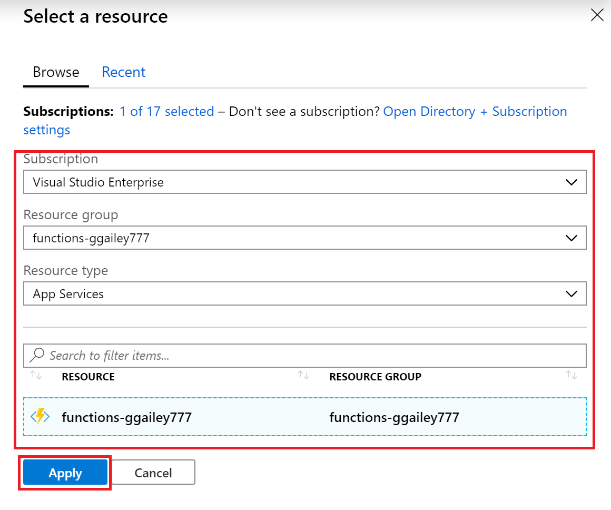
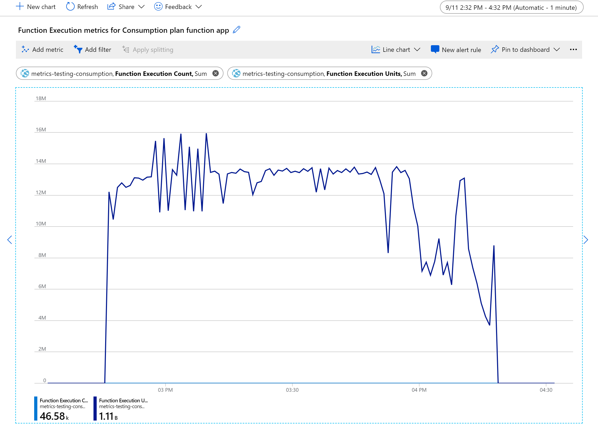

# Estimating Consumption plan costs

There are currently three types of hosting plans for an app that runs in Azure Functions, with each plan having its own pricing model: 

| Plan | Description |
| ---- | ----------- |
| [**Consumption**](consumption-plan.md) | You're only charged for the time that your function app runs. This plan includes a [free grant][pricing page] on a per subscription basis.|
| [**Premium**](functions-premium-plan.md) | Provides you with the same features and scaling mechanism as the Consumption plan, but with enhanced performance and VNET access. Cost is based on your chosen pricing tier. To learn more, see [Azure Functions Premium plan](functions-premium-plan.md). |
| [**Dedicated (App Service)**](dedicated-plan.md) <br/>(basic tier or higher) | When you need to run in dedicated VMs or in isolation, use custom images, or want to use your excess App Service plan capacity. Uses [regular App Service plan billing](https://azure.microsoft.com/pricing/details/app-service/). Cost is based on your chosen pricing tier.|

You chose the plan that best supports your function performance and cost requirements. To learn more, see [Azure Functions scale and hosting](functions-scale.md).

This article deals only with the Consumption plan, since this plan results in variable costs. This article supersedes the [Consumption plan cost billing FAQ](https://github.com/Azure/Azure-Functions/wiki/Consumption-Plan-Cost-Billing-FAQ) article.

Durable Functions can also run in a Consumption plan. To learn more about the cost considerations when using Durable Functions, see [Durable Functions billing](./durable/durable-functions-billing.md).

## Consumption plan costs

The execution *cost* of a single function execution is measured in *GB-seconds*. Execution cost is calculated by combining its memory usage with its execution time. A function that runs for longer costs more, as does a function that consumes more memory. 

Consider a case where the amount of memory used by the function stays constant. In this case, calculating the cost is simple multiplication. For example, say that your function consumed 0.5 GB for 3 seconds. Then the execution cost is `0.5GB * 3s = 1.5 GB-seconds`. 

Since memory usage changes over time, the calculation is essentially the integral of memory usage over time.  The system does this calculation by sampling the memory usage of the process (along with child processes) at regular intervals. As mentioned on the [pricing page], memory usage is rounded up to the nearest 128-MB bucket. When your process is using 160 MB, you're charged for 256 MB. The calculation takes into account concurrency, which is multiple concurrent function executions in the same process.

> [!NOTE]
> While CPU usage isn't directly considered in execution cost, it can have an impact on the cost when it affects the execution time of the function.

For an HTTP-triggered function, when an error occurs before your function code begins to execute you aren't charged for an execution. This means that 401 responses from the platform due to API key validation or the App Service Authentication / Authorization feature don't count against your execution cost. Similarly, 5xx status code responses aren't counted when they occur in the platform prior to a function processing the request. A 5xx response generated by the platform after your function code has started to execute is still counted as an execution, even if the error isn't raised by your function code.

## Other related costs

When estimating the overall cost of running your functions in any plan, remember that the Functions runtime uses several other Azure services, which are each billed separately. When calculating pricing for function apps, any triggers and bindings you have that integrate with other Azure services require you to create and pay for those additional services. 

For functions running in a Consumption plan, the total cost is the execution cost of your functions, plus the cost of bandwidth and additional services. 

When estimating the overall costs of your function app and related services, use the [Azure pricing calculator](https://azure.microsoft.com/pricing/calculator/?service=functions). 

| Related cost | Description |
| ------------ | ----------- |
| **Storage account** | Each function app requires that you have an associated General Purpose [Azure Storage account](../storage/common/storage-introduction.md#types-of-storage-accounts), which is [billed separately](https://azure.microsoft.com/pricing/details/storage/). This account is used internally by the Functions runtime, but you can also use it for Storage triggers and bindings. If you don't have a storage account, one is created for you when the function app is created. To learn more, see [Storage account requirements](storage-considerations.md#storage-account-requirements).|
| **Application Insights** | Functions relies on [Application Insights](../azure-monitor/app/app-insights-overview.md) to provide a high-performance monitoring experience for your function apps. While not required, you should [enable Application Insights integration](configure-monitoring.md#enable-application-insights-integration). A free grant of telemetry data is included every month. To learn more, see [the Azure Monitor pricing page](https://azure.microsoft.com/pricing/details/monitor/). |
| **Network bandwidth** | You don't pay for data transfer between Azure services in the same region. However, you can incur costs for outbound data transfers to another region or outside of Azure. To learn more, see [Bandwidth pricing details](https://azure.microsoft.com/pricing/details/bandwidth/). |

## Behaviors affecting execution time

The following behaviors of your functions can impact the execution time:

+ **Triggers and bindings**: The time taken to read input from and write output to your [function bindings](functions-triggers-bindings.md) is counted as execution time. For example, when your function uses an output binding to write a message to an Azure storage queue, your execution time includes the time taken to write the message to the queue, which is included in the calculation of the function cost. 

+ **Asynchronous execution**: The time that your function waits for the results of an async request (`await` in C#) is counted as execution time. The GB-second calculation is based on the start and end time of the function and the memory usage over that period. What is happening over that time in terms of CPU activity isn't factored into the calculation. You may be able to reduce costs during asynchronous operations by using [Durable Functions](durable/durable-functions-overview.md). You're not billed for time spent at awaits in orchestrator functions.

## Viewing cost-related data

In [your invoice](../cost-management-billing/understand/download-azure-invoice.md), you can view the cost-related data of **Total Executions - Functions** and **Execution Time - Functions**, along with the actual billed costs. However, this invoice data is a monthly aggregate for a past invoice period. 

### Function app-level metrics

To better understand the cost impact of your functions, you can use Azure Monitor to view cost-related metrics currently being generated by your function apps. You can use either [Azure Monitor metrics explorer](../azure-monitor/essentials/metrics-getting-started.md) in the [Azure portal] or REST APIs to get this data.

#### Monitor metrics explorer

Use [Azure Monitor metrics explorer](../azure-monitor/essentials/metrics-getting-started.md) to view cost-related data for your Consumption plan function apps in a graphical format. 

1. At the top of the [Azure portal] in **Search services, resources, and docs**  search for `monitor` and select **Monitor** under **Services**.

1. At the left, select **Metrics** > **Select a resource**, then use the settings below the image to choose your function app.

    

      
    |Setting  |Suggested value  |Description  |
    |---------|---------|---------|
    | Subscription    |  Your subscription	| The subscription with your function app.  |
    | Resource group     | Your resource group  | The resource group that contains your function app.   |
    | Resource type     |  App Services | Function apps are shown as App Services instances in Monitor. |
    | Resource     |  Your function app  | The function app to monitor.        |

1. Select **Apply** to choose your function app as the resource to monitor.

1. From **Metric**, choose **Function Execution Count** and **Sum** for **Aggregation**. This adds the sum of the execution counts during chosen period to the chart.

    

1. Select **Add metric** and repeat steps 2-4 to add **Function Execution Units** to the chart. 

The resulting chart contains the totals for both execution metrics in the chosen time range, which in this case is two hours.



As the number of execution units is so much greater than the execution count, the chart just shows execution units.

This chart shows a total of 1.11 billion `Function Execution Units` consumed in a two-hour period, measured in MB-milliseconds. To convert to GB-seconds, divide by 1024000. In this example, the function app consumed `1110000000 / 1024000 = 1083.98` GB-seconds. You can take this value and multiply by the current price of execution time on the [Functions pricing page][pricing page], which gives you the cost of these two hours, assuming you've already used any free grants of execution time. 

#### Azure CLI

The [Azure CLI](/cli/azure/) has commands for retrieving metrics. You can use the CLI from a local command environment or directly from the portal using [Azure Cloud Shell](../cloud-shell/overview.md). For example, the following [az monitor metrics list](/cli/azure/monitor/metrics#az_monitor_metrics_list) command returns hourly data over same time period used before.

Make sure to replace `<AZURE_SUBSCRIPTON_ID>` with your Azure subscription ID running the command.

```azurecli-interactive
az monitor metrics list --resource /subscriptions/<AZURE_SUBSCRIPTION_ID>/resourceGroups/metrics-testing-consumption/providers/Microsoft.Web/sites/metrics-testing-consumption --metric FunctionExecutionUnits,FunctionExecutionCount --aggregation Total --interval PT1H --start-time 2019-09-11T21:46:00Z --end-time 2019-09-11T23:18:00Z
```

This command returns a JSON payload that looks like the following example:

```json
{
  "cost": 0.0,
  "interval": "1:00:00",
  "namespace": "Microsoft.Web/sites",
  "resourceregion": "centralus",
  "timespan": "2019-09-11T21:46:00Z/2019-09-11T23:18:00Z",
  "value": [
    {
      "id": "/subscriptions/XXXXXXX-XXXX-XXXX-XXXX-XXXXXXXXXXX/resourceGroups/metrics-testing-consumption/providers/Microsoft.Web/sites/metrics-testing-consumption/providers/Microsoft.Insights/metrics/FunctionExecutionUnits",
      "name": {
        "localizedValue": "Function Execution Units",
        "value": "FunctionExecutionUnits"
      },
      "resourceGroup": "metrics-testing-consumption",
      "timeseries": [
        {
          "data": [
            {
              "average": null,
              "count": null,
              "maximum": null,
              "minimum": null,
              "timeStamp": "2019-09-11T21:46:00+00:00",
              "total": 793294592.0
            },
            {
              "average": null,
              "count": null,
              "maximum": null,
              "minimum": null,
              "timeStamp": "2019-09-11T22:46:00+00:00",
              "total": 316576256.0
            }
          ],
          "metadatavalues": []
        }
      ],
      "type": "Microsoft.Insights/metrics",
      "unit": "Count"
    },
    {
      "id": "/subscriptions/XXXXXXX-XXXX-XXXX-XXXX-XXXXXXXXXXX/resourceGroups/metrics-testing-consumption/providers/Microsoft.Web/sites/metrics-testing-consumption/providers/Microsoft.Insights/metrics/FunctionExecutionCount",
      "name": {
        "localizedValue": "Function Execution Count",
        "value": "FunctionExecutionCount"
      },
      "resourceGroup": "metrics-testing-consumption",
      "timeseries": [
        {
          "data": [
            {
              "average": null,
              "count": null,
              "maximum": null,
              "minimum": null,
              "timeStamp": "2019-09-11T21:46:00+00:00",
              "total": 33538.0
            },
            {
              "average": null,
              "count": null,
              "maximum": null,
              "minimum": null,
              "timeStamp": "2019-09-11T22:46:00+00:00",
              "total": 13040.0
            }
          ],
          "metadatavalues": []
        }
      ],
      "type": "Microsoft.Insights/metrics",
      "unit": "Count"
    }
  ]
}
```
This particular response shows that from `2019-09-11T21:46` to `2019-09-11T23:18`, the app consumed 1110000000 MB-milliseconds (1083.98 GB-seconds).

### Function-level metrics

Function execution units are a combination of execution time and your memory usage, which makes it a difficult metric for understanding memory usage. Memory data isn't a metric currently available through Azure Monitor. However, if you want to optimize the memory usage of your app, can use the performance counter data collected by Application Insights.  

If you haven't already done so, [enable Application Insights in your function app](configure-monitoring.md#enable-application-insights-integration). With this integration enabled, you can [query this telemetry data in the portal](analyze-telemetry-data.md#query-telemetry-data). 

[!INCLUDE [functions-consumption-metrics-queries](../../includes/functions-consumption-metrics-queries.md)]

## Next steps

> [!div class="nextstepaction"]
> [Learn more about Monitoring function apps](functions-monitoring.md)

[pricing page]:https://azure.microsoft.com/pricing/details/functions/
[Azure portal]: https://portal.azure.com
