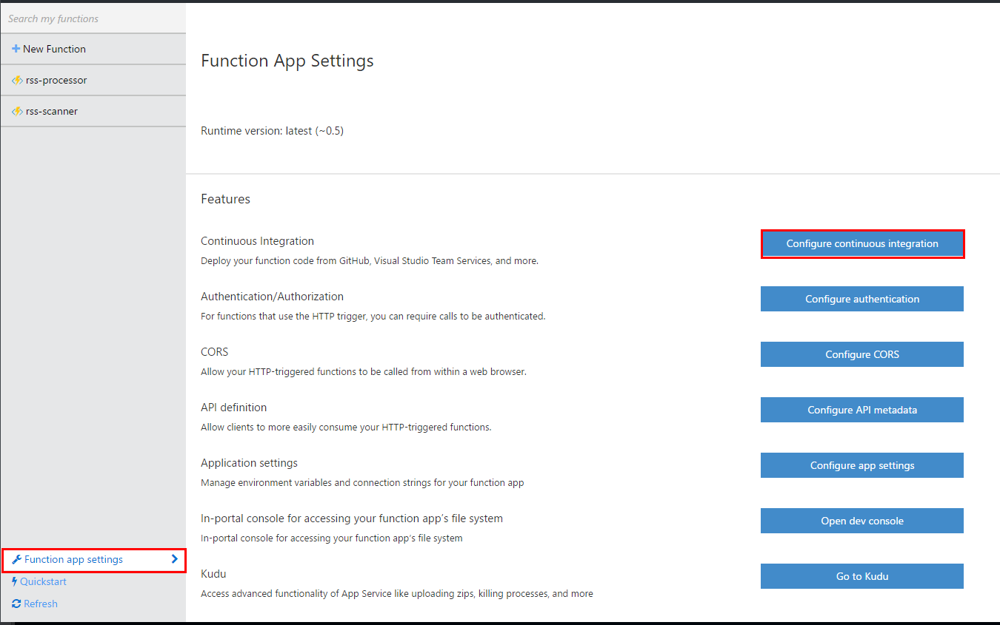
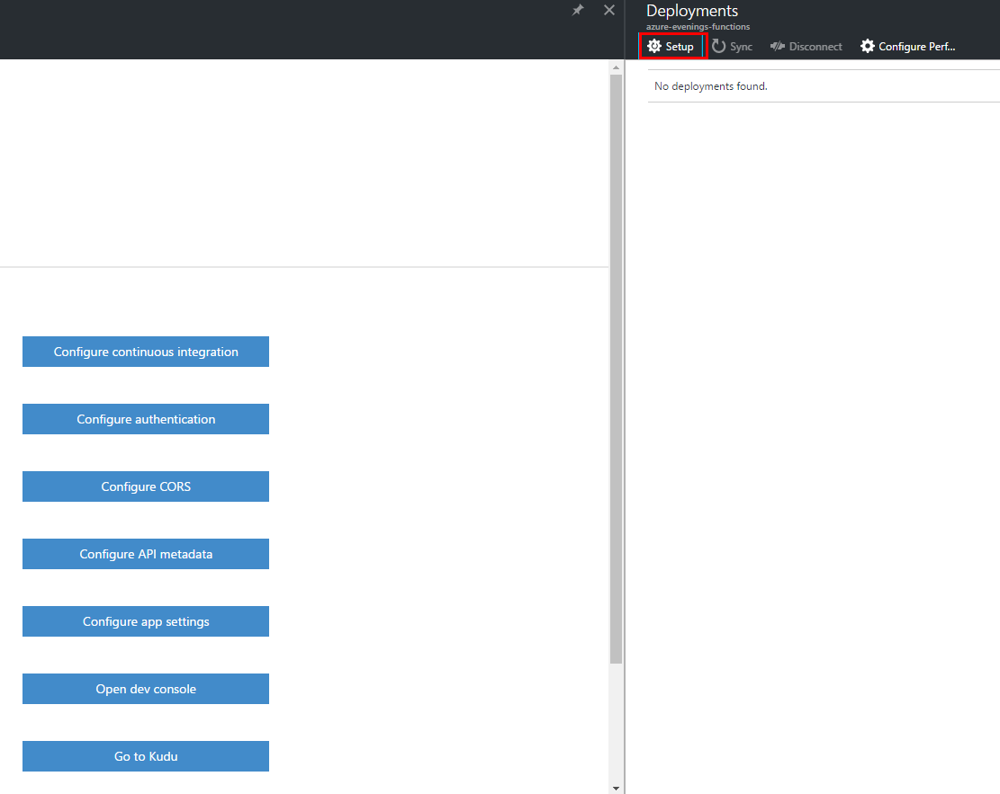
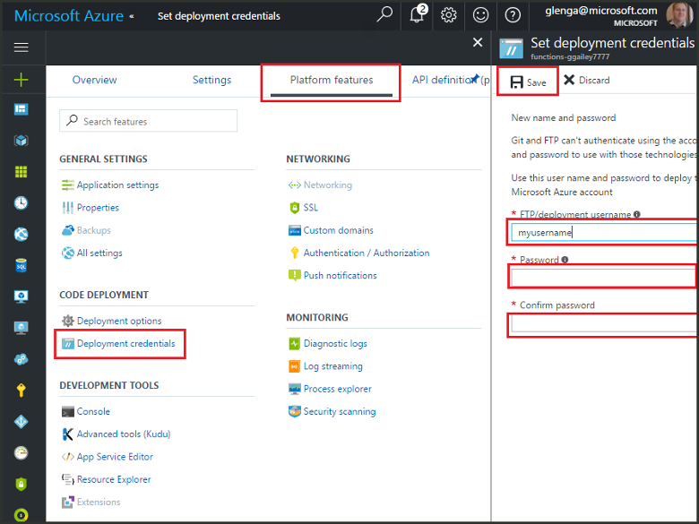

# Continuous deployment for Azure Functions
Azure Functions makes it easy to deploy your function app using App Service continuous integration. Functions integrates with BitBucket, Dropbox, GitHub, and Azure DevOps. This enables a workflow where function code updates made by using one of these integrated services trigger deployment to Azure. If you are new to Azure Functions, start with [Azure Functions Overview](functions-overview.md).

Continuous deployment is a great option for projects where multiple and frequent contributions are being integrated. It also lets you maintain source control on your functions code. The following deployment sources are currently supported:

* [Bitbucket](https://bitbucket.org/)
* [Dropbox](https://www.dropbox.com/)
* External repository (Git or Mercurial)
* [Git local repository](../app-service/app-service-deploy-local-git.md)
* [GitHub](https://github.com)
* [OneDrive](https://onedrive.live.com/)
* [Azure DevOps Services](https://www.visualstudio.com/team-services/)

Deployments are configured on a per-function app basis. After continuous deployment is enabled, access to function code in the portal is set to *read-only*.

## Continuous deployment requirements

You must have your deployment source configured and your functions code in the deployment source before you set up continuous deployment. In a given function app deployment, each function lives in a named subdirectory, where the directory name is the name of the function.  

[!INCLUDE [functions-folder-structure](../../includes/functions-folder-structure.md)]

To be able to deploy from Azure DevOps, you must first link your Azure DevOps organization with your Azure subscription. For more information, see [Set up billing for your Azure DevOps organization](https://docs.microsoft.com/azure/devops/organizations/billing/set-up-billing-for-your-organization-vs?view=vsts#set-up-billing-via-the-azure-portal).

## Set up continuous deployment
Use this procedure to configure continuous deployment for an existing function app. These steps demonstrate integration with a GitHub repository, but similar steps apply for Azure DevOps or other deployment services.

1. In your function app in the [Azure portal](https://portal.azure.com), click **Platform features** and **Deployment options**. 
   
    
 
2. Then in the **Deployments** blade click **Setup**.
 
    
   
2. In the **Deployment source** blade, click **Choose source**, then fill in the information for your chosen deployment source and click **OK**.
   
    

After continuous deployment is configured, all file changes in your deployment source are copied to the function app and a full site deployment is triggered. The site is redeployed when files in the source are updated.

## Deployment options

The following are some typical deployment scenarios:

- [Create a staging deployment](#staging)
- [Move existing functions to continuous deployment](#existing)

### Create a staging deployment

Function Apps doesn't yet support deployment slots. However, you can still manage separate staging and production deployments by using continuous integration.

The process to configure and work with a staging deployment looks generally like this:

1. Create two function apps in your subscription, one for the production code and one for staging. 

2. Create a deployment source, if you don't already have one. This example uses [GitHub].

3. For your production function app, complete the preceding steps in **Set up continuous deployment** and set the deployment branch to the master branch of your GitHub repository.
   
    

4. Repeat this step for the staging function app, but choose the staging branch instead in your GitHub repo. If your deployment source doesn't support branching, use a different folder.
    
5. Make updates to your code in the staging branch or folder, then verify that those changes are reflected in the staging deployment.

6. After testing, merge changes from the staging branch into the master branch. This merge triggers deployment to the production function app. If your deployment source doesn't support branches, overwrite the files in the production folder with the files from the staging folder.

### Move existing functions to continuous deployment
When you have existing functions that you have created and maintained in the portal, you need to download your existing function code files using FTP or the local Git repository before you can set up continuous deployment as described above. You can do this in the App Service settings for your function app. After your files are downloaded, you can upload them to your chosen continuous deployment source.

> [!NOTE]
> After you configure continuous integration, you will no longer be able to edit your source files in the Functions portal.

- [How to: Configure deployment credentials](#credentials)
- [How to: Download files using FTP](#downftp)
- [How to: Download files using the local Git repository](#downgit)

#### How to: Configure deployment credentials
Before you can download files from your function app with FTP or local Git repository, you must configure your credentials to access the site. Credentials are set at the Function app level. Use the following steps to set deployment credentials in the Azure portal:

1. In your function app in the [Azure portal](https://portal.azure.com), click **Platform features** and **Deployment credentials**.
   
    

2. Type in a username and password, then click **Save**. You can now use these credentials to access your function app from FTP or the built-in Git repo.

#### How to: Download files using FTP

1. In your function app in the [Azure portal](https://portal.azure.com), click **Platform features** and **Properties**, then copy the values for **FTP/Deployment User**, **FTP Host Name**, and **FTPS Host Name**.  

    **FTP/Deployment User** must be entered as displayed in the portal, including the app name, to provide proper context for the FTP server.
   
    

2. From your FTP client, use the connection information you gathered to connect to your app and download the source files for your functions.

#### How to: Download files using a local Git repository

1. In your function app in the [Azure portal](https://portal.azure.com), click **Platform features** and **Deployment options**. 
   
    
 
2. Then in the **Deployments** blade click **Setup**.
 
    
   
2. In the **Deployment source** blade, click **Local Git repository** and then click **OK**.

3. In **Platform features**, click **Properties** and note the value of Git URL. 
   
    

4. Clone the repository on your local machine using a Git-aware command prompt or your favorite Git tool. The Git clone command looks like this:
   
        git clone https://username@my-function-app.scm.azurewebsites.net:443/my-function-app.git

5. Fetch files from your function app to the clone on your local computer, as in the following example:
   
        git pull origin master
   
    If requested, supply your [configured deployment credentials](#credentials).  

[GitHub]: https://github.com/

## Next steps

> [!div class="nextstepaction"]
> [Best Practices for Azure Functions](functions-best-practices.md)
