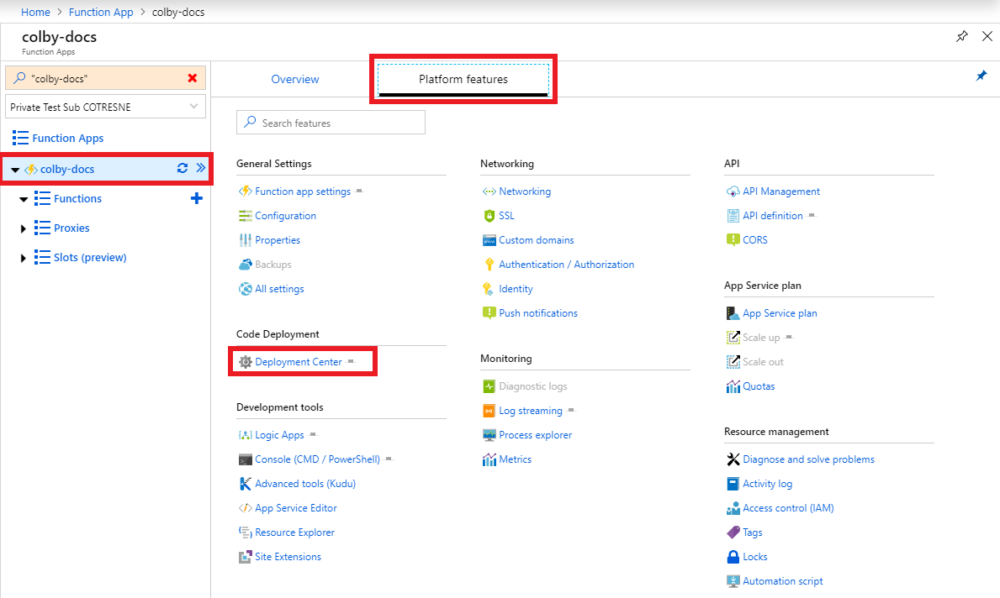
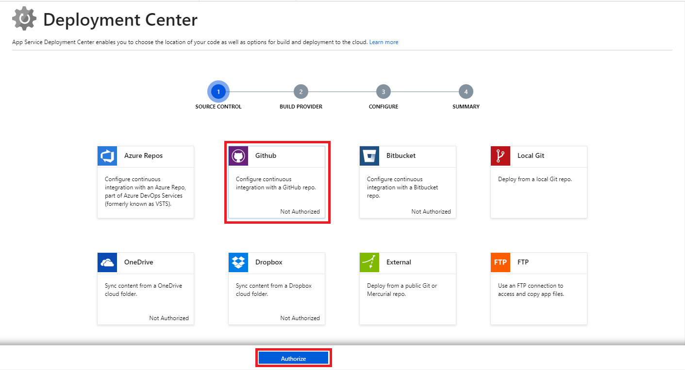
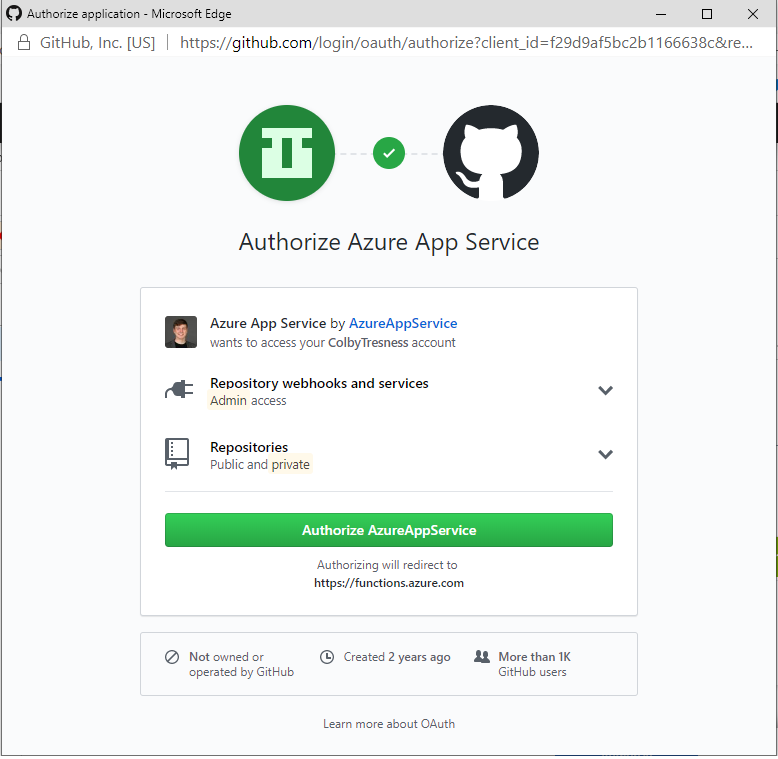
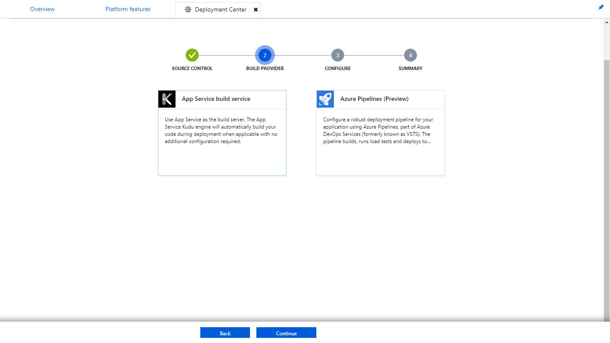
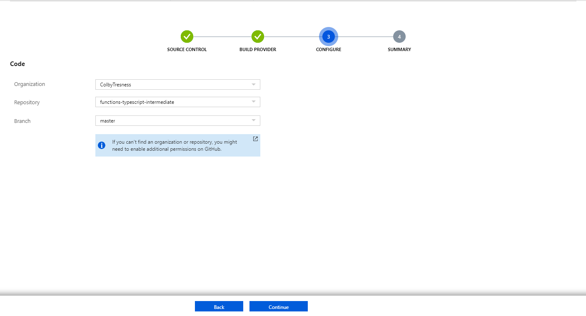
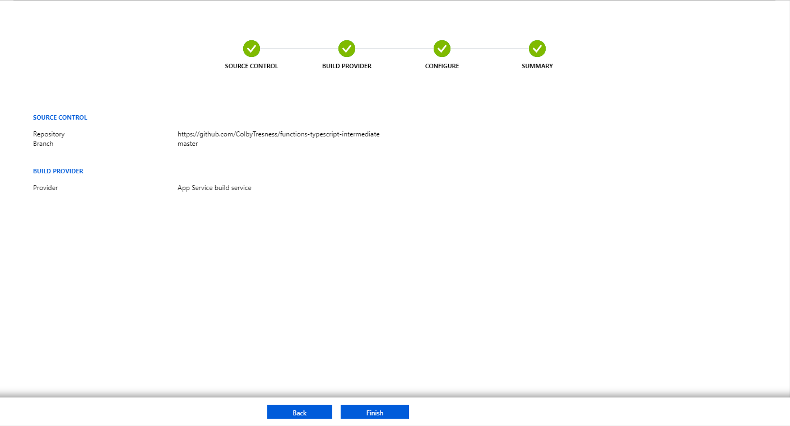
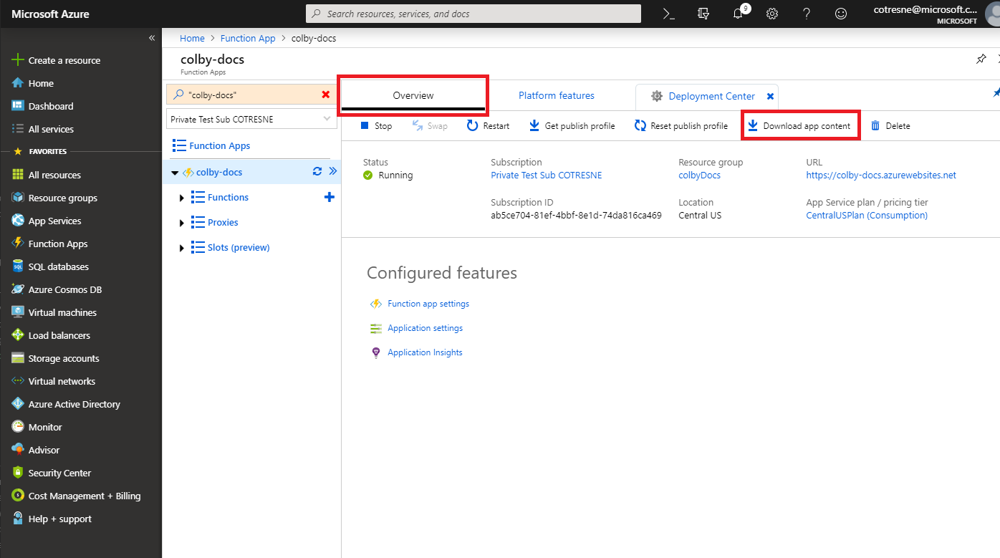

# Continuous deployment for Azure Functions

You can use Azure Functions to deploy your code continuously by using [source control integration](functions-deployment-technologies.md#source-control). Source control integration enables a workflow in which a code update triggers deployment to Azure. If you're new to Azure Functions, get started by reviewing the [Azure Functions overview](functions-overview.md).

Continuous deployment is a good option for projects where you integrate multiple and frequent contributions. When you use continuous deployment, you maintain a single source of truth for your code, which allows teams to easily collaborate. You can configure continuous deployment in Azure Functions from the following source code locations:

* [Azure Repos](https://azure.microsoft.com/services/devops/repos/)
* [GitHub](https://github.com)
* [Bitbucket](https://bitbucket.org/)

The unit of deployment for functions in Azure is the function app. All functions in a function app are deployed at the same time. After you enable continuous deployment, access to function code in the Azure portal is configured as *read-only* because the source of truth is set to be elsewhere.

## Requirements for continuous deployment

For continuous deployment to succeed, your directory structure must be compatible with the basic folder structure that Azure Functions expects.

[!INCLUDE [functions-folder-structure](../../includes/functions-folder-structure.md)]

## Set up continuous deployment

To configure continuous deployment for an existing function app, complete these steps. The steps demonstrate integration with a GitHub repository, but similar steps apply for Azure Repos or other source code repositories.

1. In your function app in the [Azure portal](https://portal.azure.com), select **Platform features** > **Deployment Center**.

    

2. In **Deployment Center**, select **GitHub**, and then select **Authorize**. If you've already authorized GitHub, select **Continue**. 

    

3. In GitHub, select the **Authorize AzureAppService** button. 

    
    
    In **Deployment Center** in the Azure portal, select **Continue**.

4. Select one of the following build providers:

    * **App Service build service**: Best when you don't need a build or if you need a generic build.
    * **Azure Pipelines (Preview)**: Best when you need more control over the build. This provider currently is in preview.

    

5. Configure information specific to the source control option you specified. For GitHub, you must enter or select values for **Organization**, **Repository**, and **Branch**. The values are based on the location of your code. Then, select **Continue**.

    

6. Review all details, and then select **Finish** to complete your deployment configuration.

    

When the process is finished, all code from the specified source is deployed to your app. At that point, changes in the deployment source trigger a deployment of those changes to your function app in Azure.

## Deployment scenarios

### Move existing functions to continuous deployment

If you've already written functions in the [Azure portal](https://portal.azure.com) and you want to download the contents of your app before you switch to continuous deployment, go to the **Overview** tab of your function app. Select the **Download app content** button.

> [!NOTE]
> After you configure continuous integration, you can no longer edit your source files in the Functions portal.

## Next steps

> [!div class="nextstepaction"]
> [Best practices for Azure Functions](functions-best-practices.md)
