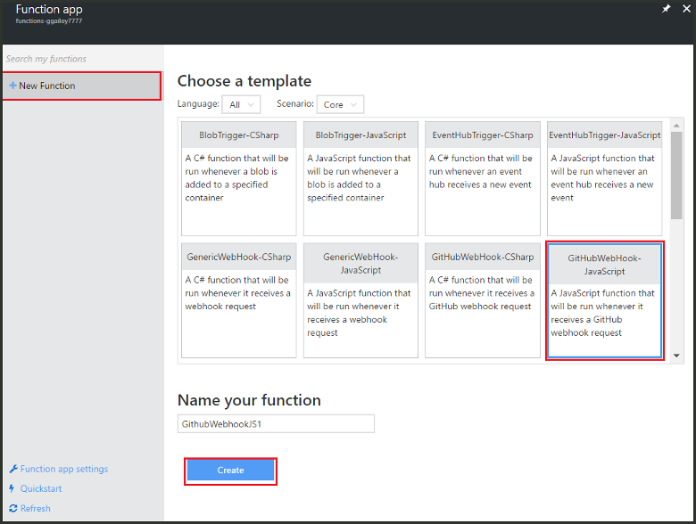
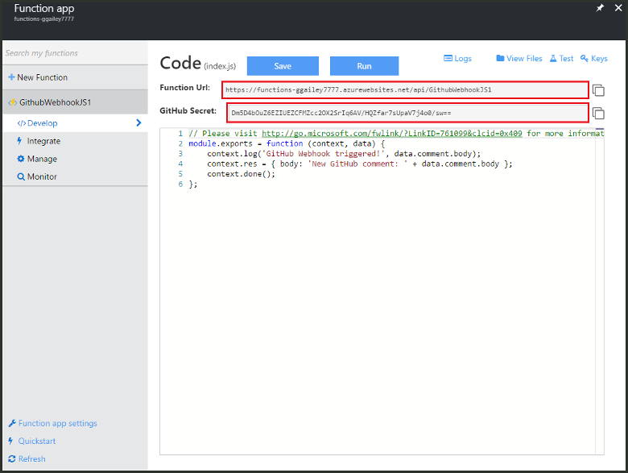
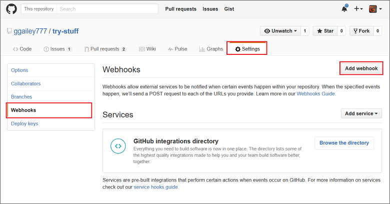
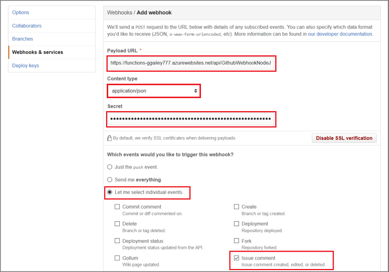

<properties
   pageTitle="Create a web hook or API Azure Function | Microsoft Azure"
   description="Use Azure Functions to create a function that is invoked by a WebHook or API call."
   services="azure-functions"
   documentationCenter="na"
   authors="ggailey777"
   manager="erikre"
   editor=""
   tags=""
   />

<tags
   ms.service="functions"
   ms.devlang="multiple"
   ms.topic="article"
   ms.tgt_pltfrm="multiple"
   ms.workload="na"
   ms.date="04/27/2016"
   ms.author="glenga"/>
   
# Create a webhook or API Azure Function

Azure Functions event-driven, compute-on-demand experience that enables you to create scheduled or triggered units of code implemented in a variety of programming languages. To learn more about Azure Functions, see the [Azure Functions Overview](functions-overview.md).

This topic shows you how to create a new Node.js function that is invoked by a GitHub webhook. The new function is created based on a pre-defined template in the Azure Functions portal. You can also watch a short video to see how these steps are performed in the portal.

## Watch the video

The following video show how to perform the basic steps in this tutorial 

[AZURE.VIDEO create-a-web-hook-or-api-azure-function]

##Create a webhook-triggered function from the template

A function app hosts the execution of your functions in Azure. Before you can create a function, you need to have an active Azure account. If you don't already have an Azure account, [free accounts are available](https://azure.microsoft.com/free/). 

1. Go to the [Azure Functions portal](https://functions.azure.com/signin) and sign-in with your Azure account.

2. If you have an existing function app to use, select it from Function apps then click Open. To create a new function app, type a unique **Name** for your new function app or accept the generated one, select your preferred **Region**, then click **Create + get started**. 

3. In your function app, click **+ New Function** > **GitHub Webhook - Node** > **Create**. This creates a function with a default name that is based on the specified template. 

	 

4. In the **Develop** tab, note the sample express.js function in the **Code** window. This is the function itself, which expects to receive a GitHub request from a issue comment webhook. The following is the code that logs the issue comment text and sends it back to the webhook in the response as `New GitHub comment: <Your issue comment text>`:

		module.exports = function (context, data) {
		    context.log('GitHub WebHook triggered!', data.comment.body);
		    context.res = { body: 'New GitHub comment: ' + data.comment.body };
		    context.done();
		};

5. Copy the **Function URL** and **GitHub Secret** values. You will need these to create the webhook. 

	 

You can always test a new template-based function immediately in the portal by clicking the **Run** button. This sends a test request to the function endpoint with the JSON code in **Request body**, which represents an issue comment webhook request. Next, you will configure a GitHub repository to be able to test the function by submitting an issue comment.

##Configure the webhook

1. In GitHub, navigate to a repository that you own. This includes any repositories that you have forked.
 
2. Click **Settings** > **Webhooks & services** > **Add webhook**.

	   

3. Paste your function's URL and secret into **Payload URL** and **Secret**, then click **Let me select individual events**, check **Issue comment** and click **Add webhook**.

	 

At this point, the GitHub webhook is configured to trigger your function when a new issue comment is added. Now, it's time to test it out.

##Test the function

1. In your GitHub repo, open the **Issues** tab in a new browser window, click **New Issue**, type a title then click **Submit new issue**. You can also open an existing issue.

2. In the issue, type a comment and click **Comment**. At this point, you can go back to your new webhook in GitHub and under **Recent Deliveries** see that a webhook request was sent and that the body of response is `New GitHub comment: <Your issue comment text>`.

3. Back in the Functions portal, scroll down to the logs and see that the function has been triggered and the value `New GitHub comment: <Your issue comment text>` is written to the streaming logs.

##Next steps

See these topics for more information about Azure Functions.

+ [Azure Functions developer reference](functions-reference.md)  
Programmer reference for coding functions and defining triggers and bindings.
+ [Testing Azure Functions](functions-test-a-function.md)  
Describes various tools and techniques for testing your functions.
+ [How to scale Azure Functions](functions-scale.md)  
Discusses service plans available with Azure Functions, including the Dynamic service plan, and how to choose the right plan.  

[AZURE.INCLUDE [Getting Started Note](../../includes/functions-get-help.md)]
