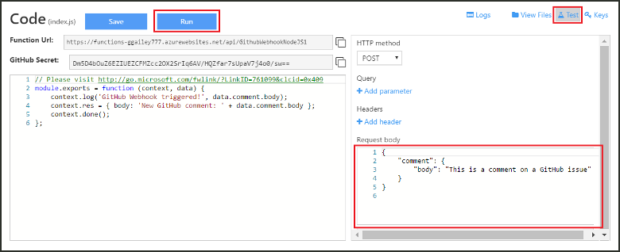

# Create a webhook or API Azure Function
Azure Functions is an event-driven, compute-on-demand experience that enables you to create scheduled or triggered units of code implemented in various programming languages. To learn more about Azure Functions, see the [Azure Functions Overview](functions-overview.md).

This topic shows you how to create a JavaScript function that is invoked by a GitHub webhook. The new function is created based on a pre-defined template in the Azure Functions portal. You can also watch a short video to see how these steps are performed in the portal.

The general steps in this tutorial can also be used to create a function in C# or F# instead of JavaScript. 

## Watch the video
The following video shows how to perform the basic steps in this tutorial 

>[!VIDEO https://channel9.msdn.com/Series/Windows-Azure-Web-Sites-Tutorials/Create-a-Web-Hook-or-API-Azure-Function/player]
>
>

## Prerequisites

To complete this tutorial, you will need the following:

+ An active Azure account. If you don't already have an account, you can [sign up for a free Azure acccount](https://azure.microsoft.com/free/).  
 You can also use the [Try Functions](https://functions.azure.com/try) experience to complete this tutorial without an Azure account.
+ A GitHub account. You can [sign up for a free GitHub account](https://github.com/join), if you don't already have one. 

## Create a webhook-triggered function from the template
A function app hosts the execution of your functions in Azure. 

1. Go to the [Azure Functions portal](https://functions.azure.com/signin) and sign-in with your Azure account.

2. If you have an existing function app to use, select it from **Your function apps** then click **Open**. To create a function app, type a unique **Name** for your new function app or accept the generated one, select your preferred **Region**, then click **Create + get started**. 

3. In your function app, click **+ New Function** > **GitHub Webhook - JavaScript** > **Create**. This step creates a function with a default name that is based on the specified template. You can alternately create a C# or F# function.
   
     

4. In **Develop**, note the sample express.js function in the **Code** window. This function receives a GitHub request from an issue comment webhook, logs the issue text and sends a response to the webhook as `New GitHub comment: <Your issue comment text>`.

     

1. Copy and save the **Function URL** and **GitHub Secret** values. You will use these values in the next section to configure the webhook in GitHub. 

2. Click **Test**, note the predefined JSON body of an issue comment in the **Request body**, then click **Run**. 

	
   
    > [!NOTE]
    > You can always test a new template-based function right in the **Develop** tab by supplying any expected body JSON data and clicking the **Run** button. In this case, the template has a predefined body for an issue comment. 

Next, you will create the actual webhook in your GitHub repository.

## Configure the webhook
1. In GitHub, navigate to a repository that you own. You can also use any repositories that you have forked.
 
2. Click **Settings** > **Webhooks & services** > **Add webhook**.
   
       

3. Paste your function's URL and secret into **Payload URL** and **Secret** and select **application/json** for **Content type**.

4. Click **Let me select individual events**, select **Issue comment**, and click **Add webhook**.
   
     

At this point, the GitHub webhook is configured to trigger your function when a new issue comment is added.  
Now, it's time to test it out.

## Test the function
1. In your GitHub repo, open the **Issues** tab in a new browser window.

2. In the new window, click **New Issue**, type a title then click **Submit new issue**. You can also open an existing issue.

2. In the issue, type a comment and click **Comment**. 

3. In the other GitHub window, click **Edit** next to your new webhook, scroll down to **Recent Deliveries**, and verify that a webhook request was sent and that the body of response is `New GitHub comment: <Your issue comment text>`.

3. Back in the Functions portal, scroll down to the logs and see that the function has been triggered and the value `New GitHub comment: <Your issue comment text>` is written to the streaming logs.

## Next steps
See these topics for more information about Azure Functions.

* [Azure Functions developer reference](functions-reference.md)  
  Programmer reference for coding functions.
* [Testing Azure Functions](functions-test-a-function.md)  
  Describes various tools and techniques for testing your functions.
* [How to scale Azure Functions](functions-scale.md)  
  Discusses service plans available with Azure Functions, including the Consumption hosting plan, and how to choose the right plan.  

[!INCLUDE [Getting Started Note](../../includes/functions-get-help.md)]

