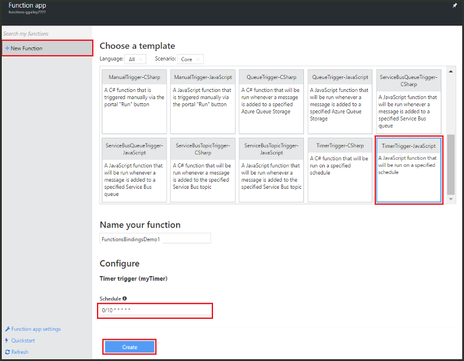
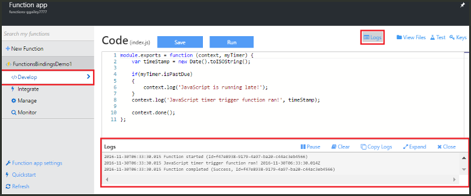
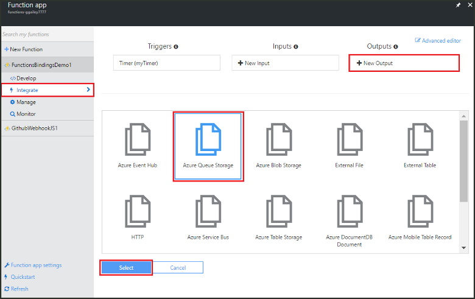
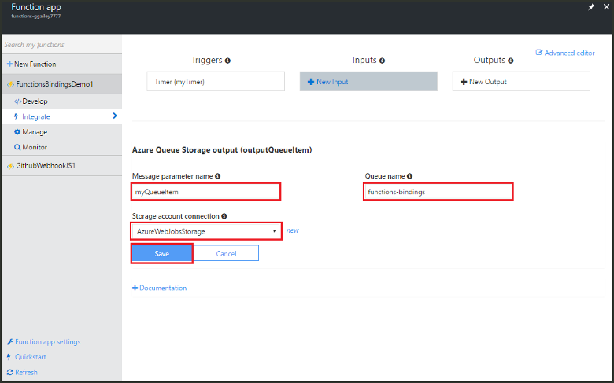
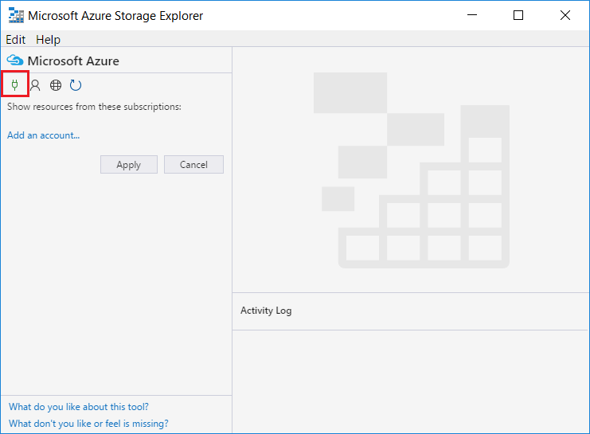
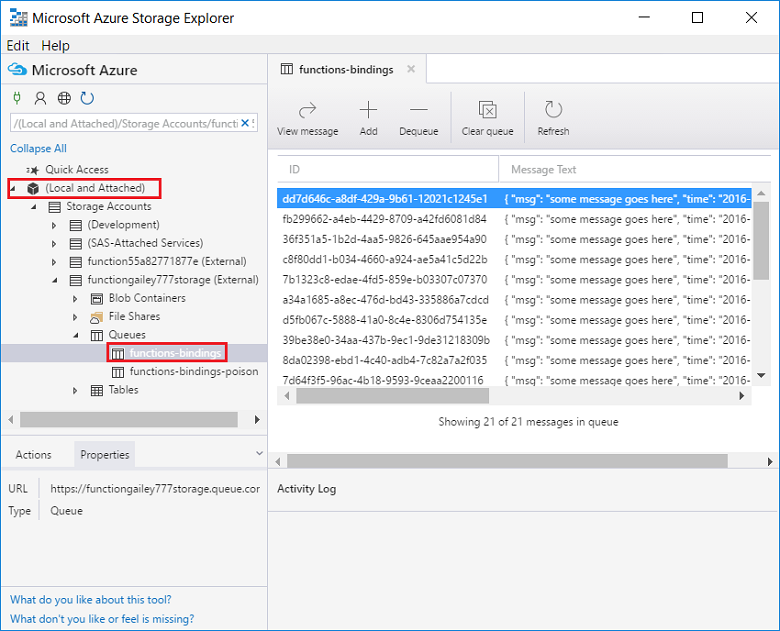
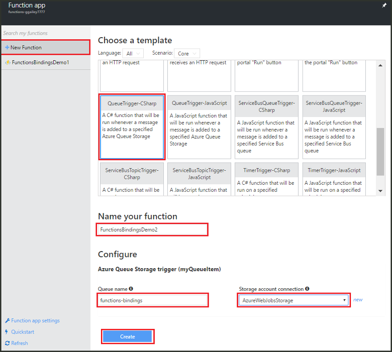
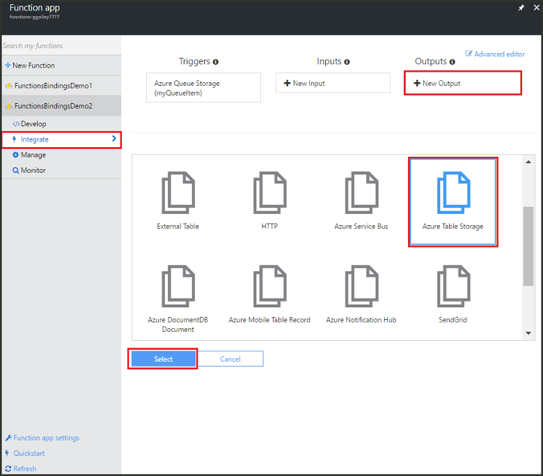
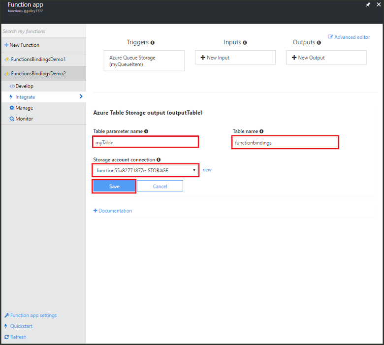
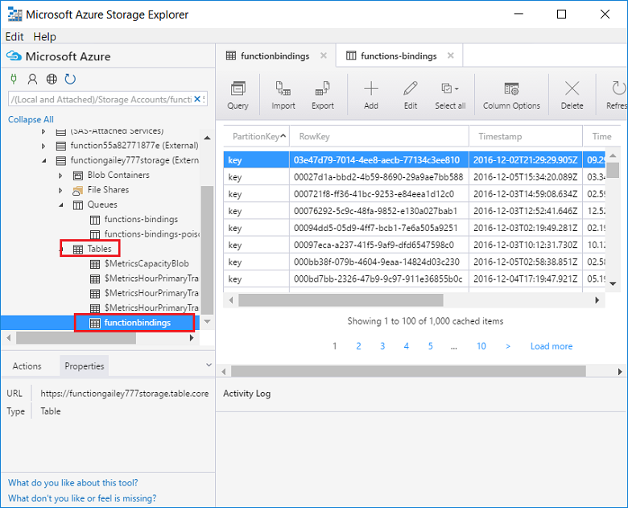

# Use Azure Functions to create a function that connects to other Azure services

This topic shows you how to create a function in Azure Functions that listens to messages on an Azure Storage queue and copies the messages to rows in an Azure Storage table. A timer triggered function is used to load messages into the queue. A second function reads from the queue and writes messages to the table. Both the queue and the table are created for you by Azure Functions based on the binding definitions. 

To make things more interesting, one function is written in JavaScript and the other is written in C# script. This demonstrates how a function app can have functions in various languages. 

You can see this scenario demonstrated in a [video on Channel 9](https://channel9.msdn.com/Series/Windows-Azure-Web-Sites-Tutorials/Create-an-Azure-Function-which-binds-to-an-Azure-service/player).

## Create a function that writes to the queue

Before you can connect to a storage queue, you need to create a function that loads the message queue. This JavaScript function uses a timer trigger that writes a message to the queue every 10 seconds. If you don't already have an Azure account, check out the [Try Azure Functions](https://functions.azure.com/try) experience, or [create your free Azure account](https://azure.microsoft.com/free/).

1. Go to the Azure portal and locate your function app.

2. Click **New Function** > **TimerTrigger-JavaScript**. 

3. Name the function **FunctionsBindingsDemo1**, enter a cron expression value of `0/10 * * * * *` for **Schedule**, and then click **Create**.
   
    

	You have now created a timer triggered function that runs every 10 seconds.

5. On the **Develop** tab, click **Logs** and view the activity in the log. You see a log entry written every 10 seconds.
   
	

## Add a message queue output binding

1. On the **Integrate** tab, choose **New Output** > **Azure Queue Storage** > **Select**.

	

2. Enter `myQueueItem` for **Message parameter name** and `functions-bindings` for **Queue name**, select an existing **Storage account connection** or click **new** to create a storage account connection, and then click **Save**.  

	

1. Back in the **Develop** tab, append the following code to the function:
   
    ```javascript
   
    function myQueueItem() 
    {
        return {
            msg: "some message goes here",
            time: "time goes here"
        }
    }
   
    ```
2. Locate the *if* statement around line 9 of the function, and insert the following code after that statement.
   
    ```javascript
   
    var toBeQed = myQueueItem();
    toBeQed.time = timeStamp;
    context.bindings.myQueueItem = toBeQed;
   
    ```  
   
    This code creates a **myQueueItem** and sets its **time** property to the current timeStamp. It then adds the new queue item to the context's **myQueueItem** binding.

3. Click **Save and Run**.

## View storage updates by using Storage Explorer
You can verify that your function is working by viewing messages in the queue you created.  You can connect to your storage queue by using Cloud Explorer in Visual Studio. However, the portal makes it easy to connect to your storage account by using Microsoft Azure Storage Explorer.

1. In the **Integrate** tab, click your queue output binding > **Documentation**, then unhide the Connection String for your storage account and copy the value. You use this value to connect to your storage account.

	


2. If you haven't already done so, download and install [Microsoft Azure Storage Explorer](http://storageexplorer.com). 
 
3. In Storage Explorer, click the connect to Azure Storage icon, paste the connection string in the field, and complete the wizard.

	

4. Under **Local and attached**, expand **Storage Accounts** > your storage account > **Queues** > **functions-bindings** and verify that messages are written to the queue.

	

	If the queue does not exist or is empty, there is most likely a problem with your function binding or code.

## Create a function that reads from the queue

Now that you have messages being added to the queue, you can create another function that reads from the queue and writes the messages permanently to an Azure Storage table.

1. Click **New Function** > **QueueTrigger-CSharp**. 
 
2. Name the function `FunctionsBindingsDemo2`, enter **functions-bindings** in the **Queue name** field, select an existing storage account or create one, and then click **Create**.

	 

3. (Optional) You can verify that the new function works by viewing the new queue in Storage Explorer as before. You can also use Cloud Explorer in Visual Studio.  

4. (Optional) Refresh the **functions-bindings** queue and notice that items have been removed from the queue. The removal occurs because the function is bound to the **functions-bindings** queue as an input trigger and the function reads the queue. 
 
## Add a table output binding

1. In FunctionsBindingsDemo2, click **Integrate** > **New Output** > **Azure Table Storage** > **Select**.

	 

2. Enter `functionbindings` for **Table name** and `myTable` for **Table parameter name**, choose a **Storage account connection** or create a new one, and then click **Save**.

	
   
3. In the **Develop** tab, replace the existing function code with the following:
   
	```cs
	
	using System;
	
	public static void Run(QItem myQueueItem, ICollector<TableItem> myTable, TraceWriter log)
	{    
	    TableItem myItem = new TableItem
	    {
	        PartitionKey = "key",
	        RowKey = Guid.NewGuid().ToString(),
	        Time = DateTime.Now.ToString("hh.mm.ss.ffffff"),
	        Msg = myQueueItem.Msg,
	        OriginalTime = myQueueItem.Time    
	    };
	    
	    // Add the item to the table binding collection.
	    myTable.Add(myItem);
	
	    log.Verbose($"C# Queue trigger function processed: {myItem.RowKey} | {myItem.Msg} | {myItem.Time}");
	}
	
	public class TableItem
	{
	    public string PartitionKey {get; set;}
	    public string RowKey {get; set;}
	    public string Time {get; set;}
	    public string Msg {get; set;}
	    public string OriginalTime {get; set;}
	}
	
	public class QItem
	{
	    public string Msg { get; set;}
	    public string Time { get; set;}
	}
	```
	The **TableItem** class represents a row in the storage table, and you add the item to the `myTable` collection of **TableItem** objects. You must set the **PartitionKey** and **RowKey** properties to be able to insert into the table.

4. Click **Save**.  Finally, you can verify the function works by viewing the table in Storage explorer or Visual Studio Cloud Explorer.

5. (Optional) In your storage account in Storage Explorer, expand **Tables** > **functionsbindings** and verify that rows are added to the table. You can do the same in Cloud Explorer in Visual Studio.

	

	If the table does not exist or is empty, there is most likely a problem with your function binding or code. 
 
[!INCLUDE [More binding information](../../includes/functions-bindings-next-steps.md)]

## Next steps
For more information about Azure Functions, see the following topics:

* [Azure Functions developer reference](functions-reference.md)  
  Programmer reference for coding functions and defining triggers and bindings.
* [Testing Azure Functions](functions-test-a-function.md)  
  Describes various tools and techniques for testing your functions.
* [How to scale Azure Functions](functions-scale.md)  
  Discusses service plans available with Azure Functions, including the Consumption hosting plan, and how to choose the right plan. 

[!INCLUDE [Getting help note](../../includes/functions-get-help.md)]

