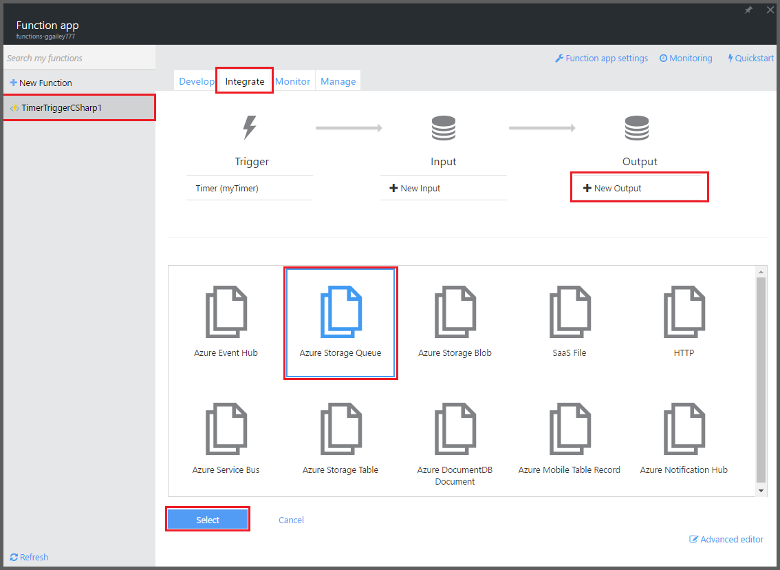
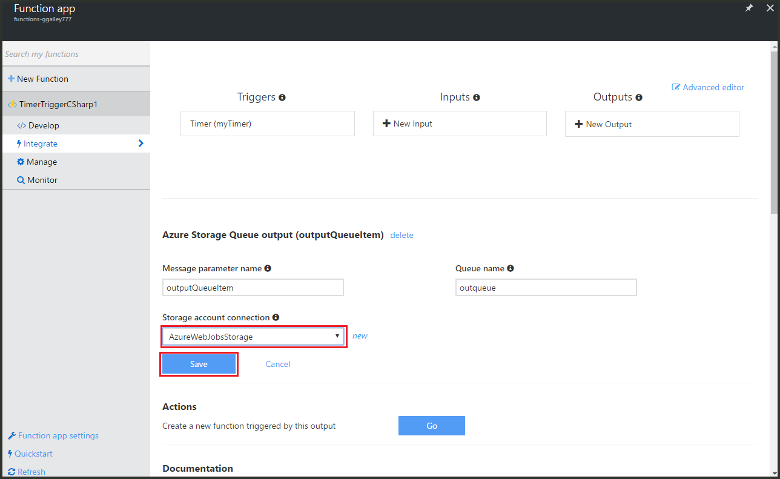

<properties
   pageTitle="Create an event processing function | Microsoft Azure"
   description="Use Azure Functions create a C# function that runs based on an event timer."
   services="azure-functions"
   documentationCenter="na"
   authors="ggailey777"
   manager="erikre"
   editor=""
   tags=""
   />

<tags
   ms.service="functions"
   ms.devlang="multiple"
   ms.topic="get-started-article"
   ms.tgt_pltfrm="multiple"
   ms.workload="na"
   ms.date="06/05/2016"
   ms.author="glenga"/>
   
# Create an event processing Azure Function

Azure Functions is an event-driven, compute-on-demand experience that enables you to create scheduled or triggered units of code implemented in a variety of programming languages. To learn more about Azure Functions, see the [Azure Functions Overview](functions-overview.md).

This topic shows you how to create a new function in C# that executes based on an event timer to add messages to a storage queue. 

## Prerequisites 

Before you can create a function, you need to have an active Azure account. If you don't already have an Azure account, [free accounts are available](https://azure.microsoft.com/free/).

## Create a timer-triggered function from the template

A function app hosts the execution of your functions in Azure. Before you can create a function, you need to have an active Azure account. If you don't already have an Azure account, [free accounts are available](https://azure.microsoft.com/free/). 

1. Go to the [Azure Functions portal](https://functions.azure.com/signin) and sign-in with your Azure account.

2. If you have an existing function app to use, select it from **Your function apps** then click **Open**. To create a new function app, type a unique **Name** for your new function app or accept the generated one, select your preferred **Region**, then click **Create + get started**. 

3. In your function app, click **+ New Function** > **TimerTrigger - C#** > **Create**. This creates a function with a default name that is run on the default schedule of once every minute. 

	

4. In your new function, click the **Integrate** tab > **New Output** > **Azure Storage Queue** > **Select**.

	

5. In  **Azure Storage Queue output**, click **select** next to **Storage account connection**, select the existing storage account or create a new one, then click **Save**. 

	

6. Back in the **Develop** tab, replace the existing C# script in the **Code** window with the following code:

		using System;
		
		public static void Run(TimerInfo myTimer, out string outputQueueItem, TraceWriter log)
		{
		    // Add a new scheduled message to the queue.
		    outputQueueItem = $"Ping message added to the queue at: {DateTime.Now}.";
		    
		    // Also write the message to the logs.
		    log.Info(outputQueueItem);
		}

	This code adds a new message to the queue with the current date and time when the function is executed.

7. Click **Save** and watch the **Logs** windows for the next function execution.

8. (Optional) Navigate to the storage account and verify that messages are being added to the queue.

9. Go back to the **Integrate** tab and change the schedule field to `0 0 * * * *`. The function now runs once every hour. 

This is a very simplified example of both a timer trigger and a storage queue output binding. For more information, see both the [Azure Functions timer trigger](functions-bindings-timer.md) and the [Azure Functions triggers and bindings for Azure Storage](functions-bindings-storage.md) topics.

##Next steps

See these topics for more information about Azure Functions.

+ [Azure Functions developer reference](functions-reference.md)  
Programmer reference for coding functions and defining triggers and bindings.
+ [Testing Azure Functions](functions-test-a-function.md)  
Describes various tools and techniques for testing your functions.
+ [How to scale Azure Functions](functions-scale.md)  
Discusses service plans available with Azure Functions, including the Dynamic service plan, and how to choose the right plan.  

[AZURE.INCLUDE [Getting Started Note](../../includes/functions-get-help.md)]
