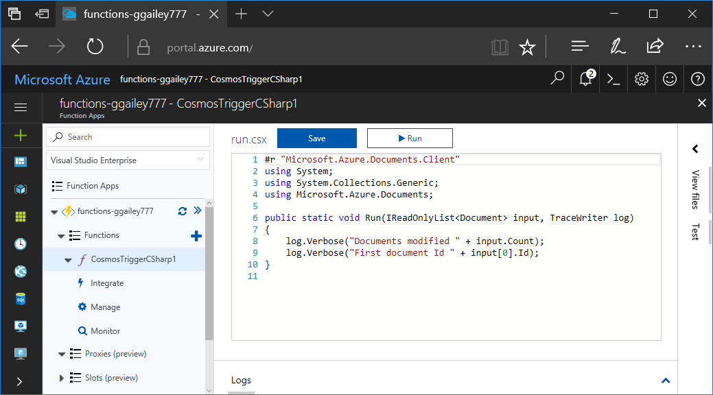
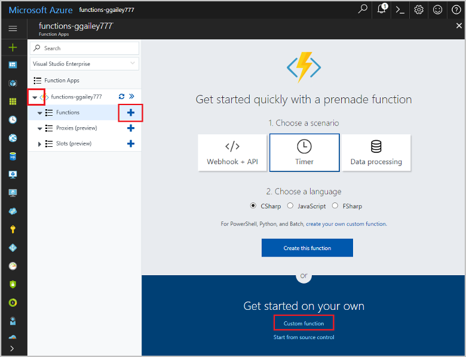
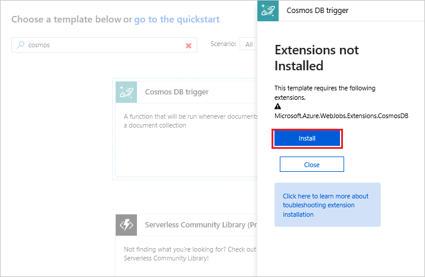
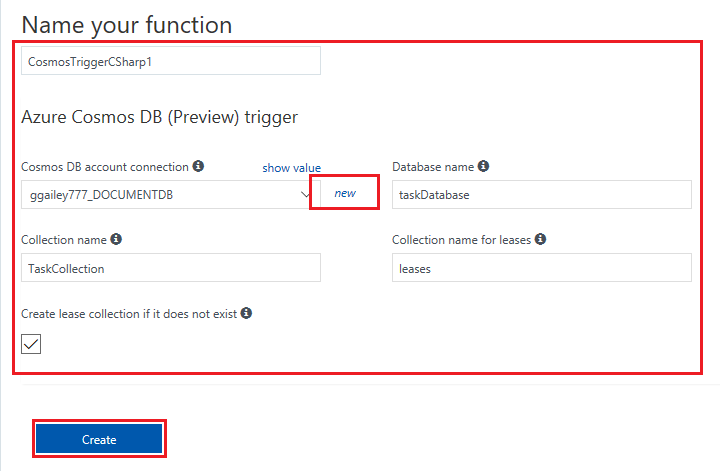
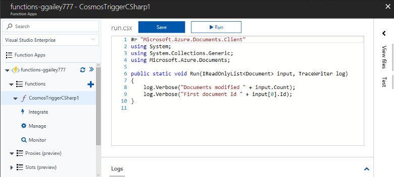
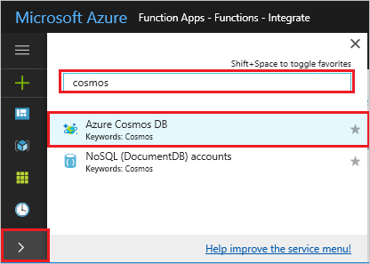
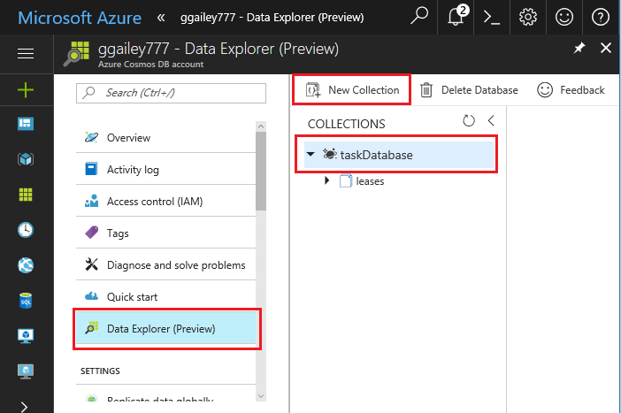
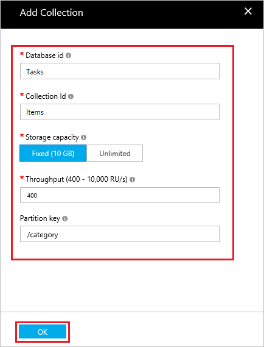
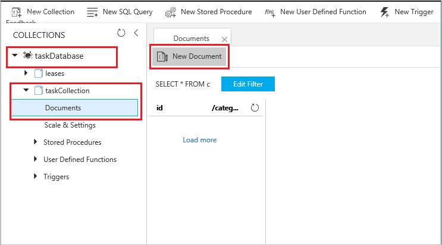
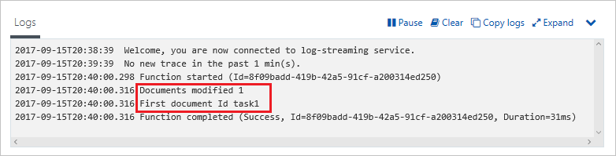

# Create a function triggered by Azure Cosmos DB

Learn how to create a function triggered when data is added to or changed in Azure Cosmos DB. To learn more about Azure Cosmos DB, see [Azure Cosmos DB: Serverless database computing using Azure Functions](../cosmos-db/serverless-computing-database.md).

## Prerequisites

To complete this tutorial:

+ If you don't have an Azure subscription, create a [free account](https://azure.microsoft.com/free/?WT.mc_id=A261C142F) before you begin.

> [!NOTE]
> [!INCLUDE [SQL API support only](../../includes/functions-cosmosdb-sqlapi-note.md)]

## Create an Azure Cosmos DB account

You must have an Azure Cosmos DB account that uses the SQL API before you create the trigger.

[!INCLUDE [cosmos-db-create-dbaccount](../../includes/cosmos-db-create-dbaccount.md)]

## Create an Azure Function app

[!INCLUDE [Create function app Azure portal](../../includes/functions-create-function-app-portal.md)]

Next, you create a function in the new function app.

## Create Azure Cosmos DB trigger

1. Expand your function app and click the **+** button next to **Functions**. If this is the first function in your function app, select **In-portal** then **Continue**. Otherwise, go to step three.

   

1. Choose **More templates** then **Finish and view templates**.

    

1. In the search field, type `cosmos` and then choose the **Azure Cosmos DB trigger** template.

1. If prompted, select **Install** to install the Azure Cosmos DB extension in the function app. After installation succeeds, select **Continue**.

    

1. Configure the new trigger with the settings as specified in the table below the image.

    

    | Setting      | Suggested value  | Description                                |
    | ------------ | ---------------- | ------------------------------------------ |
    | **Name** | Default | Use the default function name suggested by the template.|
    | **Azure Cosmos DB account connection** | New setting | Select **New**, then choose your **Subscription**, the **Database account** you created earlier, and **Select**. This creates an application setting for your account connection. This setting is used by the binding to connection to the database. |
    | **Collection name** | Items | Name of collection to be monitored. |
    | **Create lease collection if it doesn't exist** | Checked | The collection doesn't already exist, so create it. |
    | **Database name** | Tasks | Name of database with the collection to be monitored. |

1. Click **Create** to create your Azure Cosmos DB triggered function. After the function is created, the template-based function code is displayed.  

    

    This function template writes the number of documents and the first document ID to the logs.

Next, you connect to your Azure Cosmos DB account and create the `Items` collection in the `Tasks` database.

## Create the Items collection

1. Open a second instance of the [Azure portal](https://portal.azure.com) in a new tab in the browser.

1. On the left side of the portal, expand the icon bar, type `cosmos` in the search field, and select **Azure Cosmos DB**.

    

1. Choose your Azure Cosmos DB account, then select the **Data Explorer**. 

1. In **Collections**, choose **taskDatabase** and select **New Collection**.

    

1. In **Add Collection**, use the settings shown in the table below the image. 

    

    | Setting|Suggested value|Description |
    | ---|---|--- |
    | **Database ID** | Tasks |The name for your new database. This must match the name defined in your function binding. |
    | **Collection ID** | Items | The name for the new collection. This must match the name defined in your function binding.  |
    | **Storage capacity** | Fixed (10 GB)|Use the default value. This value is the storage capacity of the database. |
    | **Throughput** |400 RU| Use the default value. If you want to reduce latency, you can scale up the throughput later. |
    | **[Partition key](../cosmos-db/partition-data.md)** | /category|A partition key that distributes data evenly to each partition. Selecting the correct partition key is important in creating a performant collection. | 

1. Click **OK** to create the Items collection. It may take a short time for the collection to get created.

After the collection specified in the function binding exists, you can test the function by adding documents to this new collection.

## Test the function

1. Expand the new **taskCollection** collection in Data Explorer, choose **Documents**, then select **New Document**.

    

1. Replace the contents of the new document with the following content, then choose **Save**.

        {
            "id": "task1",
            "category": "general",
            "description": "some task"
        }

1. Switch to the first browser tab that contains your function in the portal. Expand the function logs and verify that the new document has triggered the function. See that the `task1` document ID value is written to the logs. 

    

1. (Optional) Go back to your document, make a change, and click **Update**. Then, go back to the function logs and verify that the update has also triggered the function.

## Clean up resources

[!INCLUDE [Next steps note](../../includes/functions-quickstart-cleanup.md)]

## Next steps

You have created a function that runs when a document is added or modified in your Azure Cosmos DB. For more information about Azure Cosmos DB triggers, see [Azure Cosmos DB bindings for Azure Functions](functions-bindings-cosmosdb.md).

[!INCLUDE [Next steps note](../../includes/functions-quickstart-next-steps.md)]
