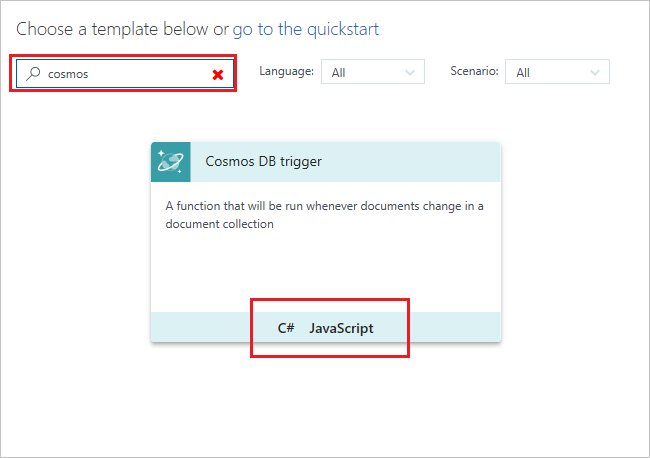
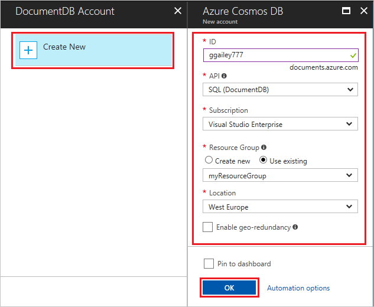

# Create a function triggered by Azure Cosmos DB

Learn how to create a function triggered when data is added to a database in Azure Cosmos DB.

## Prerequisites

To complete this tutorial:

+ If you don't have an Azure subscription, create a [free account](https://azure.microsoft.com/free/?WT.mc_id=A261C142F) before you begin.

[!INCLUDE [functions-portal-favorite-function-apps](../../includes/functions-portal-favorite-function-apps.md)]

## Create an Azure Function app

[!INCLUDE [Create function app Azure portal](../../includes/functions-create-function-app-portal.md)]

Next, you create a function in the new function app.

## Create a Cosmos DB triggered function

1. Expand your function app and click the **+** button next to **Functions**. If this is the first function in your function app, select **Custom function**. This displays the complete set of function templates.

    

2. Select the **CosmosDBTrigger** template for your desired language.

    

3. Configure the new trigger with the settings as specified in the table below the image:

    
    
    | Setting      | Suggested value  | Description                                |
    | ------------ | ---------------- | ------------------------------------------ |
    | **Name your function** | Default | Use the default function name suggested by the template. |
    | **Database name** | taskDatabase | Name of database with the collection to be monitored. |
    | **Collection name** | TaskCollection | Name of collection to be monitored. |
    | **Create lease collection if it doesn't exist** | Checked | The collection doesn't already exist, so create it. |

4. Select **New** next to the **Cosmos DB account connection** label, and select **+ Create new**. 
 
    

6. Use the **New account** settings as specified in the table:

    | Setting      | Suggested value  | Description                                |
    | ------------ | ---------------- | ------------------------------------------ |
    | **ID** | Name of database | Unique ID for the Cosmos DB database  |
    | **API** | SQL (DocumentDB) | This topic uses the document database API.  |
    | **Subscription** | Azure Subscription | Azure Subscription  |
    | **Resource Group** | myResourceGroup |  Use the existing resource group that contains your function app. |
    | **Location**  | WestEurope | Select a location near to either your function app or to other apps that use the stored documents.  |

6. Click **OK** to create the database. It may take a few minutes to create the database. After the database is created, the database connection string is stored as a function app setting. The name of this app setting is inserted in **Cosmos DB account connection**. 

7. Click **Create** to create your Cosmos DB triggered function. After the function is created, the template-based function code is displayed.  

    

Note that this function template writes the number of documents and the first document ID to the logs. Next, you connect to your Cosmos DB account and add a document to the database collection. 

## Test the function

1. On the left side of the Azure portal, expand the icon bar, type `cosmos` in the search field, and select **Azure Cosmos DB**.

    

2. Choose your Cosmos DB account, then select the **Data Explorer**. 
 
3. In **Collections**, expand **taskDatabase**, and choose **New Collection**.

    

4. In the  

1. Type your "Hello World!" message in **Message text** and click **OK**.

1. Wait for a few seconds, then go back to your function logs and verify that the new message has been read from the queue.

    

1. Back in Storage Explorer, click **Refresh** and verify that the message has been processed and is no longer in the queue.

## Clean up resources

[!INCLUDE [Next steps note](../../includes/functions-quickstart-cleanup.md)]

## Next steps

You have created a function that runs when a message is added to a storage queue.

[!INCLUDE [Next steps note](../../includes/functions-quickstart-next-steps.md)]

For more information about Queue storage triggers, see [Azure Functions Storage queue bindings](functions-bindings-storage-queue.md).