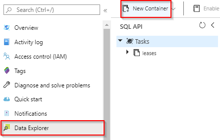
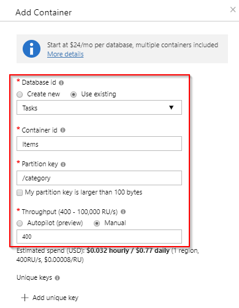

# Create a function triggered by Azure Cosmos DB

Learn how to create a function triggered when data is added to or changed in Azure Cosmos DB. To learn more about Azure Cosmos DB, see [Azure Cosmos DB: Serverless database computing using Azure Functions](../cosmos-db/serverless-computing-database.md).

:::image type="content" source="./media/functions-create-cosmos-db-triggered-function/quickstart-completed.png" alt-text="Azure Cosmos DB code":::

## Prerequisites

To complete this tutorial:

+ If you don't have an Azure subscription, create a [free account](https://azure.microsoft.com/free/?WT.mc_id=A261C142F) before you begin.

> [!NOTE]
> [!INCLUDE [SQL API support only](../../includes/functions-cosmosdb-sqlapi-note.md)]

## Sign in to Azure
Sign in to the [Azure portal](https://portal.azure.com/) with your Azure account.

## Create an Azure Cosmos DB account

You must have an Azure Cosmos DB account that uses the SQL API before you create the trigger.

[!INCLUDE [cosmos-db-create-dbaccount](../../includes/cosmos-db-create-dbaccount.md)]

## Create an Azure Function app

[!INCLUDE [Create function app Azure portal](../../includes/functions-create-function-app-portal.md)]

Next, you create a function in the new function app.

<a name="create-function"></a>

## Create Azure Cosmos DB trigger

1. In your function app, select **Functions** from the left menu, and then select **Add** from the top menu. 

1. On the **New Function** page, enter `cosmos` in the search field and then choose the **Azure Cosmos DB trigger** template.

   :::image type="content" source="./media/functions-create-cosmos-db-triggered-function/function-choose-cosmos.png" alt-text="Functions page in the Azure portal":::


1. Configure the new trigger with the settings as specified in the following table:

    | Setting      | Suggested value  | Description                                |
    | ------------ | ---------------- | ------------------------------------------ |
    | **New Function** | Accept the default name | The name of the function. |
    | **Cosmos DB account connection** | Accept the default new name | Select **New**, the **Database Account** you created earlier, and then **OK**. This action creates an application setting for your account connection. This setting is used by the binding to connection to the database. |
    | **Database name** | Tasks | Name of the database that includes the collection to be monitored. |
    | **Collection name** | Items | Name of the collection to be monitored. |
    | **Collection name for leases** | leases | Name of the collection to store the leases. |
    | **Create lease collection if it does not exist** | Yes | Checks for existence of the lease collection and automatically creates it. |

    :::image type="content" source="./media/functions-create-cosmos-db-triggered-function/functions-cosmosdb-trigger-settings.png" alt-text="Create the Azure Cosmos DB triggered function":::

1. Select **Create Function**. 

    Azure creates the Cosmos DB trigger function.

1. To display the template-based function code, select **Code + Test**.

    :::image type="content" source="./media/functions-create-cosmos-db-triggered-function/function-cosmosdb-template.png" alt-text="Cosmos DB function template in C#":::

    This function template writes the number of documents and the first document ID to the logs.

Next, you connect to your Azure Cosmos DB account and create the `Items` container in the `Tasks` database.

## Create the Items container

1. Open a second instance of the [Azure portal](https://portal.azure.com) in a new tab in the browser.

1. On the left side of the portal, expand the icon bar, type `cosmos` in the search field, and select **Azure Cosmos DB**.

    

1. Choose your Azure Cosmos DB account, then select the **Data Explorer**. 

1. Under **SQL API**, choose **Tasks** database and select **New Container**.

    

1. In **Add Container**, use the settings shown in the table below the image. 

    

    | Setting|Suggested value|Description |
    | ---|---|--- |
    | **Database ID** | Tasks |The name for your new database. This must match the name defined in your function binding. |
    | **Container ID** | Items | The name for the new container. This must match the name defined in your function binding.  |
    | **[Partition key](../cosmos-db/partition-data.md)** | /category|A partition key that distributes data evenly to each partition. Selecting the correct partition key is important in creating a performant container. | 
    | **Throughput** |400 RU| Use the default value. If you want to reduce latency, you can scale up the throughput later. |    

1. Click **OK** to create the Items container. It may take a short time for the container to get created.

After the container specified in the function binding exists, you can test the function by adding items to this new container.

## Test the function

1. Expand the new **Items** container in Data Explorer, choose **Items**, then select **New Item**.

    :::image type="content" source="./media/functions-create-cosmos-db-triggered-function/create-item-in-container.png" alt-text="Create an item in Items container":::

1. Replace the contents of the new item with the following content, then choose **Save**.

    ```yaml
    {
        "id": "task1",
        "category": "general",
        "description": "some task"
    }
    ```

1. Switch to the first browser tab that contains your function in the portal. Expand the function logs and verify that the new document has triggered the function. See that the `task1` document ID value is written to the logs. 

    

1. (Optional) Go back to your document, make a change, and click **Update**. Then, go back to the function logs and verify that the update has also triggered the function.

## Clean up resources

[!INCLUDE [Next steps note](../../includes/functions-quickstart-cleanup.md)]

## Next steps

You have created a function that runs when a document is added or modified in your Azure Cosmos DB. For more information about Azure Cosmos DB triggers, see [Azure Cosmos DB bindings for Azure Functions](functions-bindings-cosmosdb.md).

[!INCLUDE [Next steps note](../../includes/functions-quickstart-next-steps.md)]
