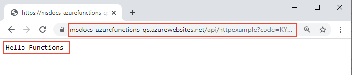

# Quickstart: Create a function in Azure that responds to HTTP requests

::: zone pivot="programming-language-csharp"  
In this article, you use command-line tools to create a C# class library-based function that responds to HTTP requests. After testing the code locally, you deploy it to the serverless environment of Azure Functions. 
::: zone-end  
::: zone pivot="programming-language-javascript"
In this article, you use command-line tools to create a JavaScript function that responds to HTTP requests. After testing the code locally, you deploy it to the serverless environment of Azure Functions. 
::: zone-end
::: zone pivot="programming-language-typescript"
In this article, you use command-line tools to create a TypeScript function that responds to HTTP requests. After testing the code locally, you deploy it to the serverless environment of Azure Functions. 
::: zone-end   
::: zone pivot="programming-language-powershell"
In this article, you use command-line tools to create a PowerShell function that responds to HTTP requests. After testing the code locally, you deploy it to the serverless environment of Azure Functions. 
::: zone-end  
::: zone pivot="programming-language-python" 
In this article, you use command-line tools to create a Python function that responds to HTTP requests. After testing the code locally, you deploy it to the serverless environment of Azure Functions. 
::: zone-end  
::: zone pivot="programming-language-java" 
In this article, you use command-line tools to create a Java function that responds to HTTP requests. After testing the code locally, you deploy it to the serverless environment of Azure Functions. 
::: zone-end

Completing this quickstart incurs a small cost of a few USD cents or less in your Azure account.

::: zone pivot="programming-language-csharp,programming-language-javascript,programming-language-typescript,programming-language-powershell,programming-language-python"  
There is also a [Visual Studio Code-based version](functions-create-first-function-vs-code.md) of this article.
::: zone-end  
::: zone pivot="programming-language-java"  
> [!NOTE]
> If Maven is not your prefered development tool, check out our similar tutorials for Java developers using [Gradle](/azure/azure-functions/functions-create-first-java-gradle), [IntelliJ IDEA](/azure/developer/java/toolkit-for-intellij/quickstart-functions) and [Visual Studio Code](/azure/azure-functions/functions-create-first-function-vs-code?pivots=programming-language-java).
::: zone-end  

[!INCLUDE [functions-requirements-cli](../../includes/functions-requirements-cli.md)]

[!INCLUDE [functions-cli-verify-prereqs](../../includes/functions-cli-verify-prereqs.md)]

[!INCLUDE [functions-cli-create-venv](../../includes/functions-cli-create-venv.md)]

## Create a local function project

In Azure Functions, a function project is a container for one or more individual functions that each responds to a specific trigger. All functions in a project share the same local and hosting configurations. In this section, you create a function project that contains a single function.

::: zone pivot="programming-language-csharp,programming-language-javascript,programming-language-typescript,programming-language-powershell,programming-language-python"  
Run the `func init` command, as follows, to create a functions project in a folder named *LocalFunctionProj* with the specified runtime:  
::: zone-end  
::: zone pivot="programming-language-python"  
```
func init LocalFunctionProj --python
```
::: zone-end  
::: zone pivot="programming-language-csharp"  
```
func init LocalFunctionProj --dotnet
```
::: zone-end  
::: zone pivot="programming-language-javascript"  
```
func init LocalFunctionProj --javascript
```
::: zone-end  
::: zone pivot="programming-language-typescript"  
```
func init LocalFunctionProj --typescript
```
::: zone-end  
::: zone pivot="programming-language-powershell"  
```
func init LocalFunctionProj --powershell
```
::: zone-end    
::: zone pivot="programming-language-java"  
In an empty folder, run the following command to generate the Functions project from a [Maven archetype](https://maven.apache.org/guides/introduction/introduction-to-archetypes.html).

# [bash](#tab/bash)
```bash
mvn archetype:generate -DarchetypeGroupId=com.microsoft.azure -DarchetypeArtifactId=azure-functions-archetype 
```
# [PowerShell](#tab/powershell)
```powershell
mvn archetype:generate "-DarchetypeGroupId=com.microsoft.azure" "-DarchetypeArtifactId=azure-functions-archetype" 
```
# [Cmd](#tab/cmd)
```cmd
mvn archetype:generate "-DarchetypeGroupId=com.microsoft.azure" "-DarchetypeArtifactId=azure-functions-archetype" 
```
---

Maven asks you for values needed to finish generating the project on deployment.   
Provide the following values when prompted:

| Prompt | Value | Description |
| ------ | ----- | ----------- |
| **groupId** | `com.fabrikam` | A value that uniquely identifies your project across all projects, following the [package naming rules](https://docs.oracle.com/javase/specs/jls/se6/html/packages.html#7.7) for Java. |
| **artifactId** | `fabrikam-functions` | A value that is the name of the jar, without a version number. |
| **version** | `1.0-SNAPSHOT` | Choose the default value. |
| **package** | `com.fabrikam` | A value that is the Java package for the generated function code. Use the default. |

Type `Y` or press Enter to confirm.

Maven creates the project files in a new folder with a name of _artifactId_, which in this example is `fabrikam-functions`. 
::: zone-end  
Navigate into the project folder:

::: zone pivot="programming-language-csharp,programming-language-javascript,programming-language-typescript,programming-language-powershell,programming-language-python"  
```
cd LocalFunctionProj
```
::: zone-end  
::: zone pivot="programming-language-java"  
```
cd fabrikam-functions
```
::: zone-end  
This folder contains various files for the project, including configurations files named [local.settings.json](functions-run-local.md#local-settings-file) and [host.json](functions-host-json.md). Because *local.settings.json* can contain secrets downloaded from Azure, the file is excluded from source control by default in the *.gitignore* file.

[!INCLUDE [functions-cli-add-function](../../includes/functions-cli-add-function.md)]

### (Optional) Examine the file contents

If desired, you can skip to [Run the function locally](#run-the-function-locally) and examine the file contents later.

::: zone pivot="programming-language-csharp"
#### HttpExample.cs

*HttpExample.cs* contains a `Run` method that receives request data in the `req` variable is an [HttpRequest](/dotnet/api/microsoft.aspnetcore.http.httprequest) that's decorated with the **HttpTriggerAttribute**, which defines the trigger behavior. 

:::code language="csharp" source="~/functions-docs-csharp/http-trigger-template/HttpExample.cs":::

The return object is an [ActionResult](/dotnet/api/microsoft.aspnetcore.mvc.actionresult) that returns an response message as either an [OkObjectResult](/dotnet/api/microsoft.aspnetcore.mvc.okobjectresult) (200) or a [BadRequestObjectResult](/dotnet/api/microsoft.aspnetcore.mvc.badrequestobjectresult) (400). To learn more, see [Azure Functions HTTP triggers and bindings](/azure/azure-functions/functions-bindings-http-webhook?tabs=csharp).
::: zone-end

::: zone pivot="programming-language-java"
#### Function.java
*Function.java* contains a `run` method that receives request data in the `request` variable is an [HttpRequestMessage](/java/api/com.microsoft.azure.functions.httprequestmessage) that's decorated with the [HttpTrigger](/java/api/com.microsoft.azure.functions.annotation.httptrigger) annotation, which defines the trigger behavior. 

:::code language="java" source="~/azure-functions-samples-java/src/main/java/com/functions/Function.java":::

The response message is generated by the [HttpResponseMessage.Builder](/java/api/com.microsoft.azure.functions.httpresponsemessage.builder) API.

#### pom.xml

Settings for the Azure resources created to host your app are defined in the **configuration** element of the plugin with a **groupId** of `com.microsoft.azure` in the generated pom.xml file. For example, the configuration element below instructs a Maven-based deployment to create a function app in the `java-functions-group` resource group in the `westus` region. The function app itself runs on Windows hosted in the `java-functions-app-service-plan` plan, which by default is a serverless Consumption plan.    

:::code language="java" source="~/azure-functions-samples-java/pom.xml" range="62-102":::

You can change these settings to control how resources are created in Azure, such as by changing `runtime.os` from `windows` to `linux` before initial deployment. For a complete list of settings supported by the Maven plug-in, see the [configuration details](https://github.com/microsoft/azure-maven-plugins/wiki/Azure-Functions:-Configuration-Details).

#### FunctionTest.java

The archetype also generates a unit test for your function. When you change your function to add bindings or add new functions to the project, you'll also need to modify the tests in the *FunctionTest.java* file.
::: zone-end  
::: zone pivot="programming-language-python"
#### \_\_init\_\_.py

*\_\_init\_\_.py* contains a `main()` Python function that's triggered according to the configuration in *function.json*.

:::code language="python" source="~/functions-quickstart-templates/Functions.Templates/Templates/HttpTrigger-Python/__init__.py":::

For an HTTP trigger, the function receives request data in the variable `req` as defined in *function.json*. `req` is an instance of the [azure.functions.HttpRequest class](/python/api/azure-functions/azure.functions.httprequest). The return object, defined as `$return` in *function.json*, is an instance of [azure.functions.HttpResponse class](/python/api/azure-functions/azure.functions.httpresponse). To learn more, see [Azure Functions HTTP triggers and bindings](/azure/azure-functions/functions-bindings-http-webhook?tabs=python).
::: zone-end

::: zone pivot="programming-language-javascript"
#### index.js

*index.js* exports a function that's triggered according to the configuration in *function.json*.

:::code language="javascript" source="~/functions-quickstart-templates/Functions.Templates/Templates/HttpTrigger-JavaScript/index.js":::

For an HTTP trigger, the function receives request data in the variable `req` as defined in *function.json*. The return object, defined as `$return` in *function.json*, is the response. To learn more, see [Azure Functions HTTP triggers and bindings](/azure/azure-functions/functions-bindings-http-webhook?tabs=javascript).
::: zone-end

::: zone pivot="programming-language-typescript"
#### index.ts

*index.ts* exports a function that's triggered according to the configuration in *function.json*.

:::code language="typescript" source="~/functions-quickstart-templates/Functions.Templates/Templates/HttpTrigger-TypeScript/index.ts":::

For an HTTP trigger, the function receives request data in the variable `req` of type **HttpRequest** as defined in *function.json*. The return object, defined as `$return` in *function.json*, is the response. 
::: zone-end

::: zone pivot="programming-language-powershell"
#### run.ps1

*run.ps1* defines a function script that's triggered according to the configuration in *function.json*.

:::code language="powershell" source="~/functions-quickstart-templates/Functions.Templates/Templates/HttpTrigger-PowerShell/run.ps1":::

For an HTTP trigger, the function receives request data passed to the `$Request` param defined in *function.json*. The return object, defined as `Response` in *function.json*, is passed to the `Push-OutputBinding` cmdlet as the response. 
::: zone-end

::: zone pivot="programming-language-javascript,programming-language-typescript,programming-language-python,programming-language-powershell"
#### function.json

*function.json* is a configuration file that defines the input and output `bindings` for the function, including the trigger type. 
::: zone-end

::: zone pivot="programming-language-python"
You can change `scriptFile` to invoke a different Python file if desired.

:::code language="json" source="~/functions-quickstart-templates/Functions.Templates/Templates/HttpTrigger-Python/function.json":::
::: zone-end

::: zone pivot="programming-language-javascript,programming-language-typescript"
:::code language="json" source="~/functions-quickstart-templates/Functions.Templates/Templates/HttpTrigger-JavaScript/function.json":::
::: zone-end

::: zone pivot="programming-language-powershell"
:::code language="json" source="~/functions-quickstart-templates/Functions.Templates/Templates/HttpTrigger-PowerShell/function.json":::
::: zone-end

::: zone pivot="programming-language-javascript,programming-language-typescript,programming-language-python,programming-language-powershell"  
Each binding requires a direction, a type, and a unique name. The HTTP trigger has an input binding of type [`httpTrigger`](functions-bindings-http-webhook-trigger.md) and output binding of type [`http`](functions-bindings-http-webhook-output.md).
::: zone-end  

[!INCLUDE [functions-run-function-test-local-cli](../../includes/functions-run-function-test-local-cli.md)]

::: zone pivot="programming-language-javascript,programming-language-typescript,programming-language-python,programming-language-powershell,programming-language-csharp"    
## Create supporting Azure resources for your function

Before you can deploy your function code to Azure, you need to create three resources:

- A resource group, which is a logical container for related resources.
- A Storage account, which maintains state and other information about your projects.
- A function app, which provides the environment for executing your function code. A function app maps to your local function project and lets you group functions as a logical unit for easier management, deployment, and sharing of resources.

Use the following Azure CLI commands to create these items. Each command provides JSON output upon completion.

If you haven't done so already, sign in to Azure with the [az login](/cli/azure/reference-index#az-login) command:

```azurecli
az login
```
    
Create a resource group with the [az group create](/cli/azure/group#az-group-create) command. The following example creates a resource group named `AzureFunctionsQuickstart-rg` in the `westeurope` region. (You generally create your resource group and resources in a region near you, using an available region from the `az account list-locations` command.)

```azurecli
az group create --name AzureFunctionsQuickstart-rg --location westeurope
```

> [!NOTE]
> You can't host Linux and Windows apps in the same resource group. If you have an existing resource group named `AzureFunctionsQuickstart-rg` with a Windows function app or web app, you must use a different resource group.
 
    
Create a general-purpose storage account in your resource group and region by using the [az storage account create](/cli/azure/storage/account#az-storage-account-create) command. In the following example, replace `<STORAGE_NAME>` with a globally unique name appropriate to you. Names must contain three to 24 characters numbers and lowercase letters only. `Standard_LRS` specifies a general-purpose account, which is [supported by Functions](storage-considerations.md#storage-account-requirements).

```azurecli
az storage account create --name <STORAGE_NAME> --location westeurope --resource-group AzureFunctionsQuickstart-rg --sku Standard_LRS
```

The storage account incurs only a few cents (USD) for this quickstart.
    
Create the function app using the [az functionapp create](/cli/azure/functionapp#az-functionapp-create) command. In the following example, replace `<STORAGE_NAME>` with the name of the account you used in the previous step, and replace `<APP_NAME>` with a globally unique name appropriate to you. The `<APP_NAME>` is also the default DNS domain for the function app. 
::: zone-end  

::: zone pivot="programming-language-python"  
If you are using Python 3.8, change `--runtime-version` to `3.8` and `--functions_version` to `3`.

If you are using Python 3.6, change `--runtime-version` to `3.6`.

```azurecli
az functionapp create --resource-group AzureFunctionsQuickstart-rg --os-type Linux --consumption-plan-location westeurope --runtime python --runtime-version 3.7 --functions-version 2 --name <APP_NAME> --storage-account <STORAGE_NAME>
```
::: zone-end  

::: zone pivot="programming-language-javascript,programming-language-typescript"  
If you are using Node.js 8, also change `--runtime-version` to `8`.


```azurecli
az functionapp create --resource-group AzureFunctionsQuickstart-rg --consumption-plan-location westeurope --runtime node --runtime-version 10 --functions-version 2 --name <APP_NAME> --storage-account <STORAGE_NAME>
```
::: zone-end  

::: zone pivot="programming-language-csharp"  
```azurecli
az functionapp create --resource-group AzureFunctionsQuickstart-rg --consumption-plan-location westeurope --runtime dotnet --functions-version 2 --name <APP_NAME> --storage-account <STORAGE_NAME>
```
::: zone-end  

::: zone pivot="programming-language-powershell"  
```azurecli
az functionapp create --resource-group AzureFunctionsQuickstart-rg --consumption-plan-location westeurope --runtime powershell --functions-version 2 --name <APP_NAME> --storage-account <STORAGE_NAME>
```
::: zone-end  

::: zone pivot="programming-language-javascript,programming-language-typescript,programming-language-python,programming-language-powershell,programming-language-csharp"  
This command creates a function app running in your specified language runtime under the [Azure Functions Consumption Plan](functions-scale.md#consumption-plan), which is free for the amount of usage you incur here. The command also provisions an associated Azure Application Insights instance in the same resource group, with which you can monitor your function app and view logs. For more information, see [Monitor Azure Functions](functions-monitoring.md). The instance incurs no costs until you activate it.
    
## Deploy the function project to Azure
::: zone-end  

::: zone pivot="programming-language-typescript"  
Before you use Core Tools to deploy your project to Azure, you create a production-ready build of JavaScript files from the TypeScript source files.

The following command prepares your TypeScript project for deployment:

```
npm run build:production 
```
::: zone-end  

::: zone pivot="programming-language-javascript,programming-language-typescript,programming-language-python,programming-language-powershell,programming-language-csharp"  
With the necessary resources in place, you're now ready to deploy your local functions project to the function app in Azure by using the [func azure functionapp publish](functions-run-local.md#project-file-deployment) command. In the following example, replace `<APP_NAME>` with the name of your app.

```
func azure functionapp publish <APP_NAME>
```

If you see the error, "Can't find app with name ...", wait a few seconds and try again, as Azure may not have fully initialized the app after the previous `az functionapp create` command.

The publish command shows results similar to the following output (truncated for simplicity):

<pre>
...

Getting site publishing info...
Creating archive for current directory...
Performing remote build for functions project.

...

Deployment successful.
Remote build succeeded!
Syncing triggers...
Functions in msdocs-azurefunctions-qs:
    HttpExample - [httpTrigger]
        Invoke url: https://msdocs-azurefunctions-qs.azurewebsites.net/api/httpexample?code=KYHrydo4GFe9y0000000qRgRJ8NdLFKpkakGJQfC3izYVidzzDN4gQ==
</pre>

::: zone-end  
::: zone pivot="programming-language-java"  
## Deploy the function project to Azure

A function app and related resources are created in Azure when you first deploy your functions project. Settings for the Azure resources created to host your app are defined in the [pom.xml file](#pomxml). In this article, you'll accept the defaults.

> [!TIP]
> To create a function app running on Linux instead of Windows, change the `runtime.os` element in the pom.xml file from `windows` to `linux`. Running Linux in a consumption plan is supported in [these regions](https://github.com/Azure/azure-functions-host/wiki/Linux-Consumption-Regions). You can't have apps that run on Linux and apps that run on Windows in the same resource group.

Before you can deploy, use the [az login](/cli/azure/authenticate-azure-cli) Azure CLI command to sign in to your Azure subscription. 

```azurecli
az login
```

Use the following command to deploy your project to a new function app. 

```
mvn azure-functions:deploy
```

This creates the following resources in Azure:

+ Resource group. Named as _java-functions-group_.
+ Storage account. Required by Functions. The name is generated randomly based on Storage account name requirements.
+ Hosting plan. Serverless hosting for your function app in the _westus_ region. The name is _java-functions-app-service-plan_.
+ Function app. A function app is the deployment and execution unit for your functions. The name is randomly generated based on your your _artifactId_, appended with a randomly generated number. 

The deployment packages the project files and deploys them to the new function app using [zip deployment](functions-deployment-technologies.md#zip-deploy). The code runs from the deployment package in Azure.
::: zone-end

## Invoke the function on Azure

Because your function uses an HTTP trigger, you invoke it by making an HTTP request to its URL in the browser or with a tool like curl. In both instances, the `code` URL parameter is your unique [function key](functions-bindings-http-webhook-trigger.md#authorization-keys) that authorizes the invocation of your function endpoint.

# [Browser](#tab/browser)

Copy the complete **Invoke URL** shown in the output of the publish command into a browser address bar, appending the query parameter `&name=Functions`. The browser should display similar output as when you ran the function locally.




# [curl](#tab/curl)

Run [`curl`](https://curl.haxx.se/) with the **Invoke URL**, appending the parameter `&name=Functions`. The output of the command should be the text, "Hello Functions."


---

> [!TIP]
> To view near real-time logs for a published function app, use the [Application Insights Live Metrics Stream](functions-monitoring.md#streaming-logs).

## Clean up resources

If you continue to the next step, [Add an Azure Storage queue output binding](functions-add-output-binding-storage-queue-cli.md), keep all your resources in place as you'll build on what you've already done.

Otherwise, use the following command to delete the resource group and all its contained resources to avoid incurring further costs.

::: zone pivot="programming-language-javascript,programming-language-typescript,programming-language-python,programming-language-powershell,programming-language-csharp" 
```azurecli
az group delete --name AzureFunctionsQuickstart-rg
```
::: zone-end
::: zone pivot="programming-language-java"
```azurecli
az group delete --name java-functions-group
```
::: zone-end
::: zone pivot="programming-language-python"
To exit the virtual environment, run `deactivate`.
::: zone-end

## Next steps

> [!div class="nextstepaction"]
> [Connect to an Azure Storage queue](functions-add-output-binding-storage-queue-cli.md)
 
