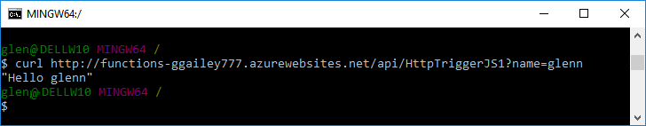

# Create your first function using the Azure CLI

This quickstart tutorial walks through how to use Azure Functions to create your first function. You use the Azure CLI to create a function app, which is the serverless infrastructure that hosts your function. The function code itself is deployed from a GitHub sample repository.    

You can follow the steps below using a Mac, Windows, or Linux computer. 

## Prerequisites 

Before running this sample, you must have the following:

+ An active [GitHub](https://github.com) account. 
+ An active Azure subscription.

[!INCLUDE [quickstarts-free-trial-note](../../includes/quickstarts-free-trial-note.md)]

[!INCLUDE [cloud-shell-try-it.md](../../includes/cloud-shell-try-it.md)]

If you choose to install and use the CLI locally, this topic requires that you are running the Azure CLI version 2.0 or later. Run `az --version` to find the version. If you need to install or upgrade, see [Install Azure CLI 2.0]( /cli/azure/install-azure-cli). 


## Create a resource group

Create a resource group with the [az group create](/cli/azure/group#create). An Azure resource group is a logical container into which Azure resources like function apps, databases, and storage accounts are deployed and managed.

The following example creates a resource group named `myResourceGroup`:

```azurecli-interactive
az group create --name myResourceGroup --location westeurope
```
## Create an Azure Storage account

Functions uses an Azure Storage account to maintain state and other information about your functions. Create a storage account in the resource group you created by using the [az storage account create](/cli/azure/storage/account#create) command.

In the following command, substitute your own globally unique storage account name where you see the `<storage_name>` placeholder. Storage account names must be between 3 and 24 characters in length and may contain numbers and lowercase letters only.

```azurecli-interactive
az storage account create --name <storage_name> --location westeurope --resource-group myResourceGroup --sku Standard_LRS
```

After the storage account has been created, the Azure CLI shows information similar to the following example:

```json
{
  "creationTime": "2017-04-15T17:14:39.320307+00:00",
  "id": "/subscriptions/bbbef702-e769-477b-9f16-bc4d3aa97387/resourceGroups/myresourcegroup/...",
  "kind": "Storage",
  "location": "westeurope",
  "name": "myfunctionappstorage",
  "primaryEndpoints": {
    "blob": "https://myfunctionappstorage.blob.core.windows.net/",
    "file": "https://myfunctionappstorage.file.core.windows.net/",
    "queue": "https://myfunctionappstorage.queue.core.windows.net/",
    "table": "https://myfunctionappstorage.table.core.windows.net/"
  },
     ....
    // Remaining output has been truncated for readability.
}
```

## Create a function app

You must have a function app to host the execution of your functions. The function app provides an environment for serverless execution of your function code. It lets you group functions as a logic unit for easier management, deployment and sharing of resources. Create a function app by using the [az functionapp create](/cli/azure/functionapp#create) command. 

In the following command, substitute your own unique function app name where you see the `<app_name>` placeholder and the storage account name for  `<storage_name>`. The `<app_name>` is used as the default DNS domain for the function app, and so the name needs to be unique across all apps in Azure. 

```azurecli-interactive
az functionapp create --name <app_name> --storage-account  <storage_name>  --resource-group myResourceGroup --consumption-plan-location westeurope
```
By default, a function app is created with the Consumption hosting plan, which means that resources are added dynamically as required by your functions and you only pay when functions are running. For more information, see [Choose the correct hosting plan](functions-scale.md). 

After the function app has been created, the Azure CLI shows information similar to the following example:

```json
{
  "availabilityState": "Normal",
  "clientAffinityEnabled": true,
  "clientCertEnabled": false,
  "containerSize": 1536,
  "dailyMemoryTimeQuota": 0,
  "defaultHostName": "quickstart.azurewebsites.net",
  "enabled": true,
  "enabledHostNames": [
    "quickstart.azurewebsites.net",
    "quickstart.scm.azurewebsites.net"
  ],
   ....
    // Remaining output has been truncated for readability.
}
```

Now that you have a function app, you can deploy the actual function code from the GitHub sample repository.

## Deploy your function code  

There are several ways to create your function code in your new function app. This topic connects to a sample repository in GitHub. As before, in the following code replace the `<app_name>` placeholder with the name of the function app you created. 

```azurecli-interactive
az functionapp deployment source config --name <app_name> --resource-group myResourceGroup --repo-url https://github.com/Azure-Samples/functions-quickstart --branch master --manual-integration
```
After the deployment source been set, the Azure CLI shows information similar to the following example (null values removed for readability):

```json
{
  "branch": "master",
  "deploymentRollbackEnabled": false,
  "id": "/subscriptions/bbbef702-e769-477b-9f16-bc4d3aa97387/resourceGroups/myResourceGroup/...",
  "isManualIntegration": true,
  "isMercurial": false,
  "location": "West Europe",
  "name": "quickstart",
  "repoUrl": "https://github.com/Azure-Samples/functions-quickstart",
  "resourceGroup": "myResourceGroup",
  "type": "Microsoft.Web/sites/sourcecontrols"
}
```

## Test the function

Use cURL to test the deployed function on a Mac or Linux computer or using Bash on Windows. Execute the following cURL command, replacing the `<app_name>` placeholder with the name of your function app. Append the query string `&name=<yourname>` to the URL.

```bash
curl http://<app_name>.azurewebsites.net/api/HttpTriggerJS1?name=<yourname>
```  

  

If you don't have cURL available in your command line, simply enter the same URL in the address of your web browser. Again, replace the `<app_name>` placeholder with the name of your function ap, and append the query string `&name=<yourname>` to the URL and execute the request. 

    http://<app_name>.azurewebsites.net/api/HttpTriggerJS1?name=<yourname>
   
  

## Clean up resources

Other quickstarts in this collection build upon this quickstart. If you plan to continue on to work with subsequent quickstarts or with the tutorials, do not clean up the resources created in this quickstart. If you do not plan to continue, use the following command to delete all resources created by this quickstart:

```azurecli-interactive
az group delete --name myResourceGroup
```
Type `y` when prompted.

## Next steps

[!INCLUDE [Next steps note](../../includes/functions-quickstart-next-steps.md)]
