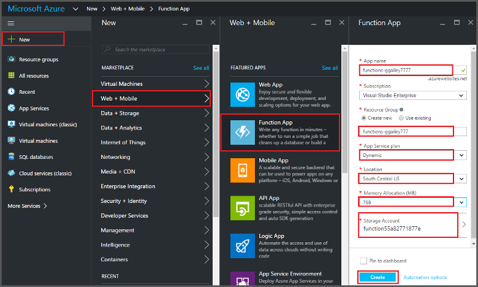
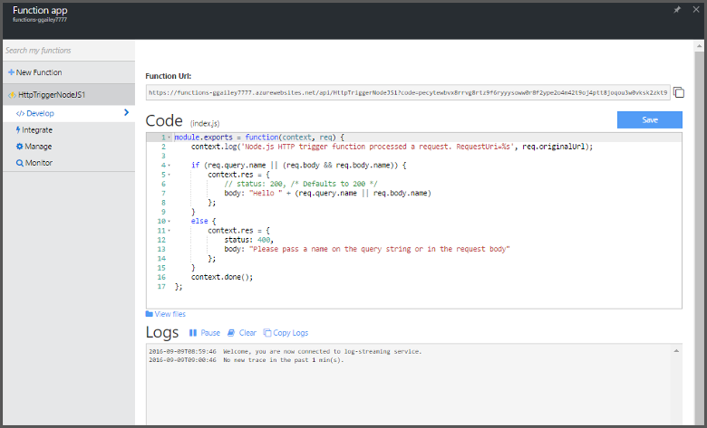

<properties
   pageTitle="Create a function from the Azure Portal | Microsoft Azure"
   description="Build your first Azure Function, a serverless application, in less than two minutes."
   services="functions"
   documentationCenter="na"
   authors="ggailey777"
   manager="erikre"
   editor=""
   tags=""
/>

<tags
   ms.service="functions"
   ms.devlang="multiple"
   ms.topic="article"
   ms.tgt_pltfrm="multiple"
   ms.workload="na"
   ms.date="09/08/2016"
   ms.author="glenga"/>

#Create a function from the Azure portal

##Overview
Azure Functions is an event-driven, compute-on-demand experience that extends the existing Azure application platform with capabilities to implement code triggered by events occurring in other Azure services, SaaS products, and on-premises systems. With Azure Functions, your applications scale based on demand and you pay only for the resources you consume. Azure Functions enables you to create scheduled or triggered units of code implemented in various programming languages. To learn more about Azure Functions, see the [Azure Functions Overview](functions-overview.md).

This topic shows you how to use the Azure portal to create a simple "hello world"  Node.js Azure Function that is invoked by an HTTP-trigger. Before you can create a function in the Azure portal, you must explicitly create a function app in Azure App Service. To have the function app created for you automatically, see [the other Azure Functions quickstart tutorial](functions-create-first-azure-function.md), which is a simpler quickstart experience and includes a video.

##Create a function app

A function app hosts the execution of your functions in Azure. Follow these steps to create a function app in the Azure portal.

Before you can create your first function, you need to have an active Azure account. If you don't already have an Azure account, [free accounts are available](https://azure.microsoft.com/free/).

1. Go to the [Azure portal](https://portal.azure.com) and sign-in with your Azure account.

2. Click **+New** > **Web + Mobile** > **Function App**, select your **Subscription**, type a unique **App name** that identifies your function app, then specify the following settings:

	+ **[Resource Group](../azure-portal/resource-group-portal.md/)**: Select **Create new** and enter a name for your new resource group. You can also choose an existing resource group, however you may not be able to create a dynamic App Service plan for your function app.
	+ **[App Service plan](../app-service/azure-web-sites-web-hosting-plans-in-depth-overview.md)**: Choose either *dynamic* or *classic*. 
		+ **Dynamic**: The default plan type for Azure Functions. When you choose a dynamic plan, you must also choose the **Location** and set the **Memory Allocation** (in MB). For information about how memory allocation affects costs, see [Azure Functions pricing](https://azure.microsoft.com/pricing/details/functions/). 
		+ **Classic**: A classic App Service plan requires you to create an **App Service plan/location** or select an existing one. These settings determine the [location, features, cost and compute resources](https://azure.microsoft.com/pricing/details/app-service/) associated with your app.  
	+ **Storage account**: Each function app requires a storage account. You can either choose an existing storage account or create one. 

	

3. Click **Create** to provision and deploy the new function app.  

Now that the function app is provisioned, you can create your first function.

## Create a function

These steps create a function from the Azure Functions quickstart.

1. In the **Quickstart** tab, click **WebHook + API** and **JavaScript**, then click **Create a function**. A new predefined Node.js function is created. 

	

2. (Optional) At this point in the quickstart, you can choose to take a quick tour of Azure Functions features in the portal.	Once you have completed or skipped the tour, you can test your new function by using the HTTP trigger.

##Test the function

Since the Azure Functions quickstarts contain functional code, you can immediately test your new function.

1. In the **Develop** tab, review the **Code** window and notice that this Node.js code expects an HTTP request with a *name* value passed either in the message body or in a query string. When the function runs, this value is returned in the response message.

	

2. Scroll down to the **Request body** text box, change the value of the *name* property to your name, and click **Run**. You see that execution is triggered by a test HTTP request, information is written to the streaming logs, and the "hello" response is displayed in the **Output**. 

3. To trigger execution of the same function from another browser window or tab, copy the **Function URL** value from the **Develop** tab and paste it in a browser address bar, then append the query string value `&name=yourname` and press enter. The same information is written to the logs and the browser displays the "hello" response as before.

##Next steps

This quickstart demonstrates a very simple execution of a basic HTTP-triggered function. See these topics for more information about using the power of Azure Functions in your apps.

+ [Azure Functions developer reference](functions-reference.md)  
Programmer reference for coding functions and defining triggers and bindings.
+ [Testing Azure Functions](functions-test-a-function.md)  
Describes various tools and techniques for testing your functions.
+ [How to scale Azure Functions](functions-scale.md)  
Discusses service plans available with Azure Functions, including the Dynamic service plan, and how to choose the right plan. 
+ [What is Azure App Service?](../app-service/app-service-value-prop-what-is.md)  
Azure Functions uses the Azure App Service platform for core functionality like deployments, environment variables, and diagnostics. 

[AZURE.INCLUDE [Getting Started Note](../../includes/functions-get-help.md)]
