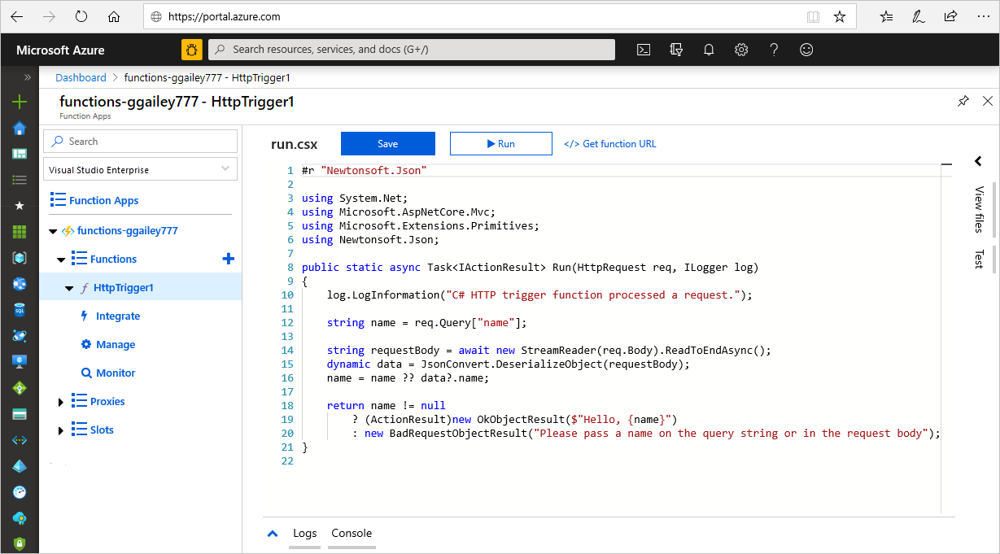
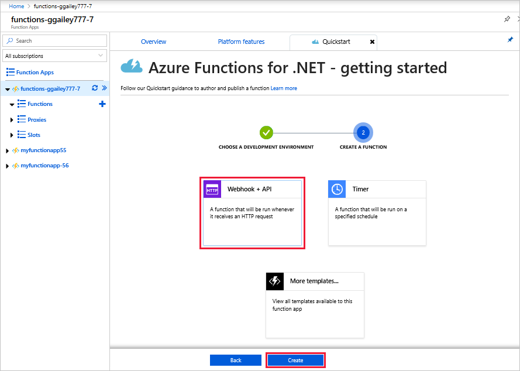

# Create your first function in the Azure portal

Azure Functions lets you execute your code in a serverless environment without having to first create a VM or publish a web application. In this topic, learn how to use Functions to create a "hello world" function in the Azure portal.

[!INCLUDE [quickstarts-free-trial-note](../../includes/quickstarts-free-trial-note.md)]

It should take you less than five minutes to complete all the steps in this topic.

## Log in to Azure

Log in to the [Azure portal](https://portal.azure.com/).

## Create a function app

You must have a function app to host the execution of your functions. A function app lets you group functions as a logic unit for easier management, deployment, and sharing of resources. 

[!INCLUDE [Create function app Azure portal](../../includes/functions-create-function-app-portal.md)]

[!INCLUDE [functions-portal-favorite-function-apps](../../includes/functions-portal-favorite-function-apps.md)]

Next, you create a function in the new function app.

## Create an HTTP triggered function

1. Expand your new function app, then click the **+** button next to **Functions**.

2.  In the **Get started quickly** page, click **WebHook + API**, choose a language for your function, and click **Create this function**. 
   
    

A function is created in your chosen language using the template for an HTTP triggered function. You can run the new function by sending an HTTP request.

## Test the function

1. In your new function, click **</> Get function URL** and copy the **Function URL**. 

    

2. Paste the URL for the HTTP request into your browser's address bar. Append the query string `&name=<yourname>` to this URL and execute the request. The following shows the response in the browser to the GET request returned by the function:

    

    The request URL includes a key that is required, by default, to access your function over HTTP.   

## View the function logs 

When your function runs, trace information is written to the logs. To see the trace output from the previous execution, return to your function in the portal and click the up arrow at the bottom of the screen to expand **Logs**. 

## Clean up resources

[!INCLUDE [Clean up resources](../../includes/functions-quickstart-cleanup.md)]

## Next steps

You have created a function app with a simple HTTP triggered function.  

[!INCLUDE [Next steps note](../../includes/functions-quickstart-next-steps.md)]

For more information, see [Azure Functions HTTP and webhook bindings](functions-bindings-http-webhook.md).

