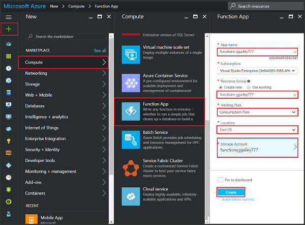

# Create your first function in the Azure portal

Learn how to use Azure Functions to create a "hello world" function in the Azure Portal. 

[!INCLUDE [quickstarts-free-trial-note](../../includes/quickstarts-free-trial-note.md)]

It should take you less than five minutes to complete all the steps in this topic.

## Log in to Azure

Log in to the [Azure portal](https://portal.azure.com/).

## Create a function app

Before you can create a function in the Azure portal, you must create a function app to host the serverless execution of your function.

1. Click the **New** button found on the upper left-hand corner of the Azure portal.

2. Click **Compute** > **Function App**, select your **Subscription**, and enter values for the required function app settings.
 
     

    | Setting      | Description                                        |
    | ------------ | -------------------------------------------------- |
    | **App name** | A name that uniquely identifies your function app. |
    | **[Resource Group](../azure-resource-manager/resource-group-overview.md)** | Select an existing resource group or **Create new** and enter a name for the new resource group. |
    | **[Hosting plan](../app-service/azure-web-sites-web-hosting-plans-in-depth-overview.md)** | Choose **Consumption plan**, which is the default plan type for Functions where resources are added to your function app as needed. |
    | **Storage account** | Each function app requires a storage account. You can either choose an existing storage account or [create a storage account](../storage/storage-create-storage-account.md#create-a-storage-account).|    

3. Click **Create** to provision and deploy the function app.  

Next, you will create a function in the new function app.

## Create an HTTP triggered function

Click the **+** button next to **Functions**, then click **WebHook + API**,choose a language for your function, and click **Create this function**. 
   

A function is created in your chosen language using the template for an HTTP triggered function. You can run the new function by sending an HTTP request.

## Test the function

1. In your new function, click **</> Get function URL** and copy the **Function URL**. 

    

2. Paste the URL for the HTTP request into your browser's address bar. Append the query string `&name=<yourname>` to this URL and execute the request. The following shows the response in the browser to the GET request returned by the function:

    

The request URL includes a key that is required, by default, to access your function over HTTP.   

## View the function logs 

When your function runs, trace information is written to the logs. To see the trace output from the previous execution, return to your function in the portal and click the up arrow at the bottom of the screen to expand **Logs**. 

## Clean up resources

[!INCLUDE [Next steps note](../../includes/functions-quickstart-cleanup.md)]

## Next steps

You have just created a function app with a simple HTTP triggered function. For more information, see [Azure Functions HTTP and webhook bindings](functions-bindings-http-webhook.md).

[!INCLUDE [Next steps note](../../includes/functions-quickstart-next-steps.md)]

[!INCLUDE [Getting Started Note](../../includes/functions-get-help.md)]

