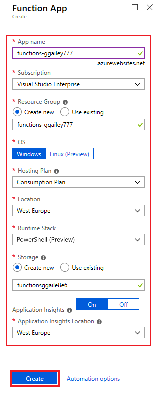

# Create your first PowerShell function in Azure (preview)

[!INCLUDE [functions-powershell-preview-note](../../includes/functions-powershell-preview-note.md)]

This quickstart article walks you through how to create your first [serverless](https://azure.com/serverless) PowerShell function app running on Windows. The function code is created locally and then deployed to Azure by using the [Azure Functions Core Tools](functions-run-local.md). The function app in Azure is created by using the [Azure portal]. 

The following steps are supported on a Mac, Windows, or Linux computer.

## Prerequisites

To run and debug functions locally, you need to install:

* [PowerShell Core](https://docs.microsoft.com/powershell/scripting/install/installing-powershell#powershell-core)
* [.NET Core SDK 2.1+](https://www.microsoft.com/net/download) (required by Core Tools)
* Install [Azure Functions Core Tools](functions-run-local.md#v2), version 2.4.299 or later.

You also need an active Azure subscription.

  [!INCLUDE [quickstarts-free-trial-note](../../includes/quickstarts-free-trial-note.md)]

## Create a local Functions project

In the Terminal window or from a command prompt, run the following commands:

```powershell
mkdir MyFunctionProj
cd MyFunctionProj
func init --worker-runtime powershell
```

You should see something like the following output:

```output
PS > func init --worker-runtime powershell
Writing .gitignore
Writing host.json
Writing local.settings.json
```

A new folder named _MyFunctionProj_ is created and initialized with files required by the Functions runtime. This directory is the same as a function app in running in Azure. It can contain multiple function folders, where each function shares the same local and hosting configuration.

## Creating a function

The following command creates an HTTP-triggered function named `MyHttpTrigger`.

```powershell
func new -template HttpTrigger -name MyHttpTrigger
```

When the command executes, you see something like the following output:

```output
PS > func new -template HttpTrigger -name MyHttpTrigger
Select a template: HttpTrigger
Function name: [HttpTrigger] Writing .../MyFunctionProj/MyHttpTrigger/run.ps1
Writing .../MyFunctionProj/MyHttpTrigger/sample.dat
Writing .../MyFunctionProj/MyHttpTrigger/function.json
The function "MyHttpTrigger" was created successfully from the "HttpTrigger" template.
PS >
```

The function.json file defines the HTTP trigger. The run.ps1 file contains code that runs when the function is triggered by an HTTP request.

## Update the function

By default, the template creates a function that requires a [function key](functions-bindings-http-webhook.md#authorization-keys) when making requests. To make it easier to test the function in Azure, you need to update the function to allow anonymous access.

Open the function.json file for your new function in a text editor, update the **authLevel** property in **bindings** to `anonymous`, and save your changes.

```json
  "bindings": [
    {
      "authLevel": "anonymous",
      "type": "httpTrigger",
      "direction": "in",
      "name": "Request",
      "methods": [
        "get",
        "post"
      ]
    },
    {
      "type": "http",
      "direction": "out",
      "name": "Response"
    }
  ]
```

Now you can call the function in Azure without having to supply the function key. The function key is never required when running locally.

## Run the function locally

Run the following command in the root of your Functions project.

```powershell
func start
```

This command starts the function app running using the same Azure Functions runtime that is in Azure.

When the Functions host starts, it outputs the URL of your HTTP-triggered function. (The full output has been truncated for readability.)

```output

                  %%%%%%
                 %%%%%%
            @   %%%%%%    @
          @@   %%%%%%      @@
       @@@    %%%%%%%%%%%    @@@
     @@      %%%%%%%%%%        @@
       @@         %%%%       @@
         @@      %%%       @@
           @@    %%      @@
                %%
                %
...
Now listening on: http://0.0.0.0:7071
Application started. Press Ctrl+C to shut down.
...

Http Functions:

        HttpTrigger: http://localhost:7071/api/HttpTrigger
```

Copy the URL of your `HttpTrigger` function from the runtime output, append the query string `?name=<yourname>` to this URL, and then use `Invoke-RestMethod` to execute the request, as follows:

```powershell
Invoke-RestMethod http://localhost:7071/api/MyHttpTrigger?name=PowerShell
```

This is the expected response:

```output
PS > Invoke-RestMethod http://localhost:7071/api/MyHttpTrigger?name=PowerShell
Hello PowerShell
```

When you call the MyHttpTrigger endpoint without passing `name` either as a query parameter or in the body, the function returns a 500 error. If you review the code in run.ps1, you see that this error occurs by design.

Now that you've verified that the function runs locally, you can publish it to Azure.

## Create a function app in Azure

Before publishing to Azure, you must create a function app in which your functions run. Use the following steps to create a function app in the [Azure portal].

1. Select the **Create a resource** button found on the upper left-hand corner of the [Azure portal], then select **Compute** > **Function App**.

    

2. Use the function app settings as specified in the table below the image.

    

    | Setting      | Suggested value  | Description                                        |
    | ------------ |  ------- | -------------------------------------------------- |
    | **App name** | Globally unique name | Name that identifies your new function app. Valid characters are `a-z`, `0-9`, and `-`.  | 
    | **Subscription** | Your subscription | The subscription under which this new function app is created. | 
    | **[Resource Group](../azure-resource-manager/resource-group-overview.md)** |  myResourceGroup | Name for the new resource group in which to create your function app. |
    | **OS** | Windows | Serverless hosting on Linux is currently in preview. For more information, see [this considerations article](https://aka.ms/funclinux). |
    | **[Hosting plan](functions-scale.md)** | Consumption plan | Hosting plan that defines how resources are made available to your function app. In the default **Consumption Plan**, resources are added dynamically as required by your functions. In this [serverless](https://azure.microsoft.com/overview/serverless-computing/) hosting, you only pay for the time your functions run. When you run in an App Service plan, you must manage the [scaling of your function app](functions-scale.md).  |
    | **Location** | West Europe | Choose a [region](https://azure.microsoft.com/regions/) near you or near other services your functions access. |
    | **Runtime stack** | Preferred language | Choose a runtime that supports your favorite function programming language. Choose **.NET** for C# and F# functions. |
    | **[Storage](../storage/common/storage-quickstart-create-account.md)** |  Globally unique name |  Create a storage account used by your function app. Storage account names must be between 3 and 24 characters in length and may contain numbers and lowercase letters only. You can also use an existing account, which must meet the [storage account requirements](functions-scale.md#storage-account-requirements). |
    | **[Application Insights](functions-monitoring.md)** | Default | Creates an Application Insights resource of the same *App name* in the nearest supported region. By expanding this setting, you can change the **New resource name** or choose a different **Location** in an [Azure geography](https://azure.microsoft.com/global-infrastructure/geographies/) where you want to store your data. |

3. Select **Create** to provision and deploy the function app.

4. Select the Notification icon in the upper-right corner of the portal and watch for the **Deployment succeeded** message.

    

    After the resources have been created, you can use Core Tools to deploy your project to the new function app.

## Sign in to Azure in your local shell

Before deploying, sign in to Azure PowerShell by running the following command and following the prompt:

```powershell
Login-AzAccount
```

[!INCLUDE [functions-publish-project](../../includes/functions-publish-project.md)]

## <a name="test"></a>Run the function in Azure

To verify that your published function runs in Azure, execute the following PowerShell command, replacing the `<app_name>` placeholder with the name of your function app. As before, append the query string `&name=<yourname>` to the URL.

```powershell
Invoke-WebRequest -Uri "https://<app_name>.azurewebsites.net/api/MyHttpTrigger?name=<yourname>"
```

## Clean up resources

Other articles in this collection build upon this quickstart article. If you plan to continue on to work with subsequent quickstarts or with the tutorials, don't clean up the resources created in this quickstart. If you don't plan to continue, use the following command to delete all resources created by this quickstart:

```powershell
Remove-AzResourceGroup -Name myResourceGroup
```

Type `y` or choose **Yes** when prompted.

## Next steps

Learn more about developing Azure Functions using PowerShell:

> [!div class="nextstepaction"]
> [Azure Functions PowerShell developer guide](functions-reference-powershell.md)
> [Azure Functions triggers and bindings](functions-triggers-bindings.md)

[Azure portal]: https://portal.azure.com