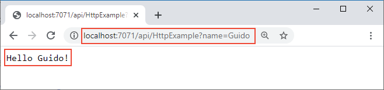

# Create an HTTP triggered function in Azure

[!INCLUDE [functions-python-preview-note](../../includes/functions-python-preview-note.md)]

This article shows you how to use command-line tools to create a Python project that runs in Azure Functions. The function you create is triggered by HTTP requests. Finally, you publish your project to run as a [serverless function](functions-scale.md#consumption-plan) in Azure.

This article is the first of two quickstarts for Azure Functions. After you complete this article, you [add an Azure Storage queue output binding](functions-add-output-binding-storage-queue-python.md) to your function.

## Prerequisites

Before you start, you must have the following:

+ Install [Python 3.6](https://www.python.org/downloads/).

+ Install [Azure Functions Core Tools](./functions-run-local.md#v2) version 2.6.1071 or a later version.

+ Install the [Azure CLI](/cli/azure/install-azure-cli) version 2.x or a later version.

+ An active Azure subscription.

[!INCLUDE [quickstarts-free-trial-note](../../includes/quickstarts-free-trial-note.md)]

## Create and activate a virtual environment

To locally develop and test Python functions, you must work in a Python 3.6 environment. Run the following commands to create and activate a virtual environment named `.env`.

### Bash:

```bash
python3.6 -m venv .venv
source .venv/bin/activate
```

### PowerShell or a Windows command prompt:

```powershell
py -3.6 -m venv .venv
.venv\scripts\activate
```

The remaining commands are run inside the virtual environment.

## Create a local Functions project

A Functions project is the equivalent of a function app in Azure. It can have multiple functions that all share the same local and hosting configurations.

In the virtual environment, run the following command, choosing **python** as your worker runtime.

```console
func init MyFunctionProj
```

A folder named _MyFunctionProj_ is created, which contains the following three files:

* `local.settings.json` is used to store app settings and connection strings when running locally. This file doesn't get published to Azure.
* `requirements.txt` contains the list of packages to be installed on publishing to Azure.
* `host.json` contains global configuration options that affect all functions in a function app. This file does get published to Azure.

Navigate to the new MyFunctionProj folder:

```console
cd MyFunctionProj
```

Next, you update the host.json file to enable extension bundles.  

## Create a function

To add a function to your project, run the following command:

```console
func new
```

Choose the **HTTP trigger** template, type `HttpTrigger` as the  name for the function, then press Enter.

A subfolder named _HttpTrigger_ is created, which contains the following files:

* **function.json**: configuration file that defines the function, trigger, and other bindings. Review this file and see that the value for `scriptFile` points to the file containing the function, while the invocation trigger and bindings are defined in the `bindings` array.

  Each binding requires a direction, type and a unique name. The HTTP trigger has an input binding of type [`httpTrigger`](functions-bindings-http-webhook.md#trigger) and output binding of type [`http`](functions-bindings-http-webhook.md#output).

* **\_\_init\_\_.py**: script file that is your HTTP triggered function. Review this script and see that it contains a default `main()`. HTTP data from the trigger is passed to this function using the `req` named binding parameter. Defined in function.json, `req` is an instance of the [azure.functions.HttpRequest class](/python/api/azure-functions/azure.functions.httprequest). 

    The return object, defined as `$return` in function.json, is an instance of [azure.functions.HttpResponse class](/python/api/azure-functions/azure.functions.httpresponse). To learn more, see [Azure Functions HTTP triggers and bindings](functions-bindings-http-webhook.md).

## Run the function locally

The following command starts the function app, which runs locally using the same Azure Functions runtime that is in Azure.

```bash
func host start
```

When the Functions host starts, it writes something like the following output, which has been truncated for readability:

```output

                  %%%%%%
                 %%%%%%
            @   %%%%%%    @
          @@   %%%%%%      @@
       @@@    %%%%%%%%%%%    @@@
     @@      %%%%%%%%%%        @@
       @@         %%%%       @@
         @@      %%%       @@
           @@    %%      @@
                %%
                %

...

Content root path: C:\functions\MyFunctionProj
Now listening on: http://0.0.0.0:7071
Application started. Press Ctrl+C to shut down.

...

Http Functions:

        HttpTrigger: http://localhost:7071/api/MyHttpTrigger

[8/27/2018 10:38:27 PM] Host started (29486ms)
[8/27/2018 10:38:27 PM] Job host started
```

Copy the URL of your `HttpTrigger` function from the runtime output and paste it into your browser's address bar. Append the query string `?name=<yourname>` to this URL and execute the request. The following shows the response in the browser to the GET request returned by the local function:



Now that you have run your function locally, you can create the function app and other required resources in Azure.

[!INCLUDE [functions-create-resource-group](../../includes/functions-create-resource-group.md)]

[!INCLUDE [functions-create-storage-account](../../includes/functions-create-storage-account.md)]

## Create a function app in Azure

A function app provides an environment for executing your function code. It lets you group functions as a logical unit for easier management, deployment, and sharing of resources.

Run the following command using a unique function app name in place of the `<APP_NAME>` placeholder and the storage account name for  `<STORAGE_NAME>`. The `<APP_NAME>` is also the default DNS domain for the function app. This name needs to be unique across all apps in Azure.

```azurecli-interactive
az functionapp create --resource-group myResourceGroup --os-type Linux \
--consumption-plan-location westeurope  --runtime python \
--name <APP_NAME> --storage-account  <STORAGE_NAME>
```

> [!NOTE]
> Azure Functions, Consumption plan for Linux is currently in preview and only available on following regions: West US, East US, West Europe, East Asia. Moreover, Linux and Windows apps cannot be hosted in the same resource group. If you have an existing resource group named `myResourceGroup` with a Windows function app or web app, you must use a different resource group.

You're now ready to publish your local functions project to the function app in Azure.

[!INCLUDE [functions-publish-project](../../includes/functions-publish-project.md)]

[!INCLUDE [functions-test-function-code](../../includes/functions-test-function-code.md)]

## Next steps

You've created a Python functions project with an HTTP triggered function, run it on your local machine, and deployed it to Azure. Now, extend your function by...

> [!div class="nextstepaction"]
> [Adding an Azure Storage queue output binding](functions-add-output-binding-storage-queue-python.md)
