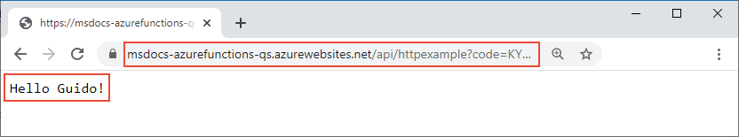
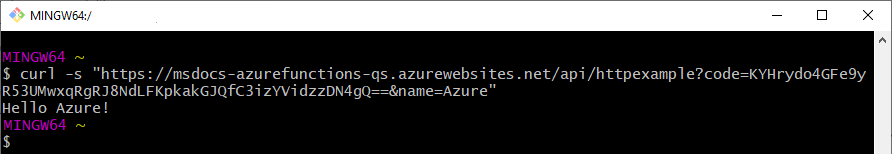

# Quickstart: Create a Python function in Azure that responds to HTTP requests

In this article, you use command-line tools to create a Python function that responds to HTTP requests. After testing the code locally, you deploy it to the serverless environment of Azure Functions. Completing this quickstart incurs a small cost of a few USD cents or less in your Azure account.

There is also a [Visual Studio Code-based version](/azure/azure-functions/functions-create-first-function-vs-code?pivots=programming-language-python) of this article.

## Prerequisites

- An Azure account with an active subscription. [Create an account for free](https://azure.microsoft.com/free/?ref=microsoft.com&utm_source=microsoft.com&utm_medium=docs&utm_campaign=visualstudio).
- The [Azure Functions Core Tools](./functions-run-local.md#v2) version 2.7.1846 or a later.
- The [Azure CLI](/cli/azure/install-azure-cli) version 2.0.76 or later. 
- [Python 3.7.4 - 64 bit](https://www.python.org/downloads/release/python-374/). (Python 3.7.4 is verified with Azure Functions; Python 3.8 and later versions are not yet supported.)

### Prerequisite check

1. In a terminal or command window, run `func --version` to check that the Azure Functions Core Tools are version 2.7.1846 or later.
1. Run `az --version` to check that the Azure CLI version is 2.0.76 or later.
1. Run `az login` to sign in to Azure and verify an active subscription.
1. Run `python --version` (Linux/MacOS) or `py --version` (Windows) to check your Python version reports 3.7.x.

## Create and activate a virtual environment

In a suitable folder, run the following commands to create and activate a virtual environment named `.venv`. Be sure to use Python 3.7, which is supported by Azure Functions.


# [bash](#tab/bash)

```bash
python -m venv .venv
```

```bash
source .venv/bin/activate
```

If Python didn't install the venv package on your Linux distribution, run the following command:

```bash
sudo apt-get install python3-venv
```

# [PowerShell](#tab/powershell)

```powershell
py -m venv .venv
```

```powershell
.venv\scripts\activate
```

# [Cmd](#tab/cmd)

```cmd
py -m venv .venv
```

```cmd
.venv\scripts\activate
```

---

You run all subsequent commands in this activated virtual environment. (To exit the virtual environment, run `deactivate`.)

## Create a local function project

In Azure Functions, a function project is a container for one or more individual functions that each responds to a specific trigger. All functions in a project share the same local and hosting configurations. In this section, you create a function project that contains a single function.

1. In the virtual environment, run the `func init` command to create a functions project in a folder named *LocalFunctionProj* with the specified runtime:

    ```
    func init LocalFunctionProj --python
    ```
    
    This folder contains various files for the project, including configurations files named [local.settings.json](functions-run-local.md#local-settings-file) and [host.json](functions-host-json.md). Because *local.settings.json* can contain secrets downloaded from Azure, the file is excluded from source control by default in the *.gitignore* file.

    > [!TIP]
    > Because a function project is tied to a specific runtime, all the functions in the project must be written with the same language.

1. Navigate into the project folder:

    ```
    cd LocalFunctionProj
    ```
    
1. Add a function to your project by using the following command, where the `--name` argument is the unique name of your function and the `--template` argument specifies the function's trigger. `func new` create a subfolder matching the function name that contains a code file appropriate to the project's chosen language and a configuration file named *function.json*.

    ```
    func new --name HttpExample --template "HTTP trigger"
    ```

### (Optional) Examine the file contents

If desired, you can skip to [Run the function locally](#run-the-function-locally) and examine the file contents later.

#### \_\_init\_\_.py

*\_\_init\_\_.py* contains a `main()` Python function that's triggered according to the configuration in *function.json*.

```python
import logging

import azure.functions as func


def main(req: func.HttpRequest) -> func.HttpResponse:
    logging.info('Python HTTP trigger function processed a request.')

    name = req.params.get('name')
    if not name:
        try:
            req_body = req.get_json()
        except ValueError:
            pass
        else:
            name = req_body.get('name')

    if name:
        return func.HttpResponse(f"Hello {name}!")
    else:
        return func.HttpResponse(
             "Please pass a name on the query string or in the request body",
             status_code=400
        )
```

For HTTP trigger, the function receives request data in the variable `req` as defined in *function.json*. `req` is an instance of the [azure.functions.HttpRequest class](/python/api/azure-functions/azure.functions.httprequest). The return object, defined as `$return` in *function.json*, is an instance of [azure.functions.HttpResponse class](/python/api/azure-functions/azure.functions.httpresponse). To learn more, see [Azure Functions HTTP triggers and bindings](functions-bindings-http-webhook.md).

#### function.json

*function.json* is a configuration file that defines the input and output `bindings` for the function, including the trigger type. You can change `scriptFile` to invoke a different Python file if desired.

```json
{
  "scriptFile": "__init__.py",
  "bindings": [
    {
      "authLevel": "function",
      "type": "httpTrigger",
      "direction": "in",
      "name": "req",
      "methods": [
        "get",
        "post"
      ]
    },
    {
      "type": "http",
      "direction": "out",
      "name": "$return"
    }
  ]
}
```

Each binding requires a direction, a type, and a unique name. The HTTP trigger has an input binding of type [`httpTrigger`](functions-bindings-http-webhook.md#trigger) and output binding of type [`http`](functions-bindings-http-webhook.md#output).


## Run the function locally

Start the function by starting the local Azure Functions runtime host in the *LocalFunctionProj* folder:

```
func start
```

The following output should appear. (If HttpExample doesn't appear as shown below, you likely started the host from within the *HttpExample* folder. In that case, use **Ctrl**+**C** to stop the host, navigate to the parent *LocalFunctionProj* folder, and run `func start` again.)

```output
Now listening on: http://0.0.0.0:7071
Application started. Press Ctrl+C to shut down.

Http Functions:

        HttpExample: [GET,POST] http://localhost:7071/api/HttpExample
```

Copy the URL of your `HttpExample` function from this output to a browser and append the query string `?name=<your-name>`, making the full URL like `http://localhost:7071/api/HttpExample?name=Functions`. The browser should display a message like `Hello Functions`:


The terminal in which you ran `func start` also shows log output as you make requests.

When you're ready, **Ctrl**+**C** to stop the functions host.

## Create supporting Azure resources for your function

Before you can deploy your function code to Azure, you need to create three resources:

- A resource group, which is a logical container for related resources.
- An Azure Storage account, which maintains state and other information about your projects.
- An Azure functions app, which provides the environment for executing your function code. A function app maps to your local function project and lets you group functions as a logical unit for easier management, deployment, and sharing of resources.

You use Azure CLI commands to create these items. Each command provides JSON output upon completion.

1. If you haven't done so already, sign in to Azure with the [az login](/cli/azure/reference-index#az-login) command:

    ```azurecli
    az login
    ```
    
1. Create a resource group with the [az group create](/cli/azure/group#az-group-create) command. The following example creates a resource group named `AzureFunctionsQuickstart-rg` in the `westeurope` region. (You generally create your resource group and resources in a region near you, using an available region from the `az account list-locations` command.)

    ```azurecli
    az group create --name AzureFunctionsQuickstart-rg --location westeurope
    ```
    
    > [!NOTE]
    > You can't host Linux and Windows apps in the same resource group. If you have an existing resource group named `AzureFunctionsQuickstart-rg` with a Windows function app or web app, you must use a different resource group.
    
1. Create a general-purpose storage account in your resource group and region by using the [az storage account create](/cli/azure/storage/account#az-storage-account-create) command. In the following example, replace `<storage_name>` with a globally unique name appropriate to you. Names must contain three to 24 characters numbers and lowercase letters only. `Standard_LRS` specifies a typical general-purpose account.

    ```azurecli
    az storage account create --name <storage_name> --location westeurope --resource-group AzureFunctionsQuickstart-rg --sku Standard_LRS
    ```
    
    The storage account incurs only a few USD cents for this quickstart.
    
1. Create the Functions app using the [az functionapp create](/cli/azure/functionapp#az-functionapp-create) command. In the following example, replace `<storage_name>` with the name of the account you used in the previous step, and replace `<app_name>` with a globally unique name appropriate to you. The `<app_name>` is also the default DNS domain for the function app.

    ```azurecli
    az functionapp create --resource-group AzureFunctionsQuickstart-rg --os-type Linux --consumption-plan-location westeurope --runtime python --name <app_name> --storage-account <storage_name>
    ```
    
    This command creates a function app running the specified language runtime under the [Azure Functions Consumption Plan](functions-scale.md#consumption-plan), which is free for the amount of usage you incur here. The command also provisions an associated Azure Application Insights instance in the same resource group, with which you can monitor your function app and view logs. For more information, see [Monitor Azure Functions](functions-monitoring.md). The instance incurs no costs until you activate it.
    
## Deploy the function project to Azure

With the necessary resources in place, you're now ready to deploy your local functions project to the function app in Azure by using the [func azure functionapp publish](functions-run-local.md#project-file-deployment) command. In the following example, replace `<app_name>` with the name of your app.

```
func azure functionapp publish <app_name>
```

If you see the error, "Can't find app with name ...", wait a few seconds and try again, as Azure may not have fully initialized the app after the previous `az functionapp create` command.

The publish command shows results similar to the following output (truncated for simplicity):

```output
Getting site publishing info...
Creating archive for current directory...
Performing remote build for functions project.

...

Deployment successful.
Remote build succeeded!
Syncing triggers...
Functions in msdocs-azurefunctions-qs:
    HttpExample - [httpTrigger]
        Invoke url: https://msdocs-azurefunctions-qs.azurewebsites.net/api/httpexample?code=KYHrydo4GFe9y0000000qRgRJ8NdLFKpkakGJQfC3izYVidzzDN4gQ==
```

## Invoke the function on Azure

Because your function uses an HTTP trigger, you invoke it by making an HTTP request to its URL in the browser or with a tool like curl. In both instances, the `code` URL parameter is your unique function key that authorizes the invocation with your function endpoint.

# [Browser](#tab/browser)

Copy the complete **Invoke url** shown in the output of the publish command into a browser address bar, appending the query parameter `&name=Azure`. The browser should display similar output as when you ran the function locally.




# [curl](#tab/curl)

Run [curl](https://curl.haxx.se/) with the **Invoke url**, appending the parameter `&name=Azure`. The output of the command should be the text, "Hello Azure".



---

> [!TIP]
> To view near real-time logs for a published Python app, use the [Application Insights Live Metrics Stream](functions-monitoring.md#streaming-logs).

## Clean up resources

If you continue to the next step, [Add an Azure Storage queue output binding](functions-add-output-binding-storage-queue-python.md), keep all your resources in place as you'll build on what you've already done.

Otherwise, use the following command to delete the resource group and all its contained resources to avoid incurring further costs.

```azurecli
az group delete --name AzureFunctionsQuickstart-rg
```

## Next steps

> [!div class="nextstepaction"]
> [Add an Azure Storage queue output binding](functions-add-output-binding-storage-queue-python.md)
