# Create your first function using Visual Studio Code

Azure Functions lets you execute your code in a [serverless](https://azure.microsoft.com/solutions/serverless/) environment without having to first create a VM or publish a web application.

In this article, you learn how to use the [Azure Functions extension for Visual Studio Code] to create and test a "hello world" function on your local computer using Microsoft Visual Studio Code. You then publish the function code to Azure from Visual Studio Code.

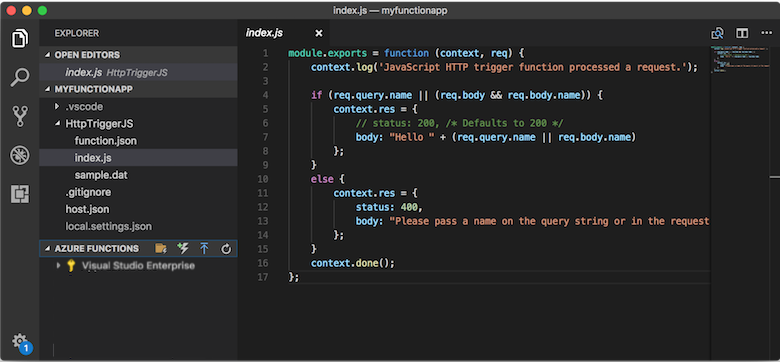

The extension currently supports C#, JavaScript, and Java functions. The steps in this article may vary depending on your choice of language for your Azure Functions project. The extension is currently in preview. To learn more, see the [Azure Functions extension for Visual Studio Code] extension page.

## Prerequisites

To complete this quickstart:

* Install [Visual Studio Code](https://code.visualstudio.com/) on one of the [supported platforms](https://code.visualstudio.com/docs/supporting/requirements#_platforms). This article was developed and tested on a device running macOS (High Sierra).

* Install version 2.x of the [Azure Functions Core Tools](functions-run-local.md#v2), which is still in preview.

* Install the specific requirements for your chosen language:

    | Language | Extension |
    | -------- | --------- |
    | **C#** | [C# for Visual Studio Code](https://marketplace.visualstudio.com/items?itemName=ms-vscode.csharp) [.NET Core CLI tools](https://docs.microsoft.com/dotnet/core/tools/?tabs=netcore2x)*   |
    | **Java** | [Debugger for Java](https://marketplace.visualstudio.com/items?itemName=vscjava.vscode-java-debug) [JDK 1.8](http://www.oracle.com/technetwork/java/javase/downloads/index.html) [Maven 3+](https://maven.apache.org/) |
    | **JavaScript** | [Node 8.0+](https://nodejs.org/)  |

    \* Also required by Core Tools.

[!INCLUDE [quickstarts-free-trial-note](../../includes/quickstarts-free-trial-note.md)]

## Install the Azure Function extension

The Azure Functions extension is used to create, test, and deploy functions to Azure.

1. In Visual Studio Code, open **Extensions** and search for `azure functions`, or [open this link in Visual Studio Code](vscode:extension/ms-azuretools.vscode-azurefunctions).

1. Select **Install** to install the extension to Visual Studio Code. 

    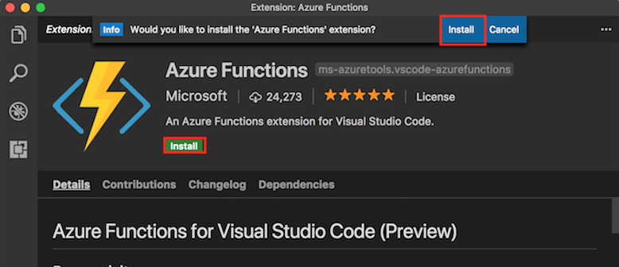

1. Restart Visual Studio Code and select the Azure icon on the Activity bar. You should see an Azure Functions area in the Side Bar.

    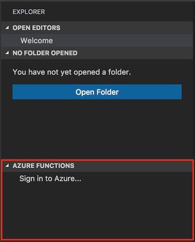

## Create an Azure Functions project

The Azure Functions project template in Visual Studio Code creates a project that can be published to a function app in Azure. A function app lets you group functions as a logical unit for management, deployment, and sharing of resources.

1. In Visual Studio Code, select the Azure logo to display the **Azure: Functions** area, and then select the Create New Project icon.

    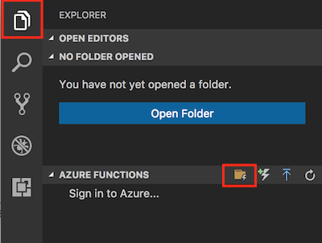

1. Choose a location for your project workspace and choose **Select**.

    > [!NOTE]
    > This article was designed to be completed outside of a workspace. In this case, do not select a project folder that is part of a workspace.

1. Select the language for your function app project. In this article, JavaScript is used.
    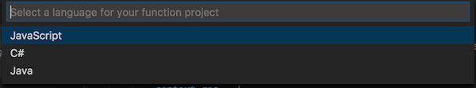

1. When prompted, choose **Add to workspace**.

Visual Studio Code creates the function app project in a new workspace. This project contains the [host.json](functions-host-json.md) and [local.settings.json](functions-run-local.md#local-settings-file) configuration files, plus any language-specific project files. You also get a new Git repository in the project folder.

## Create an HTTP triggered function

1. From **Azure: Functions**, choose the Create Function icon.

    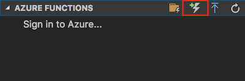

1. Select the folder with your function app project and select the **HTTP trigger** function template.

    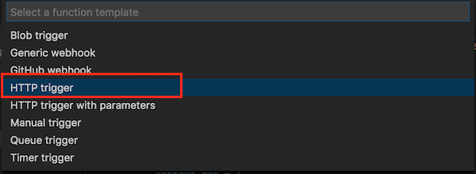

1. Type `HTTPTrigger` for the function name and press Enter, then select **Anonymous** authentication.

    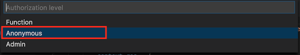

    A function is created in your chosen language using the template for an HTTP-triggered function.

    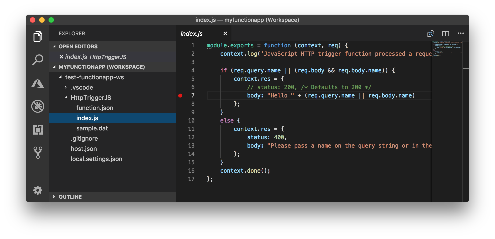

You can add input and output bindings to your function by modifying the function.json file. For more information, see  [Azure Functions triggers and bindings concepts](functions-triggers-bindings.md).

Now that you've created your function project and an HTTP-triggered function, you can test it on your local computer.

## Test the function locally

Azure Functions Core Tools lets you run an Azure Functions project on your local development computer. You're prompted to install these tools the first time you start a function from Visual Studio Code.  

1. To test your function, set a breakpoint in the function code and press F5 to start the function app project. Output from Core Tools is displayed in the **Terminal** panel.

1. In the **Terminal** panel, copy the URL endpoint of your HTTP-triggered function.

    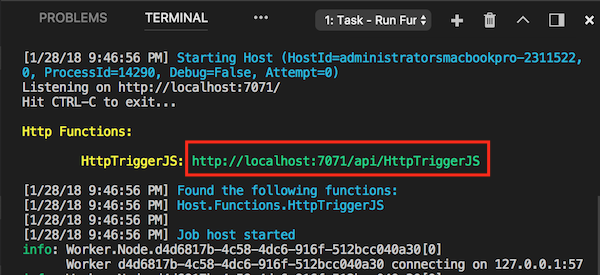

1. Paste the URL for the HTTP request into your browser's address bar. Append the query string `?name=<yourname>` to this URL and execute the request. Execution is paused when the breakpoint is hit.

    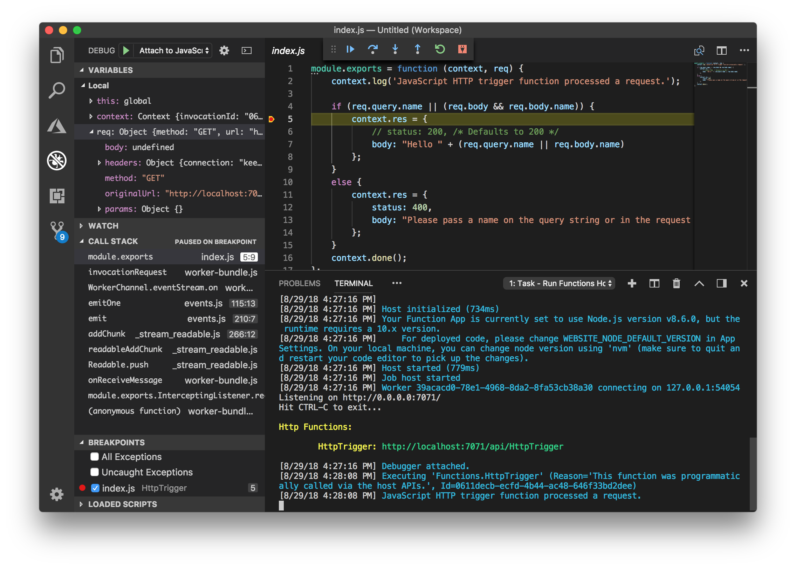

1. When you continue the execution, the following shows the response in the browser to the GET request:

    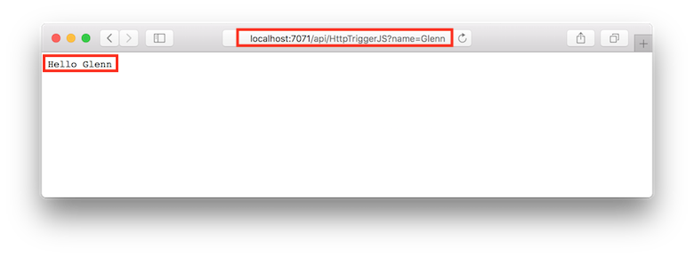

1. To stop debugging, press Shift + F1.

After you've verified that the function runs correctly on your local computer, it's time to publish the project to Azure.

## Sign in to Azure

Before you can publish your app, you must sign in to Azure.

1. In the **Azure: Functions** area, choose **Sign in to Azure...**. If you don't already have one, you can **Create a free Azure account**.

    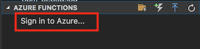

1. When prompted, select **Copy & Open**, or copy the displayed code and open <https://aka.ms/devicelogin> in your browser.

1. Paste the copied code in the **Device Login** page, verify the sign-in for Visual Studio Code, then select **Continue**.  

1. Complete the sign-in using your Azure account credentials. After you have successfully signed in, you can close the browser.

## Publish the project to Azure

Visual Studio Code lets you publish your functions project directly to Azure. In the process, you create a function app and related resources in your Azure subscription. The function app provides an execution context for your functions. The project is packaged and deployed to the new function app in your Azure subscription. 

This article assumes that you are creating a new function app. Publishing to an existing function app overwrites the content of that app in Azure.

1. In the **Azure: Functions** area, select the Deploy to Function App icon.

    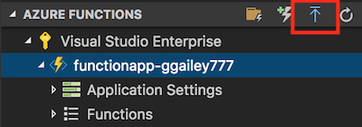

1. Choose the project folder, which is your current workspace.

1. If you have more than one subscription, choose the one you want to host your function app, then choose **+ Create New Function App**.

1. Type a globally unique name that identifies your function app and press Enter. Valid characters for a function app name are `a-z`, `0-9`, and `-`.

1. Choose **+ Create New Resource Group**, type a resource group name, like `myResourceGroup`, and press enter. You can also use an existing resource group.

1. Choose **+Create New Storage Account**, type a globally unique name of the new storage account used by your function app and press Enter. Storage account names must be between 3 and 24 characters in length and may contain numbers and lowercase letters only. You can also use an existing account.

1. Choose a location in a [region](https://azure.microsoft.com/regions/) near you or near other services your functions access.

    Function app creation starts after you choose your location. A notification is displayed after your function app is created and the deployment package is applied.

1. Select **View Output** in the notifications to view the creation and deployment results, including the Azure resources that you created.

    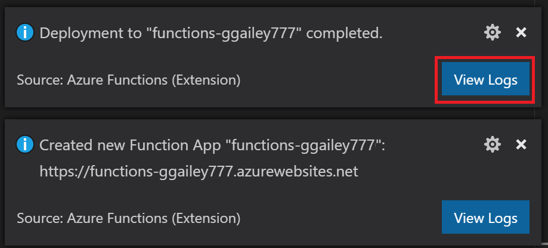

1. Make a note of the URL of the new function app in Azure. You use this to test your function after the project is published to Azure.

    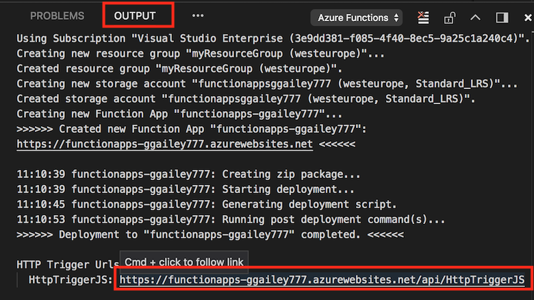

1. Back in the **Azure: Functions** area, you see the new function app displayed under your subscription. When you expand this node, you see the functions in the function app, as well as application settings and function proxies.

    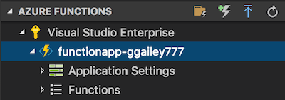

    From your function app node, type Ctrl and click (right-click) to choose to perform various management and configuration tasks against the function app in Azure. You can also choose to view the function app in the Azure portal.

## Test your function in Azure

1. Copy the URL of the HTTP trigger from the **Output** panel. As before, make sure to add the query string `?name=<yourname>` to the end of this URL and execute the request.

    The URL that calls your HTTP-triggered function should be in the following format:

        http://<functionappname>.azurewebsites.net/api/<functionname>?name=<yourname> 

1. Paste this new URL for the HTTP request into your browser's address bar. The following shows the response in the browser to the remote GET request returned by the function: 

    

## Next steps

You have used Visual Studio Code to create a function app with a simple HTTP-triggered function. To learn more about developing functions in a specific language, see the language reference guides for [JavaScript](functions-reference-node.md), [.NET](functions-dotnet-class-library.md), or [Java](functions-reference-java.md).

Next you may want to learn more about local testing and debugging from the Terminal or command prompt using the Azure Functions Core Tools.

> [!div class="nextstepaction"]
> [Code and test locally](functions-run-local.md)

[Azure Functions Core Tools]: functions-run-local.md
[Azure Functions extension for Visual Studio Code]: https://marketplace.visualstudio.com/items?itemName=ms-azuretools.vscode-azurefunctions
