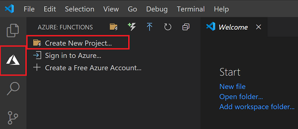
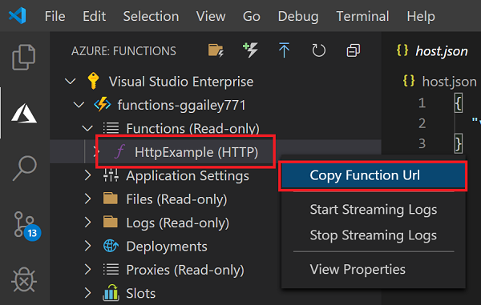
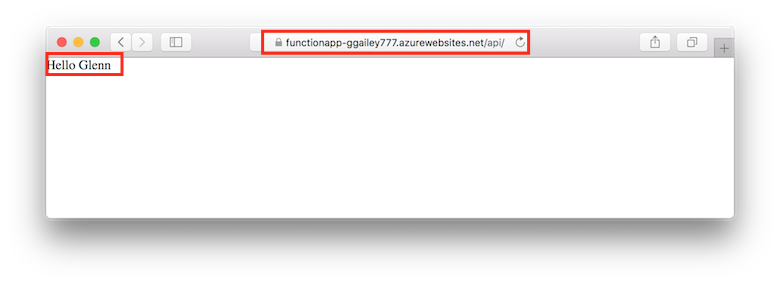

# Quickstart: Create a function in Azure using Visual Studio Code

::: zone pivot="programming-language-csharp"  
In this article, you use Visual Studio Code to create a C# class library-based function that responds to HTTP requests. After testing the code locally, you deploy it to the serverless environment of Azure Functions. 
::: zone-end  
::: zone pivot="programming-language-javascript"
In this article, you use Visual Studio Code to create a JavaScript function that responds to HTTP requests. After testing the code locally, you deploy it to the serverless environment of Azure Functions. 
::: zone-end
::: zone pivot="programming-language-typescript"
In this article, you use Visual Studio Code to create a TypeScript function that responds to HTTP requests. After testing the code locally, you deploy it to the serverless environment of Azure Functions. 
::: zone-end   
::: zone pivot="programming-language-powershell"
In this article, you use Visual Studio Code to create a PowerShell function that responds to HTTP requests. After testing the code locally, you deploy it to the serverless environment of Azure Functions. 
::: zone-end  
::: zone pivot="programming-language-python" 
In this article, you use Visual Studio Code to create a Python function that responds to HTTP requests. After testing the code locally, you deploy it to the serverless environment of Azure Functions. 
::: zone-end  
::: zone pivot="programming-language-java" 
In this article, you use Visual Studio Code to create a Java function that responds to HTTP requests. After testing the code locally, you deploy it to the serverless environment of Azure Functions. 
::: zone-end

Completing this quickstart incurs a small cost of a few USD cents or less in your Azure account. 

::: zone pivot="programming-language-csharp,programming-language-javascript,programming-language-typescript,programming-language-powershell,programming-language-python"
There's also a [CLI-based version](functions-create-first-azure-function-azure-cli.md) of this article.
::: zone-end
::: zone pivot="programming-language-java"  
> [!NOTE]
> If Visual Studio Code isn't your prefered development tool, check out our similar tutorials for Java developers using [Maven](/azure/azure-functions/functions-create-first-azure-function-azure-cli?pivots=programming-language-java), [Gradle](/azure/azure-functions/functions-create-first-java-gradle) and [IntelliJ IDEA](/azure/developer/java/toolkit-for-intellij/quickstart-functions).
::: zone-end  

## Configure your environment

Before you get started, make sure you have the following requirements in place:

+ An Azure account with an active subscription. [Create an account for free](https://azure.microsoft.com/free/?ref=microsoft.com&utm_source=microsoft.com&utm_medium=docs&utm_campaign=visualstudio).

::: zone pivot="programming-language-csharp,programming-language-powershell,programming-language-python"  
+ [Node.js](https://nodejs.org/), required by Windows for npm. Only [Active LTS and Maintenance LTS versions](https://nodejs.org/about/releases/). Use the `node --version` command to check your version.
    Not required for local development on macOS and Linux.   
::: zone-end  
::: zone pivot="programming-language-javascript,programming-language-typescript"  
+ [Node.js](https://nodejs.org/), Active LTS and Maintenance LTS versions (10.14.1 recommended). Use the `node --version` command to check your version.
::: zone-end 
::: zone pivot="programming-language-python"
+ [Python 3.8](https://www.python.org/downloads/release/python-381/), [Python 3.7](https://www.python.org/downloads/release/python-375/), [Python 3.6](https://www.python.org/downloads/release/python-368/) are supported by Azure Functions (x64).
::: zone-end   
::: zone pivot="programming-language-powershell"
+ [PowerShell Core](/powershell/scripting/install/installing-powershell-core-on-windows)

+ The [.NET Core SDK 2.2+](https://www.microsoft.com/net/download)  
::: zone-end  
::: zone pivot="programming-language-java"  
+ The [Java Developer Kit](https://aka.ms/azure-jdks), version 8.

+ [Apache Maven](https://maven.apache.org), version 3.0 or above.
::: zone-end  
+ [Visual Studio Code](https://code.visualstudio.com/) on one of the [supported platforms](https://code.visualstudio.com/docs/supporting/requirements#_platforms).  
::: zone pivot="programming-language-csharp"  
+ The [C# extension](https://marketplace.visualstudio.com/items?itemName=ms-dotnettools.csharp) for Visual Studio Code.  
::: zone-end  
::: zone pivot="programming-language-python"
+ The [Python extension](https://marketplace.visualstudio.com/items?itemName=ms-python.python) for Visual Studio Code.  
::: zone-end  
::: zone pivot="programming-language-powershell"
+ The [PowerShell extension for Visual Studio Code](https://marketplace.visualstudio.com/items?itemName=ms-vscode.PowerShell). 
::: zone-end  
::: zone pivot="programming-language-java"  
+ The [Java extension pack](https://marketplace.visualstudio.com/items?itemName=vscjava.vscode-java-pack)
::: zone-end  

+ The [Azure Functions extension](https://marketplace.visualstudio.com/items?itemName=ms-azuretools.vscode-azurefunctions) for Visual Studio Code. 

## <a name="create-an-azure-functions-project"></a>Create your local project 

In this section, you use Visual Studio Code to create a local Azure Functions project in your chosen language. Later in this article, you'll publish your function code to Azure. 

1. Choose the Azure icon in the Activity bar, then in the **Azure: Functions** area, select the **Create new project...** icon.

    

1. Choose a directory location for your project workspace and choose **Select**.

    > [!NOTE]
    > These steps were designed to be completed outside of a workspace. In this case, do not select a project folder that is part of a workspace.

1. Provide the following information at the prompts:

    ::: zone pivot="programming-language-csharp"
    + **Select a language for your function project**: Choose `C#`.
    ::: zone-end
    ::: zone pivot="programming-language-javascript"
    + **Select a language for your function project**: Choose `JavaScript`.
    ::: zone-end
    ::: zone pivot="programming-language-typescript"
    + **Select a language for your function project**: Choose `TypeScript`.
    ::: zone-end
    ::: zone pivot="programming-language-powershell"
    + **Select a language for your function project**: Choose `PowerShell`.
    ::: zone-end
    ::: zone pivot="programming-language-python"
    + **Select a language for your function project**: Choose `Python`.

    + **Select a Python alias to create a virtual environment**: Choose the location of your Python interpreter. If the location isn't shown, type in the full path to your Python binary.  
    ::: zone-end

    ::: zone pivot="programming-language-java"  
    + **Select a language for your function project**: Choose `Java`.

    + **Provide a group ID**: Choose `com.function`.

    + **Provide an artifact ID**: Choose `myFunction`.

    + **Provide a version**: Choose `1.0-SNAPSHOT`.

    + **Provide a package name**: Choose `com.function`.

    + **Provide an app name**: Choose `myFunction-12345`.
    ::: zone-end  
    ::: zone pivot="programming-language-csharp,programming-language-javascript,programming-language-typescript,programming-language-powershell,programming-language-python"
    + **Select a template for your project's first function**: Choose `HTTP trigger`.
    
    + **Provide a function name**: Type `HttpExample`.
    ::: zone-end  
    ::: zone pivot="programming-language-csharp"
    + **Provide a namespace**: Type `My.Functions`. 
    ::: zone-end  
    ::: zone pivot="programming-language-csharp,programming-language-javascript,programming-language-typescript,programming-language-powershell,programming-language-python"
    + **Authorization level**: Choose `Anonymous`, which enables anyone to call your function endpoint. To learn about authorization level, see [Authorization keys](functions-bindings-http-webhook-trigger.md#authorization-keys).
    ::: zone-end  
    + **Select how you would like to open your project**: Choose `Add to workspace`.

1. Using this information, Visual Studio Code generates an Azure Functions project with an HTTP trigger. You can view the local project files in the Explorer. To learn more about files that are created, see [Generated project files](functions-develop-vs-code.md#generated-project-files). 

::: zone pivot="programming-language-csharp,programming-language-javascript,programming-language-python,programming-language-java"

[!INCLUDE [functions-run-function-test-local-vs-code](../../includes/functions-run-function-test-local-vs-code.md)]

::: zone-end

::: zone pivot="programming-language-powershell"

[!INCLUDE [functions-run-function-test-local-vs-code-ps](../../includes/functions-run-function-test-local-vs-code-ps.md)]

::: zone-end

After you've verified that the function runs correctly on your local computer, it's time to use Visual Studio Code to publish the project directly to Azure. 

[!INCLUDE [functions-sign-in-vs-code](../../includes/functions-sign-in-vs-code.md)]

[!INCLUDE [functions-publish-project-vscode](../../includes/functions-publish-project-vscode.md)]

## Run the function in Azure

1. Back in the **Azure: Functions** area in the side bar, expand the new function app under your subscription. Expand **Functions**, right-click (Windows) or Ctrl + click (macOS) on **HttpExample**, and then choose **Copy function URL**.

    

1. Paste this URL for the HTTP request into your browser's address bar, add the `name` query string as `?name=Functions` to the end of this URL, and then execute the request. The URL that calls your HTTP-triggered function should be in the following format:

    ```http
    http://<functionappname>.azurewebsites.net/api/httpexample?name=Functions
    ```
        
    The following example shows the response in the browser to the remote GET request returned by the function: 

    

## Clean up resources

When you continue to the next step, [Add an Azure Storage queue binding to your function](functions-add-output-binding-storage-queue-vs-code.md), you'll need to keep all your resources in place to build on what you've already done.

Otherwise, you can use the following steps to delete the function app and its related resources to avoid incurring any further costs.

[!INCLUDE [functions-cleanup-resources-vs-code.md](../../includes/functions-cleanup-resources-vs-code.md)]

To learn more about Functions costs, see [Estimating Consumption plan costs](functions-consumption-costs.md).

## Next steps

You have used Visual Studio Code to create a function app with a simple HTTP-triggered function. In the next article, you expand that function by adding an output binding. This binding writes the string from the HTTP request to a message in an Azure Queue Storage queue. 

> [!div class="nextstepaction"]
> [Add an Azure Storage queue binding to your function](functions-add-output-binding-storage-queue-vs-code.md)

[Azure Functions Core Tools]: functions-run-local.md
[Azure Functions extension for Visual Studio Code]: https://marketplace.visualstudio.com/items?itemName=ms-azuretools.vscode-azurefunctions
