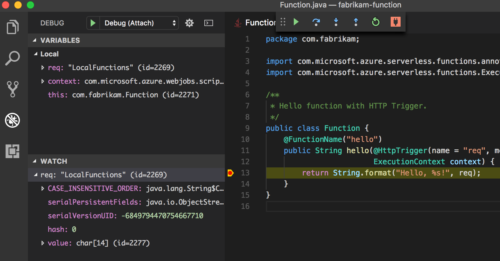

# Create your first function with Java and Maven (Preview)

This quickstart guides through creating a [serverless](https://azure.microsoft.com/overview/serverless-computing/) function project with Maven, testing it locally, and deploying it to Azure Functions. When you're done, you have a HTTP-triggered function app running in Azure.

 

[!INCLUDE [quickstarts-free-trial-note](../../includes/quickstarts-free-trial-note.md)]

## Prerequisites
To develop functions app with Java, you must have the following installed:

-  [.NET Core](https://www.microsoft.com/net/core), latest version.
-  [Java Developer Kit](https://www.azul.com/downloads/zulu/), version 8.
-  [Azure CLI](https://docs.microsoft.com/cli/azure)
-  [Apache Maven](https://maven.apache.org), version 3.0 or above.
-  [Node.js](https://nodejs.org/download/), version 8.6 or higher.

> [!IMPORTANT] 
> The JAVA_HOME environment variable must be set to the install location of the JDK to complete this quickstart.

## Install the Azure Functions Core Tools

The [Azure Functions Core Tools 2.0](https://www.npmjs.com/package/azure-functions-core-tools) provide a local development environment for writing, running, and debugging Azure Functions. Install the tools with [npm](https://www.npmjs.com/), included with [Node.js](https://nodejs.org/).

```
npm install -g azure-functions-core-tools@core
```

> [!NOTE]
> If you have trouble installing Azure Functions Core Tools version 2.0, see [Version 2.x runtime](/azure/azure-functions/functions-run-local#version-2x-runtime).

## Generate a new Functions project

In an empty folder, run the following command to generate the Functions project from a [Maven archetype](https://maven.apache.org/guides/introduction/introduction-to-archetypes.html).

### Linux/MacOS

```bash
mvn archetype:generate \
    -DarchetypeGroupId=com.microsoft.azure \
	-DarchetypeArtifactId=azure-functions-archetype 
```

### Windows (CMD)
```cmd
mvn archetype:generate ^
	-DarchetypeGroupId=com.microsoft.azure ^
	-DarchetypeArtifactId=azure-functions-archetype
```

Maven prompts you for values needed to finish generating the project. For _groupId_, _artifactId_, and _version_ values, see the [Maven naming conventions](https://maven.apache.org/guides/mini/guide-naming-conventions.html) reference. The _appName_ value must be unique across Azure, so Maven generates an app name based on the previously entered _artifactId_  as a default. The _packageName_ value determines the Java package for the generated function code.

```Output
Define value for property 'groupId': com.fabrikam.functions
Define value for property 'artifactId' : fabrikam-functions
Define value for property 'version' 1.0-SNAPSHOT : 
Define value for property 'package': com.fabrikam.functions
Define value for property 'appName' fabrikam-functions-20170927220323382:
Confirm properties configuration: Y
```

Maven creates the project files in a new folder with a name of _artifactId_. The generated code in the project is a simple [HTTP triggered](/azure/azure-functions/functions-bindings-http-webhook) function that echoes the body of the request:

```java
public class Function {
    @FunctionName("hello")
    public String hello(@HttpTrigger(name = "req", methods = {"get", "post"}, authLevel = AuthorizationLevel.ANONYMOUS) String req,
                        ExecutionContext context) {
        return String.format("Hello, %s!", req);
    }
}
```

## Run the function locally

Change directory to the newly created project folder and build and run the function with Maven:

```
cd fabrikam-function
mvn clean package 
mvn azure-functions:run
```

You see this output when the function is running:

```Output
Listening on http://localhost:7071
Hit CTRL-C to exit...

Http Functions:

   hello: http://localhost:7071/api/hello
```

Trigger the function from the command line using curl in a new terminal:

```
curl -w '\n' -d LocalFunction http://localhost:7071/api/hello
```

```Output
Hello LocalFunction!
```

Use `Ctrl-C` in the terminal to stop the function code.

## Deploy the function to Azure

The deploy process to Azure Functions uses account credentials from the Azure CLI. [Log in with the Azure CLI](/cli/azure/authenticate-azure-cli?view=azure-cli-latest) and then deploy your code into a new Function app using the `azure-functions:deploy` Maven target.

```
az login
mvn azure-functions:deploy
```

When the deploy is complete, you see the URL you can use to access your Azure function app:

```output
[INFO] Successfully deployed Function App with package.
[INFO] Deleting deployment package from Azure Storage...
[INFO] Successfully deleted deployment package fabrikam-function-20170920120101928.20170920143621915.zip
[INFO] Successfully deployed Function App at https://fabrikam-function-20170920120101928.azurewebsites.net
[INFO] ------------------------------------------------------------------------
```

Test the function app running on Azure using curl:

```
curl -w '\n' https://fabrikam-function-20170920120101928.azurewebsites.net/api/hello -d AzureFunctions
```

```Output
Hello AzureFunctions!
```

## Next steps

You have created a Java function app with a simple HTTP trigger and deployed it to Azure Functions.

- Review the  [Java Functions developer guide](functions-reference-java.md) for more information on developing Java functions.
- Add additional functions with different triggers to your project using the `azure-functions:add` Maven target.
- Debug functions locally with Visual Studio Code. With the [Java extension pack](https://marketplace.visualstudio.com/items?itemName=vscjava.vscode-java-pack) installed and with your Functions project open in Visual Studio Code, [attach the debugger](https://code.visualstudio.com/Docs/editor/debugging#_launch-configurations) to port 5005. Then set a breakpoint in the editor and trigger your function while it's running locally:
    


