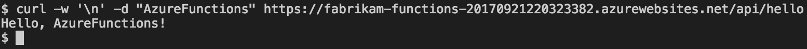

# Create your first function with Java and Maven (Preview)

[!INCLUDE [functions-java-preview-note](../../includes/functions-java-preview-note.md)]

This quickstart guides through creating a [serverless](https://azure.microsoft.com/solutions/serverless/) function project with Maven, testing it locally, and deploying it to Azure Functions. When you're done, you have a HTTP-triggered function app running in Azure.



[!INCLUDE [quickstarts-free-trial-note](../../includes/quickstarts-free-trial-note.md)]

## Prerequisites
To develop functions app with Java, you must have the following installed:

-  [Java Developer Kit](https://www.azul.com/downloads/zulu/), version 8.
-  [Apache Maven](https://maven.apache.org), version 3.0 or above.
-  [Azure CLI](https://docs.microsoft.com/cli/azure)

> [!IMPORTANT] 
> The JAVA_HOME environment variable must be set to the install location of the JDK to complete this quickstart.

## Install the Azure Functions Core Tools

The Azure Functions Core Tools provide a local development environment for writing, running, and debugging Azure Functions from the terminal or command prompt. 

Install [version 2 of the Core Tools](functions-run-local.md#v2) on your local computer before continuing.

## Generate a new Functions project

In an empty folder, run the following command to generate the Functions project from a [Maven archetype](https://maven.apache.org/guides/introduction/introduction-to-archetypes.html).

### Linux/MacOS

```bash
mvn archetype:generate \
    -DarchetypeGroupId=com.microsoft.azure \
	-DarchetypeArtifactId=azure-functions-archetype 
```

### Windows (CMD)
```cmd
mvn archetype:generate ^
	-DarchetypeGroupId=com.microsoft.azure ^
	-DarchetypeArtifactId=azure-functions-archetype
```

Maven will ask you for values needed to finish generating the project. For _groupId_, _artifactId_, and _version_ values, see the [Maven naming conventions](https://maven.apache.org/guides/mini/guide-naming-conventions.html) reference. The _appName_ value must be unique across Azure, so Maven generates an app name based on the previously entered _artifactId_  as a default. The _packageName_ value determines the Java package for the generated function code.

The `appRegion` value specifies which [Azure region](https://azure.microsoft.com/global-infrastructure/regions/) you want to run the deployed Function app in. You can get a list of region name values through the `az account list-locations` command in the Azure CLI. The `resourceGroup` value specifies which Azure resource group the function app will be created in.

The `com.fabrikam.functions` and `fabrikam-functions` identifiers below are used as an example and to make later steps in this quickstart easier to read. You are encouraged to supply your own values to Maven in this step.

```Output
Define value for property 'groupId': com.fabrikam.functions
Define value for property 'artifactId' : fabrikam-functions
Define value for property 'version' 1.0-SNAPSHOT : 
Define value for property 'package': com.fabrikam.functions
Define value for property 'appName' fabrikam-functions-20170927220323382:
Define value for property 'appRegion' westus : 
Define value for property 'resourceGroup' java-functions-group: 
Confirm properties configuration: Y
```

Maven creates the project files in a new folder with a name of _artifactId_, in this example `fabrikam-functions`. The ready to run generated code in the project is a simple [HTTP triggered](/azure/azure-functions/functions-bindings-http-webhook) function that echoes the body of the request after a "Hello, " string.

```java
public class Function {
    @FunctionName("HttpTrigger-Java")
    public HttpResponseMessage HttpTriggerJava(
    @HttpTrigger(name = "req", methods = {HttpMethod.GET, HttpMethod.POST}, authLevel = AuthorizationLevel.ANONYMOUS) HttpRequestMessage<Optional<String>> request,final ExecutionContext context) {
        context.getLogger().info("Java HTTP trigger processed a request.");

        // Parse query parameter
        String query = request.getQueryParameters().get("name");
        String name = request.getBody().orElse(query);

        if (name == null) {
            return request.createResponseBuilder(HttpStatus.BAD_REQUEST).body("Please pass a name on the query string or in the request body").build();
        } else {
            return request.createResponseBuilder(HttpStatus.OK).body("Hello, " + name).build();
        }
    }
}
```

## Run the function locally

Change directory to the newly created project folder and build and run the function with Maven:

```
cd fabrikam-functions
mvn clean package 
mvn azure-functions:run
```

> [!NOTE]
> If you're experiencing this exception: `javax.xml.bind.JAXBException` with Java 9, see the workaround on [GitHub](https://github.com/jOOQ/jOOQ/issues/6477).

You see this output when the function is running locally on your system and ready to respond to HTTP requests:

```Output
Listening on http://0.0.0.0:7071/
Hit CTRL-C to exit...

Http Functions:

        HttpTrigger-Java: http://localhost:7071/api/HttpTrigger-Java
```

Trigger the function from the command line using curl in a new terminal window:

```
curl -w '\n' -d LocalFunctionTest http://localhost:7071/api/HttpTrigger-Java
```

```Output
Hello, LocalFunctionTest
```

Use `Ctrl-C` in the terminal to stop the function code.

## Deploy the function to Azure

The deploy process to Azure Functions uses account credentials from the Azure CLI. [Log in with the Azure CLI](/cli/azure/authenticate-azure-cli?view=azure-cli-latest) before continuing.

```azurecli
az login
```

Deploy your code into a new Function app using the `azure-functions:deploy` Maven target.

```
mvn azure-functions:deploy
```

When the deploy is complete, you see the URL you can use to access your Azure function app:

```output
[INFO] Successfully deployed Function App with package.
[INFO] Deleting deployment package from Azure Storage...
[INFO] Successfully deleted deployment package fabrikam-function-20170920120101928.20170920143621915.zip
[INFO] Successfully deployed Function App at https://fabrikam-function-20170920120101928.azurewebsites.net
[INFO] ------------------------------------------------------------------------
```

Test the function app running on Azure using `cURL`. You'll need to change the URL from the sample below to match the deployed URL for your own function app from the previous step.

```
curl -w '\n' -d AzureFunctionsTest https://fabrikam-functions-20170920120101928.azurewebsites.net/api/HttpTrigger-Java
```

```Output
Hello, AzureFunctionsTest
```

## Make changes and redeploy

Edit the `src/main.../Function.java` source file in the generated project to alter the text returned by your Function app. Change this line:

```java
return request.createResponse(200, "Hello, " + name);
```

To the following:

```java
return request.createResponse(200, "Hi, " + name);
```

Save the changes and redeploy by running `azure-functions:deploy` from the terminal as before. The function app will be updated and this request:

```bash
curl -w '\n' -d AzureFunctionsTest https://fabrikam-functions-20170920120101928.azurewebsites.net/api/HttpTrigger-Java
```

Will have updated output:

```Output
Hi, AzureFunctionsTest
```

## Next steps

You've created a Java function app with a simple HTTP trigger and deployed it to Azure Functions.

- Review the  [Java Functions developer guide](functions-reference-java.md) for more information on developing Java functions.
- Add additional functions with different triggers to your project using the `azure-functions:add` Maven target.
- Write and debug functions locally with [Visual Studio Code](https://code.visualstudio.com/docs/java/java-azurefunctions), [IntelliJ](functions-create-maven-intellij.md), and [Eclipse](functions-create-maven-eclipse.md). 
- Debug functions deployed in Azure with Visual Studio Code. See the Visual Studio Code [serverless Java applications](https://code.visualstudio.com/docs/java/java-serverless#_remote-debug-functions-running-in-the-cloud) documentation for instructions.
