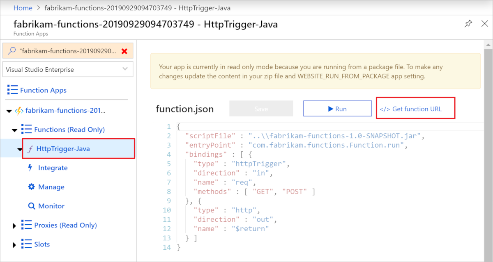

# Quickstart: Use Java and Maven/Gradle to create and publish a function to Azure

This article shows you how to build and publish a Java function to Azure Functions with the Maven/Gradle command-line tool. When you're done, your function code runs in Azure in a [serverless hosting plan](functions-scale.md#consumption-plan) and is triggered by an HTTP request.

<!--
> [!NOTE] 
> You can also create a Kotlin-based Azure Functions project by using the azure-functions-kotlin-archetype instead. Visit the [GitHub repository](https://github.com/microsoft/azure-maven-archetypes/tree/develop/azure-functions-kotlin-archetype) for more information.
-->

## Prerequisites

To develop functions using Java, you must have the following installed:

- [Java Developer Kit](https://aka.ms/azure-jdks), version 8
- [Azure CLI]
- [Azure Functions Core Tools](./functions-run-local.md#v2) version 2.6.666 or above
::: zone pivot="java-build-tools-maven" 
- [Apache Maven](https://maven.apache.org), version 3.0 or above
::: zone-end

::: zone pivot="java-build-tools-gradle"  
- [Gradle](https://gradle.org/), version 4.10 and above
::: zone-end 

You also need an active Azure subscription. [!INCLUDE [quickstarts-free-trial-note](../../includes/quickstarts-free-trial-note.md)]


> [!IMPORTANT]
> The JAVA_HOME environment variable must be set to the install location of the JDK to complete this quickstart.

## Prepare a Functions project

::: zone pivot="java-build-tools-maven" 
In an empty folder, run the following command to generate the Functions project from a [Maven archetype](https://maven.apache.org/guides/introduction/introduction-to-archetypes.html).

```bash
mvn archetype:generate -DarchetypeGroupId=com.microsoft.azure -DarchetypeArtifactId=azure-functions-archetype 
```

> [!NOTE]
> If you're using Powershell, remeber to add "" around parameters.

> [!NOTE]
> If you're experiencing issues with running the command, take a look at what `maven-archetype-plugin` version is used. Because you are running the command in an empty directory with no `.pom` file, it might be attempting to use a plugin of the older version from `~/.m2/repository/org/apache/maven/plugins/maven-archetype-plugin` if you upgraded your Maven from an older version. If so, try deleting the `maven-archetype-plugin` directory and re-running the command.

Maven asks you for values needed to finish generating the project on deployment. Provide the following values when prompted:

| Value | Description |
| ----- | ----------- |
| **groupId** | A value that uniquely identifies your project across all projects, following the [package naming rules](https://docs.oracle.com/javase/specs/jls/se6/html/packages.html#7.7) for Java. The examples in this quickstart use `com.fabrikam.functions`. |
| **artifactId** | A value that is the name of the jar, without a version number. The examples in this quickstart use `fabrikam-functions`. |
| **version** | Choose the default value of `1.0-SNAPSHOT`. |
| **package** | A value that is the Java package for the generated function code. Use the default. The examples in this quickstart use `com.fabrikam.functions`. |

Type `Y` or press Enter to confirm.

Maven creates the project files in a new folder with a name of **artifactId**, which in this example is `fabrikam-functions`. Run the following command to change the directory to the created project folder.
```bash
cd fabrikam-function
```

::: zone-end 
::: zone pivot="java-build-tools-gradle"
Use the following command to clone the sample project:

```bash
git clone https://github.com/Azure-Samples/azure-functions-samples-java.git
cd azure-functions-samples-java/
```

Open `build.gradle` and change the `appName` in the following section to a unique name to avoid domain name conflict when deploying to Azure. 

```gradle
azurefunctions {
    resourceGroup = 'java-functions-group'
    appName = 'azure-functions-sample-demo'
    pricingTier = 'Consumption'
    region = 'westus'
    runtime {
      os = 'windows'
    }
    localDebug = "transport=dt_socket,server=y,suspend=n,address=5005"
}
```
::: zone-end

Open the new Function.java file from the *src/main/java* path in a text editor and review the generated code. This code is an [HTTP triggered](functions-bindings-http-webhook.md) function that echoes the body of the request. 

> [!div class="nextstepaction"]
> [I ran into an issue](https://www.research.net/r/javae2e?tutorial=functions-maven-quickstart&step=generate-project)

## Run the function locally

Run the following command to build then run the function project:

::: zone pivot="java-build-tools-maven" 
```bash
mvn clean package 
mvn azure-functions:run
```
::: zone-end 

::: zone pivot="java-build-tools-gradle"  
```bash
gradle jar --info
gradle azureFunctionsRun
```
::: zone-end 

You will see output like the following from Azure Functions Core Tools when you run the project locally:

```output
...

Now listening on: http://0.0.0.0:7071
Application started. Press Ctrl+C to shut down.

Http Functions:

    HttpExample: [GET,POST] http://localhost:7071/api/HttpExample
...
```

Trigger the function from the command line using cURL in a new terminal window:

```bash
curl -w "\n" http://localhost:7071/api/HttpExample --data AzureFunctions
```

```output
Hello AzureFunctions!
```
The [function key](functions-bindings-http-webhook-trigger.md#authorization-keys) isn't required when running locally. Use `Ctrl+C` in the terminal to stop the function code.

> [!div class="nextstepaction"]
> [I ran into an issue](https://www.research.net/r/javae2e?tutorial=functions-maven-quickstart&step=local-run)

## Deploy the function to Azure

A function app and related resources are created in Azure when you first deploy your function app. Before you can deploy, use the [az login](/cli/azure/authenticate-azure-cli) Azure CLI command to sign in to your Azure subscription. 

```azurecli
az login
```

> [!TIP]
> If your account can access multiple subscriptions, use [az account set](/cli/azure/account#az-account-set) to set the default subscription for this session. 

Use the following command to deploy your project to a new function app. 


::: zone pivot="java-build-tools-maven" 
```bash
mvn azure-functions:deploy
```
::: zone-end 

::: zone pivot="java-build-tools-gradle"  
```bash
gradle azureFunctionsDeploy
```
::: zone-end

This will create the following resources in Azure:

+ Resource group. Named with the _resourceGroup_ you supplied.
+ Storage account. Required by Functions. The name is generated randomly based on Storage account name requirements.
+ App service plan. Serverless hosting for your function app in the specified _appRegion_. The name is generated randomly.
+ Function app. A function app is the deployment and execution unit for your functions. The name is your _appName_, appended with a randomly generated number. 

The deployment also packages the project files and deploys them to the new function app using [zip deployment](functions-deployment-technologies.md#zip-deploy), with run-from-package mode enabled.

After the deployment completes, you see the URL you can use to access your function app endpoints. Because the HTTP trigger we published uses `authLevel = AuthorizationLevel.FUNCTION`, you need to get the function key to call the function endpoint over HTTP. The easiest way to get the function key is from the [Azure portal].

> [!div class="nextstepaction"]
> [I ran into an issue](https://www.research.net/r/javae2e?tutorial=functions-maven-quickstart&step=deploy)

## Get the HTTP trigger URL

<!--- We can updates this to remove portal dependency after the Maven archetype returns the full URLs with keys on publish (https://github.com/microsoft/azure-maven-plugins/issues/571). -->

You can get the URL required to trigger your function, with the function key, from the Azure portal. 

1. Browse to the [Azure portal], sign in, type the _appName_ of your function app into **Search** at the top of the page, and press enter.
 
1. In your function app, expand **Functions (Read Only)**, choose your function, then select **</> Get function URL** at the top right. 

    

1. Choose **default (Function key)** and select **Copy**. 

You can now use the copied URL to access your function.

## Verify the function in Azure

To verify the function app running on Azure using `cURL`, replace the URL from the sample below with the URL that you copied from the portal.

```console
curl -w "\n" https://fabrikam-functions-20190929094703749.azurewebsites.net/api/HttpExample?code=zYRohsTwBlZ68YF.... --data AzureFunctions
```

This sends a POST request to the function endpoint with `AzureFunctions` in the body of the request. You see the following response.

```output
Hello AzureFunctions!
```

> [!div class="nextstepaction"]
> [I ran into an issue](https://www.research.net/r/javae2e?tutorial=functions-maven-quickstart&step=verify-deployment)

## Next steps

You've created a Java functions project with an HTTP triggered function, run it on your local machine, and deployed it to Azure. Now, extend your function by...

> [!div class="nextstepaction"]
> [Adding an Azure Storage queue output binding](functions-add-output-binding-storage-queue-java.md)


[Azure CLI]: /cli/azure
[Azure portal]: https://portal.azure.com
