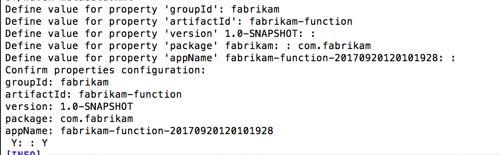
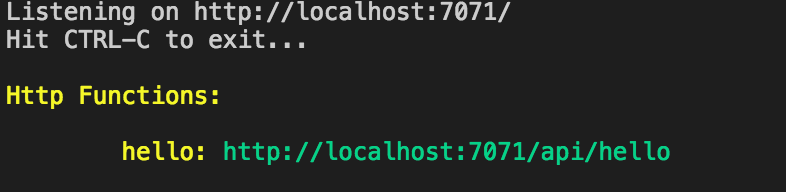
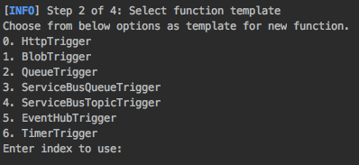

# Create your first function with Java and Maven (Preview)

This quickstart guides through creating a serverless function project with Maven, testing it locally, and deploying it to Azure Functions. When you're done, you have a HTTP-triggered function running in Azure.


[!INCLUDE [quickstarts-free-trial-note](../../includes/quickstarts-free-trial-note.md)]

## Prerequisites

-  [.NET Core](https://www.microsoft.com/net/core) , latest version.
-  [Java Developer Kit](https://www.azul.com/downloads/zulu/), version 1.8.
-  [Azure CLI](https://docs.microsoft.com/cli/azure)
-  [Apache Maven](https://maven.apache.org) , version 3.0 or above.
-  [Azure Functions Core Tools](/azure/azure-functions/functions-run-local#install-the-azure-functions-core-tools) 2.0 or higher.
   
## Configure Maven

To create a new Functions project with Maven, you first need to configure Maven to generate the project from a [Maven archetype](https://maven.apache.org/guides/introduction/introduction-to-archetypes.html). Update your Maven [settings](https://maven.apache.org/settings.html) to add the Azure Functions archetype repository:

```XML
<profile>
    <id>azure-functions-private-preview</id>
    <activation>
		<activeByDefault>true</activeByDefault>
    </activation>
    <repositories>
		<repository>
		    <id>archetype</id>
		    <url>https://www.myget.org/F/azure-function/maven/</url>
		    <releases>
		        <enabled>true</enabled>
		    </releases>
		    <snapshots>
		        <enabled>true</enabled>
		    </snapshots>
		</repository>
    </repositories>
</profile>
```

## Generate a new Functions project

In an empty folder, run the following command to generate the Functions project:

```bash
mvn archetype:generate \
    -DarchetypeGroupId=com.microsoft.azure \
	-DarchetypeArtifactId=azure-functions-archetype \
    -DarchetypeVersion=1.0-SNAPSHOT
```

Maven prompts you for values needed to finish generating the project. For _groupId_, _artifactId_, and _version_ values, see the [Maven naming conventions](https://maven.apache.org/guides/mini/guide-naming-conventions.html) reference. The _appName_ value must be unique across Azure, so it generated an app name based on the previously entered _artifactId_  as a default. The _packageName_ value determines what Java package the generated code in the project uses.



Maven generates the project files in a new folder under the current one named after the _appName_ value used when configuring the project. The generated code in the project is a simple [HTTP triggered](/azure/azure-functions/functions-bindings-http-webhook) function that echoes back the body of the request:

```java
public class Function {
    @FunctionName("hello")
    public String hello(@HttpTrigger(name = "req", methods = {"get", "post"}, authLevel = AuthorizationLevel.ANONYMOUS) String req,
                        ExecutionContext context) {
        return String.format("Hello, %s!", req);
    }
}
```

## Run the function locally

Change directory to the newly created project folder and build and run the function with Maven:

```bash
cd fabrikam-function
mvn clean package azure-functions:run
```

You see this output when the function is running:



Trigger the function from the command line using curl in a new terminal:

```bash
curl -w '\n' -d LocalFunction http://localhost:7071/api/hello
```

```Output
Hello LocalFunction!
```

Use `Ctrl+C` in the terminal to stop the function code.

## Deploy the function to Azure

The deploy process to Azure Functions uses account credentials from the Azure CLI. [Log in with the Azure CLI](/cli/azure/authenticate-azure-cli?view=azure-cli-latest) and then deploy your code into a new Function app using the `azure-functions:deploy` Maven target.

```bash
az login
mvn azure-fuctions:deploy
```

When the deploy is complete, you see the URL you can use to access your Azure function app:

```output
[INFO] Successfully deployed Function App with package.
[INFO] Deleting deployment package from Azure Storage...
[INFO] Successfully deleted deployment package fabrikam-function-20170920120101928.20170920143621915.zip
[INFO] Successfully deployed Function App at https://fabrikam-function-20170920120101928.azurewebsites.net
[INFO] ------------------------------------------------------------------------
```

Test the function running on Azure using curl:

```bash
curl https://fabrikam-function-20170920120101928.azurewebsites.net/api/hello -d AzureFunctions
```

```Output
Hello AzureFunctions!
```

## Next steps

You have created a Java function app with a simple HTTP trigger. 


- Add additional functions with different triggers to your project using the `azure-functions:add` Maven target.

   

- [Java Functions developer guide](functions-reference-java.md)
- [Java Functions annotation reference](https://github.com/Azure/azure-functions-java-worker/tree/documentation/azure-functions-java-core)


