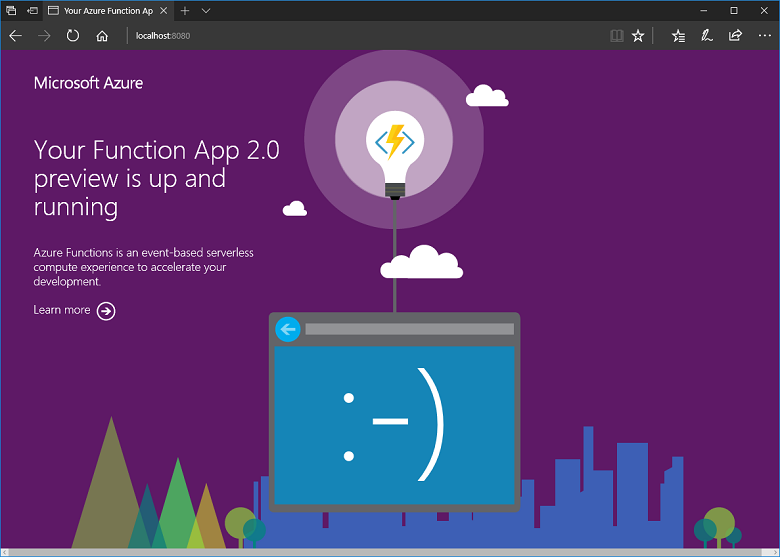
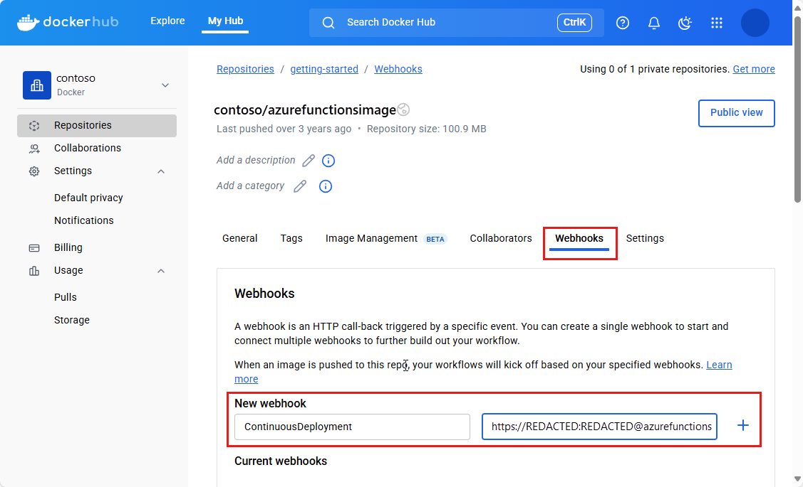

# Create a function on Linux using a custom image

Azure Functions lets you host your functions on Linux in your own custom container. You can also [host on a default Azure App Service container](functions-create-first-azure-function-azure-cli-linux.md). This functionality requires [the Functions 2.x runtime](functions-versions.md).

In this tutorial, you learn how to deploy your functions to Azure as a custom Docker image. This pattern is useful when you need to customize the built-in App Service container image. You may want to use a custom image when your functions need a specific language version or require a specific dependency or configuration that isn't provided within the built-in image. Supported base images for Azure Functions are found in the [Azure Functions base images repo](https://hub.docker.com/_/microsoft-azure-functions-base). [Python support](functions-reference-python.md) is in preview at this time.

This tutorial walks you through how to use Azure Functions Core Tools to create a function in a custom Linux image. You publish this image to a function app in Azure, which was created using the Azure CLI.

In this tutorial, you learn how to:

> [!div class="checklist"]
> * Create a function app and Dockerfile using Core Tools.
> * Build a custom image using Docker.
> * Publish a custom image to a container registry.
> * Create an Azure Storage account.
> * Create a Linux App Service plan.
> * Deploy a function app from Docker Hub.
> * Add application settings to the function app.
> * Enable continuous deployment

The following steps are supported on a Mac, Windows, or Linux computer.  

## Prerequisites

Before running this sample, you must have the following:

* Install [Azure Core Tools version 2.x](functions-run-local.md#v2).

* Install the [Azure CLI]( /cli/azure/install-azure-cli). This article requires the Azure CLI version 2.0 or later. Run `az --version` to find the version you have.  
You can also use the [Azure Cloud Shell](https://shell.azure.com/bash).

* An active Azure subscription.

[!INCLUDE [quickstarts-free-trial-note](../../includes/quickstarts-free-trial-note.md)]

## Create the local function app project

Run the following command from the command line to create a function app project in the `MyFunctionProj` folder of the current local directory.

```bash
func init MyFunctionProj --docker
```

When you include the `--docker` option, a dockerfile is generated for the project. This file is used to create a custom container in which to run the project. The base image used depends on the worker runtime language chosen.  

When prompted, choose a worker runtime from the following languages:

* `dotnet`: creates a .NET class library project (.csproj).
* `node`: creates a JavaScript project.
* `python`: creates a Python project.

[!INCLUDE [functions-python-preview-note](../../includes/functions-python-preview-note.md)]

When the command executes, you see something like the following output:

```output
Writing .gitignore
Writing host.json
Writing local.settings.json
Writing Dockerfile
```

Use the following command to navigate to the new `MyFunctionProj` project folder.

```bash
cd MyFunctionProj
```

[!INCLUDE [functions-create-function-core-tools](../../includes/functions-create-function-core-tools.md)]

[!INCLUDE [functions-update-function-code](../../includes/functions-update-function-code.md)]

[!INCLUDE [functions-run-function-test-local](../../includes/functions-run-function-test-local.md)]

## Build the image from the Docker file

Take a look at the _Dockerfile_ in the root folder of the project. This file describes the environment that is required to run the function app on Linux. The following example is a Dockerfile that creates a container that runs a function app on the JavaScript (Node.js) worker runtime: 

```Dockerfile
FROM mcr.microsoft.com/azure-functions/node:2.0

ENV AzureWebJobsScriptRoot=/home/site/wwwroot
COPY . /home/site/wwwroot
```

> [!NOTE]
> The complete list of supported base images for Azure Functions can be found in the [Azure Functions base image page](https://hub.docker.com/_/microsoft-azure-functions-base).

### Run the `build` command
In the root folder, run the [docker build](https://docs.docker.com/engine/reference/commandline/build/) command, and provide a name, `mydockerimage`, and tag, `v1.0.0`. Replace `<docker-id>` with your Docker Hub account ID. This command builds the Docker image for the container.

```bash
docker build --tag <docker-id>/mydockerimage:v1.0.0 .
```

When the command executes, you see something like the following output, which in this case is for a JavaScript worker runtime:

```bash
Sending build context to Docker daemon  17.41kB
Step 1/3 : FROM mcr.microsoft.com/azure-functions/node:2.0
2.0: Pulling from azure-functions/node
802b00ed6f79: Pull complete
44580ea7a636: Pull complete
73eebe8d57f9: Pull complete
3d82a67477c2: Pull complete
8bd51cd50290: Pull complete
7bd755353966: Pull complete
Digest: sha256:480e969821e9befe7c61dda353f63298f2c4b109e13032df5518e92540ea1d08
Status: Downloaded newer image for mcr.microsoft.com/azure-functions/node:2.0
 ---> 7c71671b838f
Step 2/3 : ENV AzureWebJobsScriptRoot=/home/site/wwwroot
 ---> Running in ed1e5809f0b7
Removing intermediate container ed1e5809f0b7
 ---> 39d9c341368a
Step 3/3 : COPY . /home/site/wwwroot
 ---> 5e196215935a
Successfully built 5e196215935a
Successfully tagged <docker-id>/mydockerimage:v1.0.0
```

### Test the image locally
Verify that the image you built works by running the Docker image in a local container. Issue the [docker run](https://docs.docker.com/engine/reference/commandline/run/) command and pass the name and tag of the image to it. Be sure to specify the port using the `-p` argument.

```bash
docker run -p 8080:80 -it <docker-ID>/mydockerimage:v1.0.0
```

With the custom image running in a local Docker container, verify the function app and container are functioning correctly by browsing to <http://localhost:8080>.



You can optionally test your function again, this time in the local container using the following URL:

`http://localhost:8080/api/myhttptrigger?name=<yourname>`

After you have verified the function app in the container, stop the execution. Now, you can push the custom image to your Docker Hub account.

## Push the custom image to Docker Hub

A registry is an application that hosts images and provides services image and container services. To share your image, you must push it to a registry. Docker Hub is a registry for Docker images that allows you to host your own repositories, either public or private.

Before you can push an image, you must sign in to Docker Hub using the [docker login](https://docs.docker.com/engine/reference/commandline/login/) command. Replace `<docker-id>` with your account name and type in your password into the console at the prompt. For other Docker Hub password options, see the [docker login command documentation](https://docs.docker.com/engine/reference/commandline/login/).

```bash
docker login --username <docker-id>
```

A "login succeeded" message confirms that you are logged in. After you have signed in, you push the image to Docker Hub by using the [docker push](https://docs.docker.com/engine/reference/commandline/push/) command.

```bash
docker push <docker-id>/mydockerimage:v1.0.0
```

Verify that the push succeeded by examining the command's output.

```bash
The push refers to a repository [docker.io/<docker-id>/mydockerimage:v1.0.0]
24d81eb139bf: Pushed
fd9e998161c9: Mounted from <docker-id>/mydockerimage
e7796c35add2: Mounted from <docker-id>/mydockerimage
ae9a05b85848: Mounted from <docker-id>/mydockerimage
45c86e20670d: Mounted from <docker-id>/mydockerimage
v1.0.0: digest: sha256:be080d80770df71234eb893fbe4d... size: 1796
```

Now, you can use this image as the deployment source for a new function app in Azure.

[!INCLUDE [functions-create-resource-group](../../includes/functions-create-resource-group.md)]

[!INCLUDE [functions-create-storage-account](../../includes/functions-create-storage-account.md)]

## Create a Linux App Service plan

Linux hosting for Functions is currently not supported on consumption plans. You have to host Linux container apps in a Linux App Service plan. To learn more about hosting, see [Azure Functions hosting plans comparison](functions-scale.md).

[!INCLUDE [app-service-plan-no-h](../../includes/app-service-web-create-app-service-plan-linux-no-h.md)]

## Create and deploy the custom image

The function app hosts the execution of your functions. Create a function app from a Docker Hub image by using the [az functionapp create](/cli/azure/functionapp#az-functionapp-create) command.

In the following command, substitute a unique function app name where you see the `<app_name>` placeholder and the storage account name for  `<storage_name>`. The `<app_name>` is used as the default DNS domain for the function app, and so the name needs to be unique across all apps in Azure. As before, `<docker-id>` is your Docker account name.

```azurecli-interactive
az functionapp create --name <app_name> --storage-account  <storage_name>  --resource-group myResourceGroup \
--plan myAppServicePlan --deployment-container-image-name <docker-id>/mydockerimage:v1.0.0
```

After the function app has been created, the Azure CLI shows information similar to the following example:

```json
{
  "availabilityState": "Normal",
  "clientAffinityEnabled": true,
  "clientCertEnabled": false,
  "containerSize": 1536,
  "dailyMemoryTimeQuota": 0,
  "defaultHostName": "quickstart.azurewebsites.net",
  "enabled": true,
  "enabledHostNames": [
    "quickstart.azurewebsites.net",
    "quickstart.scm.azurewebsites.net"
  ],
   ....
    // Remaining output has been truncated for readability.
}
```

The _deployment-container-image-name_ parameter indicates the image hosted on Docker Hub to use to create the function app. Use the [az functionapp config container show](/cli/azure/functionapp/config/container#az-functionapp-config-container-show) command to view information about the image used for deployment. Use the [az functionapp config container set](/cli/azure/functionapp/config/container#az-functionapp-config-container-set) command to deploy from a different image.

## Configure the function app

The function needs the connection string to connect to the default storage account. When you are publishing your custom image to a private container account, you should instead set these application settings as environment variables in the Dockerfile using the [ENV instruction](https://docs.docker.com/engine/reference/builder/#env), or something similar.

In this case, `<storage_name>` is the name of the storage account you created. Get the connection string with the [az storage account show-connection-string](/cli/azure/storage/account) command. Add these application settings in the function app with the [az functionapp config appsettings set](/cli/azure/functionapp/config/appsettings#az-functionapp-config-appsettings-set) command.

```azurecli-interactive
storageConnectionString=$(az storage account show-connection-string \
--resource-group myResourceGroup --name <storage_name> \
--query connectionString --output tsv)

az functionapp config appsettings set --name <app_name> \
--resource-group myResourceGroup \
--settings AzureWebJobsDashboard=$storageConnectionString \
AzureWebJobsStorage=$storageConnectionString
```

> [!NOTE]
> If your container is private, you would have to set the following application settings as well  
> - DOCKER_REGISTRY_SERVER_USERNAME  
> - DOCKER_REGISTRY_SERVER_PASSWORD  
>
> You will have to stop and then start your function app for these values to be picked up

You can now test your functions running on Linux in Azure.

[!INCLUDE [functions-test-function-code](../../includes/functions-test-function-code.md)]

## Enable Application Insights

The recommended way to monitor the execution of your functions is by integrating your function app with Azure Application Insights. When you create a function app in the Azure portal, this integration is done for you by default. However, when you create your function app by using the Azure CLI, the integration in your function app in Azure isn't done.

To enable Application Insights for your function app:

[!INCLUDE [functions-connect-new-app-insights.md](../../includes/functions-connect-new-app-insights.md)]

To learn more, see [Monitor Azure Functions](functions-monitoring.md).

## Enable continuous deployment

One of the benefits of using containers is being able to automatically deploy updates when containers are updated in the registry. Enable continuous deployment with the [az functionapp deployment container config](/cli/azure/functionapp/deployment/container#az-functionapp-deployment-container-config) command.

```azurecli-interactive
az functionapp deployment container config --enable-cd \
--query CI_CD_URL --output tsv \
--name <app_name> --resource-group myResourceGroup
```

This command returns the deployment webhook URL after continuous deployment is enabled. You can also use the [az functionapp deployment container show-cd-url](/cli/azure/functionapp/deployment/container#az-functionapp-deployment-container-show-cd-url) command to return this URL. 

Copy the deployment URL and browse to your DockerHub repo, choose the **Webhooks** tab, type a **Webhook name** for the webhook, paste your URL in **Webhook URL**, and then choose the plus sign (**+**).

  

With the webhook set, any updates to the linked image in DockerHub result in the function app downloading and installing the latest image.

[!INCLUDE [functions-cleanup-resources](../../includes/functions-cleanup-resources.md)]

## Next steps

In this tutorial, you learned how to:

> [!div class="checklist"]
> * Create a function app and Dockerfile using Core Tools.
> * Build a custom image using Docker.
> * Publish a custom image to a container registry.
> * Create an Azure Storage account.
> * Create a Linux App Service plan.
> * Deploy a function app from Docker Hub.
> * Add application settings to the function app.

Learn how to enable continuous integration functionality built into the core App Service platform. You can configure your function app so that the container is redeployed when you update your image in Docker Hub.

> [!div class="nextstepaction"] 
> [Continuous deployment with Web App for Containers](../app-service/containers/app-service-linux-ci-cd.md)
