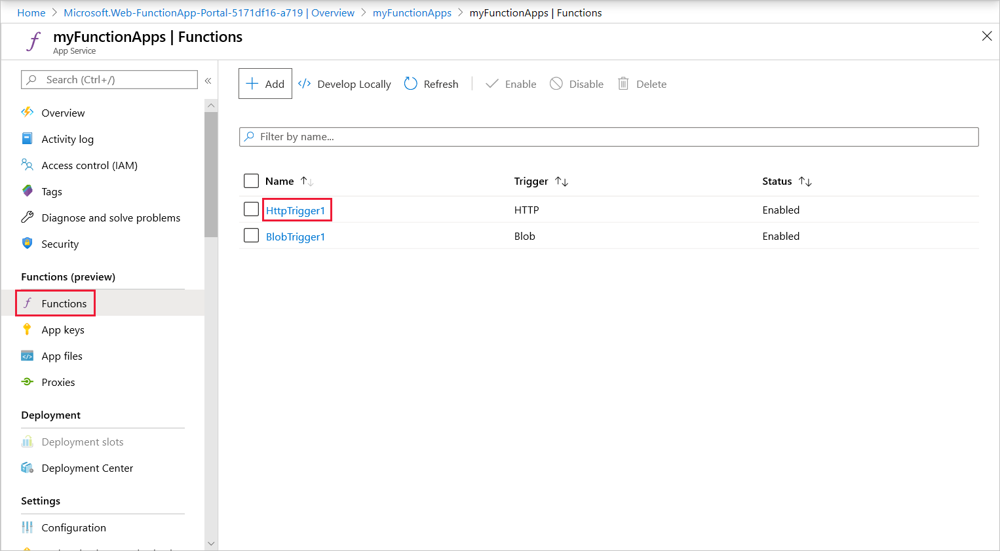
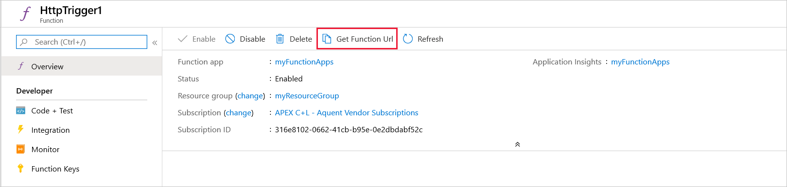
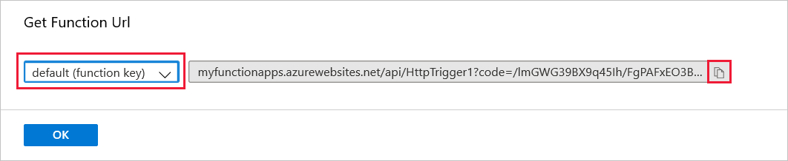
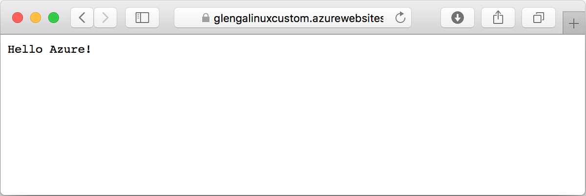
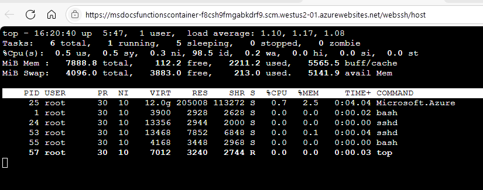

# Create a function on Linux using a custom container

In this tutorial, you create and deploy your code to Azure Functions as a custom Docker container using a Linux base image. You typically use a custom image when your functions require a specific language version or have a specific dependency or configuration that isn't provided by the built-in image.

You can also use a default Azure App Service container as described on [Create your first function hosted on Linux](functions-create-first-azure-function-azure-cli-linux.md). Supported base images for Azure Functions are found in the [Azure Functions base images repo](https://hub.docker.com/_/microsoft-azure-functions-base).

In this tutorial, you learn how to:

> [!div class="checklist"]
> * Create a function app and Dockerfile using the Azure Functions Core Tools.
> * Build a custom image using Docker.
> * Publish a custom image to a container registry.
> * Create supporting resources in Azure for the function app
> * Deploy a function app from Docker Hub.
> * Add application settings to the function app.
> * Enable continuous deployment.
> * Enable SSH connections to the container.
> * Add a Queue storage output binding. 

You can follow this tutorial on any computer running Windows, macOS, or Linux. Completing the tutorial will incur costs of a few US dollars in your Azure account.

[!INCLUDE [functions-requirements-cli](../../includes/functions-requirements-cli.md)]

<!---Requirements specific to Docker --->
+ [Docker](https://docs.docker.com/install/)  

+ A [Docker ID](https://hub.docker.com/signup)

[!INCLUDE [functions-cli-verify-prereqs](../../includes/functions-cli-verify-prereqs.md)]

+ Run `docker login` to sign in to Docker. This command fails if Docker isn't running, in which case start docker and retry the command.

[!INCLUDE [functions-cli-create-venv](../../includes/functions-cli-create-venv.md)]

## Create and test the local functions project

::: zone pivot="programming-language-csharp,programming-language-javascript,programming-language-typescript,programming-language-powershell,programming-language-python"  
In a terminal or command prompt, run the following command for your chosen language to create a function app project in a folder named `LocalFunctionsProject`.  
::: zone-end  
::: zone pivot="programming-language-csharp"  
```
func init LocalFunctionsProject --worker-runtime dotnet --docker
```
::: zone-end  
::: zone pivot="programming-language-javascript"  
```
func init LocalFunctionsProject --worker-runtime node --language javascript --docker
```
::: zone-end  
::: zone pivot="programming-language-powershell"  
```
func init LocalFunctionsProject --worker-runtime powershell --docker
```
::: zone-end  
::: zone pivot="programming-language-python"  
```
func init LocalFunctionsProject --worker-runtime python --docker
```
::: zone-end  
::: zone pivot="programming-language-typescript"  
```
func init LocalFunctionsProject --worker-runtime node --language typescript --docker
```
::: zone-end
::: zone pivot="programming-language-java"  
In an empty folder, run the following command to generate the Functions project from a [Maven archetype](https://maven.apache.org/guides/introduction/introduction-to-archetypes.html).

# [bash](#tab/bash)
```bash
mvn archetype:generate -DarchetypeGroupId=com.microsoft.azure -DarchetypeArtifactId=azure-functions-archetype -Ddocker
```
# [PowerShell](#tab/powershell)
```powershell
mvn archetype:generate "-DarchetypeGroupId=com.microsoft.azure" "-DarchetypeArtifactId=azure-functions-archetype" "-Ddocker"
```
# [Cmd](#tab/cmd)
```cmd
mvn archetype:generate "-DarchetypeGroupId=com.microsoft.azure" "-DarchetypeArtifactId=azure-functions-archetype" "-Ddocker"
```
---

Maven asks you for values needed to finish generating the project on deployment.   
Provide the following values when prompted:

| Prompt | Value | Description |
| ------ | ----- | ----------- |
| **groupId** | `com.fabrikam` | A value that uniquely identifies your project across all projects, following the [package naming rules](https://docs.oracle.com/javase/specs/jls/se6/html/packages.html#7.7) for Java. |
| **artifactId** | `fabrikam-functions` | A value that is the name of the jar, without a version number. |
| **version** | `1.0-SNAPSHOT` | Choose the default value. |
| **package** | `com.fabrikam.functions` | A value that is the Java package for the generated function code. Use the default. |

Type `Y` or press Enter to confirm.

Maven creates the project files in a new folder with a name of _artifactId_, which in this example is `fabrikam-functions`. 
::: zone-end
The `--docker` option generates a `Dockerfile` for the project, which defines a suitable custom container for use with Azure Functions and the selected runtime.

Navigate into the project folder:
::: zone pivot="programming-language-csharp,programming-language-javascript,programming-language-typescript,programming-language-powershell,programming-language-python"  
```
cd LocalFunctionsProject
```
::: zone-end  
::: zone pivot="programming-language-java"  
```
cd fabrikam-functions
```
::: zone-end  
::: zone pivot="programming-language-csharp,programming-language-javascript,programming-language-typescript,programming-language-powershell,programming-language-python" 
Add a function to your project by using the following command, where the `--name` argument is the unique name of your function and the `--template` argument specifies the function's trigger. `func new` create a subfolder matching the function name that contains a code file appropriate to the project's chosen language and a configuration file named *function.json*.

```
func new --name HttpExample --template "HTTP trigger"
```
::: zone-end  
To test the function locally, start the local Azure Functions runtime host in the root of the project folder: 
::: zone pivot="programming-language-csharp"  
```
func start --build  
```
::: zone-end  
::: zone pivot="programming-language-javascript,programming-language-powershell,programming-language-python"   
```
func start  
```
::: zone-end  
::: zone pivot="programming-language-typescript"  
```
npm install
npm start
```
::: zone-end  
::: zone pivot="programming-language-java"  
```
mvn clean package  
mvn azure-functions:run
```
::: zone-end
Once you see the `HttpExample` endpoint appear in the output, navigate to `http://localhost:7071/api/HttpExample?name=Functions`. The browser should display a "hello" message that echoes back `Functions`, the value supplied to the `name` query parameter.

Use **Ctrl**-**C** to stop the host.

## Build the container image and test locally

(Optional) Examine the *Dockerfile" in the root of the project folder. The Dockerfile describes the required environment to run the function app on Linux.  The complete list of supported base images for Azure Functions can be found in the [Azure Functions base image page](https://hub.docker.com/_/microsoft-azure-functions-base).
    
In the root project folder, run the [docker build](https://docs.docker.com/engine/reference/commandline/build/) command, and provide a name, `azurefunctionsimage`, and tag, `v1.0.0`. Replace `<DOCKER_ID>` with your Docker Hub account ID. This command builds the Docker image for the container.

```
docker build --tag <DOCKER_ID>/azurefunctionsimage:v1.0.0 .
```

When the command completes, you can run the new container locally.
    
To test the build, run the image in a local container using the [docker run](https://docs.docker.com/engine/reference/commandline/run/) command, replacing again `<DOCKER_ID` with your Docker ID and adding the ports argument, `-p 8080:80`:

```
docker run -p 8080:80 -it <docker_id>/azurefunctionsimage:v1.0.0
```

::: zone pivot="programming-language-csharp,programming-language-javascript,programming-language-typescript,programming-language-powershell,programming-language-python"  
Once the image is running in a local container, open a browser to `http://localhost:8080`, which should display the placeholder image shown below. The image appears at this point because your function is running in the local container, as it would in Azure, which means that it's protected by an access key as defined in *function.json* with the `"authLevel": "function"` property. The container hasn't yet been published to a function app in Azure, however, so the key isn't yet available. If you want to test against the local container, stop docker, change the authorization property to `"authLevel": "anonymous"`, rebuild the image, and restart docker. Then reset `"authLevel": "function"` in *function.json*. For more information, see [authorization keys](functions-bindings-http-webhook-trigger.md#authorization-keys).


::: zone-end
::: zone pivot="programming-language-java"  
Once the image is running in a local container, browse to `http://localhost:8080/api/HttpExample?name=Functions`, which should display the same "hello" message as before. Because the Maven archetype generates an HTTP triggered function that uses anonymous authorization, you can still call the function even though it's running in the container. 
::: zone-end  

After you've verified the function app in the container, stop docker with **Ctrl**+**C**.

## Push the image to Docker Hub

Docker Hub is a container registry that hosts images and provides image and container services. To share your image, which includes deploying to Azure, you must push it to a registry.

1. If you haven't already signed in to Docker, do so with the [docker login](https://docs.docker.com/engine/reference/commandline/login/) command, replacing `<docker_id>` with your Docker ID. This command prompts you for your username and password. A "Login Succeeded" message confirms that you're signed in.

    ```
    docker login
    ```
    
1. After you've signed in, push the image to Docker Hub by using the [docker push](https://docs.docker.com/engine/reference/commandline/push/) command, again replacing `<docker_id>` with your Docker ID.

    ```
    docker push <docker_id>/azurefunctionsimage:v1.0.0
    ```

1. Depending on your network speed, pushing the image the first time might take a few minutes (pushing subsequent changes is much faster). While you're waiting, you can proceed to the next section and create Azure resources in another terminal.

## Create supporting Azure resources for your function

To deploy your function code to Azure, you need to create three resources:

- A resource group, which is a logical container for related resources.
- An Azure Storage account, which maintains state and other information about your projects.
- An Azure functions app, which provides the environment for executing your function code. A function app maps to your local function project and lets you group functions as a logical unit for easier management, deployment, and sharing of resources.

You use Azure CLI commands to create these items. Each command provides JSON output upon completion.

1. Sign in to Azure with the [az login](/cli/azure/reference-index#az-login) command:

    ```azurecli
    az login
    ```
    
1. Create a resource group with the [az group create](/cli/azure/group#az-group-create) command. The following example creates a resource group named `AzureFunctionsContainers-rg` in the `westeurope` region. (You generally create your resource group and resources in a region near you, using an available region from the `az account list-locations` command.)

    ```azurecli
    az group create --name AzureFunctionsContainers-rg --location westeurope
    ```
    
    > [!NOTE]
    > You can't host Linux and Windows apps in the same resource group. If you have an existing resource group named `AzureFunctionsContainers-rg` with a Windows function app or web app, you must use a different resource group.
    
1. Create a general-purpose storage account in your resource group and region by using the [az storage account create](/cli/azure/storage/account#az-storage-account-create) command. In the following example, replace `<storage_name>` with a globally unique name appropriate to you. Names must contain three to 24 characters numbers and lowercase letters only. `Standard_LRS` specifies a typical general-purpose account.

    ```azurecli
    az storage account create --name <storage_name> --location westeurope --resource-group AzureFunctionsContainers-rg --sku Standard_LRS
    ```
    
    The storage account incurs only a few USD cents for this tutorial.
    
1. Use the command to create a Premium plan for Azure Functions named `myPremiumPlan` in the **Elastic Premium 1** pricing tier (`--sku EP1`), in the West Europe region (`-location westeurope`, or use a suitable region near you), and in a Linux container (`--is-linux`).

    ```azurecli
    az functionapp plan create --resource-group AzureFunctionsContainers-rg --name myPremiumPlan --location westeurope --number-of-workers 1 --sku EP1 --is-linux
    ```   

    Linux hosting for custom functions containers are supported on [Dedicated (App Service) plans](functions-scale.md#app-service-plan) and [Premium plans](functions-premium-plan.md#features). We use the Premium plan here, which can scale as needed. To learn more about hosting, see [Azure Functions hosting plans comparison](functions-scale.md). To calculate costs, see the [Functions pricing page](https://azure.microsoft.com/pricing/details/functions/).

    The command also provisions an associated Azure Application Insights instance in the same resource group, with which you can monitor your function app and view logs. For more information, see [Monitor Azure Functions](functions-monitoring.md). The instance incurs no costs until you activate it.

## Create and configure a function app on Azure with the image

A function app on Azure manages the execution of your functions in your hosting plan. In this section, you use the Azure resources from the previous section to create a function app from an image on Docker Hub and configure it with a connection string to Azure Storage.

1. Create the Functions app using the [az functionapp create](/cli/azure/functionapp#az-functionapp-create) command. In the following example, replace `<storage_name>` with the name you used in the previous section for the storage account. Also replace `<app_name>` with a globally unique name appropriate to you, and `<docker_id>` with your Docker ID.

    ```azurecli
    az functionapp create --name <app_name> --storage-account <storage_name> --resource-group AzureFunctionsContainers-rg --plan myPremiumPlan --deployment-container-image-name <docker_id>/azurefunctionsimage:v1.0.0
    ```
    
    The *deployment-container-image-name* parameter specifies the image to use for the function app. You can use the [az functionapp config container show](/cli/azure/functionapp/config/container#az-functionapp-config-container-show) command to view information about the image used for deployment. You can also use the [az functionapp config container set](/cli/azure/functionapp/config/container#az-functionapp-config-container-set) command to deploy from a different image.

1. Retrieve the connection string for the storage account you created by using the [az storage account show-connection-string](/cli/azure/storage/account) command, assigning it to a shell variable `storageConnectionString`:

    ```azurecli
    az storage account show-connection-string --resource-group AzureFunctionsContainers-rg --name <storage_name> --query connectionString --output tsv
    ```
    
1. Add this setting to the function app by using the [az functionapp config appsettings set](/cli/azure/functionapp/config/appsettings#az-functionapp-config-appsettings-set) command. In the following command, replace `<app_name>` with the name of your function app, and replace `<connection_string>` with the connection string from the previous step (a long encoded string that begins with "DefaultEndpointProtocol="):
 
    ```azurecli
    az functionapp config appsettings set --name <app_name> --resource-group AzureFunctionsContainers-rg --settings AzureWebJobsStorage=<connection_string>
    ```

1. The function can now use this connection string to access the storage account.

    > [!TIP]
    > In bash, you can use a shell variable to capture the connection string instead of using the clipboard. First, use the following command to create a variable with the connection string:
    > 
    > ```bash
    > storageConnectionString=$(az storage account show-connection-string --resource-group AzureFunctionsContainers-rg --name <storage_name> --query connectionString --output tsv)
    > ```
    > 
    > Then refer to the variable in the second command:
    > 
    > ```azurecli
    > az functionapp config appsettings set --name <app_name> --resource-group AzureFunctionsContainers-rg --settings AzureWebJobsStorage=$storageConnectionString
    > ```

> [!NOTE]    
> If you publish your custom image to a private container account, you should use environment variables in the Dockerfile for the connection string instead. For more information, see the [ENV instruction](https://docs.docker.com/engine/reference/builder/#env). You should also set the variables `DOCKER_REGISTRY_SERVER_USERNAME` and `DOCKER_REGISTRY_SERVER_PASSWORD`. To use the values, then, you must rebuild the image, push the image to the registry, and then restart the function app on Azure.

## Verify your functions on Azure

With the image deployed to the function app on Azure, you can now invoke the function through HTTP requests. Because the *function.json* definition includes the property `"authLevel": "function"`, you must first obtain the access key (also called the "function key") and include it as a URL parameter in any requests to the endpoint.

1. Retrieve the function URL with the access (function) key by using the Azure portal, or by using the Azure CLI with the `az rest` command.)

    # [Portal](#tab/portal)

    1. Sign in to the Azure portal, then search for and select **Function App**.

    1. Select the function you want to verify.

    1. In the left navigation panel, select **Functions**, and then select the function you want to verify.

           

    
    1. Select **Get Function Url**.

           

    
    1. In the pop-up window, select **default (function key)** and then copy the URL to the clipboard. The key is the string of characters following `?code=`.

           


    > [!NOTE]  
    > Because your function app is deployed as a container, you can't make changes to your function code in the portal. You must instead update the project in the local image, push the image to the registry again, and then redeploy to Azure. You can set up continuous deployment in a later section.
    
    # [Azure CLI](#tab/azurecli)

    1. Construct a URL string in the following format, replacing `<subscription_id>`, `<resource_group>`, and `<app_name>` with your Azure subscription ID, the resource group of your function app, and the name of your function app, respectively:

        ```
        "/subscriptions/<subscription_id>/resourceGroups/<resource_group>/providers/Microsoft.Web/sites/<app_name>/host/default/listKeys?api-version=2018-11-01"
        ```

        For example, the URL might look the following address:

        ```
        "/subscriptions/1234aaf4-1234-abcd-a79a-245ed34eabcd/resourceGroups/AzureFunctionsContainers-rg/providers/Microsoft.Web/sites/msdocsfunctionscontainer/host/default/listKeys?api-version=2018-11-01"
        ```

        > [!TIP]
        > For convenience, you can instead assign the URL to an environment variable and use it in the `az rest` command.
    
    1. Run the following `az rest` command (available in the Azure CLI version 2.0.77 and later), replacing `<uri>` with the URI string from the last step, including the quotes:

        ```azurecli
        az rest --method post --uri <uri> --query functionKeys.default --output tsv
        ```

    1. The output of the command is the function key. The full function URL is then `https://<app_name>.azurewebsites.net/api/<function_name>?code=<key>`, replacing `<app_name>`, `<function_name>`, and `<key>` with your specific values.
    
        > [!NOTE]
        > The key retrieved here is the *host* key that works for all functions in the functions app; the method shown for the portal retrieves the key for the one function only.

    ---

1. Paste the function URL into your browser's address bar, adding the parameter `&name=Azure` to the end of this URL. Text like "Hello, Azure" should appear in the browser.

    

1. To test authorization, remove the `code=` parameter from the URL and verify that you get no response from the function.


## Enable continuous deployment to Azure

You can enable Azure Functions to automatically update your deployment of an image whenever you update the image in the registry.

1. Enable continuous deployment by using [az functionapp deployment container config](/cli/azure/functionapp/deployment/container#az-functionapp-deployment-container-config) command, replacing `<app_name>` with the name of your function app:

    ```azurecli
    az functionapp deployment container config --enable-cd --query CI_CD_URL --output tsv --name <app_name> --resource-group AzureFunctionsContainers-rg
    ```
    
    This command enables continuous deployment and returns the deployment webhook URL. (You can retrieve this URL at any later time by using the [az functionapp deployment container show-cd-url](/cli/azure/functionapp/deployment/container#az-functionapp-deployment-container-show-cd-url) command.)

1. Copy the deployment webhook URL to the clipboard.

1. Open [Docker Hub](https://hub.docker.com/), sign in, and select **Repositories** on the nav bar. Locate and select image, select the **Webhooks** tab, specify a **Webhook name**, paste your URL in **Webhook URL**, and then select **Create**:

      

1. With the webhook set, Azure Functions redeploys your image whenever you update it in Docker Hub.

## Enable SSH connections

SSH enables secure communication between a container and a client. With SSH enabled, you can connect to your container using App Service Advanced Tools (Kudu). To make it easy to connect to your container using SSH, Azure Functions provides a base image that has SSH already enabled. You need only edit your Dockerfile, then rebuild and redeploy the image. You can then connect to the container through the Advanced Tools (Kudu)

1. In your Dockerfile, append the string `-appservice` to the base image in your `FROM` instruction:

    ::: zone pivot="programming-language-csharp"
    ```Dockerfile
    FROM microsoft/dotnet:2.2-sdk-appservice AS installer-env
    ```
    ::: zone-end

    ::: zone pivot="programming-language-javascript"
    ```Dockerfile
    FROM mcr.microsoft.com/azure-functions/node:2.0-appservice
    ```
    ::: zone-end

    ::: zone pivot="programming-language-powershell"
    ```Dockerfile
    FROM mcr.microsoft.com/azure-functions/powershell:2.0-appservice
    ```
    ::: zone-end

    ::: zone pivot="programming-language-python"
    ```Dockerfile
    FROM mcr.microsoft.com/azure-functions/python:2.0-python3.7-appservice
    ```
    ::: zone-end

    ::: zone pivot="programming-language-typescript"
    ```Dockerfile
    FROM mcr.microsoft.com/azure-functions/node:2.0-appservice
    ```
    ::: zone-end

    The differences between the base images are described in the [App Services - Custom docker images tutorial](../app-service/containers/tutorial-custom-docker-image.md#enable-ssh-connections).

1. Rebuild the image by using the `docker build` command again, replacing `<docker_id>` with your Docker ID:

    ```
    docker build --tag <docker_id>/azurefunctionsimage:v1.0.0 .
    ```
    
1. Push the updated image to Docker Hub, which should take considerably less time than the first push only the updated segments of the image need to be uploaded.

    ```
    docker push <docker_id>/azurefunctionsimage:v1.0.0
    ```
    
1. Azure Functions automatically redeploys the image to your functions app; the process takes place in less than a minute.

1. In a browser, open `https://<app_name>.scm.azurewebsites.net/`, replacing `<app_name>` with your unique name. This URL is the Advanced Tools (Kudu) endpoint for your function app container.

1. Sign in to your Azure account, and then select the **SSH** to establish a connection with the container. Connecting may take a few moments if Azure is still updating the container image.

1. After a connection is established with your container, run the `top` command to view the currently running processes. 

    

## Write to an Azure Storage queue

Azure Functions lets you connect your functions to other Azure services and resources without having to write your own integration code. These *bindings*, which represent both input and output, are declared within the function definition. Data from bindings is provided to the function as parameters. A *trigger* is a special type of input binding. Although a function has only one trigger, it can have multiple input and output bindings. To learn more, see [Azure Functions triggers and bindings concepts](functions-triggers-bindings.md).

This section shows you how to integrate your function with an Azure Storage queue. The output binding that you add to this function writes data from an HTTP request to a message in the queue.

[!INCLUDE [functions-cli-get-storage-connection](../../includes/functions-cli-get-storage-connection.md)]

[!INCLUDE [functions-register-storage-binding-extension-csharp](../../includes/functions-register-storage-binding-extension-csharp.md)]

[!INCLUDE [functions-add-output-binding-cli](../../includes/functions-add-output-binding-cli.md)]

::: zone pivot="programming-language-csharp"  
[!INCLUDE [functions-add-storage-binding-csharp-library](../../includes/functions-add-storage-binding-csharp-library.md)]  
::: zone-end  
::: zone pivot="programming-language-java" 
[!INCLUDE [functions-add-output-binding-java-cli](../../includes/functions-add-output-binding-java-cli.md)]
::: zone-end  

## Add code to use the output binding

With the queue binding defined, you can now update your function to receive the `msg` output parameter and write messages to the queue.

::: zone pivot="programming-language-python"     
[!INCLUDE [functions-add-output-binding-python](../../includes/functions-add-output-binding-python.md)]
::: zone-end  

::: zone pivot="programming-language-javascript"  
[!INCLUDE [functions-add-output-binding-js](../../includes/functions-add-output-binding-js.md)]
::: zone-end  

::: zone pivot="programming-language-typescript"  
[!INCLUDE [functions-add-output-binding-ts](../../includes/functions-add-output-binding-ts.md)]
::: zone-end  

::: zone pivot="programming-language-powershell"  
[!INCLUDE [functions-add-output-binding-powershell](../../includes/functions-add-output-binding-powershell.md)]  
::: zone-end

::: zone pivot="programming-language-csharp"  
[!INCLUDE [functions-add-storage-binding-csharp-library-code](../../includes/functions-add-storage-binding-csharp-library-code.md)]
::: zone-end 

::: zone pivot="programming-language-java"
[!INCLUDE [functions-add-output-binding-java-code](../../includes/functions-add-output-binding-java-code.md)]

[!INCLUDE [functions-add-output-binding-java-test-cli](../../includes/functions-add-output-binding-java-test-cli.md)]
::: zone-end

### Update the image in the registry

1. In the root folder, run `docker build` again, and this time update the version in the tag to `v1.0.1`. As before, replace `<docker_id>` with your Docker Hub account ID:

    ```
    docker build --tag <docker_id>/azurefunctionsimage:v1.0.1
    ```
    
1. Push the updated image back to the repository with `docker push`:

    ```
    docker push <docker_id>/azurefunctionsimage:v1.0.1
    ```

1. Because you configured continuous delivery, updating the image in the registry again automatically updates your function app in Azure.

## View the message in the Azure Storage queue

In a browser, use the same URL as before to invoke your function. The browser should display the same response as before, because you didn't modify that part of the function code. The added code, however, wrote a message using the `name` URL parameter to the `outqueue` storage queue.

[!INCLUDE [functions-add-output-binding-view-queue-cli](../../includes/functions-add-output-binding-view-queue-cli.md)]

## Clean up resources

If you want to continue working with Azure Function using the resources you created in this tutorial, you can leave all those resources in place. Because you created a Premium Plan for Azure Functions, you'll incur one or two USD per day in ongoing costs.

To avoid ongoing costs, delete the `AzureFunctionsContainer-rg` resource group to clean up all the resources in that group: 

```azurecli
az group delete --name AzureFunctionsContainer-rg
```

## Next steps

+ [Monitoring functions](functions-monitoring.md)
+ [Scale and hosting options](functions-scale.md)
+ [Kubernetes-based serverless hosting](functions-kubernetes-keda.md)
