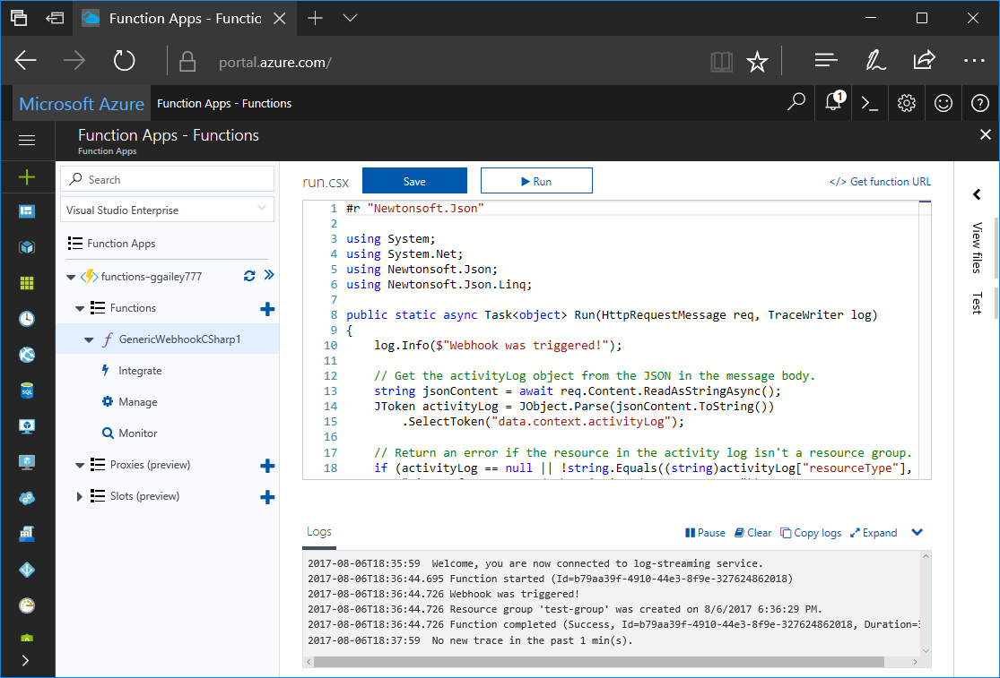
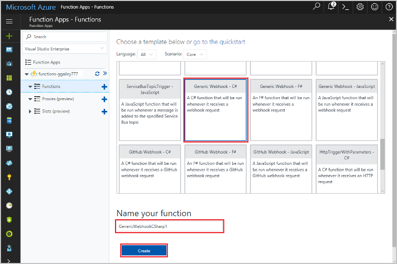
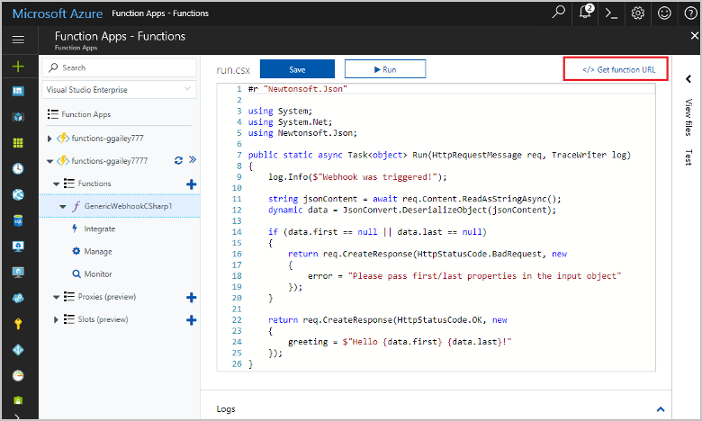
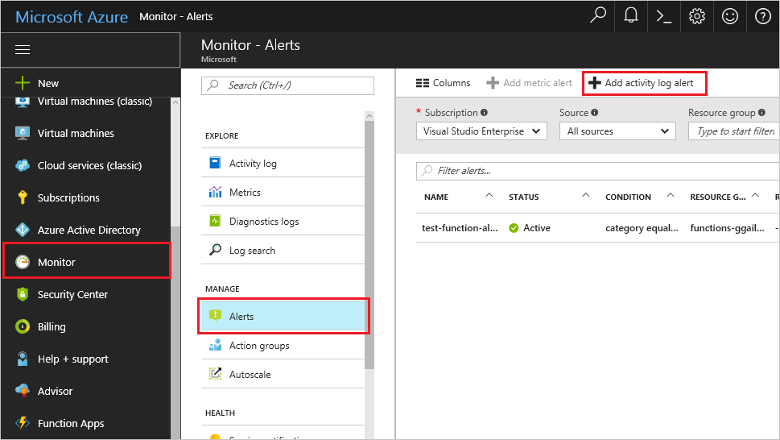
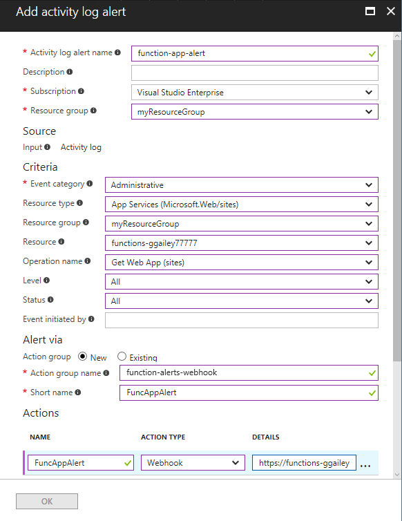
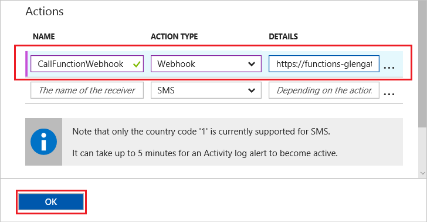
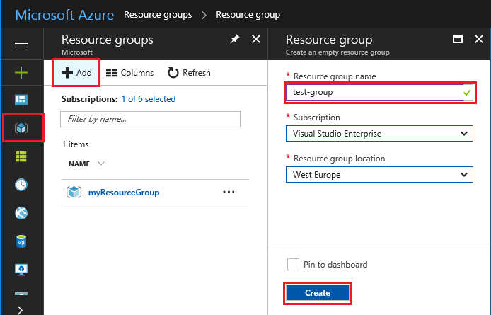
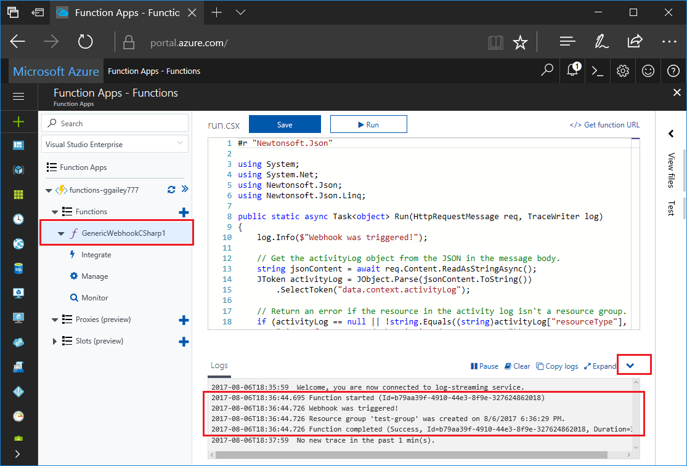

# Create a function triggered by a generic webhook

Azure Functions lets you execute your code in a serverless environment without having to first create a VM or publish a web application. For example, you can configure a function to be triggered by an alert raised by Azure Monitor. This topic shows you how to execute C# code when a resource group is added to your subscription.   



## Prerequisites 

To complete this tutorial:

+ If you don't have an Azure subscription, create a [free account](https://azure.microsoft.com/free/?WT.mc_id=A261C142F) before you begin.

[!INCLUDE [functions-portal-favorite-function-apps](../../includes/functions-portal-favorite-function-apps.md)]

## Create an Azure Function app

[!INCLUDE [Create function app Azure portal](../../includes/functions-create-function-app-portal.md)]

Next, you create a function in the new function app.

## <a name="create-function"></a>Create a generic webhook triggered function

1. Expand your function app and click the **+** button next to **Functions**. If this function is the first one in your function app, select **Custom function**. This displays the complete set of function templates.

    

2. Select the **Generic WebHook - C#** template. Type a name for your C# function, then select **Create**.

      

2. In your new function, click **</> Get function URL**, then copy and save the value. You use this value to configure the webhook. 

    
         
Next, you create a webhook endpoint in an activity log alert in Azure Monitor. 

## Create an activity log alert

1. In the Azure portal, navigate to the **Monitor** service, select **Alerts**, and click **Add activity log alert**.   

    

2. Use the settings as specified in the table:

    

    | Setting      |  Suggested value   | Description                              |
    | ------------ |  ------- | -------------------------------------------------- |
    | **Activity log alert name** | resource-group-create-alert | Name of the activity log alert. |
    | **Subscription** | Your subscription | The subscription you are using for this tutorial. | 
    |  **Resource Group** | myResourceGroup | The resource group that the alert resources are deployed to. Using the same resource group as your function app makes it easier to clean up after you complete the tutorial. |
    | **Event category** | Administrative | This category includes changes made to Azure resources.  |
    | **Resource type** | Resource groups | Filters alerts to resource group activities. |
    | **Resource Group**<br/>and **Resource** | All | Monitor all resources. |
    | **Operation name** | Create Resource Group | Filters alerts to create operations. |
    | **Level** | Informational | Include informational level alerts. | 
    | **Status** | Succeeded | Filters alerts to actions that have completed successfully. |
    | **Action group** | New | Create a new action group, which defines the action takes when an alert is raised. |
    | **Action group name** | function-webhook | A name to identify the action group.  | 
    | **Short name** | funcwebhook | A short name for the action group. |  

3. In **Actions**, add an action using the settings as specified in the table: 

    

    | Setting      |  Suggested value   | Description                              |
    | ------------ |  ------- | -------------------------------------------------- |
    | **Name** | CallFunctionWebhook | A name for the action. |
    | **Action type** | Webhook | The response to the alert is that a Webhook URL is called. |
    | **Details** | Function URL | Paste in the webhook URL of the function that you copied earlier. |v

4. Click **OK** to create the alert and action group.  

The webhook is now called when a resource group is created in your subscription. Next, you update the code in your function to handle the JSON log data in the body of the request.   

## Update the function code

1. Navigate back to your function app in the portal, and expand your function. 

2. Replace the C# script code in the function in the portal with the following code:

    ```csharp
    #r "Newtonsoft.Json"
    
    using System;
    using System.Net;
    using Newtonsoft.Json;
    using Newtonsoft.Json.Linq;
    
    public static async Task<object> Run(HttpRequestMessage req, TraceWriter log)
    {
        log.Info($"Webhook was triggered!");
    
        // Get the activityLog object from the JSON in the message body.
        string jsonContent = await req.Content.ReadAsStringAsync();
        JToken activityLog = JObject.Parse(jsonContent.ToString())
            .SelectToken("data.context.activityLog");
    
        // Return an error if the resource in the activity log isn't a resource group. 
        if (activityLog == null || !string.Equals((string)activityLog["resourceType"], 
            "Microsoft.Resources/subscriptions/resourcegroups"))
        {
            log.Error("An error occured");
            return req.CreateResponse(HttpStatusCode.BadRequest, new
            {
                error = "Unexpected message payload or wrong alert received."
            });
        }
    
        // Write information about the created resource group to the streaming log.
        log.Info(string.Format("Resource group '{0}' was {1} on {2}.",
            (string)activityLog["resourceGroupName"],
            ((string)activityLog["subStatus"]).ToLower(), 
            (DateTime)activityLog["submissionTimestamp"]));
    
        return req.CreateResponse(HttpStatusCode.OK);    
    }
    ```

Now you can test the function by creating a new resource group in your subscription.

## Test the function

1. Click the resource group icon in the left of the Azure portal, select **+ Add**, type a **Resource group name**, and select **Create** to create an empty resource group.
    
    

2. Go back to your function and expand the **Logs** window. After the resource group is created, the activity log alert triggers the webhook and the function executes. You see the name of the new resource group written to the logs.  

    

3. (Optional) Go back and delete the resource group that you created. Note that this activity doesn't trigger the function. This is because delete operations are filtered out by the alert. 

## Clean up resources

[!INCLUDE [Next steps note](../../includes/functions-quickstart-cleanup.md)]

## Next steps

You have created a function that runs when a request is received from a generic webhook. 

[!INCLUDE [Next steps note](../../includes/functions-quickstart-next-steps.md)]

For more information about webhook triggers, see [Azure Functions HTTP and webhook bindings](functions-bindings-http-webhook.md). To learn more about developing functions in C#, see [Azure Functions C# script developer reference](functions-reference-csharp.md).

