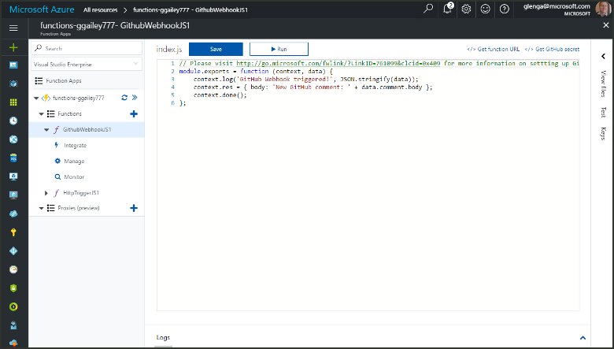
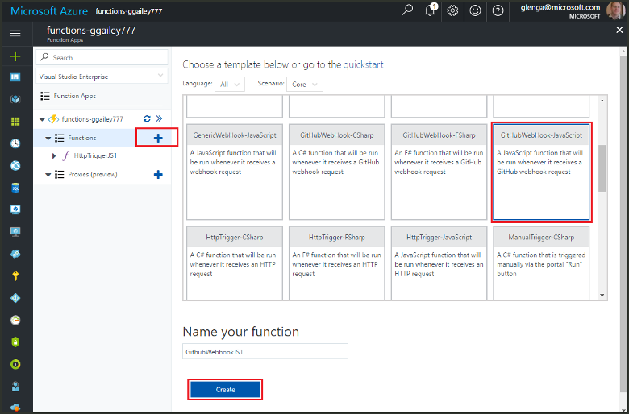
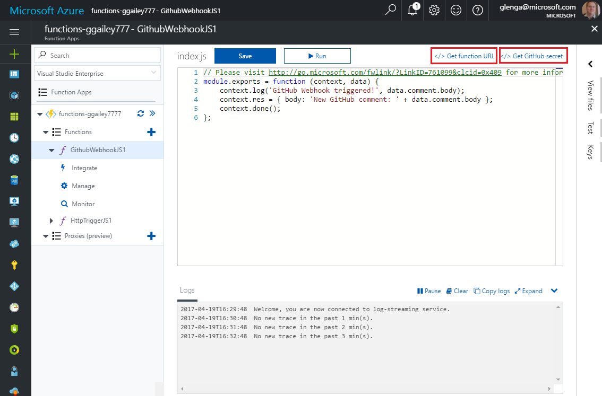
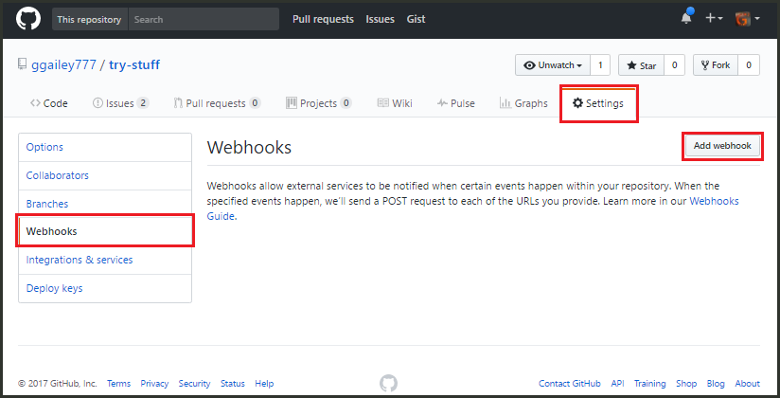
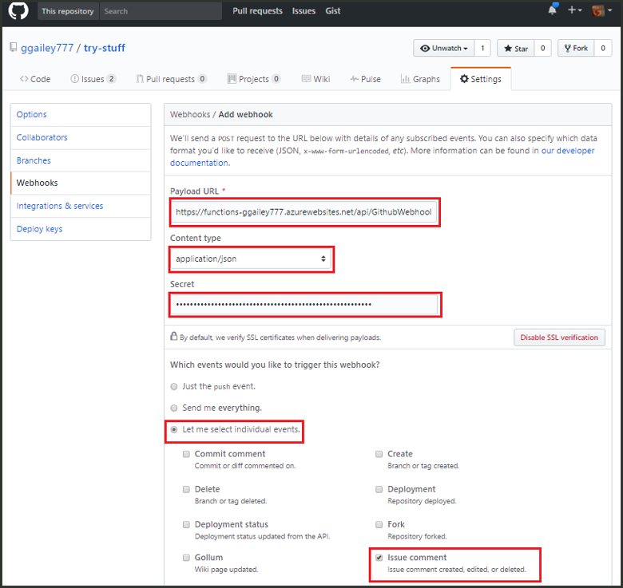
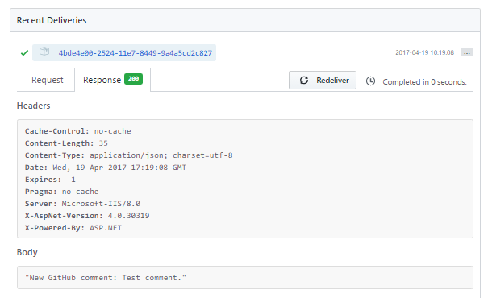

# Create a function triggered by a GitHub webhook

Learn how to create a function that is triggered by a GitHub webhook. 

This topic requires the resources created in the topic [Create your first function from the Azure portal](functions-create-first-azure-function.md).

You also need a GitHub account. You can [sign up for a free GitHub account](https://github.com/join), if you don't already have one. 

It should take you less than five minutes to complete all the steps in this topic.

## Find your function app    

1. Log in to the [Azure portal](https://portal.azure.com/). 

2. In the search bar at the top of the portal, type the name of your function app and select it from the list.

## Create a GitHub webhook triggered function

1. In your function app, click the **+** button next to **Functions**, click the **GitHubWebHook** template for your desired language, and click **Create**.
   
     

2. Click **</> Get function URL**, then copy and save the values. Do the same thing for **</> Get GitHub secret**. You use these values to configure the webhook in GitHub. 

     
         
Next, you create a webhook in your GitHub repository. 

## Configure the webhook
1. In GitHub, navigate to a repository that you own. You can also use any repository that you have forked.
 
2. Click **Settings**, then click **Webhooks**, and  **Add webhook**.
   
    

3. Paste your function's URL and secret into **Payload URL** and **Secret** and select **application/json** for **Content type**.

4. Click **Let me select individual events**, select **Issue comment**, and click **Add webhook**.
   
    

Now, the webhook is configured to trigger your function when a new issue comment is added. 

## Test the function
1. In your GitHub repository, open the **Issues** tab in a new browser window.

2. In the new window, click **New Issue**, type a title then click **Submit new issue**. 

2. In the issue, type a comment and click **Comment**. 

3. In the other GitHub window, click **Edit** next to your new webhook, scroll down to **Recent Deliveries**, and verify that a webhook request was processed by your function. 
 
    

   The response from your function should contain `New GitHub comment: <Your issue comment text>`.

## Next steps

[!INCLUDE [Next steps note](../../includes/functions-quickstart-next-steps.md)]

[!INCLUDE [Getting Started Note](../../includes/functions-get-help.md)]

