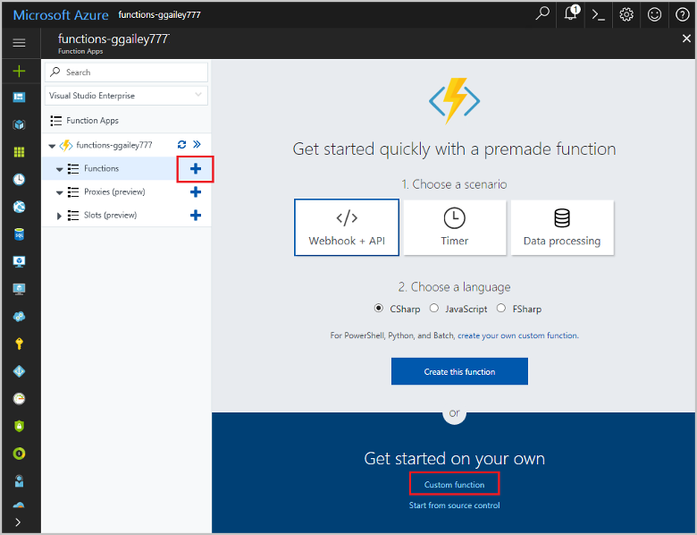
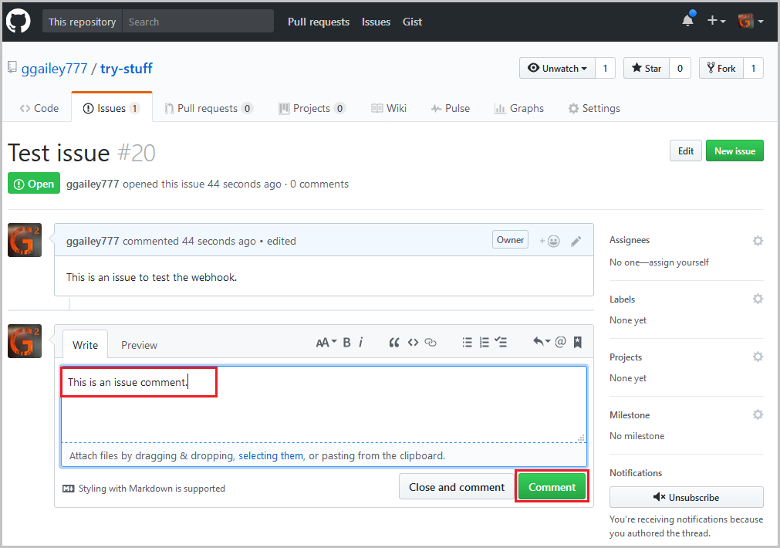
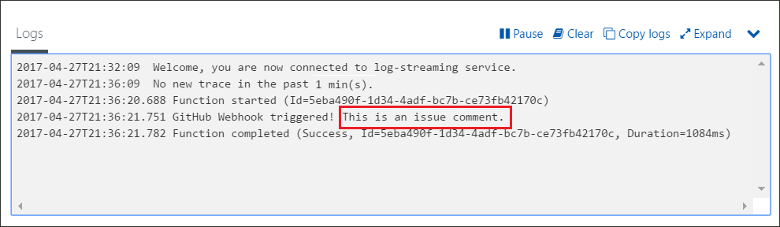

# Create a function triggered by a GitHub webhook

Learn how to create a function that is triggered by an HTTP webhook request with a GitHub-specific payload.

## Prerequisites

+ A GitHub account with at least one project.
+ An Azure subscription. If you don't have one, create a [free account](https://azure.microsoft.com/free/?WT.mc_id=A261C142F) before you begin.

[!INCLUDE [functions-portal-favorite-function-apps](../../includes/functions-portal-favorite-function-apps.md)]

## Create an Azure Function app

[!INCLUDE [Create function app Azure portal](../../includes/functions-create-function-app-portal.md)]

Next, you create a function in the new function app.

## Create a GitHub webhook triggered function

1. Expand your function app and click the **+** button next to **Functions**. If this is the first function in your function app, select **Custom function**. This displays the complete set of function templates.

    

2. Select the **GitHubWebHook** template for your desired language. **Name your function**, then select **Create**.

      

3. In your new function, click **</> Get function URL**, then copy and save the values. Do the same thing for **</> Get GitHub secret**. You use these values to configure the webhook in GitHub.

    

Next, you create a webhook in your GitHub repository.

## Configure the webhook

1. In GitHub, navigate to a repository that you own. You can also use any repository that you have forked. If you need to fork a repository, use <https://github.com/Azure-Samples/functions-quickstart>.

1. Click **Settings**, then click **Webhooks**, and  **Add webhook**.

    

1. Use settings as specified in the table, then click **Add webhook**.

    

| Setting | Suggested value | Description |
|---|---|---|
| **Payload URL** | Copied value | Use the value returned by  **</> Get function URL**. |
| **Secret**   | Copied value | Use the value returned by  **</> Get GitHub secret**. |
| **Content type** | application/json | The function expects a JSON payload. |
| Event triggers | Let me select individual events | We only want to trigger on issue comment events.  |
| | Issue comment |  |

Now, the webhook is configured to trigger your function when a new issue comment is added.

## Test the function

1. In your GitHub repository, open the **Issues** tab in a new browser window.

1. In the new window, click **New Issue**, type a title, and then click **Submit new issue**.

1. In the issue, type a comment and click **Comment**.

    

1. Go back to the portal and view the logs. You should see a trace entry with the new comment text.

     

## Clean up resources

[!INCLUDE [Next steps note](../../includes/functions-quickstart-cleanup.md)]

## Next steps

You have created a function that runs when a request is received from a GitHub webhook. 
[!INCLUDE [Next steps note](../../includes/functions-quickstart-next-steps.md)]
For more information about webhook triggers, see [Azure Functions HTTP and webhook bindings](functions-bindings-http-webhook.md).