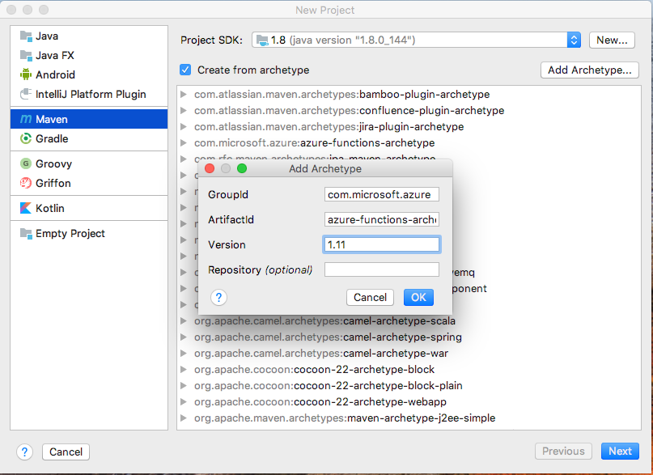
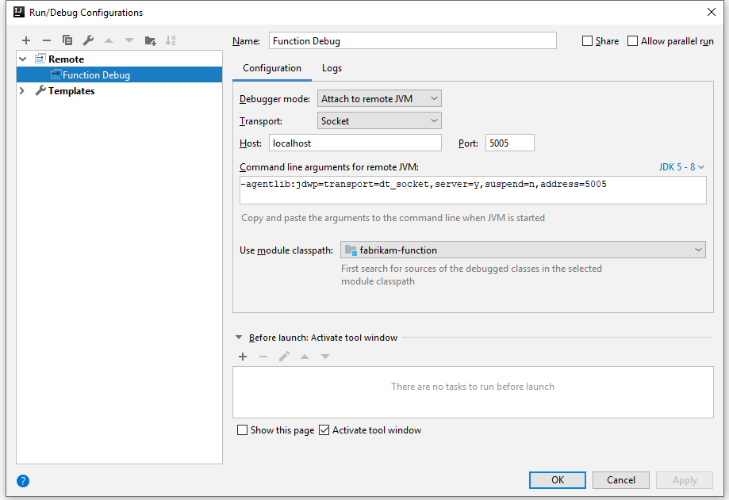

# Create your first function with Java and IntelliJ (Preview)

> [!NOTE] 
> Java for Azure Functions is currently in preview.

This article shows you how to create a [serverless](https://azure.microsoft.com/overview/serverless-computing/) function project with IntelliJ IDEA and Apache Maven, test and debug it on your own computer from the IDE, and deploy it to Azure Functions. 

<!-- TODO  -->

[!INCLUDE [quickstarts-free-trial-note](../../includes/quickstarts-free-trial-note.md)]

## Set up your development environment

To develop a functions app with Java and IntelliJ, you must have the following installed:

-  [Java Developer Kit](https://www.azul.com/downloads/zulu/), version 8.
-  [Apache Maven](https://maven.apache.org), version 3.0 or above.
-  [IntelliJ IDEA](https://www.jetbrains.com/idea/download), Community or Ultimate with Maven tooling.
-  [Azure CLI](https://docs.microsoft.com/cli/azure)

> [!IMPORTANT] 
> The JAVA_HOME environment variable must be set to the install location of the JDK to complete this quickstart.

It is highly reccommended to also install [Azure Functions Core Tools, version 2](functions-run-local.md#v2), which provide a local development environment for writing, running, and debugging Azure Functions. 


## Create a Functions project

1. In IntelliJ IDEA, click to **Create New Project**.  
1. Select to create from **Maven**
1. Select the checkbox to **Create from archetype** and **Add Archetype** for the [azure-functions-archetype](https://mvnrepository.com/artifact/com.microsoft.azure/azure-functions-archetype).
    - GroupId: com.microsoft.azure
    - ArtifactId: azure-functions-archetype
    - Version: Use latest version from [the central repository](https://mvnrepository.com/artifact/com.microsoft.azure/azure-functions-archetype)
      
1. Click **Next** and enter details for current project, and eventually **Finish**.

Maven creates the project files in a new folder with a name of _artifactId_. The generated code in the project is a simple [HTTP triggered](/azure/azure-functions/functions-bindings-http-webhook) function that echoes the body of the triggering HTTP request.

## Run functions locally in the IDE

> [!NOTE]
> [Azure Functions Core Tools, version 2](functions-run-local.md#v2) must be installed to run and debug functions locally.

1. Select to import changes or make sure that [auto import](https://www.jetbrains.com/help/idea/creating-and-optimizing-imports.html) is enables.
1. Open the **Maven Projects** toolbar
1. Under Lifecycle, double-click **package** to package and build the solution and create a target directory.
1. Under Plugins -> azure-functions double-click **azure-functions:run** to start the azure functions local runtime.  
    

Close the run dialog when you're done testing your function. Only one function host can be active and running locally at a time.

### Debug the function in IntelliJ
To start the function host in debug mode, add **-DenableDebug** as the argument when you run your function. You could run below command line in terminal or configure it in [maven goals](https://www.jetbrains.com/help/idea/maven-support.html#run_goal). Then the function host will open a debug port at 5005. 

```
mvn azure-functions:run -DenableDebug
```

To debug in IntelliJ, In the **Run** menu select **Edit Configurations**. Click **+** to add a **Remote**. Fill in **Name** and **Settings**, and then click **OK** to save the configuration. After setup, click **Debug** 'Your Remote Configuration Name' or hit **Shift+F9** to start debugging.



When finished stop the debugger and the running process. Only one function host can be active and running locally at a time.

## Deploy the function to Azure

The deploy process to Azure Functions uses account credentials from the Azure CLI. [Log in with the Azure CLI](/cli/azure/authenticate-azure-cli?view=azure-cli-latest) before continuing using your computer's command prompt.

```azurecli
az login
```

Deploy your code into a new Function app using the `azure-functions:deploy` Maven target, or select the azure-functions:deploy option in the Maven Projects window.

```
mvn azure-functions:deploy
```

When the deploy is complete, you see the URL you can use to access your Azure function app:

```output
[INFO] Successfully deployed Function App with package.
[INFO] Deleting deployment package from Azure Storage...
[INFO] Successfully deleted deployment package fabrikam-function-20170920120101928.20170920143621915.zip
[INFO] Successfully deployed Function App at https://fabrikam-function-20170920120101928.azurewebsites.net
[INFO] ------------------------------------------------------------------------
```

## Next steps

- Review the  [Java Functions developer guide](functions-reference-java.md) for more information on developing Java functions.
- Add additional functions with different triggers to your project using the `azure-functions:add` Maven target.
