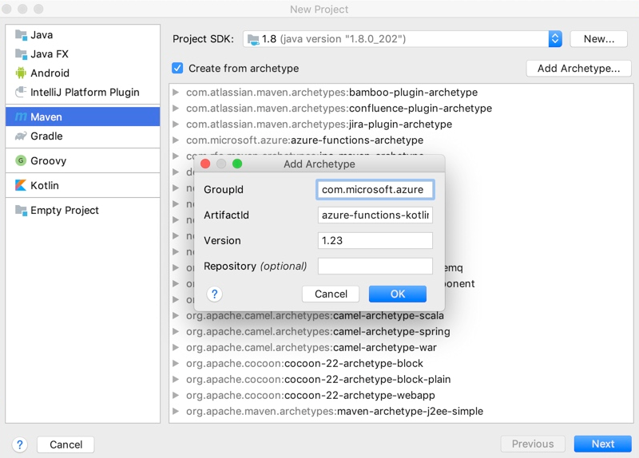
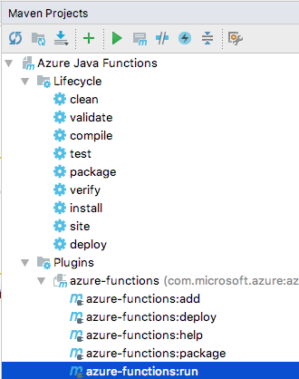

# Create your first Kotlin function in Azure using IntelliJ

This article shows you how to create an HTTP-triggered Java function in an IntelliJ IDEA project, run and debug the project in the integrated development environment (IDE), and finally deploy the function project to a function app in Azure.

[!INCLUDE [quickstarts-free-trial-note](../../includes/quickstarts-free-trial-note.md)]

## Set up your development environment

To create and publish Kotlin functions to Azure using IntelliJ, install the following software:

- [Java Developer Kit](/azure/developer/java/fundamentals/java-support-on-azure) (JDK), version 8
- [Apache Maven](https://maven.apache.org), version 3.0 or higher
- [IntelliJ IDEA](https://www.jetbrains.com/idea/download), Community or Ultimate versions with Maven
- [Azure CLI](/cli/azure)
- [Version 2.x](functions-run-local.md#v2) of the Azure Functions Core Tools. It provides a local development environment for writing, running, and debugging Azure Functions.

> [!IMPORTANT]
> The JAVA_HOME environment variable must be set to the install location of the JDK to complete the steps in this article.

## Create a function project

1. In IntelliJ IDEA, select **Create New Project**.  
1. In the **New Project** window, select **Maven** from the left pane.
1. Select the **Create from archetype** check box, and then select **Add Archetype** for the [azure-functions-kotlin-archetype](https://mvnrepository.com/artifact/com.microsoft.azure/azure-functions-kotlin-archetype).
1. In the **Add Archetype** window, complete the fields as follows:
    - _GroupId_: com.microsoft.azure
    - _ArtifactId_: azure-functions-kotlin-archetype
    - _Version_: Use the latest version from [the central repository](https://mvnrepository.com/artifact/com.microsoft.azure/azure-functions-kotlin-archetype)
      
1. Select **OK**, and then select **Next**.
1. Enter your details for current project, and select **Finish**.

Maven creates the project files in a new folder with the same name as the _ArtifactId_ value. The project's generated code is a simple [HTTP-triggered](./functions-bindings-http-webhook.md) function that echoes the body of the triggering HTTP request.

## Run project locally in the IDE

> [!NOTE]
> To run and debug the project locally, make sure you've installed [Azure Functions Core Tools, version 2](functions-run-local.md#v2).

1. Import changes manually or enable [auto import](https://www.jetbrains.com/help/idea/creating-and-optimizing-imports.html).
1. Open the **Maven Projects** toolbar.
1. Expand **Lifecycle**, and then open **package**. The solution is built and packaged in a newly created target directory.
1. Expand **Plugins** > **azure-functions** and open **azure-functions:run** to start the Azure Functions local runtime.  
    

1. Close the run dialog box when you're done testing your function. Only one function host can be active and running locally at a time.

## Debug the project in IntelliJ

1. To start the function host in debug mode, add **-DenableDebug** as the argument when you run your function. You can either change the configuration in [maven goals](https://www.jetbrains.com/help/idea/maven-support.html#run_goal) or run the following command in a terminal window:  

   ```
   mvn azure-functions:run -DenableDebug
   ```

   This command causes the function host to open a debug port at 5005.

1. On the **Run** menu, select **Edit Configurations**.
1. Select **(+)** to add a **Remote**.
1. Complete the _Name_ and _Settings_ fields, and then select **OK** to save the configuration.
1. After setup, select **Debug < Remote Configuration Name >** or press Shift+F9 on your keyboard to start debugging.

   

1. When you're finished, stop the debugger and the running process. Only one function host can be active and running locally at a time.

## Deploy the project to Azure

1. Before you can deploy your project to a function app in Azure, you must [log in by using the Azure CLI](/cli/azure/authenticate-azure-cli).

   ``` azurecli
   az login
   ```

1. Deploy your code into a new function app by using the `azure-functions:deploy` Maven target. You can also select the **azure-functions:deploy** option in the Maven Projects window.

   ```
   mvn azure-functions:deploy
   ```

1. Find the URL for your HTTP trigger function in the Azure CLI output after the function app has been successfully deployed.

   ``` output
   [INFO] Successfully deployed Function App with package.
   [INFO] Deleting deployment package from Azure Storage...
   [INFO] Successfully deleted deployment package fabrikam-function-20170920120101928.20170920143621915.zip
   [INFO] Successfully deployed Function App at https://fabrikam-function-20170920120101928.azurewebsites.net
   [INFO] ------------------------------------------------------------------------
   ```

## Next steps

Now that you have deployed your first Kotlin function app to Azure, review the [Azure Functions Java developer guide](functions-reference-java.md) for more information on developing Java and Kotlin functions.
- Add additional function apps with different triggers to your project by using the `azure-functions:add` Maven target.
