# Tutorial: Establish Azure Functions private site access

This tutorial will show you how to create an Azure Function with private site access. Private site access ensures the Azure Function only be triggered via a specific virtual network.

Private site access is useful in scenarios when access to the function needs to be limited to a specific virtual network. For example, the function may be applicable to only employees of a specific organization, or services which reside within the specified virtual network (such as another Azure Function, Azure Virtual Machine, or an AKS cluster).

If an Azure Function needs to access Azure resources within the virtual network, or connected via [service endpoints](https://docs.microsoft.com/azure/virtual-network/virtual-network-service-endpoints-overview), then [virtual network integration](https://docs.microsoft.com/azure/azure-functions/functions-create-vnet) is needed.

In this tutorial, you learn how to configure private site access for your function app:

> [!div class="checklist"]
> * Create a virtual network
> * Create a virtual machine
> * Create an Azure Bastion service
> * Create an Azure Function App plan
> * Configure a virtual network service endpoint
> * Create and deploy an Azure Function
> * Invoke the function from outside and within the virtual network

If you don’t have an Azure subscription, create a [free account](https://azure.microsoft.com/free/?WT.mc_id=A261C142F) before you begin.

## Topology

The following diagram shows the architecture of the solution to be created:

## Prerequisites

For this tutorial, it's important that you understand IP addressing and subnetting. You can start with [this article that covers the basics of addressing and subnetting](https://support.microsoft.com/help/164015/understanding-tcp-ip-addressing-and-subnetting-basics). Many more articles and videos are available online.

## Sign in to Azure portal

Sign in to the [Azure portal](https://portal.azure.com).

## Create a Virtual Network

The first step is to create a new resource group, and then a new virtual network within the resource group. The virtual network will contain one subnet (with a name of "default"), and a new virtual machine within that subnet. The VM will be used to test invoking the function app.

1. Create a new resource group
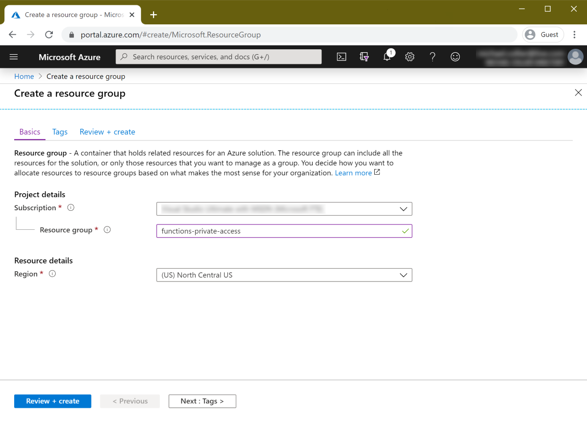
2. Select the **Add** or **Create resources** button to create a new resource in the resource group

>[!div class="mx-imgBorder"]
>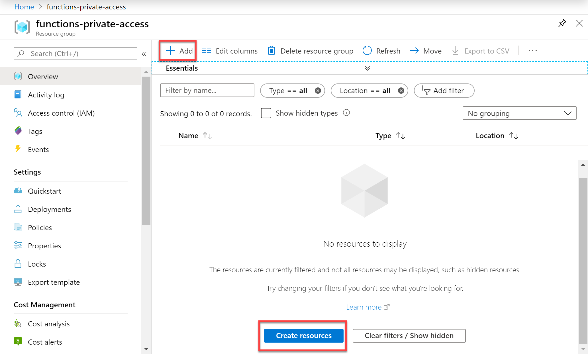

3. Type "Virtual Network" in the Marketplace search box, and select "Virtual Network".

>[!div class="mx-imgBorder"]
>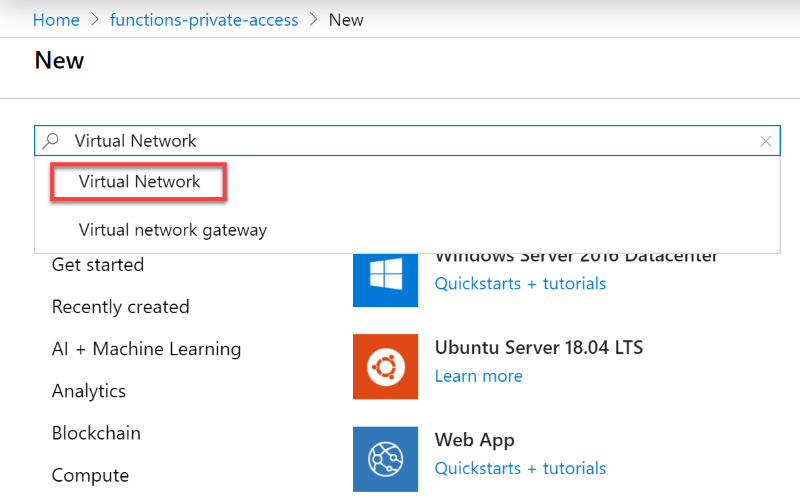

4. Press the **Create** button to begin creating the virtual network.

>[!div class="mx-imgBorder"]
>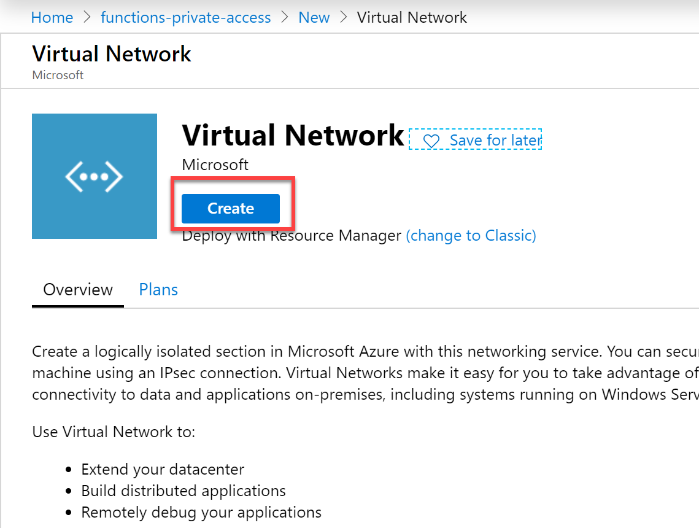

5. Provide a name for the virtual network, along with a desired address space.

>[!div class="mx-imgBorder"]
>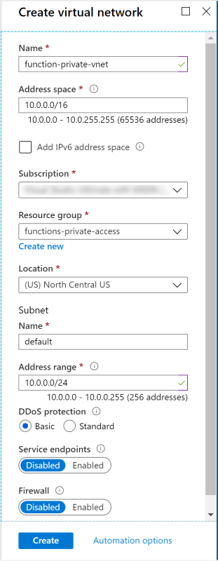

6. Press the **Create** button when finished.

## Create a virtual machine

The next step is to create a new virtual machine within one subnet of the virtual network.

1. In the portal, choose **Add** at the top of the resource group view.
2. In the search field, type "Windows Server".
3. Choose **Windows Server** in the search results.
4. In the **Basics** tab, use the VM settings as specified in the table below the image.

>[!div class="mx-imgBorder"]
>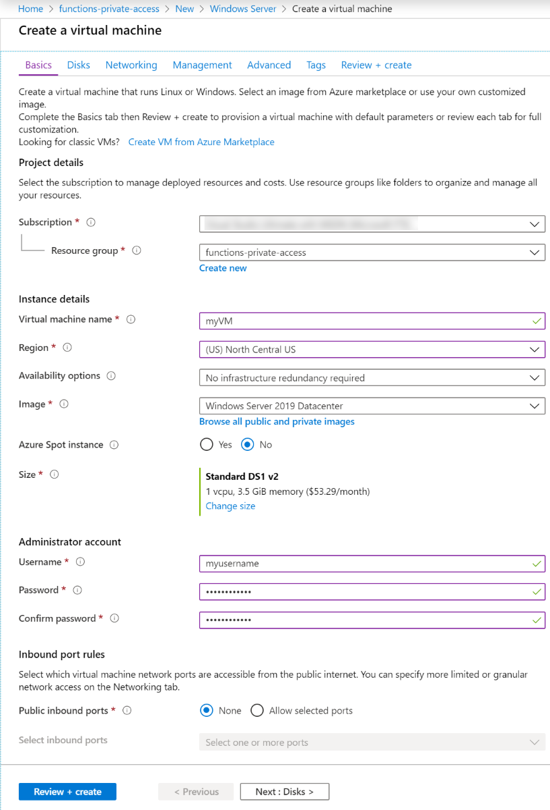

| Setting      | Suggested value  | Description      |
| ------------ | ---------------- | ---------------- |
| **Subscription** | Your subscription | The subscription under which your resources are created. |
| **Resource group** | _functions-private-access_ | Choose the resource group to contain all the resources for this tutorial.  Using the same resource group for the function app and VM makes it easier to clean up resources when you're done with this tutorial. |
| **Virtual machine name** | _myVM_ | The VM name needs to be unique in the resource group |
| **Region** | (US) North Central US | Choose a region near you or near the functions to be accessed. |
| **Public inbound ports** | None | Select **None** to ensure there is no inbound connectivity to the VM from the internet. |

5. Leave the defaults in the **Disk** tab.
6. In the **Networking** tab, select the previously created virtual network and subnet. Change the IP address setting to not have a public IP address. Remote access to the VM will be configured via the Azure Bastion service.

>[!div class="mx-imgBorder"]
>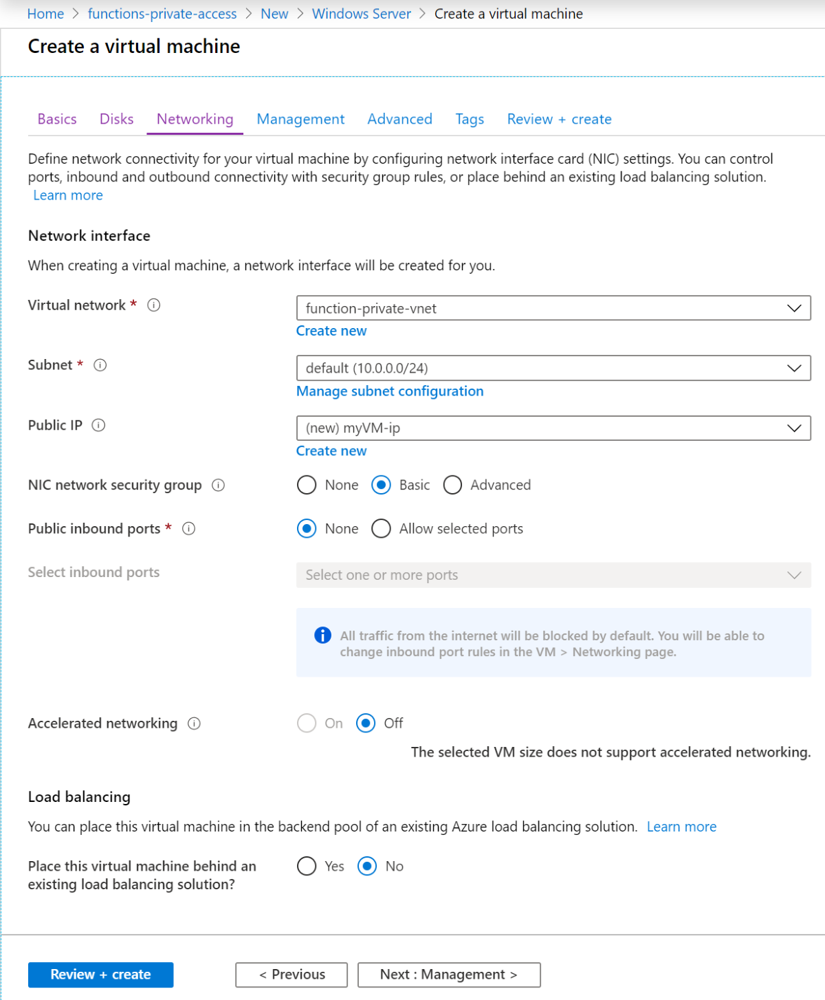

7. Leave the default values in place for the **Management**, **Advanced**, and **Tags** tabs.
8. Select **Review + create**. After validation completes, select **Create**. The VM create process takes a few minutes.

## Configure Azure Bastion

[Azure Bastion](https://azure.microsoft.com/services/azure-bastion/) is a fully-managed Azure service which provides secure RDP and SSH access to virtual machines directly from the Azure portal. Using the Azure Bastion service removes the need to configure network settings related to RDP access.

1. In the portal, choose **Add** at the top of the resource group view.
2. In the search field, type "Bastion".  Select "Bastion".
3. Select **Create** to begin the process of creating a new Azure Bastion resource.

>[!div class="mx-imgBorder"]
>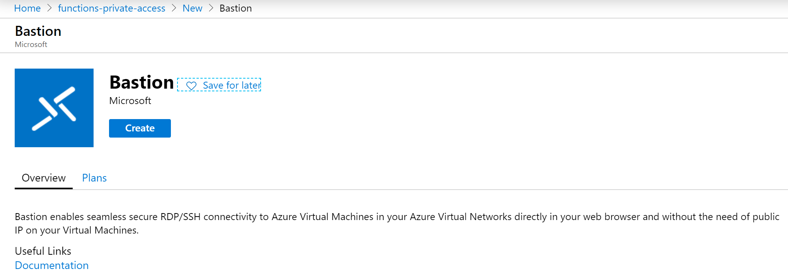

4. Create a new Azure Bastion resource using the settings as specified in the table below the image.  For a detailed, step-by-step guide to creating an Azure Bastion resource, refer to the [Create an Azure Bastion host](https://docs.microsoft.com/azure/bastion/bastion-create-host-portal) tutorial.

>[!div class="mx-imgBorder"]
>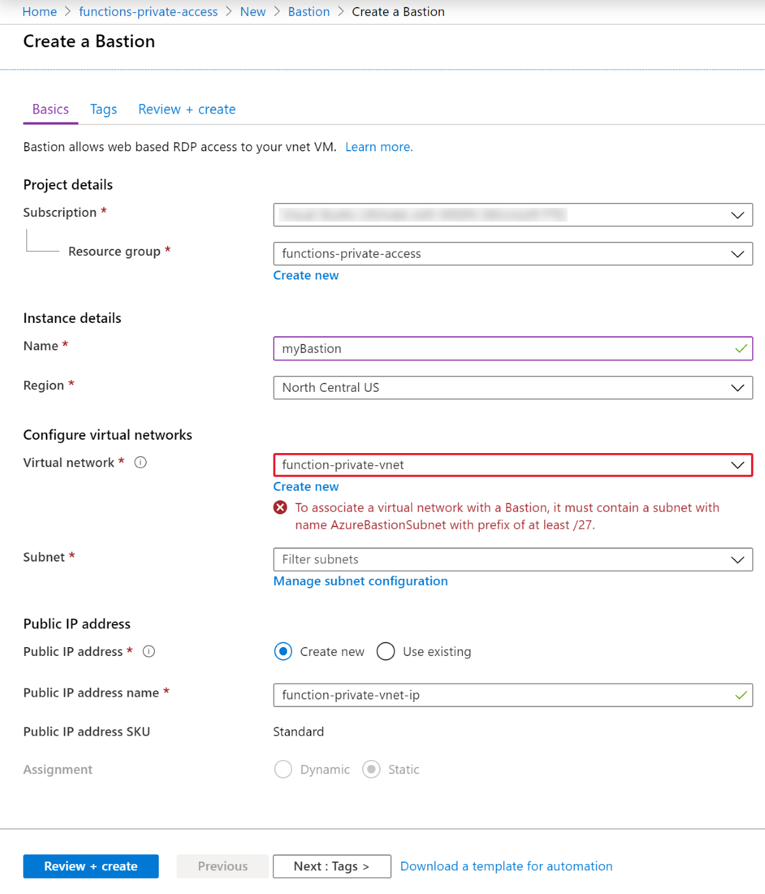

| Setting      | Suggested value  | Description      |
| ------------ | ---------------- | ---------------- |
| Name | _myBastion_ | The name of the new Bastion resource |
| Region | North Central US | Choose a [region](https://azure.microsoft.com/regions/) near you or near other services your functions access. |
| Virtual network | function-private-vnet | The virtual network in which the Bastion resource will be created in |
| Subnet | _AzureBastionSubnet_ | The subnet in your virtual network to which the new Bastion host resource will be deployed. You must create a subnet using the name value AzureBastionSubnet. This value lets Azure know which subnet to deploy the Bastion resources to. You must use a subnet of at least /27 or larger (/27, /26, and so on). |

5. You will need to create a subnet where Azure can provision the Azure Bastion host. Clicking on **Manage subnet configuration** will open a new blade to allow you to define a new subnet.  Click on **+Subnet** to create a new subnet. The subnet must be of the name **AzureBastionSubnet** and the subnet prefix must be at least /27.  Click **OK** to create the subnet.

>[!div class="mx-imgBorder"]
>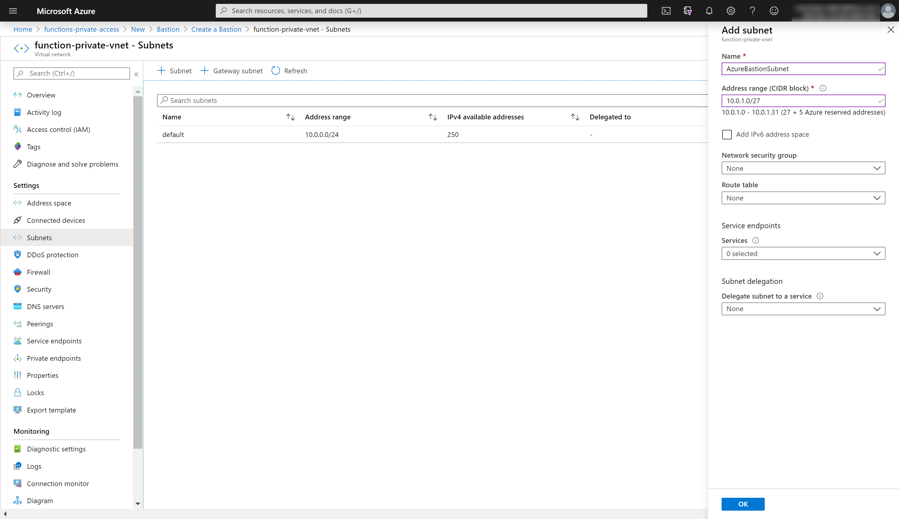

6. On the **Create a Bastion** page, select the newly created **AzureBastionSubnet** from the list of available subnets.

>[!div class="mx-imgBorder"]
>

7. Select **Review & Create**. It will take a few minutes for the Azure Bastion resource to be created.  The Azure Bastion resource should now be in your resource group.

>[!div class="mx-imgBorder"]
>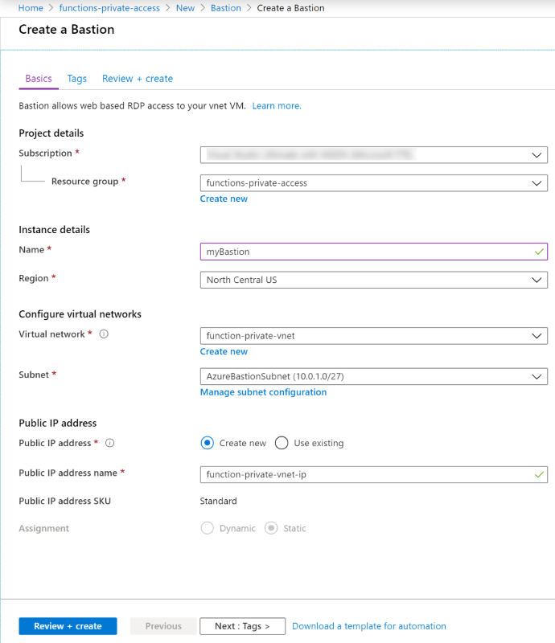

## Create an Azure Functions app

With the virtual network in place, the next step is to create an Azure Function App using a Consumption plan. The function code will be deployed to the Function App later in this tutorial.

1. In the portal, choose **Add** at the top of the resource group view.
2. Select **Compute > Function App**

>[!div class="mx-imgBorder"]
>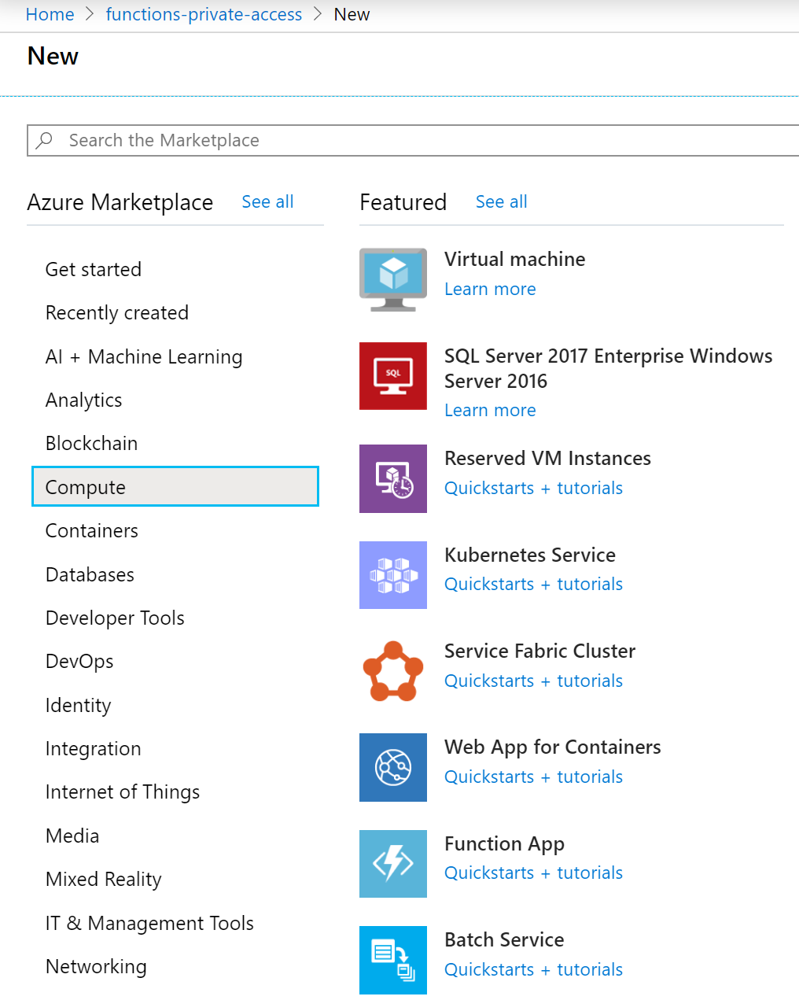

3. Use the function app settings as specified in the table below the image.

>[!div class="mx-imgBorder"]
>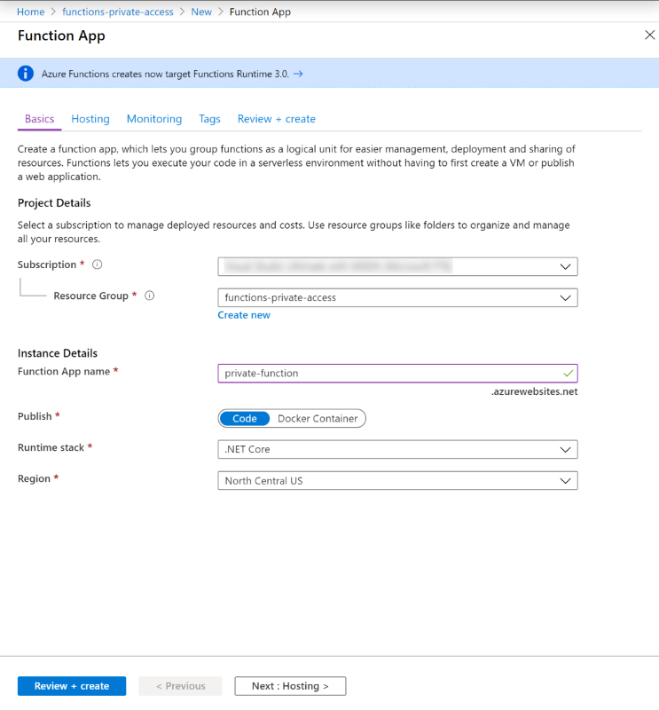

| Setting      | Suggested value  | Description      |
| ------------ | ---------------- | ---------------- |
| Subscription | Your subscription | The subscription under which your resources are created. |
| Resource Group | _functions-private-access_ | Choose the resource group to contain all the resources for this tutorial.  Using the same resource group for the function app and VM makes it easier to clean up resources when you're done with this tutorial. |
| Function App name | Globally unique name | Name that identifies your new function app. Valid characters are a-z (case insensitive), 0-9, and -. |
| Publish | Code | Option to publish code files or a Docker container. |
| Runtime stack | Preferred language | Choose a runtime that supports your favorite function programming language. |
| Region | North Central US | Choose a [region](https://azure.microsoft.com/regions/) near you or near other services your functions access. |

Select the **Next: Hosting >** button.

4. Enter the following hosting settings.

>[!div class="mx-imgBorder"]
>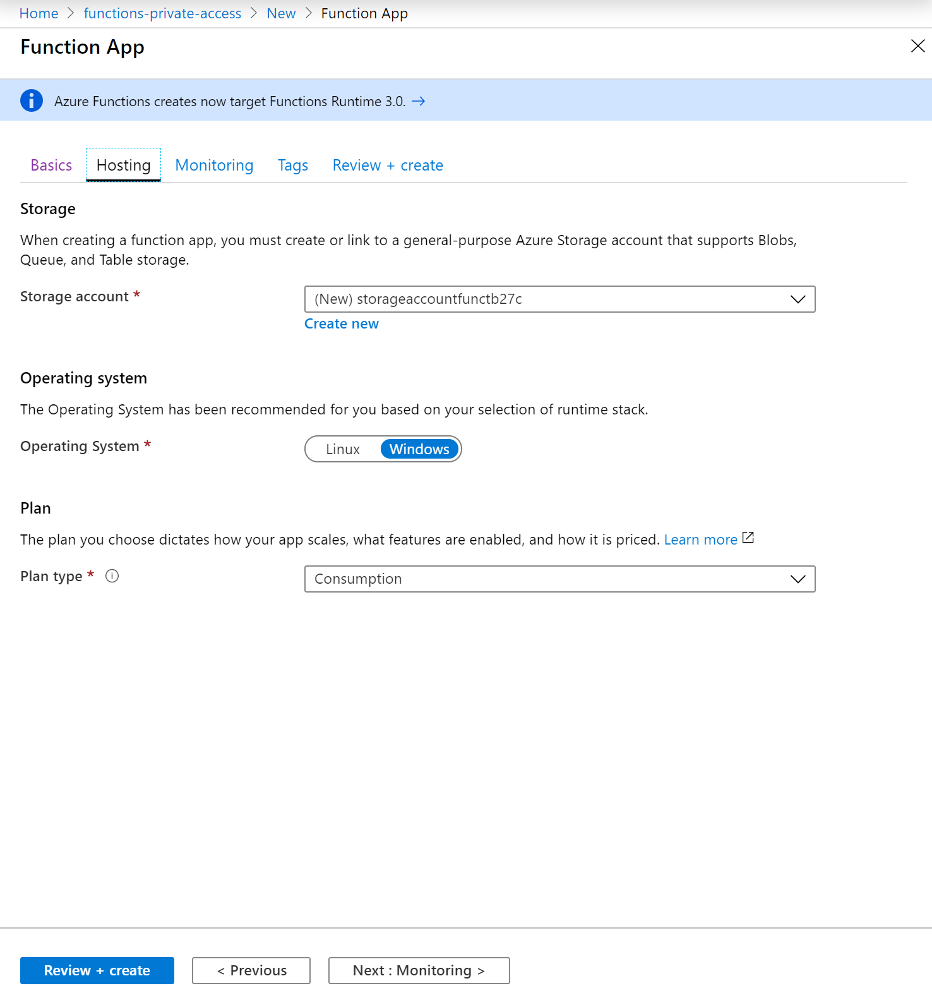

| Setting      | Suggested value  | Description      |
| ------------ | ---------------- | ---------------- |
| Storage account | Globally unique name | Create a storage account used by your function app. Storage account names must be between 3 and 24 characters in length and may contain numbers and lowercase letters only. You can also use an existing account, which must meet the [storage account requirements](https://docs.microsoft.com/azure/azure-functions/functions-scale#storage-account-requirements). |
| Operating system | Preferred operating system | An operating system is pre-selected for you based on your runtime stack selection, but you can change the setting if necessary. |
| Plan | Consumption | The [hosting plan](https://docs.microsoft.com/azure/azure-functions/functions-scale) dictates how the function app is scaled and resources available to each instance. |

Select the **Next:Monitoring >** button.

6. Enter the following monitoring settings.

>[!div class="mx-imgBorder"]
>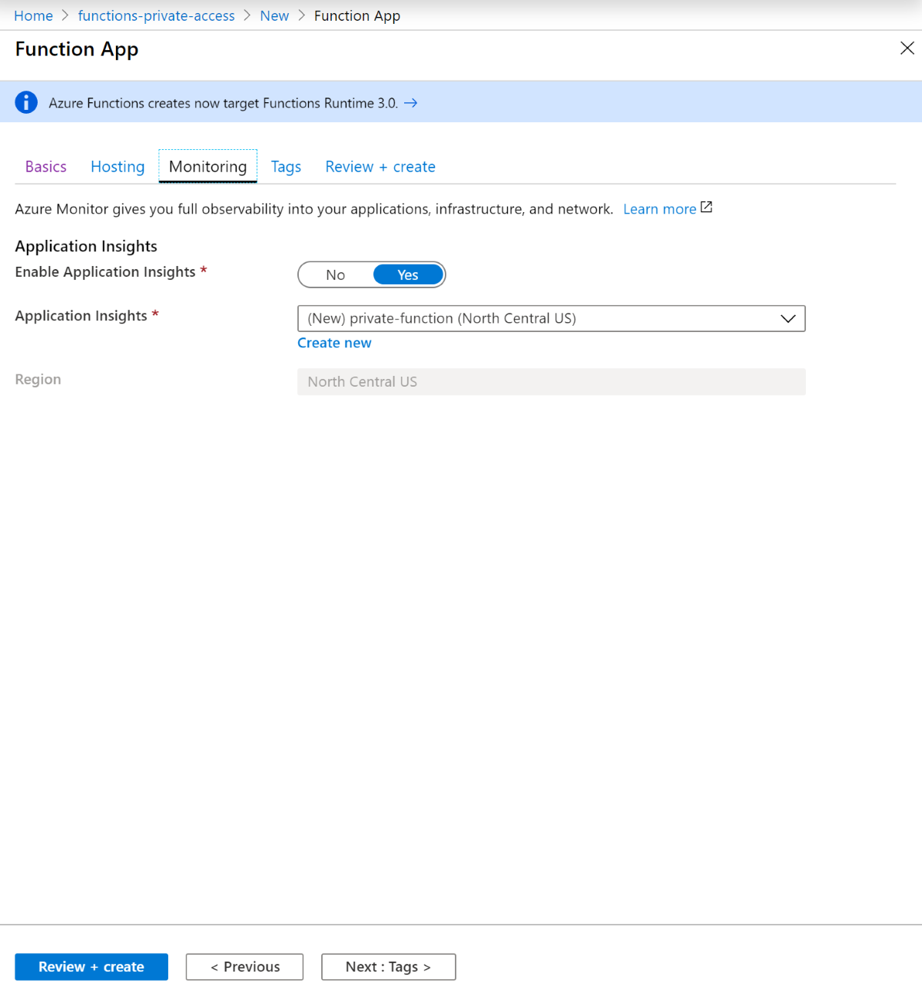

| Setting      | Suggested value  | Description      |
| ------------ | ---------------- | ---------------- |
| Application Insights | Default | Creates an Application Insights resource of the same App name in the nearest supported region. By expanding this setting, you can change the **New resource name** or choose a different **Location** in an [Azure geography](https://azure.microsoft.com/global-infrastructure/geographies/) where you want to store your data. |

Select **Review + Create** to review the app configuration selections.

7. Select **Create** to provision and deploy the function app.

## Configure Access Restrictions

The next step is to configure [access restrictions](./app-service/app-service-ip-restrictions.md) to ensure only resources on the virtual network can invoke the function.

[Private site](https://docs.microsoft.com/azure/azure-functions/functions-networking-options#private-site-access) access is enabled by creating an Azure [virtual network service endpoint](https://docs.microsoft.com/azure/virtual-network/virtual-network-service-endpoints-overview) between the App Service plan (consumption) and the specified virtual network. Access restrictions are implemented via service endpoints. Service endpoints ensure that only traffic originating from within the specified virtual network can access the designated resource. In this case, the designed resource is the Azure Function.

1. Within the function app, proceed to the **Platform features** tab. Click on **Networking** to open the **Network Feature Status** section.

>[!div class="mx-imgBorder"]
>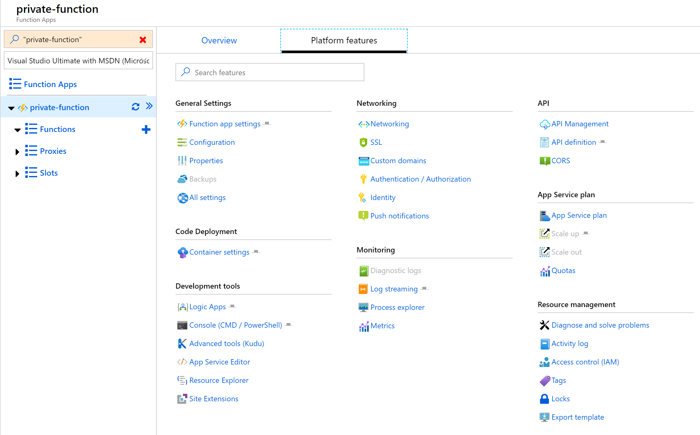

2. The **Network Feature Status** page is the starting point to configure Azure Front Door, the Azure CDN, and also Access Restrictions. Private site access is configured via access restrictions. Select **Configure Access Restrictions**.

>[!div class="mx-imgBorder"]
>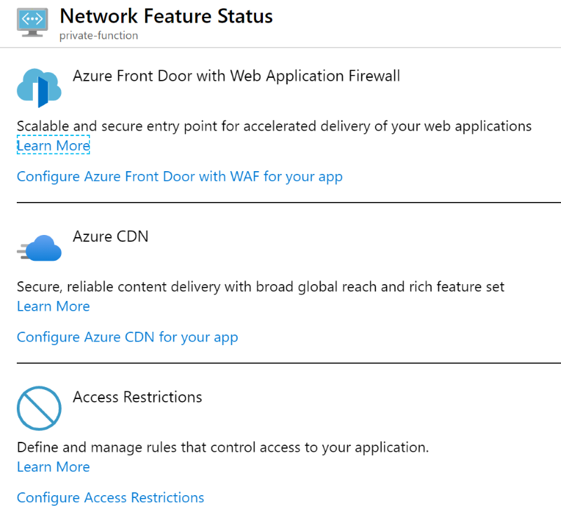

3. It can be seen on the **Access Restrictions** page that only the default restriction is in place. The default does not place any restrictions on access to the function.  For private site access, a new access restriction configuration needs to be created. Do so by first clicking on **Add rule**.

>[!div class="mx-imgBorder"]
>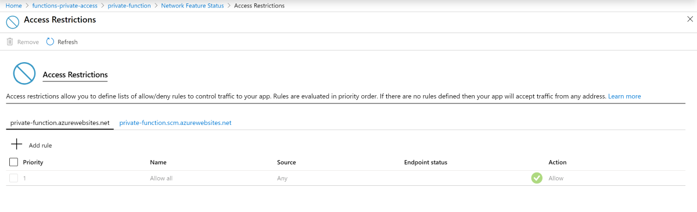

4. This will open new **Add Access Restriction** blade on the right side of the portal. The key configuration in this blade is to select **Virtual Network** from the Type drop-down selection box. Once **Virtual Network** is selected, select the desired virtual network and subnet.

>[!div class="mx-imgBorder"]
>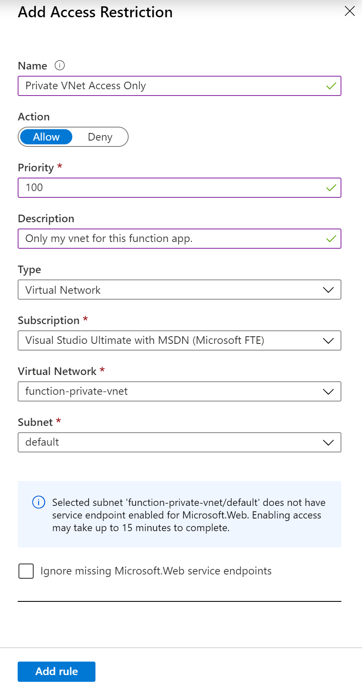

| Setting      | Suggested value  | Description      |
| ------------ | ---------------- | ---------------- |
| Name | Private VNet Access Only | The name for the access rule.  |
| Priority | 100 | The priority of the access rule. Rules are enforced in priority order starting from the lowest number and going up. |
| Description | My vnet only |  Brief description of the rule. |
| Type | Virtual Network | The type of access rule (IPv4, IPv6, or Virtual Network) |
| Virtual Network | function-private-vnet | The virtual network to which access should be restricted. |
| Subnet | default | The virtual network subnet to which access should be restricted. |

Notice in the above screenshot the information block indicating a service endpoint has not yet been enabled for Microsoft.Web. The service endpoint will automatically be created.

5. The Access Restrictions page now shows that there is a new restriction. It may take a few seconds for the Endpoint status to change from Disabled to Provisioning to Enabled.

>[!div class="mx-imgBorder"]
>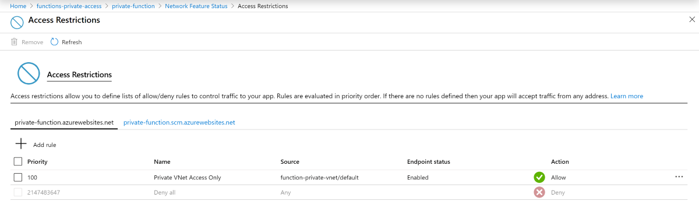

It is important to note that access restrictions have not been enabled on the [SCM site](https://docs.microsoft.com/azure/app-service/app-service-ip-restrictions#scm-site), private-site.scm.azurewebsites.net. By not enabling access restrictions the SCM site, it is possible to deploy the Azure Function code from a local developer workstation or another build service without needing to provision an agent within the virtual network.

## Access the Function app

1. Return to the previously created Azure Function app.  In the **Overview** section, copy the URL.

>[!div class="mx-imgBorder"]
>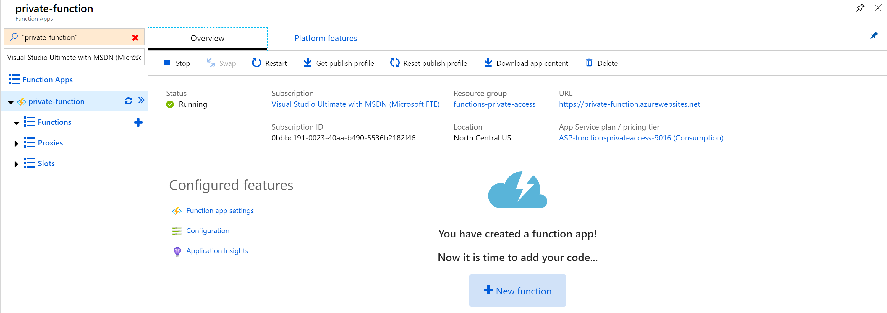

2. If you try to access the function app now, you'll receive an HTTP 403 page indicating that the app is stopped.  The app isn't stopped. The response is actually an HTTP 403 IP Forbidden status.

>[!div class="mx-imgBorder"]
>

3. Return to the previously created virtual machine. In order to access the site from the VM, connect to the VM via the Azure Bastion service.  First select **Connect** and then choose **Bastion**.

>[!div class="mx-imgBorder"]
>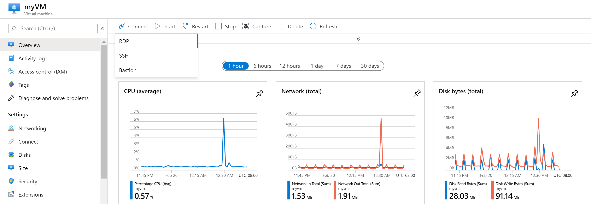

4. Provide the required username and password to log into the virtual machine.  Select **Connect**. A new browser window will pop up to allow you to interact with the virtual machine.

>[!div class="mx-imgBorder"]
>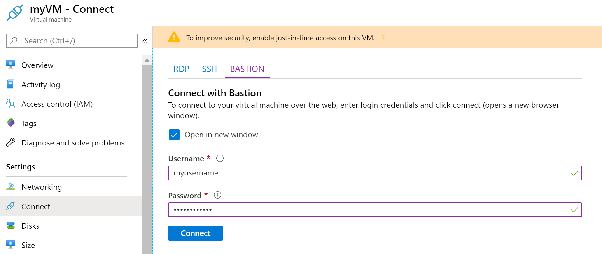

5. It is possible to access the site from the web browser on the VM.

>[!div class="mx-imgBorder"]
>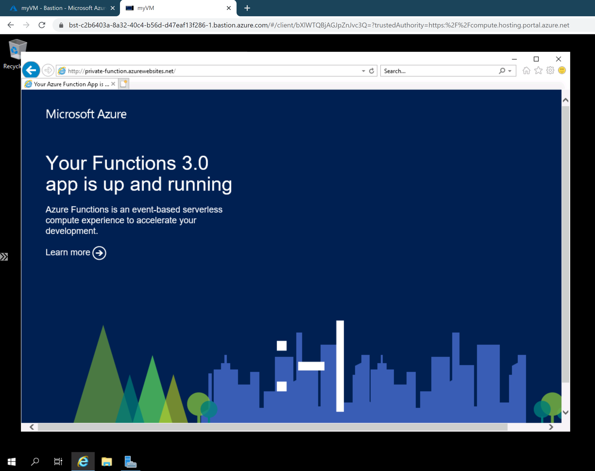

From the VM on the virtual network it is possible to access the default Azure Function site. The next step is to create an Azure Function and deploy it.

It is important to note that while the function app is only accessible from within the designated virtual network, a public DNS entry remains. As shown above, attempting to access the site will result in an HTTP 403 response.

## Create an Azure Function

The next step in this tutorial is to create an HTTP-triggered Azure Function. Invoking the function via an HTTP GET or POST should result in a response of "Hello, {name}".  

1. Follow one of the following quickstarts to create and deploy your Azure Function.

    * [Visual Studio Code](https://docs.microsoft.com/azure/azure-functions/functions-create-first-function-vs-code)
    * [Visual Studio](https://docs.microsoft.com/azure/azure-functions/functions-create-your-first-function-visual-studio)
    * [Command line](https://docs.microsoft.com/azure/azure-functions/functions-create-first-azure-function-azure-cli)
    * [Maven (Java)](https://docs.microsoft.com/azure/azure-functions/functions-create-first-java-maven)

2. When publishing the Azure Function, select the Azure Function Consumption plan previously created in this tutorial. For this tutorial, the Azure Function is deployed from a development machine which is not connected to the virtual network used in the tutorial. It is possible to do so because access restrictions where not configured for the SCM endpoint.
3. Verify the function is deployed.

>[!div class="mx-imgBorder"]
>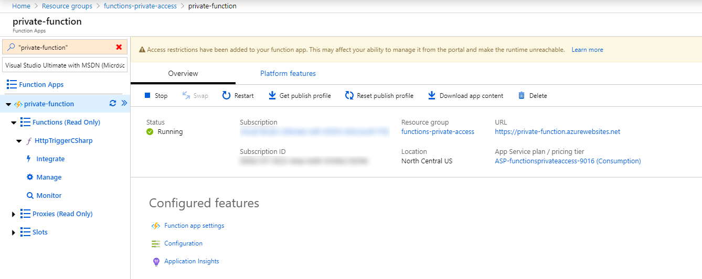

## Invoke the Azure Function

1. In order to test access to the function, copy the function URL.

>[!div class="mx-imgBorder"]
>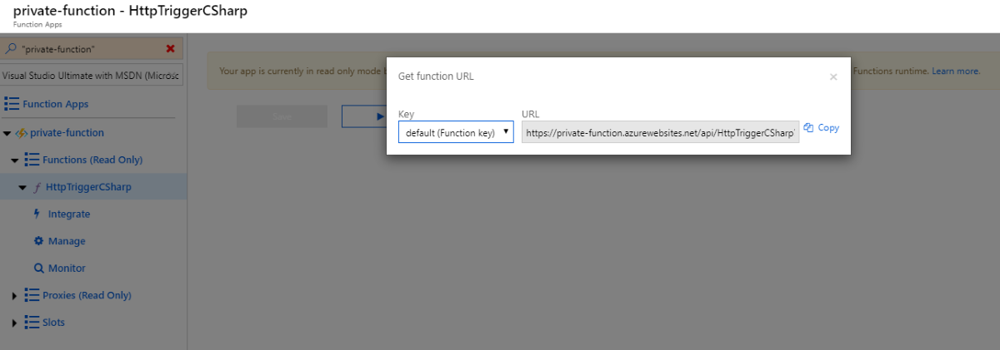

2. Paste the URL into a web browser. Doing so from a local machine will result in an HTTP 403 web app is stopped message.

>[!div class="mx-imgBorder"]
>

    >[!NOTE]
     >When the function runs, you see a runtime error in the portal stating that the function runtime is unable to start. Despite the message text, the function app is actually running. The error is a result of the new access restrictions, which prevent the portal from querying to check on the runtime. 

>[!div class="mx-imgBorder"]
>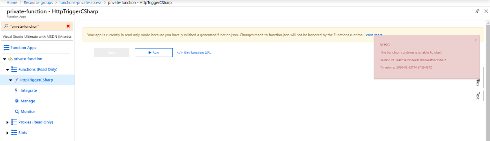

## Invoke the Azure Function from the Virtual Network

Accessing the function via a web browser (by using the Azure Bastion service) on the configured VM on the virtual network results in success!

>[!div class="mx-imgBorder"]
>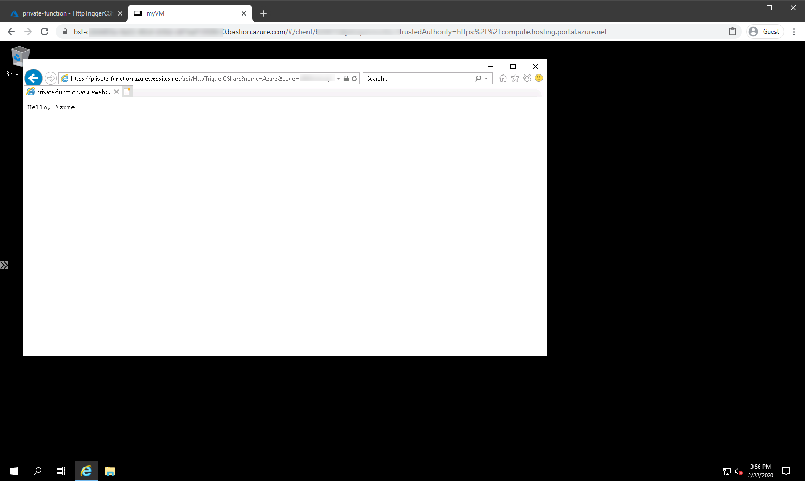

[!INCLUDE [clean-up-section-portal](../../includes/clean-up-section-portal.md)]

## Next steps

In this tutorial, you configured an Azure Function to only be accessible from a specific virtual network.  In order to restrict access to an Azure Function to a specified virtual network, it is necessary to configure access restrictions via a virtual network service endpoint. Doing so will ensure that only resources from within the specified virtual network, such as an Azure VM, can trigger the Azure Function.

> [!div class="nextstepaction"]
> [Learn more about the networking options in Functions](./functions-networking-options.md)
