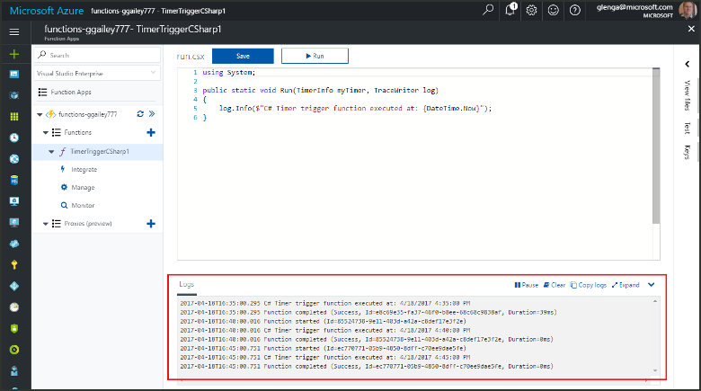

#  Create a function that runs on a schedule in Azure

Learn how to use Azure Functions to create a function that runs based a schedule that you define. 

[!INCLUDE [Next steps note](../../includes/functions-quickstart-previous-topics.md)]

In this topic, you create a timer triggered function in your existing function app.  It should take you less than five minutes to complete all the steps in this topic.

## Find your function app

1. Log in to the [Azure portal](https://portal.azure.com/). 

2. In the search bar at the top of the portal, type the name of your function app and select it from the list.

## Create a timer triggered function

1. In your function app, click the **+** button next to **Functions**, click the **TimerTrigger** template for your desired language.

2. Update the **Schedule** to `0 1 * * * *` and click **Create**. 
   
    

    A function is created in your chosen language that runs every minute. You can verify execution by viewing trace information written the logs. 

    

## Update the timer schedule

To change the schedule used by the timer trigger, expand your function and click **Integrate**, enter an updated **Schedule**, and click **Save**.  

## Clean up resources

Other quick starts in this collection build upon this quick start. If you plan to continue on to work with subsequent quick starts or with the tutorials, do not clean up the resources created in this quick start. If you do not plan to continue, select the resource group from the function app blade and click **Delete**.

## Next steps

[!INCLUDE [Next steps note](../../includes/functions-quickstart-next-steps.md)]

[!INCLUDE [Getting Started Note](../../includes/functions-get-help.md)]

