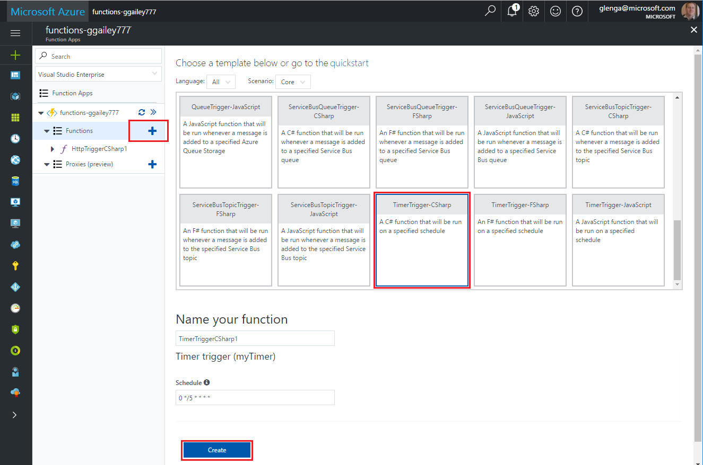

# Create a function in Azure that is triggered by a timer

Learn how to use Azure Functions to create a function that runs based a schedule that you define.

## Prerequisites

To complete this tutorial:

+ If you don't have an Azure subscription, create a [free account](https://azure.microsoft.com/free/?WT.mc_id=A261C142F) before you begin.

[!INCLUDE [functions-portal-favorite-function-apps](../../includes/functions-portal-favorite-function-apps.md)]

## Create an Azure Function app

[!INCLUDE [Create function app Azure portal](../../includes/functions-create-function-app-portal.md)]

Next, you create a function in the new function app.

## Create a timer triggered function

1. Expand your function app and click the **+** button next to **Functions**. If this is the first function in your function app, select **Custom function**. This displays the complete set of function templates.

    

2. Select the **TimerTrigger** template for your desired language. Then use the settings as specified in the table:

    

    | Setting | Suggested value | Description |
    |---|---|---|
    | **Name your function** | TimerTriggerCSharp1 | Defines the name of your timer triggered function. |
    | **[Schedule](http://en.wikipedia.org/wiki/Cron#CRON_expression)** | 0 \*/1 \* \* \* \* | A six field [CRON expression](http://en.wikipedia.org/wiki/Cron#CRON_expression) that schedules your function to run every minute. |

2. Click **Create**. A function is created in your chosen language that runs every minute.

3. Verify execution by viewing trace information written to the logs.

    

Now, you can change the function's schedule so that it runs less often, such as once every hour. 

## Update the timer schedule

1. Expand your function and click **Integrate**. This is where you define input and output bindings for your function and also set the schedule. 

2. Enter a new **Schedule** value of `0 0 */1 * * *`, and then click **Save**.  

You now have a function that runs once every hour. 

## Clean up resources

[!INCLUDE [Next steps note](../../includes/functions-quickstart-cleanup.md)]

## Next steps

You have created a function that runs based on a schedule.

[!INCLUDE [Next steps note](../../includes/functions-quickstart-next-steps.md)]

For more information timer triggers, see [Schedule code execution with Azure Functions](functions-bindings-timer.md).