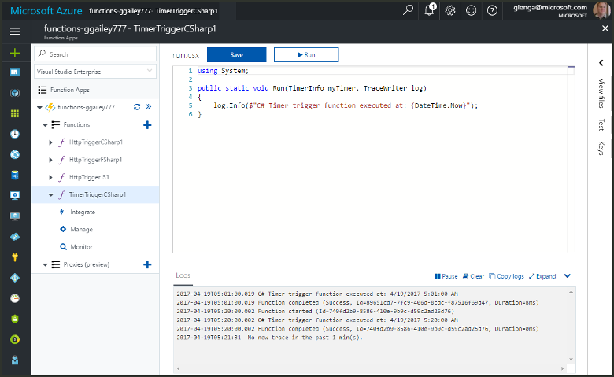
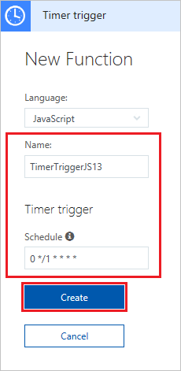
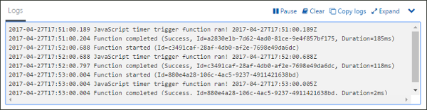
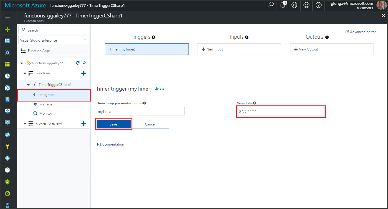

# Create a function in Azure that is triggered by a timer

Learn how to use Azure Functions to create a [serverless](https://azure.microsoft.com/solutions/serverless/) function that runs based a schedule that you define.

## Prerequisites

To complete this tutorial:

+ If you don't have an Azure subscription, create a [free account](https://azure.microsoft.com/free/?WT.mc_id=A261C142F) before you begin.

## Create an Azure Function app

[!INCLUDE [Create function app Azure portal](../../includes/functions-create-function-app-portal.md)]

Next, you create a function in the new function app.

## Create a timer triggered function

1. Expand your function app and click the **+** button next to **Functions**. If this is the first function in your function app, select **In-portal** then **Continue**. Otherwise, go to step three.

   

2. Choose **More templates** then **Finish and view templates**.

    

3. In the search field, type `timer` and configure the new trigger with the settings as specified in the table below the image.

    

    | Setting | Suggested value | Description |
    |---|---|---|
    | **Name** | Default | Defines the name of your timer triggered function. |
    | **Schedule** | 0 \*/1 \* \* \* \* | A six field [CRON expression](functions-bindings-timer.md#cron-expressions) that schedules your function to run every minute. |

4. Click **Create**. A function is created in your chosen language that runs every minute.

5. Verify execution by viewing trace information written to the logs.

    

Now, you change the function's schedule so that it runs once every hour instead of every minute.

## Update the timer schedule

1. Expand your function and click **Integrate**. This is where you define input and output bindings for your function and also set the schedule. 

2. Enter a new hourly **Schedule** value of `0 0 */1 * * *` and then click **Save**.  

You now have a function that runs once every hour. 

## Clean up resources

[!INCLUDE [Next steps note](../../includes/functions-quickstart-cleanup.md)]

## Next steps

You have created a function that runs based on a schedule. For more information about timer triggers, see [Schedule code execution with Azure Functions](functions-bindings-timer.md).

[!INCLUDE [Next steps note](../../includes/functions-quickstart-next-steps.md)]
