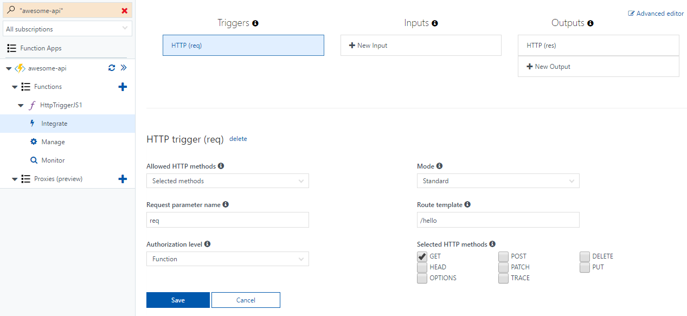
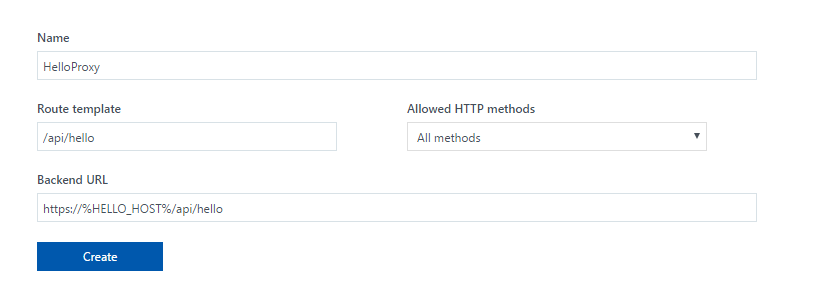

# Create a serverless API using Azure Functions

In this tutorial you will learn how Azure Functions allows you to build highly-scalable APIs. Azure Functions comes with a collection of built-in HTTP triggers and bindings which make it easy to author an endpoint in a variety of languages, including Node.JS, C#, and more. In this tutorial, you will customize an HTTP trigger to handle specific actions in your API design. You will also prepare for growing your API by integrating it with Azure Functions Proxies and setting up mock APIs. All of this is accomplished on top of the Functions serverless compute environment, so you don't have to worry about scaling resources - you can just focus on your API logic.

## Prerequisites 

[!INCLUDE [Previous quickstart note](../../includes/functions-quickstart-previous-topics.md)]

The resulting function will be used for the rest of this tutorial.

### Sign in to Azure

Open the Azure portal. To do this, sign in to [https://portal.azure.com](https://portal.azure.com) with your Azure account.

## Customize your HTTP function

By default, your HTTP-triggered function is configured to accept any HTTP method. There is also a default URL of the form `http://<yourapp>.azurewebsites.net/api/<funcname>?code=<functionkey>`. If you followed the quickstart, then `<funcname>` probably looks something like "HttpTriggerJS1". In this section, you will modify the function to respond only to GET requests against `/api/hello` route instead. 

Navigate to your function in the Azure portal. Select **Integrate** in the left navigation.



Use the HTTP trigger settings as specified in the table.

| Field | Sample value | Description |
|---|---|---|
| Allowed HTTP methods | Selected methods | Determines what HTTP methods may be used to invoke this function |
| Selected HTTP methods | GET | Allows only selected HTTP methods to be used to invoke this function |
| Route template | /hello | Determines what route is used to invoke this function |

Note that you did not include the `/api` base path prefix in the route template, as this is handled by a global setting.

Click **Save**.

You can learn more about customizing HTTP functions in [Azure Functions HTTP and webhook bindings](https://docs.microsoft.com/azure/azure-functions/functions-bindings-http-webhook#customizing-the-http-endpoint).

### Test your API

Next, test your function to see it working with the new API surface.

Navigate back to the development page by clicking on the function's name in the left navigation.

Click **Get function URL** and copy the URL. You should see that it uses the `/api/hello` route now.

Copy the URL into a new browser tab or your preferred REST client. Browsers will use GET by default.

Run the function and confirm that it is working. You may need to provide the "name" parameter as a query string to satisfy the quickstart code.

You can also try calling the endpoint with another HTTP method to confirm that the function is not executed. For this, you will need to use a REST client, such as cURL, Postman, or Fiddler.

## Proxies overview

In the next section, you will surface your API through a proxy. Azure Functions Proxies is a preview feature that allows you to forward requests to other resources. You define an HTTP endpoint just like with HTTP trigger, but instead of writing code to execute when that endpoint is called, you provide a URL to a remote implementation. This allows you to compose multiple API sources into a single API surface which is easy for clients to consume. This is particularly useful if you wish to build your API as microservices.

A proxy can point to any HTTP resource, such as:
- Azure Functions 
- API apps in [Azure App Service](https://docs.microsoft.com/azure/app-service/app-service-value-prop-what-is)
- Docker containers in [App Service on Linux](https://docs.microsoft.com/azure/app-service/app-service-linux-readme)
- Any other hosted API

To learn more about proxies, see [Working with Azure Functions Proxies (preview)].

## Create your first proxy

In this section, you will create a new proxy which serves as a frontend to your overall API. 

### Setting up the frontend environment

Repeat the steps to [Create a function app](https://docs.microsoft.com/azure/azure-functions/functions-create-first-azure-function#create-a-function-app) to create a new function app in which you will create your proxy. This new app will serve as the frontend for our API, and the function app you were previously editing will serve as a backend.

Navigate to your new frontend function app in the portal.

Select **Settings**. Then toggle **Enable Azure Functions Proxies (preview)** to "On".

Select **Platform Settings** and choose **Application Settings**.

Scroll down to **App settings** and create a new setting with key "HELLO_HOST". Set its value to the host of your backend function app, such as `<YourApp>.azurewebsites.net`. This is part of the URL that you copied earlier when testing your HTTP function. You'll reference this setting in the configuration later.

> [!NOTE] 
> App settings are recommended for the host configuration to prevent a hard-coded environment dependency for the proxy. Using app settings means that you can move the proxy configuration between environments, and the environment-specific app settings will be applied.

Click **Save**.

### Creating a proxy on the frontend

Navigate back to your frontend function app in the portal.

In the left-hand navigation, click the plus sign '+' next to "Proxies (preview)".



Use proxy settings as specified in the table.

| Field | Sample value | Description |
|---|---|---|
| Name | HelloProxy | A friendly name used only for management |
| Route template | /api/hello | Determines what route is used to invoke this proxy |
| Backend URL | https://%HELLO_HOST%/api/hello | Specifies the endpoint to which the request should be proxied |

Note that Proxies does not provide the `/api` base path prefix, and this must be included in the route template.

The `%HELLO_HOST%` syntax will reference the app setting you created earlier. The resolved URL will point to your original function.

Click **Create**.

You can try out your new proxy by copying the Proxy URL and testing it in the browser or with your favorite HTTP client.

## Create a mock API

Next, you will use a proxy to create a mock API for your solution. This allows client development to progress, without needing the backend fully implemented. Later in development, you could create a new function app which supports this logic and redirect your proxy to it.

To create this mock API, we will create a new proxy, this time using the [App Service Editor](https://github.com/projectkudu/kudu/wiki/App-Service-Editor). To get started, navigate to your function app in the portal. Select **Platform features** and find **App Service Editor**. Clicking this will open the App Service Editor in a new tab.

Select `proxies.json` in the left navigation. This is the file which stores the configuration for all of your proxies. If you use one of the [Functions deployment methods](https://docs.microsoft.com/azure/azure-functions/functions-continuous-deployment), this is the file you will maintain in source control. To learn more about this file, see [Proxies advanced configuration](https://docs.microsoft.com/azure/azure-functions/functions-proxies#advanced-configuration).

If you've followed along so far, your proxies.json should look like the following:

```json
{
    "$schema": "http://json.schemastore.org/proxies",
    "proxies": {
        "HelloProxy": {
            "matchCondition": {
                "route": "/api/hello"
            },
            "backendUri": "https://%HELLO_HOST%/api/hello"
        }
    }
}
```

Next you'll add your mock API. Replace your proxies.json file with the following:

```json
{
    "$schema": "http://json.schemastore.org/proxies",
    "proxies": {
        "HelloProxy": {
            "matchCondition": {
                "route": "/api/hello"
            },
            "backendUri": "https://%HELLO_HOST%/api/hello"
        },
        "GetUserByName" : {
            "matchCondition": {
                "methods": [ "GET" ],
                "route": "/api/users/{username}"
            },
            "responseOverrides": {
                "response.statusCode": "200",
                "response.headers.Content-Type" : "application/json",
                "response.body": {
                    "name": "{username}",
                    "description": "Awesome developer and master of serverless APIs",
                    "skills": [
                        "Serverless",
                        "APIs",
                        "Azure",
                        "Cloud"
                    ]
                }
            }
        }
    }
}
```

This adds a new proxy, "GetUserByName", without the backendUri property. Instead of calling another resource, it modifies the default response from Proxies using a response override. Request and response overrides can also be used in conjunction with a backend URL. This is particularly useful when proxying to a legacy system, where you might need to modify headers, query parameters, etc. To learn more about request and response overrides, see [Modifying requests and responses in Proxies](https://docs.microsoft.com/azure/azure-functions/functions-proxies#a-namemodify-requests-responsesamodifying-requests-and-responses).

Test your mock API by calling the `/api/users/{username}` endpoint using a browser or your favorite REST client. Be sure to replace _{username}_ with a string value representing a username.

## Next steps

In this tutorial, you learned how to build and customize and API on Azure Functions. You also learned how to bring multiple APIs, including mocks, together as a unified API surface. You can use these techniques to build out APIs of any complexity, all while running on the serverless compute model provided by Azure Functions.

The following references may be helpful as you develop your API further:

- [Azure Functions HTTP and webhook bindings](https://docs.microsoft.com/azure/azure-functions/functions-bindings-http-webhook)
- [Working with Azure Functions Proxies (preview)]
- [Documenting an Azure Functions API (preview)](https://docs.microsoft.com/azure/azure-functions/functions-api-definition-getting-started)


[Create your first function]: https://docs.microsoft.com/azure/azure-functions/functions-create-first-azure-function
[Working with Azure Functions Proxies (preview)]: https://docs.microsoft.com/azure/azure-functions/functions-proxies