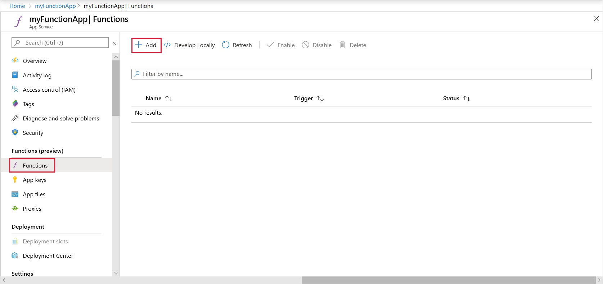
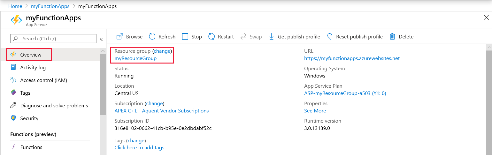
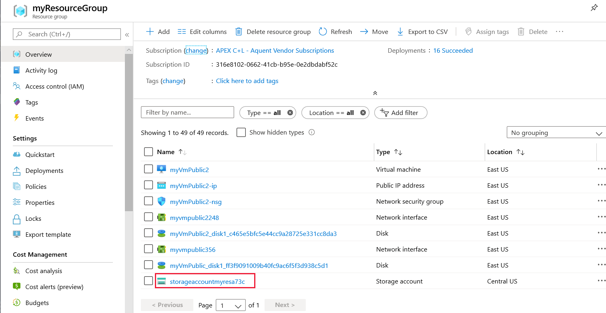
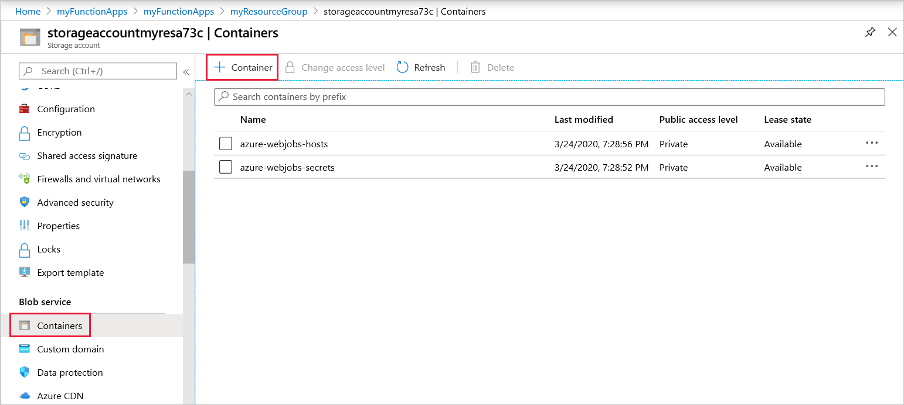
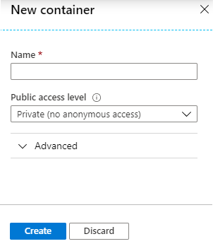
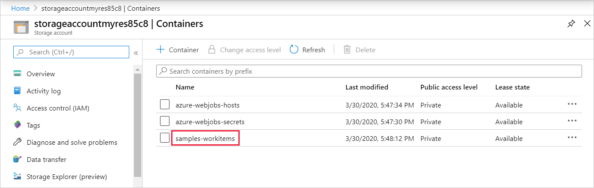

# Create a function in Azure that's triggered by Blob storage

Learn how to create a function triggered when files are uploaded to or updated in a Blob storage container.

## Prerequisites

+ An Azure subscription. If you don't have one, create a [free account](https://azure.microsoft.com/free/?WT.mc_id=A261C142F) before you begin.

## Create an Azure Function app

[!INCLUDE [Create function app Azure portal](../../includes/functions-create-function-app-portal.md)]

You've successfully created your new function app.

Next, you create a function in the new function app.

## Create an Azure Blob storage triggered function

1. Select **Functions**, and then select **+ Add** to add a new function.

   

1. Choose the **Azure Blob Storage trigger** template.

1. Use the settings as specified in the table below the image.

    

    | Setting | Suggested value | Description |
    |---|---|---|
    | **New Function** | Unique in your function app | Name of this blob triggered function. |
    | **Path**   | samples-workitems/{name}    | Location in Blob storage being monitored. The file name of the blob is passed in the binding as the _name_ parameter.  |
    | **Storage account connection** | AzureWebJobsStorage | You can use the storage account connection already being used by your function app, or create a new one.  |

1. Select **Create Function** to create your function.

Next, create the **samples-workitems** container.

## Create the container

1. In your function, on the **Overview** page, select your resource group.

    

1. Find and select your resource group's storage account.

    

1. Choose **Containers**, and then choose **+ Containers**. 

    

1. In the **Name** field, type `samples-workitems`, and then select **Create**.

    

Now that you have a blob container, you can test the function by uploading a file to the container.

## Test the function

1. Back in the Azure portal, browse to your function expand the **Logs** at the bottom of the page and make sure that log streaming isn't paused.

    
    :::image type="content" source="./media/functions-create-storage-blob-triggered-function/functions-storage-log-expander.png" alt-text="Expand the log in the Azure portal." border="false":::

1. In a separate browser window, go to your resource group in the Azure portal, and select the storage account.

1. Select **Containers**, and then select the **samples-workitems** container.

    

1. Select **Upload**, and then select the folder icon to choose a file to upload.

    

1. Browse to a file on your local computer, such as an image file, choose the file. Select **Open** and then **Upload**.

1. Go back to your function logs and verify that the blob has been read.

   

    >[!NOTE]
    > When your function app runs in the default Consumption plan, there may be a delay of up to several minutes between the blob being added or updated and the function being triggered. If you need low latency in your blob triggered functions, consider running your function app in an App Service plan.

## Clean up resources

[!INCLUDE [Next steps note](../../includes/functions-quickstart-cleanup.md)]

## Next steps

You have created a function that runs when a blob is added to or updated in Blob storage. For more information about Blob storage triggers, see [Azure Functions Blob storage bindings](functions-bindings-storage-blob.md).

[!INCLUDE [Next steps note](../../includes/functions-quickstart-next-steps.md)]
