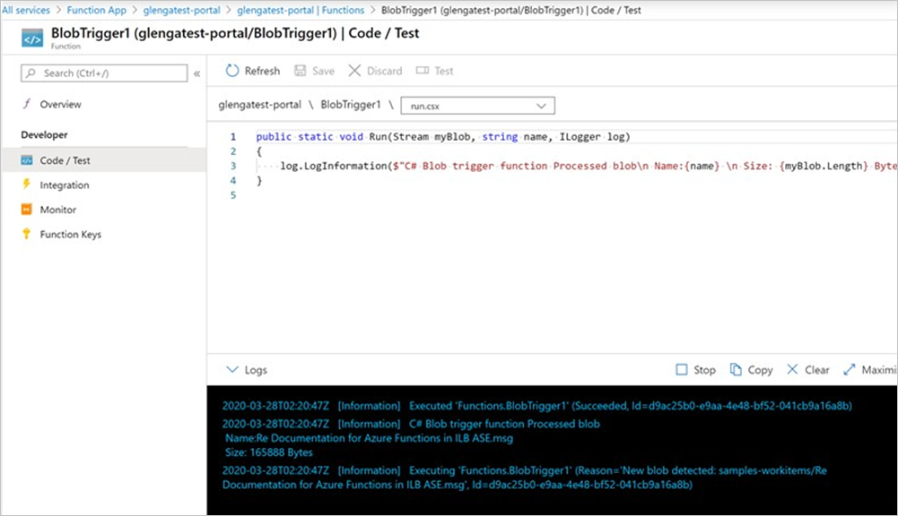
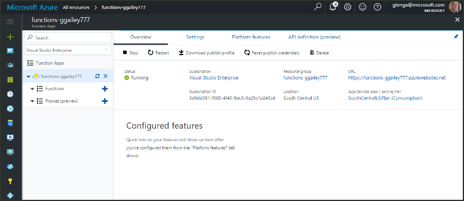
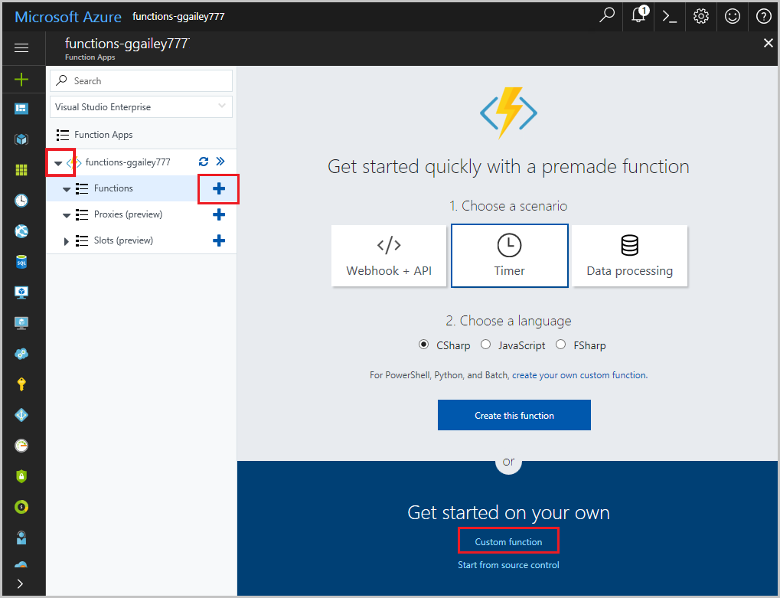
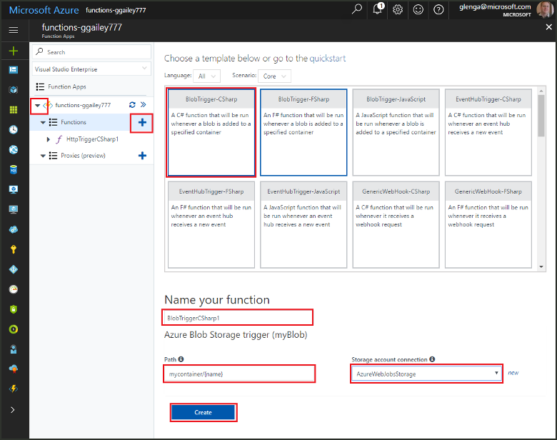
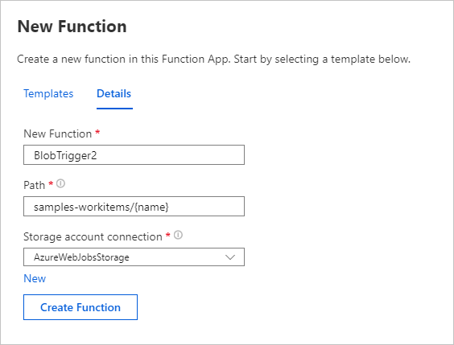
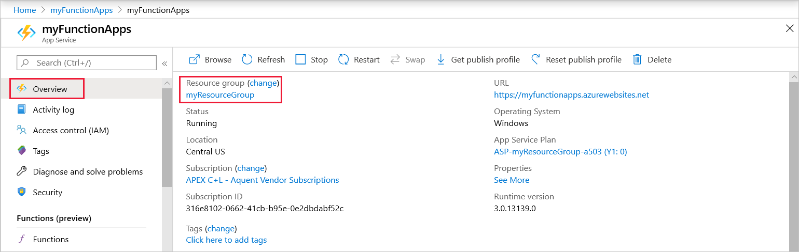
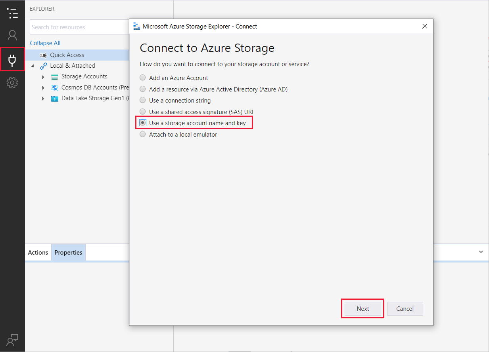
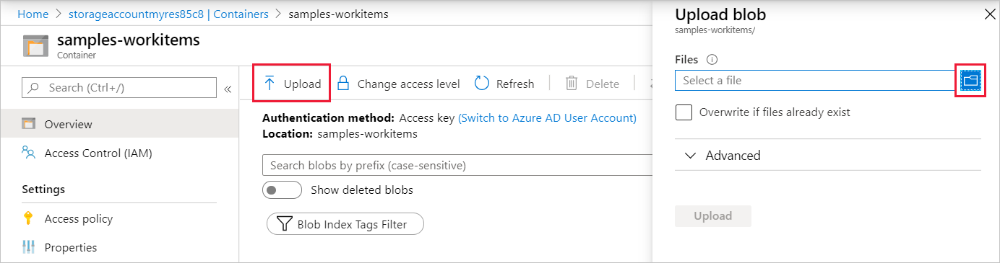

# Create a function triggered by Azure Blob storage

Learn how to create a function triggered when files are uploaded to or updated in Azure Blob storage.

## Prerequisites

+ Download and install the [Microsoft Azure Storage Explorer](http://storageexplorer.com/).
+ An Azure subscription. If you don't have one, create a [free account](https://azure.microsoft.com/free/?WT.mc_id=A261C142F) before you begin.

## Create an Azure Function app

[!INCLUDE [Create function app Azure portal](../../includes/functions-create-function-app-portal.md)]

Next, you create a function in the new function app.

## Create a Blob storage triggered function

1. Expand your function app and click the **+** button next to **Functions**. If this is the first function in your function app, select **In-portal** then **Continue**. Otherwise, go to step three.

   

1. Choose **More templates** then **Finish and view templates**.

    

1. In the search field, type `blob` and then choose the **Blob trigger** template.

1. If prompted, select **Install** to install the Azure Storage extension any dependencies in the function app. After installation succeeds, select **Continue**.

    

1. Use the settings as specified in the table below the image.

    

    | Setting | Suggested value | Description |
    |---|---|---|
    | **Name** | Unique in your function app | Name of this blob triggered function. |
    | **Path**   | samples-workitems/{name}    | Location in Blob storage being monitored. The file name of the blob is passed in the binding as the _name_ parameter.  |
    | **Storage account connection** | AzureWebJobsStorage | You can use the storage account connection already being used by your function app, or create a new one.  |

1. Click **Create** to create your function.

Next, you connect to your Azure Storage account and create the **samples-workitems** container.

## Create the container

1. In your function, click **Integrate**, expand **Documentation**, and copy both **Account name** and **Account key**. You use these credentials to connect to the storage account. If you have already connected your storage account, skip to step 4.

    

1. Run the [Microsoft Azure Storage Explorer](http://storageexplorer.com/) tool, click the connect icon on the left, choose **Use a storage account name and key**, and click **Next**.

    

1. Enter the **Account name** and **Account key** from step 1, click **Next** and then **Connect**. 

    

1. Expand the attached storage account, right-click **Blob containers**, click **Create blob container**, type `samples-workitems`, and then press enter.

    

Now that you have a blob container, you can test the function by uploading a file to the container.

## Test the function

1. Back in the Azure portal, browse to your function expand the **Logs** at the bottom of the page and make sure that log streaming isn't paused.

1. In Storage Explorer, expand your storage account, **Blob containers**, and **samples-workitems**. Click **Upload** and then **Upload files...**.

    

1. In the **Upload files** dialog box, click the **Files** field. Browse to a file on your local computer, such as an image file, select it and click **Open** and then **Upload**.

1. Go back to your function logs and verify that the blob has been read.

   

    >[!NOTE]
    > When your function app runs in the default Consumption plan, there may be a delay of up to several minutes between the blob being added or updated and the function being triggered. If you need low latency in your blob triggered functions, consider running your function app in an App Service plan.

## Clean up resources

[!INCLUDE [Next steps note](../../includes/functions-quickstart-cleanup.md)]

## Next steps

You have created a function that runs when a blob is added to or updated in Blob storage. 

[!INCLUDE [Next steps note](../../includes/functions-quickstart-next-steps.md)]

For more information about Blob storage triggers, see [Azure Functions Blob storage bindings](functions-bindings-storage-blob.md).
