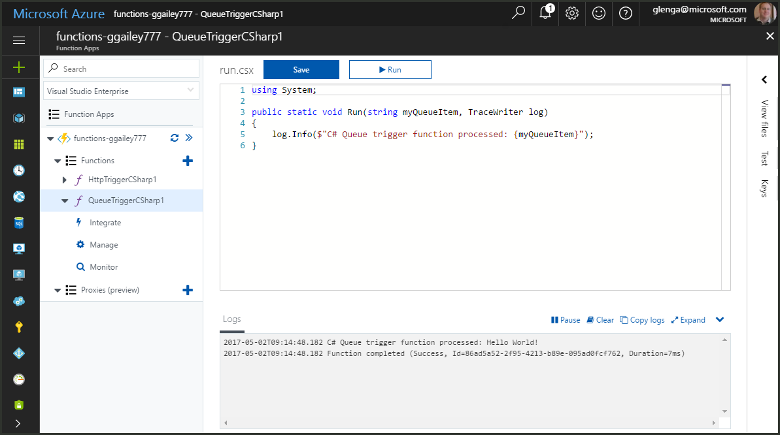
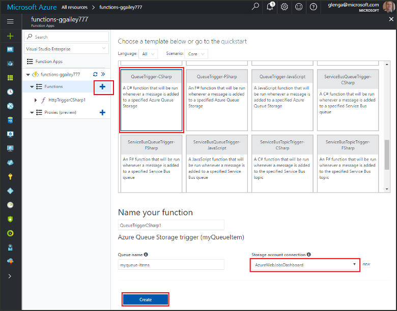
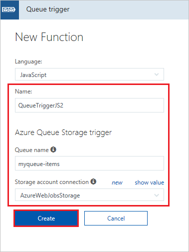
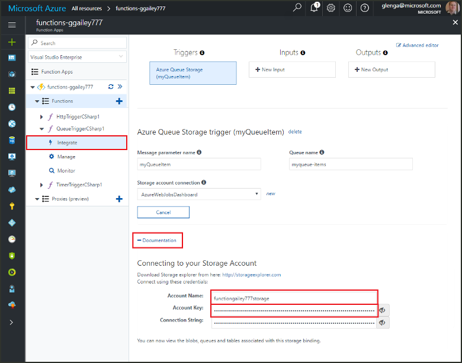
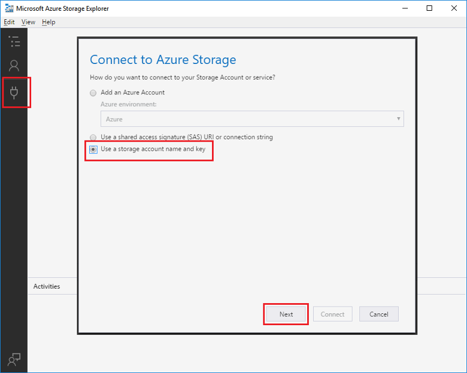
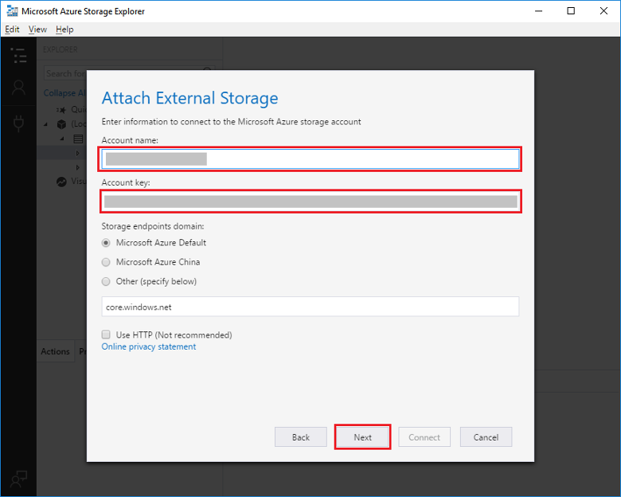
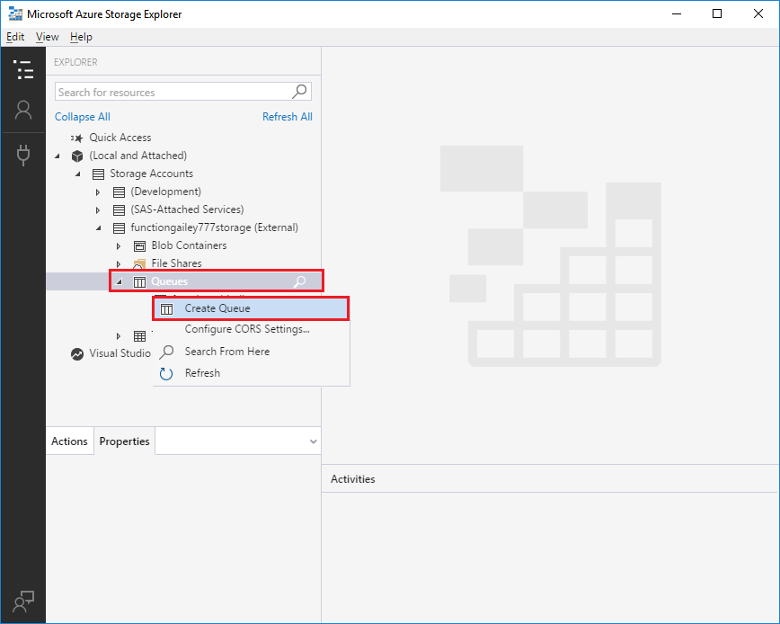
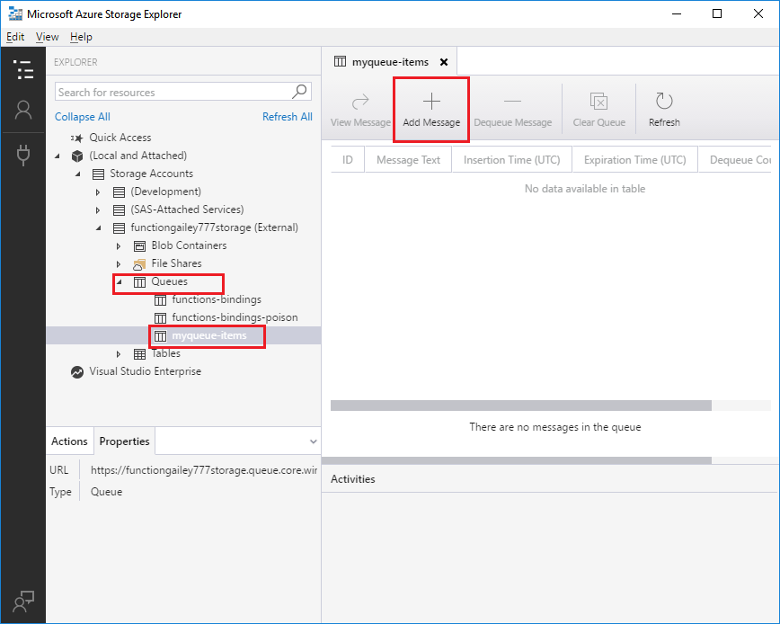
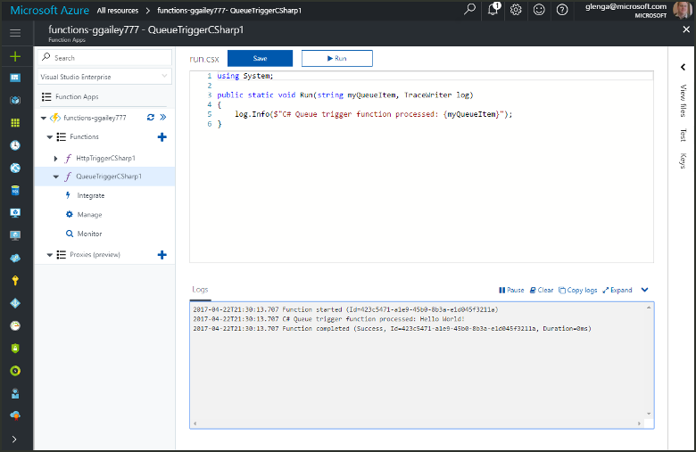

# Create a function triggered by Azure Queue storage

Learn how to create a function that is triggered when messages are submitted to an Azure Storage queue.

## Prerequisites

- Download and install the [Microsoft Azure Storage Explorer](https://storageexplorer.com/).

- An Azure subscription. If you don't have one, create a [free account](https://azure.microsoft.com/free/?WT.mc_id=A261C142F) before you begin.

## Create an Azure Function app

[!INCLUDE [Create function app Azure portal](../../includes/functions-create-function-app-portal.md)]

Next, you create a function in the new function app.

## Create a Queue triggered function

1. Expand your function app and click the **+** button next to **Functions**. If this is the first function in your function app, select **In-portal** then **Continue**. Otherwise, go to step three.

   

1. Choose **More templates** then **Finish and view templates**.

    

1. In the search field, type `queue` and then choose the **Queue trigger** template.

1. If prompted, select **Install** to install the Azure Storage extension any dependencies in the function app. After installation succeeds, select **Continue**.

    

1. Use the settings as specified in the table below the image.

    

    | Setting | Suggested value | Description |
    |---|---|---|
    | **Name** | Unique in your function app | Name of this queue triggered function. |
    | **Queue name**   | myqueue-items    | Name of the queue to connect to in your Storage account. |
    | **Storage account connection** | AzureWebJobStorage | You can use the storage account connection already being used by your function app, or create a new one.  |    

1. Click **Create** to create your function.

Next, you connect to your Azure Storage account and create the **myqueue-items** storage queue.

## Create the queue

1. In your function, click **Integrate**, expand **Documentation**, and copy both **Account name** and **Account key**. You use these credentials to connect to the storage account in Azure Storage Explorer. If you have already connected your storage account, skip to step 4.

    

1. Run the [Microsoft Azure Storage Explorer](https://storageexplorer.com/) tool, click the connect icon on the left, choose **Use a storage account name and key**, and click **Next**.

    

1. Enter the **Account name** and **Account key** from step 1, click **Next** and then **Connect**.

    

1. Expand the attached storage account, right-click **Queues**, click **Create Queue**, type `myqueue-items`, and then press enter.

    

Now that you have a storage queue, you can test the function by adding a message to the queue.

## Test the function

1. Back in the Azure portal, browse to your function, expand the **Logs** at the bottom of the page, and make sure that log streaming isn't paused.

1. In Storage Explorer, expand your storage account, **Queues**, and **myqueue-items**, then click **Add message**.

    

1. Type your "Hello World!" message in **Message text** and click **OK**.

1. Wait for a few seconds, then go back to your function logs and verify that the new message has been read from the queue.

    

1. Back in Storage Explorer, click **Refresh** and verify that the message has been processed and is no longer in the queue.

## Clean up resources

[!INCLUDE [Next steps note](../../includes/functions-quickstart-cleanup.md)]

## Next steps

You have created a function that runs when a message is added to a storage queue. For more information about Queue storage triggers, see [Azure Functions Storage queue bindings](functions-bindings-storage-queue.md).

Now that you have a created your first function, let's add an output binding to the function that writes a message back to another queue.

> [!div class="nextstepaction"]
> [Add messages to an Azure Storage queue using Functions](functions-integrate-storage-queue-output-binding.md)
