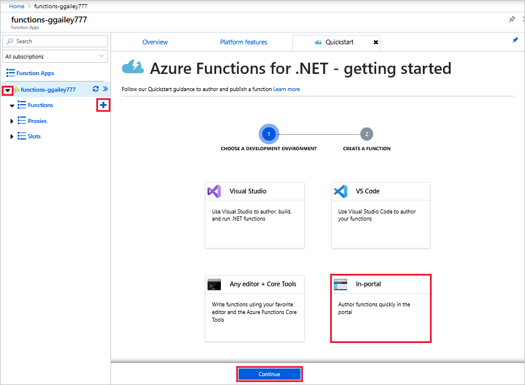

# Create a Function using Azure for Students Starter

In this tutorial we will walk through the scope of the Azure Functions offering in Azure for Students Starter and then walk through the creation of a hello world HTTP function in the Azure portal!

Microsoft *Azure for Students Starter* gets you started with the Azure products you need to develop in the cloud at no cost to you. [Learn more about this offer here](azure.microsoft.com/offers/ms-azr-0144p/)

Azure Functions lets you execute your code in a [serverless](https://azure.microsoft.com/solutions/serverless/) environment without having to first create a VM or publish a web application. [Learn more about Functions here](./functions-overview.md)

## Capibilities of Functions in Azure for Students Starter

In this offering you have access to most of the features of the Azure Functions runtime, with several key limitations:

* The HTTP trigger is the only trigger type supported.
    * However, all input and all output bindings are supported! [See the full list here](functions-triggers-bindings.md)
* Languages Supported: 
    * C# (.NET Core 2)
    * Javascript (Node.js 8 & 10)
    * F# (.NET Core 2)
    * [See languages supported in higher plans here](supported-languages.md)
* Scale is restricted to [one free tier instance](azure.microsoft.com/pricing/details/app-service/windows/) running for up to 60 minutes each day. You will serverlessly scale from 0 to 1 instances automatically as HTTP traffic is recieved, but no further.
* [The 2.x runtime](functions-versions) is the only supported runtime.
* All developer tooling is supported for editing and publishing functions: VS code, Visual studio, the Azure CLI, and the portal. However, only the portal can create a new Function app to behave as a publishing target in all tools.

## Create an HTTP triggered helo world Function

 In this topic, learn how to use Functions to create a "hello world" function in the Azure portal.

[!INCLUDE [quickstarts-free-trial-note](../../includes/quickstarts-free-trial-note.md)]

> [!NOTE]
> C# developers should consider [creating your first function in Visual Studio 2017](functions-create-your-first-function-visual-studio.md) instead of in the portal. 

## Log in to Azure

Sign in to the Azure portal at <https://portal.azure.com> with your Azure account.

## Create a function app

You must have a function app to host the execution of your functions. A function app lets you group functions as a logic unit for easier management, deployment, and sharing of resources. 

[!INCLUDE [Create function app Azure portal](../../includes/functions-create-function-app-portal.md)]

Next, you create a function in the new function app.

## Create an HTTP triggered function

1. Expand your new function app, then select the **+** button next to **Functions**, choose **In-portal**, and select **Continue**.

    

1. Choose **WebHook + API** and then select **Create**.

    

A function is created using a language-specific template for an HTTP triggered function.

Now, you can run the new function by sending an HTTP request.

## Test the function

1. In your new function, click **</> Get function URL** at the top right, select **default (Function key)**, and then click **Copy**. 

    

2. Paste the function URL into your browser's address bar. Add the query string value `&name=<yourname>` to the end of this URL and press the `Enter` key on your keyboard to execute the request. You should see the response returned by the function displayed in the browser.  

    The following example shows the response in the browser:

    

    The request URL includes a key that is required, by default, to access your function over HTTP.

3. When your function runs, trace information is written to the logs. To see the trace output from the previous execution, return to your function in the portal and click the arrow at the bottom of the screen to expand the **Logs**.

   

## Clean up resources

[!INCLUDE [Clean-up resources](../../includes/functions-quickstart-cleanup.md)]

## Next steps

You have created a function app with a simple HTTP triggered function.  

[!INCLUDE [Next steps note](../../includes/functions-quickstart-next-steps.md)]

For more information, see [Azure Functions HTTP bindings](functions-bindings-http-webhook.md).
