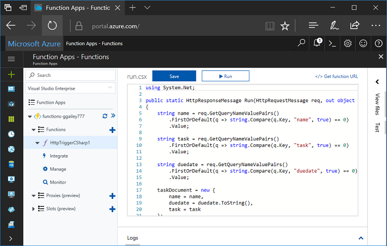
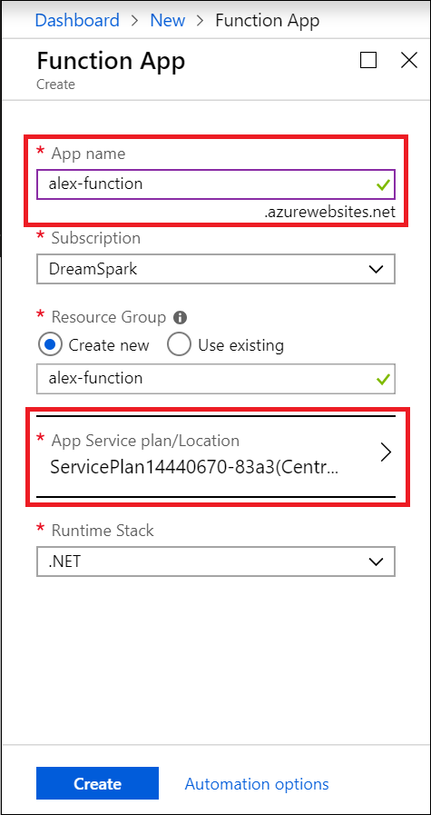
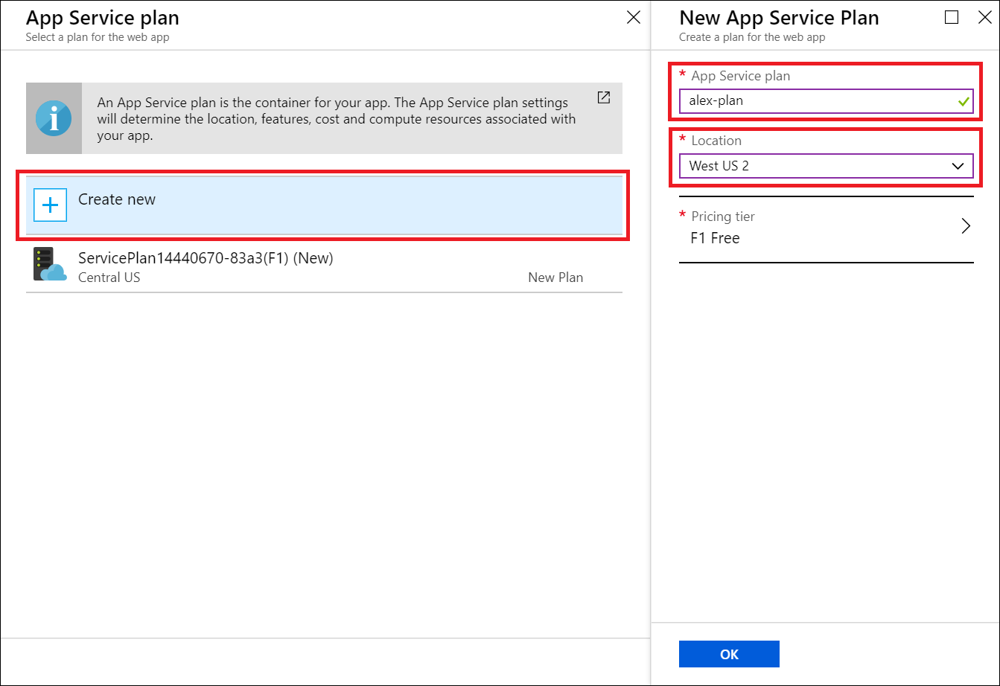
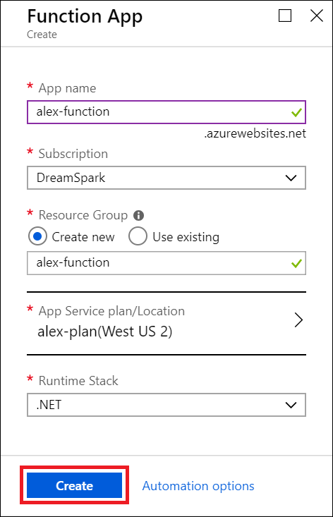
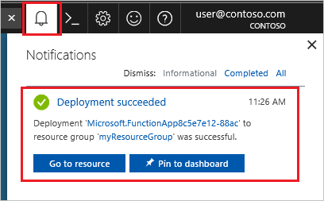
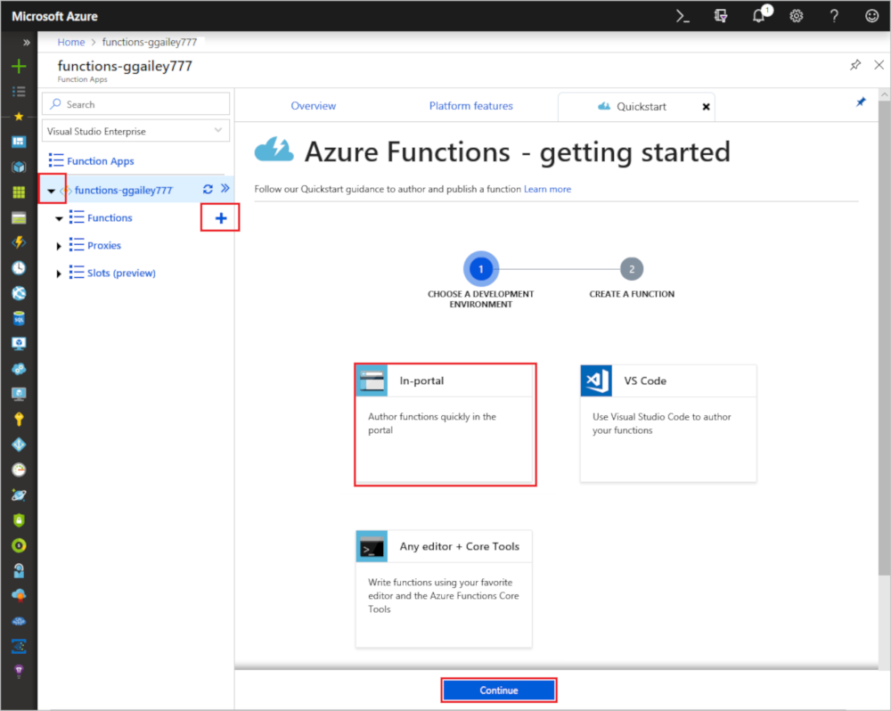
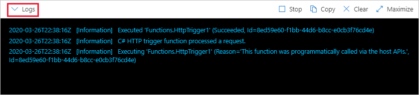

# Create a function using Azure for Students Starter

In this tutorial, we will create a "hello world" HTTP function in an Azure for Students Starter subscription. We'll also walk through what's available in Azure Functions in this subscription type.

Microsoft *Azure for Students Starter* gets you started with the Azure products you need to develop in the cloud at no cost to you. [Learn more about this offer here.](https://azure.microsoft.com/offers/ms-azr-0144p/)

Azure Functions lets you execute your code in a [serverless](https://azure.microsoft.com/solutions/serverless/) environment without having to first create a VM or publish a web application. [Learn more about Functions here.](./functions-overview.md)

## Create a function

 In this topic, learn how to use Functions to create an HTTP triggered "hello world" function in the Azure portal.

## Sign in to Azure

Sign in to the Azure portal at <https://portal.azure.com> with your Azure account.

## Create a function app

You must have a function app to host the execution of your functions. A function app lets you group functions as a logical unit for easier management, deployment, scaling, and sharing of resources.

1. Select the **Create a resource** button found in the upper-left corner of the Azure portal. Then select **Compute** > **Function App**.

    

2. Use the function app settings as specified in the table below the image.

    

    | Setting      | Suggested value  | Description                                        |
    | ------------ |  ------- | -------------------------------------------------- |
    | **App name** | Globally unique name | Name that identifies your new function app. Valid characters are `a-z`, `0-9`, and `-`.  | 
    | **Subscription** | Your subscription | The subscription under which this new function app is created. | 
    | **[Resource Group](../azure-resource-manager/management/overview.md)** |  myResourceGroup | Name for the new resource group in which to create your function app. |
   | **[App Service Plan/Location](./functions-scale.md)** | New | The hosting plan that controls what region your function app is deployed to and the density of your resources. Multiple Function Apps deployed to the same plan will all share the same single free instance. This is a restriction of the Student Starter plan. The full hosting options are [explained here.](./functions-scale.md)|
    | **Runtime stack** | Preferred language | Choose a runtime that supports your favorite function programming language. Choose **.NET** for C# and F# functions. |
    |**[Application Insights](./functions-monitoring.md)**| Enabled | Application Insights is used to store and analyze your function app's logs. It is enabled by default if you choose a location that supports Application Insights. Application Insights can be enabled for any function by manually choosing a nearby region to deploy Application Insights. Without Application Insights, you will only be able to view live streaming logs.

3. Select **App Service plan/Location** above to choose a different location

4. Select **Create new** and then give your plan a unique name.

5. Select the location closest to you. [See a full map of Azure regions here.](https://azure.microsoft.com/global-infrastructure/regions/) 

    

6. Select **Create** to provision and deploy the function app.

    

7. Select the Notification icon in the upper-right corner of the portal and watch for the **Deployment succeeded** message.

    

8. Select **Go to resource** to view your new function app.

Next, you create a function in the new function app.

## Create an HTTP triggered function

1. Expand your new function app, then select the **+** button next to **Functions**, choose **In-portal**, and select **Continue**.

    

1. Choose **WebHook + API** and then select **Create**.

    

A function is created using a language-specific template for an HTTP triggered function.

Now, you can run the new function by sending an HTTP request.

## Test the function

1. In your new function, click **</> Get function URL** at the top right, select **default (Function key)**, and then click **Copy**. 

    

2. Paste the function URL into your browser's address bar. Add the query string value `&name=<yourname>` to the end of this URL and press the `Enter` key on your keyboard to execute the request. You should see the response returned by the function displayed in the browser.  

    The following example shows the response in the browser:

    

    The request URL includes a key that is required, by default, to access your function over HTTP.

3. When your function runs, trace information is written to the logs. To see the trace output from the previous execution, return to your function in the portal and click the arrow at the bottom of the screen to expand the **Logs**.

   

## Clean up resources

[!INCLUDE [Clean-up resources](../../includes/functions-quickstart-cleanup.md)]

## Supported features in Azure for Students Starter

In Azure for Students Starter you have access to most of the features of the Azure Functions runtime, with several key limitations listed below:

* The HTTP trigger is the only trigger type supported.
    * All input and all output bindings are supported! [See the full list here.](functions-triggers-bindings.md)
* Languages Supported: 
    * C# (.NET Core 2)
    * JavaScript (Node.js 8 & 10)
    * F# (.NET Core 2)
    * [See languages supported in higher plans here](supported-languages.md)
* Windows is the only supported operating system.
* Scale is restricted to [one free tier instance](https://azure.microsoft.com/pricing/details/app-service/windows/) running for up to 60 minutes each day. You will serverlessly scale from 0 to 1 instance automatically as HTTP traffic is received, but no further.
* Only [version 2.x and later](functions-versions.md) of the Functions runtime is supported.
* All developer tooling is supported for editing and publishing functions. This includes VS Code, Visual Studio, the Azure CLI, and the Azure portal. If you'd like to use anything other than the portal, you will need to first create an app in the portal, and then choose that app as a deployment target in your preferred tool.

## Next steps

You have created a function app with a simple HTTP triggered function! Now you can explore local tooling, more languages, monitoring, and integrations.

 * [Create your first function using Visual Studio](./functions-create-your-first-function-visual-studio.md)
 * [Create your first function using Visual Studio Code](./functions-create-first-function-vs-code.md)
 * [Azure Functions JavaScript developer guide](./functions-reference-node.md)
 * [Use Azure Functions to connect to an Azure SQL Database](./functions-scenario-database-table-cleanup.md)
 * [Learn more about Azure Functions HTTP bindings](./functions-bindings-http-webhook.md).
 * [Monitor your Azure Functions](./functions-monitoring.md)
