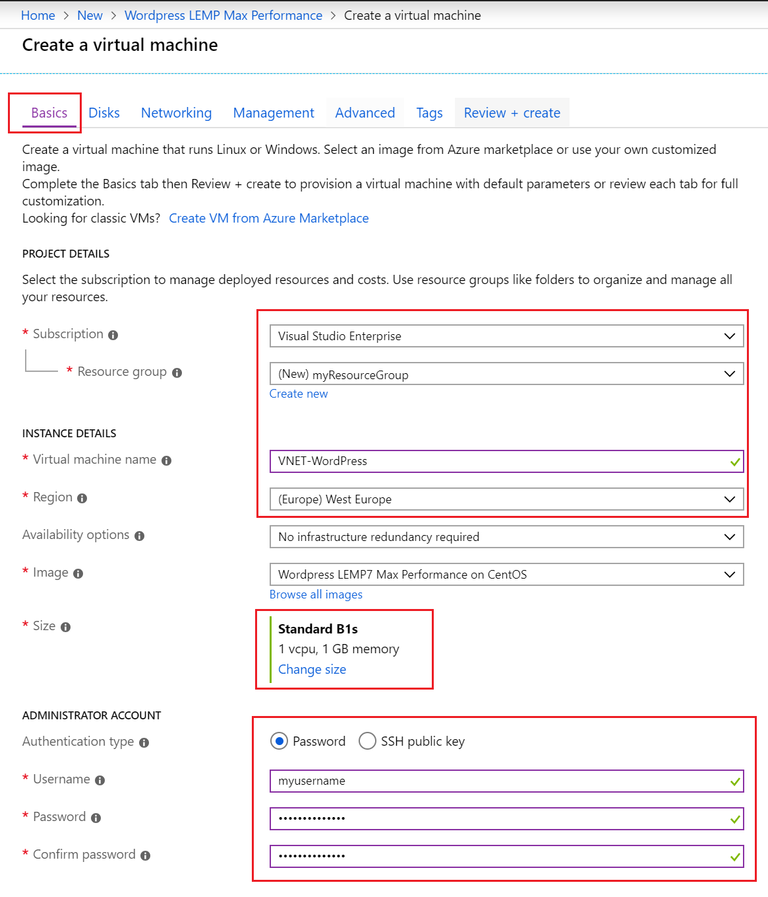
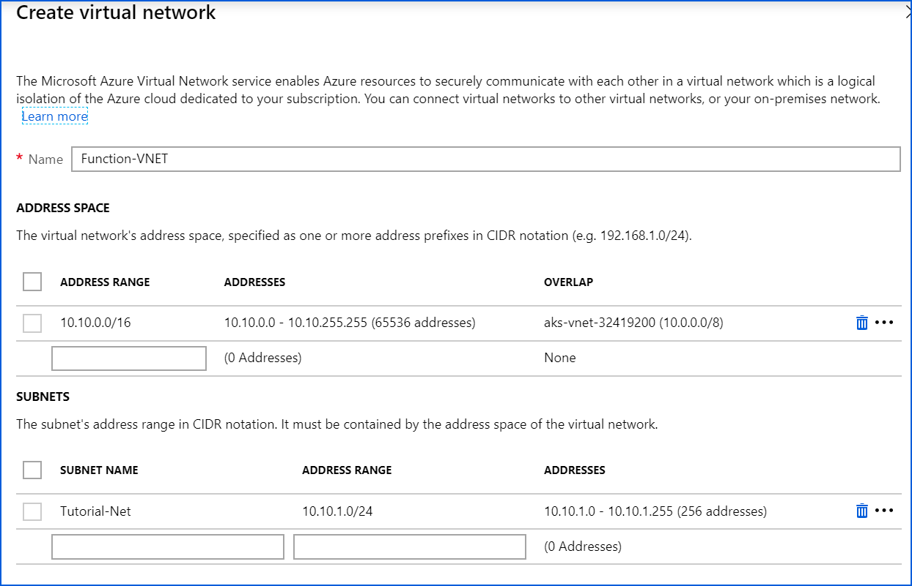
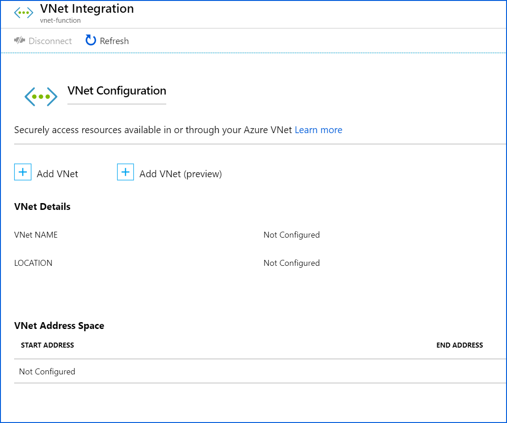
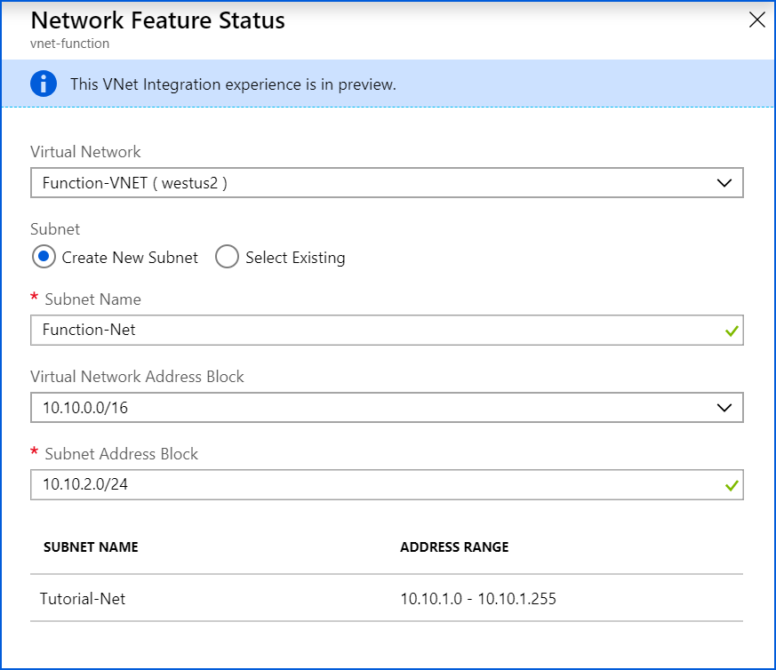
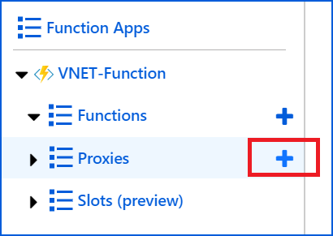
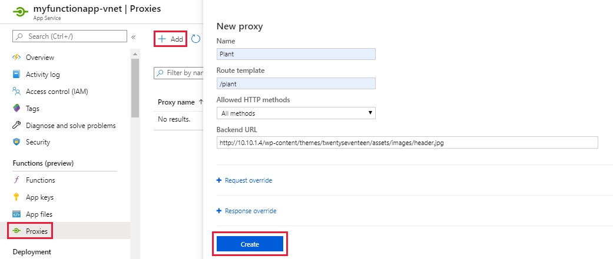
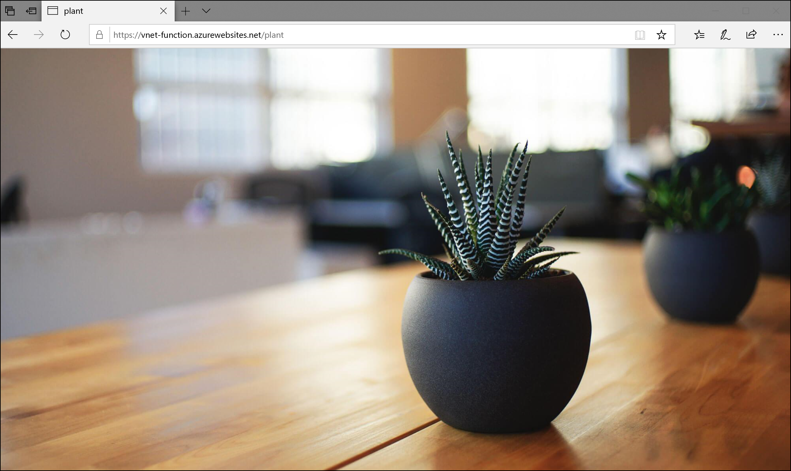

# Integrate a function app with an Azure virtual network

This tutorial shows you how to use Azure Functions to connect to resources in an Azure virtual network.

For this tutorial, we'll deploy a WordPress site on a VM in a virtual network that's not accessible from the internet. We'll then deploy a function with access to both the internet and the virtual network. We'll use that function to access resources from the WordPress site deployed inside the virtual network.

For more information on how the system works, troubleshooting, and advanced configuration, see [Integrate your app with an Azure virtual network](https://docs.microsoft.com/azure/app-service/web-sites-integrate-with-vnet). Azure functions in the Premium plan have the same hosting capabilities as web apps, so all the functionality and limitations in that article apply to functions.

## Topology

 ![UI for virtual network integration][1]

## Create a VM inside a virtual network

To start, we'll create a preconfigured VM that runs WordPress inside a virtual network. 

We chose WordPress on a VM because it's one of the least expensive resources that can be deployed inside a virtual network. Note that this scenario can also work with any resource in a virtual network, such as REST APIs, App Service Environments, and other Azure services.

1. Go to the Azure portal.
2. Add a new resource by opening the **Create a resource** blade.
3. Search for “[WordPress LEMP7 Max Performance on CentOS](https://jetware.io/appliances/jetware/wordpress4_lemp7-170526/profile?us=azure)” and open its creation blade. 
4. On the **Basics** tab, configure the VM with the following information:
    1. Create a new resource group for this VM to make cleaning up the resources easier at the end of the tutorial. Here, we're using “Function-VNET-Tutorial” as an example.
    1. Give the virtual machine a unique name. We're using “VNET-Wordpress” as an example.
    1. Select the region closest to you.
    1. Select the size as B1s (1 vCPU, 1 GB of memory).
    1. For the administrator account, choose password authentication and enter a unique username and password. For this tutorial, you won't need to sign in to the VM unless you need to troubleshoot.
    
        

1. Move to the **Networking** tab and enter the following information:
    1.	Create a new virtual network.
    1.	Enter a private address range and a subnet within that address range. The subnet size will determine how many VMs you can use in the App Service plan. If IP addressing and subnetting are new to you, there's a [document that covers the basics](https://support.microsoft.com/en-us/help/164015/understanding-tcp-ip-addressing-and-subnetting-basics). IP addressing and subnetting are important in this scenario, so we recommend that you read a few articles and watch a few videos online until it makes sense. 
    
        For this example, we're opting to use the 10.10.0.0/16 network with a subnet of 10.10.1.0/24. We're overprovisioning and using a /16 subnet because it's easy to calculate which subnets are available in the 10.10.0.0/16 network.
        
        

1. Back on the **Networking** tab, set the public IP to **None**. This step will deploy the VM with access to only the virtual network.
       
    

7. Create the VM. The process will take about 5 minutes.
8. After the VM is created, go to its **Networking** tab and note the private IP address for later. The VM should not have a public IP.

    ![14]

You now have a WordPress site deployed entirely within your virtual network. This site is not accessible from the public internet.

## Create a function app in a Premium plan

The next step is to create a function app in a Premium plan. A Premium plan brings serverless scale with all the benefits of a dedicated App Service plan. Function apps created through the Consumption plan don't support virtual network integration.

[!INCLUDE [functions-premium-create](../../includes/functions-premium-create.md)]  

## Connect your function app to your virtual network

With a WordPress site hosting files from within your virtual network, you can now connect the function app to the virtual network.

1.	In the portal for the function app from the previous step, select **Platform features**. Then select **Networking**.

    

1.	Select **Click here to configure** under **VNet Integration**.

    

1. On the virtual network integration page, select **Add VNet (preview)**.

     
    
1.  Create a new subnet for your function and App Service plan to use. Note that the subnet size will restrict the total number of VMs that you can add to your App Service plan. Your virtual network will automatically route traffic between the subnets in your virtual network, so it doesn't matter that your function is in a different subnet from your VM. 
    
    

## Create a function that accesses a resource in your virtual network

The function app can now access the virtual network with our WordPress site. So we're going to use the function to access that file and serve it back to the user. For this example, we'll use a WordPress site as the API and a proxy as the calling function because they're both easy to set up and visualize. 

You can just as easily use any other API deployed within a virtual network. You can also use another function with code that makes API calls to the API deployed within your virtual network. A SQL Server instance deployed within your virtual network is a perfect example.

1. In the portal, open the function app from the previous step.
1. Create a proxy by selecting  **Proxies** > **+**.

    

1. Configure the proxy name and route. This example uses "/plant" as a route.
1. Fill in your WordPress site's IP from earlier and set **Backend URL** to `http://{YOUR VM IP}/wp-content/themes/twentyseventeen/assets/images/header.jpg`
    
    

Now, if you try to visit your back-end URL directly by pasting it into a new browser tab, the page should time out. This is because your WordPress site is connected to only your virtual network and not the internet. If you paste your proxy URL into the browser, you should see a plant picture (pulled from your WordPress site) inside your virtual network. 

Your function app is connected to both the internet and your virtual network. The proxy is receiving a request over the public internet, and then acting as a simple HTTP proxy to forward that request along into the virtual network. The proxy then relays the response back to you over the public internet. 

## Next steps

Functions running in a Premium plan share the same underlying App Service infrastructure as web apps on PremiumV2 plans. All the documentation for web apps applies to your Premium plan functions.

* [Learn more about the networking options in Functions](./functions-networking-options.md)
* [Read the Functions networking FAQ](./functions-networking-faq.md)
* [Learn more about virtual networks in Azure](../virtual-network/virtual-networks-overview.md)
* [Enable more networking features and control with App Service Environments](../app-service/environment/intro.md)
* [Connect to individual on-premises resources without firewall changes by using Hybrid Connections](../app-service/app-service-hybrid-connections.md)
* [Learn more about Functions Proxies](./functions-proxies.md)

<!--Image references -->
[1]: ./media/functions-create-vnet/topology.png
[2]: ./media/functions-create-vnet/create-function-app.png
[3]: ./media/functions-create-vnet/create-app-service-plan.png
[4]: ./media/functions-create-vnet/configure-vnet.png
[5]: ./media/functions-create-vnet/create-vm-1.png
[6]: ./media/functions-create-vnet/create-vm-2.png
[7]: ./media/functions-create-vnet/create-vm-2-1.png
[8]: ./media/functions-create-vnet/networking-1.png
[9]: ./media/functions-create-vnet/networking-2.png
[10]: ./media/functions-create-vnet/networking-3.png
[11]: ./media/functions-create-vnet/new-proxy.png
[12]: ./media/functions-create-vnet/create-proxy.png
[14]: ./media/functions-create-vnet/vm-networking.png
