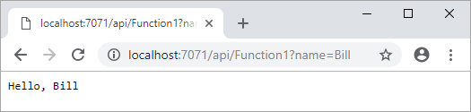
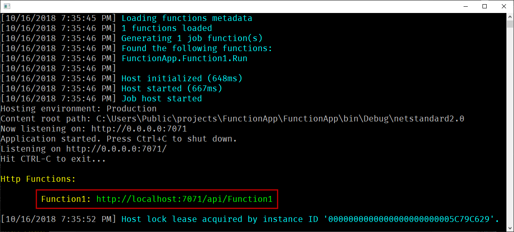
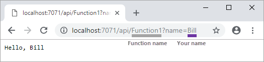
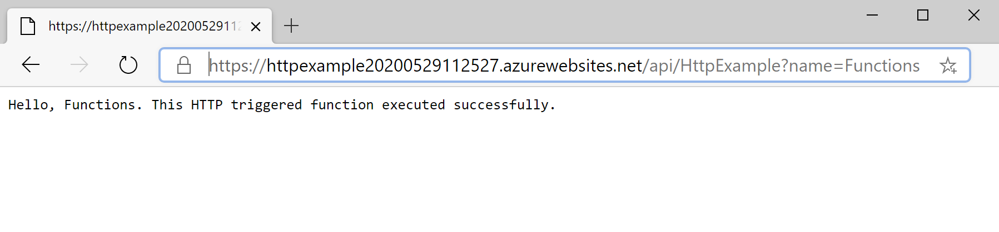

# Create your first function using Visual Studio

Azure Functions lets you execute your code in a [serverless](https://azure.microsoft.com/solutions/serverless/) environment without having to first create a VM or publish a web application.

In this article, you learn how to use the Visual Studio 2019 tools for Azure Functions to locally create and test a "hello world" function. You then publish the function code to Azure. These tools are available as part of the Azure development workload in Visual Studio 2019.

This topic includes [a video](#watch-the-video) that demonstrates the same basic steps.

## Prerequisites

To complete this tutorial:

* Install [Visual Studio 2019](https://azure.microsoft.com/downloads/) and ensure that the **Azure development** workload is also installed.

* Make sure you have the [latest Azure Functions tools](functions-develop-vs.md#check-your-tools-version).

[!INCLUDE [quickstarts-free-trial-note](../../includes/quickstarts-free-trial-note.md)]

## Create a function app project

[!INCLUDE [Create a project using the Azure Functions template](../../includes/functions-vstools-create.md)]

Visual Studio creates a project and in it a class that contains boilerplate code for the chosen function type. The **FunctionName** attribute on the method sets the name of the function. The **HttpTrigger** attribute specifies that the function is triggered by an HTTP request. The boilerplate code sends an HTTP response that includes a value from the request body or query string. You can add input and output bindings to a function by applying the appropriate attributes to the method. For more information, see the [Triggers and bindings](functions-dotnet-class-library.md#triggers-and-bindings) section of the [Azure Functions C# developer reference](functions-dotnet-class-library.md).

Now that you've created your function project and an HTTP-triggered function, you can test it on your local computer.

## Test the function locally

Azure Functions Core Tools lets you run an Azure Functions project on your local development computer. You are prompted to install these tools the first time you start a function from Visual Studio.

1. To test your function, press F5. If prompted, accept the request from Visual Studio to download and install Azure Functions Core (CLI) tools. You may also need to enable a firewall exception so that the tools can handle HTTP requests.

2. Copy the URL of your function from the Azure Functions runtime output.

    

3. Paste the URL for the HTTP request into your browser's address bar. Append the query string `?name=<YOUR_NAME>` to this URL and execute the request. The following shows the response in the browser to the local GET request returned by the function: 

    

4. To stop debugging, press **Shift + F5**.

After you have verified that the function runs correctly on your local computer, it's time to publish the project to Azure.

## Publish the project to Azure

You must have a function app in your Azure subscription before you can publish your project. You can create a function app right from Visual Studio.

[!INCLUDE [Publish the project to Azure](../../includes/functions-vstools-publish.md)]

## Test your function in Azure

1. Copy the base URL of the function app from the Publish profile page. Replace the `localhost:port` portion of the URL you used when testing the function locally with the new base URL. As before, make sure to append the query string `?name=<YOUR_NAME>` to this URL and execute the request.

    The URL that calls your HTTP triggered function should be in the following format:

        http://<APP_NAME>.azurewebsites.net/api/<FUNCTION_NAME>?name=<YOUR_NAME> 

2. Paste this new URL for the HTTP request into your browser's address bar. The following shows the response in the browser to the remote GET request returned by the function:

    

## Watch the video

> [!VIDEO https://www.youtube-nocookie.com/embed/DrhG-Rdm80k]

## Next steps

You have used Visual Studio to create and publish a C# function app with a simple HTTP triggered function.

* [Learn how to add input and output bindings that integrate with other services.](functions-develop-vs.md#add-bindings)
* [Learn more about developing functions as .NET class libraries](functions-dotnet-class-library.md).
