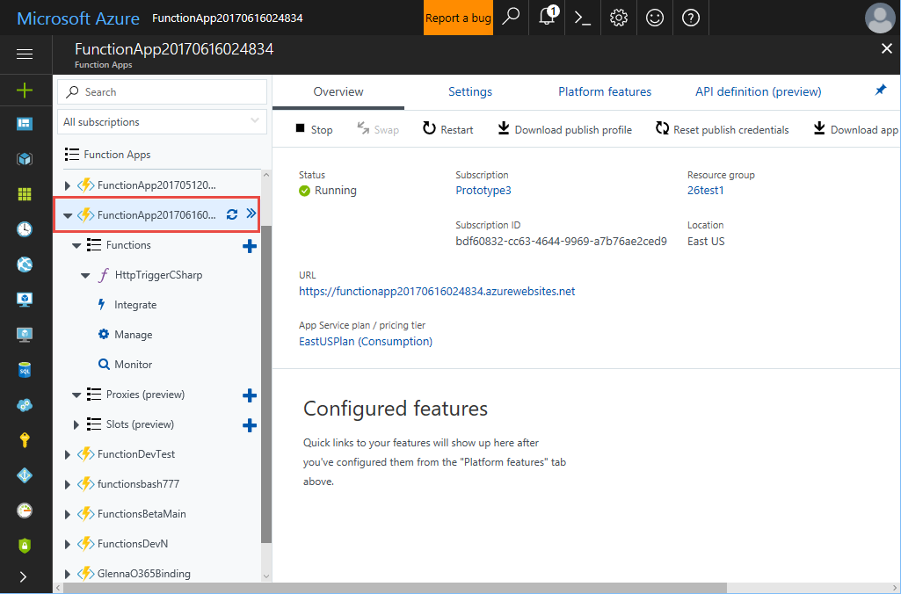

# Create your first function using the Azure Functions Tools for Visual Studio 

With **Azure Functions**, you can write code to process events and run in a serverless execution model.

In this tutorial, you learn how to create an Azure Function app using **Azure Function Tools for Visual Studio 2017** for Visual Studio. HTTP trigger invoke your function, so every time there is an HTTP request to your function's URL, your function runs.   

## Prerequisites

Before running this sample, you must have the following:

* Install [Visual Studio 2017 (version 15.3) Preview](https://www.visualstudio.com/vs/preview/)  with the Azure development workload.
* Install [Azure Function Tools for Visual Studio 2017] (https://marketplace.visualstudio.com/vsgallery/e3705d94-7cc3-4b79-ba7b-f43f30774d28)
* Ensure the Azure development workload is installed.

[!INCLUDE [quickstarts-free-trial-note](../../includes/quickstarts-free-trial-note.md)]

## Create a functions app project in Visual Studio

Open Visual Studio and launch the **New Project** dialog. You'll find the Azure Functions templates under the **Visual C#** > **Cloud** node. Name your function app, select a location, and click **Ok**.

Visual Studio creates a project containing a [local.settings.json] and [host.json](https://github.com/Azure/azure-webjobs-sdk-script/wiki/host.json) file. The local.settings.json file specifies connection strings for resources such as storage accounts, including the setting `AzureWebJobsStorage`. To learn more, see the section [Local settings file][local.settings.json] in the article [Code and test Azure functions locally](functions-run-local.md). 

Now that you have created a function project, which represents a function app, create an HTTP triggered function.

## Create a new function

Right mouse click on the project node in **Solution Explorer**, then choose **Add** > **New Item**. Choose **Azure Function** from the dialog box.

Select **HttpTrigger** and provide the following information in the next dialog box:

| Setting      | Suggested value  | Description                                        |
| ------------ |  ------- | -------------------------------------------------- |
| Function name  | myFunction | The name of your function.  |
| Access rights | Anonymous | Determines which HTTP requests can access your function  |

>[!NOTE]
>If you use triggers other than HTTP, you need to specify a value for the Azure Storage connection string `AzureWebJobsStorage` in the file `local.settings.json`. This storage account is used by the Azure Functions runtime to run triggers. To get a connection string, go to **Cloud Explorer** -> **Storage Account** -> **Your Storage Account**. In the **Properties** view, copy **Primary Connection String** and paste it in [local.settings.json].

## Test the function locally

Like other Visual Studio Projects, Azure Functions projects support the use of the built-in debugging tools to test your function.

Right-click the project node in **Solution Explorer** and select **Debug** > **Start new instance**. 

You can obtain the endpoint for your function by examining the output of the functions runtime as shown above. The local runtime displays the local URL, port, and path to where the function is listening. You can then open a browser and navigate to the function's local URL to verify the function works. Don't forget to append a query string named *name* and a value, for example, `http://localhost:7071/api/HttpTriggerCSharp?name=Azure`. The output in the browser window should display the name "Azure". 

When you run the function, the build process creates a `function.json` file with the required bindings for the function's trigger, input, and output bindings.  Visual Studio creates the `function.json` file from the attributes applied to the `Run` method in your code. When the project is built, Visual Studio creates a `function.json` file for each function in the project, using the attributes defined on the method.

To stop debugging, click the **Stop** button on the Visual Studio toolbar.

## Publish the function to Azure

Right click the project node in **Solution Explorer** and choose **Publish**. This displays a dialog where you configure what you want to publish.

Choose **Create New** to publish this as a new function in a new Function App to publish this function. When ready, click the **Publish**. You'll be presented with the **Create App Service** dialog. 

The table below details the required fields in order to publish your Function App.

| Setting      | Suggested value  | Description                                        |
| ------------ |  ------- | -------------------------------------------------- |
| Function App Name | Globally unique name | The function's name. This must be unique.  |
| Subscription | Choose an existing subscription | The Azure subscription . |
| Resource Group | myResourceGroup |  The Azure resource group to contain the function. |
| App Service Plan | Existing App Service Plan name |  The function's App Service plan.  |
| Storage Account | Globally unique name |  The storage account for the function. |

Click the **Create** button, and the final confirmation page displays. Click **Publish** to deploy. Verify that your function has been published by logging into the Azure portal and locating the function. 

## Next steps

For more information about Azure Functions, see the following topics:

[!INCLUDE [functions-quickstart-next-steps](../../includes/functions-quickstart-next-steps.md)]
+ [Code and test Azure functions locally](functions-run-local.md)
+ [Using .NET class libraries with Azure Functions](functions-dotnet-class-library.md)

<!--Links:-->

[local.settings.json]: functions-run-local.md#local-settings-file