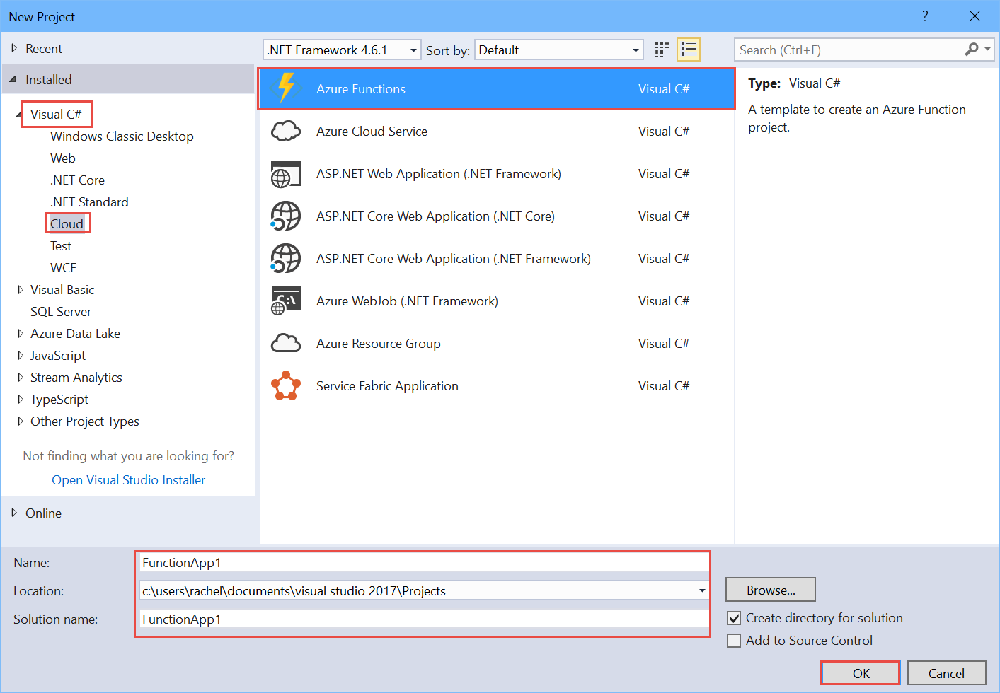
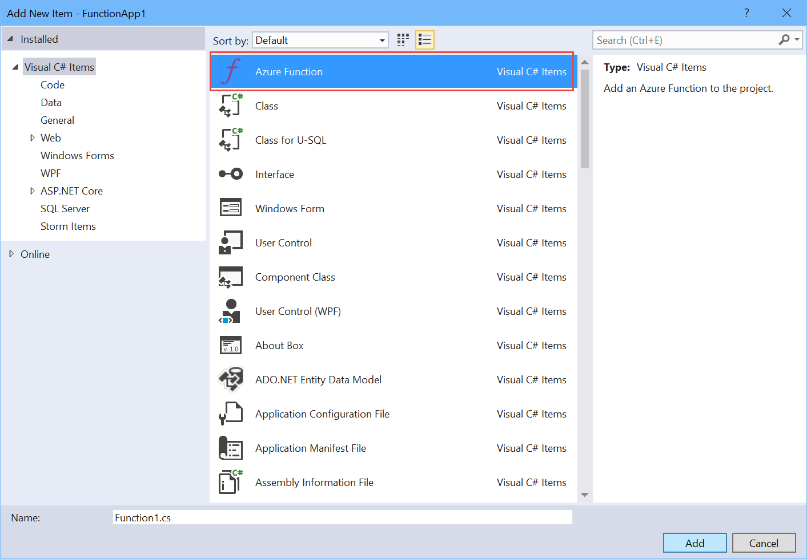

# Create your first Azure Function using the Azure Functions Tools for Visual Studio 

In this tutorial, you will learn how to create an Azure Function app using *Functions Core Tools* for Visual Studio. A queue trigger will invoke your function, so every time an item is placed on the queue, your function will run. When it runs your function will use the item in the queue trigger and log it.  

## Prerequisites

Before running this sample, you must have the following:

* An active Azure subscription.
*  (it will not work with any earlier versions of Visual Studio)
* ![Azure Functions Core Tools] (https://marketplace.visualstudio.com/vsgallery/e3705d94-7cc3-4b79-ba7b-f43f30774d28)
    * Either the ASP.NET and web development or Azure development workload installed

If you don't have an Azure subscription, create a  before you begin.

## Create a new Azure Functions App project in Visual Studio

Open Visual Studio and launch the *New Project* dialog. You'll find the Azure Functions templates under the *Visual C#* > *Cloud* node. Name your function app, select a location, and click *Ok*.



Visual Studio will create a project containing a *local.settings.json* and  file. The *local.settings.json* file contains application settings for the storage account and dashboard connections. Storage accounts hold unstructured data, and the SDK uses the dashboard to manage triggers and bindings. 

Now that you have a fresh Azure Functions queue triggered project, you now must create one or more Azure functions.

## Create a new Azure Function

You can either use the File menu to add a new file or right mouse click on the project node in *Solution Explorer*, then choose *Add* > *New Item*. Choose *Azure Function* from the dialog box.



A new dialog will appear giving you more options. Select *QueueTrigger* and provide the following information in the next dialog box:
  * A unique function name. The function's name is the same name that will appear in the portal. If the function is an HTTP trigger function, it also defines the default route.
  * The name of the storage account connection. 
  * The path for accessing items in the queue. 


You may be asked for different information, such as which storage account or queue you want to use when selecting other project templates.

Note: Behind the scenes, the runtime creates queues to schedule work, so all triggers except the HTTP trigger require setting *AzureWebJobsStorage*.    

## Review the function's bindings

The *function.json* file contains settings for the trigger, as well as input and output bindings, and other information. 

```json
{
  "bindings": [
    {
      "type": "queueTrigger",
      "queueName": "myqueue-items",
      "connection": "AzureWebJobsStorage",
      "direction": "in",
      "name": "myQueueItem"
    }
  ],
  "disabled": false,
  "scriptFile": "..\\FunctionApp1.dll",
  "entryPoint": "FunctionApp1.Function1.Run"
}
```

## Review the function's code

In the *run.cs* file is the function's code. Since this function is a queue triggered function, there is a string argument representing the queued item. All functions contain an argument of type *TraceWriter* that you can use for logging purposes.

```csharp
using System;
using Microsoft.Azure.WebJobs;
using Microsoft.Azure.WebJobs.Host;

namespace FunctionApp1
{
    public static class Function1
    {
        [FunctionName("QueueTriggerCSharp")]        
        public static void Run([QueueTrigger("myqueue-items", Connection = "AzureWebJobsStorage")]string myQueueItem, TraceWriter log)
        {
            log.Info($"C# Queue trigger function processed: {myQueueItem}");
        }
    }
}
```

## Test the function 

Just as you would with other Visual Studio projects, you can use the built-in debugging tools to test your function.

Click *Start* > *Debug* or press *F5* to run the application. This causes Visual Studio to launch a command window that prepares a local environment in which to run and test your function. 


When you run the function, the build process creates a *function.json* file with the required bindings for the function's trigger, input, and output bindings.  Visual Studio creates the *function.json* file from the attributes applied to the `Run` method in your code. In the previous example, the bindings are defined in the `HttpTrigger` attribute.

You can obtain the endpoint for your function by examining the output of the functions runtime. You should see a local address, port, and path to where the function is listening. You can then open a browser and navigate to the function's HTTP endpoint to verify the function works.

To stop debugging, click the *Stop* button on the Visual Studio toolbar, or click *Debug* > *Stop Debugging*.

## Publish the function to Azure

From the *Build* menu you can select *Publish* to launch the *Publish* dialog box. Alternatively, you can right mouse click on the project in *Solution Explorer* and select *Publish* from the context menu. After that, select *Azure Function App* as your publish target. 

Choose *Create New* to publish this as a new function in a new Function App, or choose *Select existing* to publish this function to a Function App that is already deployed to Azure. When ready, click the *Publish*. You'll be presented with the *Create App Service* dialog. 


The table below details the required fields in order to publish your Function App.

| Field | Value |
|---|---|
| Function App Name | The function's name. This must be unique.  |
| Subscription | The MSDN subscription that this function will be published under. |
| Resource Group | The Azure resource group to contain the function. |
| App Service Plan | The function's App Service plan.  |
| Storage Account | The storage account for the function. |

Click the *Create* button, and the final confirmation page will display. Click *Publish* to deploy. Verify that your function has been published by logging into the Azure portal and locating the function.

## Next steps

For more information about Azure Functions, see the following topics:

[!INCLUDE [functions-quickstart-next-steps](../../includes/functions-quickstart-next-steps.md)]

[!INCLUDE [Getting help note](../../includes/functions-get-help.md)]
